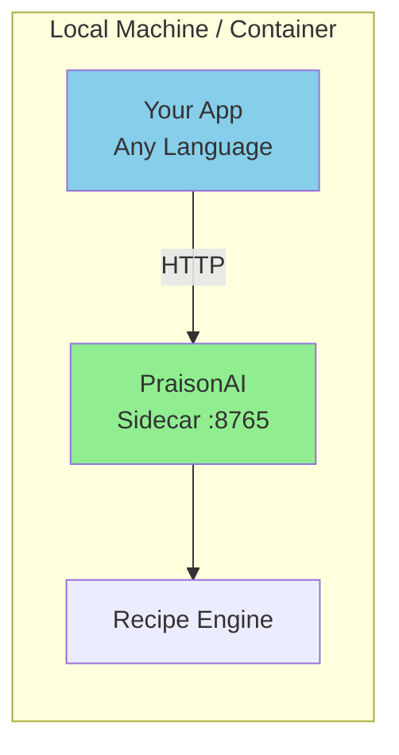

# Model 3: Local HTTP Sidecar

<Callout type="info">
**When to Use**: Microservices architectures, non-Python applications, or when you need HTTP-based integration without deploying to the cloud.
</Callout>

## How It Works



The sidecar runs as a local HTTP server, exposing recipes via REST API. Your application communicates over localhost—no external network required.

## Pros & Cons

<Tabs>
  <Tab title="Pros">
    - **Polyglot** - Any language with HTTP client can use it
    - **Process isolation** - Recipes run in separate process
    - **Standard HTTP** - Familiar REST/JSON interface
    - **Streaming support** - SSE for real-time events
    - **Auth built-in** - API key and JWT authentication
    - **Hot reload** - Update recipes without restart
  </Tab>
  <Tab title="Cons">
    - **Network overhead** - HTTP adds latency (~1-5ms)
    - **Port management** - Need to manage port allocation
    - **Process lifecycle** - Must start/stop sidecar
    - **Local only** - Not suitable for distributed systems
  </Tab>
</Tabs>

## Step-by-Step Tutorial

<Steps>
  <Step title="Install with Serve Dependencies">
    ```bash
    pip install "praisonai[serve]"
    ```
  </Step>
  
  <Step title="Start the Sidecar Server">
    ```bash
    # Basic start
    praisonai serve recipe --port 8765
    
    # With API key authentication
    praisonai serve recipe --port 8765 --auth api-key
    
    # With hot reload for development
    praisonai serve recipe --port 8765 --reload
    ```
  </Step>
  
  <Step title="Verify Server Health">
    ```bash
    curl http://localhost:8765/health
    ```
    
    Expected response:
    ```json
    {"status": "healthy", "service": "praisonai-recipe-runner", "version": "..."}
    ```
  </Step>
  
  <Step title="List Available Recipes">
    ```bash
    curl http://localhost:8765/v1/recipes
    ```
  </Step>
  
  <Step title="Run a Recipe">
    ```bash
    curl -X POST http://localhost:8765/v1/recipes/run \
      -H "Content-Type: application/json" \
      -d '{
        "recipe": "my-recipe",
        "input": {"query": "Hello"}
      }'
    ```
  </Step>
</Steps>

## API Reference

| Endpoint | Method | Description |
|----------|--------|-------------|
| `/health` | GET | Health check |
| `/v1/recipes` | GET | List recipes |
| `/v1/recipes/{name}` | GET | Describe recipe |
| `/v1/recipes/{name}/schema` | GET | Get recipe schema |
| `/v1/recipes/run` | POST | Run recipe (sync) |
| `/v1/recipes/stream` | POST | Run recipe (SSE) |
| `/v1/recipes/validate` | POST | Validate recipe |

## Production-Ready Example

<CodeGroup>
```python Python (requests)
import requests
from typing import Any, Dict, Optional

class RecipeClient:
    """HTTP client for PraisonAI recipe sidecar."""
    
    def __init__(
        self,
        base_url: str = "http://localhost:8765",
        api_key: Optional[str] = None,
        timeout: int = 60
    ):
        self.base_url = base_url.rstrip("/")
        self.timeout = timeout
        self.headers = {"Content-Type": "application/json"}
        if api_key:
            self.headers["X-API-Key"] = api_key
    
    def health(self) -> Dict[str, Any]:
        """Check server health."""
        resp = requests.get(
            f"{self.base_url}/health",
            headers=self.headers,
            timeout=5
        )
        resp.raise_for_status()
        return resp.json()
    
    def list_recipes(self, tags: list = None) -> list:
        """List available recipes."""
        params = {}
        if tags:
            params["tags"] = ",".join(tags)
        
        resp = requests.get(
            f"{self.base_url}/v1/recipes",
            headers=self.headers,
            params=params,
            timeout=self.timeout
        )
        resp.raise_for_status()
        return resp.json().get("recipes", [])
    
    def run(
        self,
        recipe_name: str,
        input_data: Dict[str, Any],
        config: Dict[str, Any] = None,
        session_id: str = None
    ) -> Dict[str, Any]:
        """Run a recipe."""
        body = {
            "recipe": recipe_name,
            "input": input_data,
        }
        if config:
            body["config"] = config
        if session_id:
            body["session_id"] = session_id
        
        resp = requests.post(
            f"{self.base_url}/v1/recipes/run",
            headers=self.headers,
            json=body,
            timeout=self.timeout
        )
        resp.raise_for_status()
        return resp.json()
    
    def run_stream(self, recipe_name: str, input_data: Dict[str, Any]):
        """Run a recipe with streaming."""
        body = {"recipe": recipe_name, "input": input_data}
        
        with requests.post(
            f"{self.base_url}/v1/recipes/stream",
            headers={**self.headers, "Accept": "text/event-stream"},
            json=body,
            stream=True,
            timeout=self.timeout
        ) as resp:
            resp.raise_for_status()
            for line in resp.iter_lines():
                if line:
                    line = line.decode("utf-8")
                    if line.startswith("data:"):
                        yield line[5:].strip()


# Usage
if __name__ == "__main__":
    client = RecipeClient(api_key="your-api-key")
    
    # Check health
    print(client.health())
    
    # Run recipe
    result = client.run(
        "support-reply-drafter",
        {"ticket_id": "T-123", "message": "I need help"}
    )
    print(result["output"])
```

```javascript Node.js (fetch)
class RecipeClient {
  constructor(baseUrl = 'http://localhost:8765', apiKey = null) {
    this.baseUrl = baseUrl.replace(/\/$/, '');
    this.headers = { 'Content-Type': 'application/json' };
    if (apiKey) {
      this.headers['X-API-Key'] = apiKey;
    }
  }

  async health() {
    const resp = await fetch(`${this.baseUrl}/health`, {
      headers: this.headers,
    });
    return resp.json();
  }

  async listRecipes(tags = []) {
    const params = tags.length ? `?tags=${tags.join(',')}` : '';
    const resp = await fetch(`${this.baseUrl}/v1/recipes${params}`, {
      headers: this.headers,
    });
    const data = await resp.json();
    return data.recipes || [];
  }

  async run(recipeName, inputData, config = null) {
    const body = { recipe: recipeName, input: inputData };
    if (config) body.config = config;

    const resp = await fetch(`${this.baseUrl}/v1/recipes/run`, {
      method: 'POST',
      headers: this.headers,
      body: JSON.stringify(body),
    });
    return resp.json();
  }

  async *runStream(recipeName, inputData) {
    const body = { recipe: recipeName, input: inputData };
    
    const resp = await fetch(`${this.baseUrl}/v1/recipes/stream`, {
      method: 'POST',
      headers: { ...this.headers, Accept: 'text/event-stream' },
      body: JSON.stringify(body),
    });

    const reader = resp.body.getReader();
    const decoder = new TextDecoder();
    let buffer = '';

    while (true) {
      const { done, value } = await reader.read();
      if (done) break;
      
      buffer += decoder.decode(value, { stream: true });
      const lines = buffer.split('\n');
      buffer = lines.pop();

      for (const line of lines) {
        if (line.startsWith('data:')) {
          yield JSON.parse(line.slice(5).trim());
        }
      }
    }
  }
}

// Usage
const client = new RecipeClient('http://localhost:8765', 'your-api-key');
const result = await client.run('my-recipe', { query: 'Hello' });
console.log(result.output);
```

```bash curl
# Health check
curl http://localhost:8765/health

# List recipes
curl http://localhost:8765/v1/recipes

# Run recipe
curl -X POST http://localhost:8765/v1/recipes/run \
  -H "Content-Type: application/json" \
  -H "X-API-Key: your-api-key" \
  -d '{"recipe": "my-recipe", "input": {"query": "Hello"}}'

# Stream recipe
curl -X POST http://localhost:8765/v1/recipes/stream \
  -H "Content-Type: application/json" \
  -H "Accept: text/event-stream" \
  -d '{"recipe": "my-recipe", "input": {"query": "Hello"}}'
```
</CodeGroup>

## Docker Deployment

```dockerfile
FROM python:3.11-slim

WORKDIR /app

RUN pip install "praisonai[serve]"

EXPOSE 8765

CMD ["praisonai", "recipe", "serve", "--host", "0.0.0.0", "--port", "8765"]
```

```yaml
# docker-compose.yml
version: '3.8'
services:
  praisonai-sidecar:
    build: .
    ports:
      - "8765:8765"
    environment:
      - OPENAI_API_KEY=${OPENAI_API_KEY}
      - PRAISONAI_API_KEY=${PRAISONAI_API_KEY}
    volumes:
      - ./recipes:/root/.praison/templates
    healthcheck:
      test: ["CMD", "curl", "-f", "http://localhost:8765/health"]
      interval: 30s
      timeout: 10s
      retries: 3
```

## Troubleshooting

<Accordion title="Connection refused">
Ensure the server is running:
```bash
# Check if port is in use
lsof -i :8765

# Start server
praisonai serve recipe --port 8765
```
</Accordion>

<Accordion title="401 Unauthorized">
If auth is enabled, provide the API key:
```bash
curl -H "X-API-Key: your-key" http://localhost:8765/v1/recipes
```

Or set the environment variable:
```bash
export PRAISONAI_API_KEY=your-key
```
</Accordion>

<Accordion title="SSE streaming not working">
Ensure you're using the correct endpoint and headers:
```bash
curl -X POST http://localhost:8765/v1/recipes/stream \
  -H "Accept: text/event-stream" \
  -H "Content-Type: application/json" \
  -d '{"recipe": "my-recipe", "input": {}}'
```
</Accordion>

<Accordion title="CORS errors in browser">
Start the server with CORS enabled:
```bash
# Via environment
export PRAISONAI_CORS_ORIGINS="*"
praisonai serve recipe

# Or via config file (serve.yaml)
# cors_origins: "*"
```
</Accordion>

## Security & Ops Notes

<Callout type="warning">
**Security Considerations**
</Callout>

- **Bind to localhost** - Default `127.0.0.1` prevents external access
- **API key auth** - Enable `--auth api-key` for production
- **HTTPS** - Use a reverse proxy (nginx, traefik) for TLS
- **Rate limiting** - Configure `rate_limit` in serve.yaml
- **Request size limits** - Default 10MB, adjust via `max_request_size`

```yaml
# serve.yaml - Production configuration
host: 127.0.0.1
port: 8765
auth: api-key
api_key: ${PRAISONAI_API_KEY}
cors_origins: "https://myapp.com"
rate_limit: 100
max_request_size: 10485760
enable_metrics: true
```

## Next Steps

- [Remote Managed Runner](/docs/guides/recipes/integration-models/remote-managed-runner) - For cloud deployments
- [Event-Driven](/docs/guides/recipes/integration-models/event-driven) - For async processing
- [Platform/DevOps Persona](/docs/guides/recipes/personas/platform-devops) - Deployment best practices
