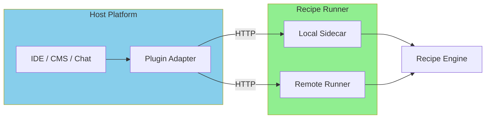

# Model 6: Plugin Mode

<Callout type="info">
**When to Use**: Building IDE extensions, CMS plugins, chat integrations, or any scenario where recipes need to be embedded into an existing platform with native UX.
</Callout>

## How It Works



Plugin Mode wraps recipes in a platform-specific adapter that translates between the host platform's API and PraisonAI's HTTP interface.

<Callout type="warning">
**Note**: PraisonAI does not include an official plugin SDK. This model documents an integration pattern for building plugins that connect to PraisonAI via HTTP.
</Callout>

## Pros & Cons

<Tabs>
  <Tab title="Pros">
    - **Native UX** - Feels like part of the host platform
    - **Context-aware** - Access to platform context (files, selection, etc.)
    - **User-friendly** - No CLI or API knowledge needed
    - **Discoverable** - Users find recipes in familiar UI
    - **Streaming support** - Real-time feedback in UI
  </Tab>
  <Tab title="Cons">
    - **Platform-specific** - Each platform needs its own adapter
    - **Maintenance burden** - Keep up with platform API changes
    - **Distribution** - Plugin store approval processes
    - **Limited control** - Platform sandboxing restrictions
  </Tab>
</Tabs>

## Step-by-Step Tutorial

<Steps>
  <Step title="Choose Your Platform">
    | Platform | Extension Type | Communication |
    |----------|---------------|---------------|
    | VS Code | Extension | HTTP to sidecar |
    | JetBrains | Plugin | HTTP to sidecar |
    | Obsidian | Plugin | HTTP to sidecar |
    | Slack | App | HTTP to remote |
    | Discord | Bot | HTTP to remote |
    | WordPress | Plugin | HTTP to remote |
  </Step>
  
  <Step title="Start Recipe Runner">
    ```bash
    # Local development
    praisonai serve recipe --port 8765
    
    # Or use remote runner
    export PRAISONAI_ENDPOINTS_URL=https://api.example.com
    ```
  </Step>
  
  <Step title="Create Plugin Manifest">
    ```json
    {
      "name": "praisonai-recipes",
      "displayName": "PraisonAI Recipes",
      "version": "1.0.0",
      "description": "Run AI recipes from your editor",
      "engines": {
        "vscode": "^1.80.0"
      },
      "activationEvents": [
        "onCommand:praisonai.runRecipe"
      ],
      "contributes": {
        "commands": [
          {
            "command": "praisonai.runRecipe",
            "title": "Run Recipe"
          }
        ],
        "configuration": {
          "title": "PraisonAI",
          "properties": {
            "praisonai.serverUrl": {
              "type": "string",
              "default": "http://localhost:8765",
              "description": "PraisonAI server URL"
            },
            "praisonai.apiKey": {
              "type": "string",
              "description": "API key for authentication"
            }
          }
        }
      }
    }
    ```
  </Step>
  
  <Step title="Implement Plugin Logic">
    See platform-specific examples below.
  </Step>
</Steps>

## VS Code Extension Example

```typescript
// extension.ts
import * as vscode from 'vscode';

interface RecipeResult {
  ok: boolean;
  output: string;
  error?: string;
}

class PraisonAIClient {
  private baseUrl: string;
  private apiKey: string | undefined;

  constructor() {
    const config = vscode.workspace.getConfiguration('praisonai');
    this.baseUrl = config.get('serverUrl', 'http://localhost:8765');
    this.apiKey = config.get('apiKey');
  }

  async listRecipes(): Promise<any[]> {
    const response = await fetch(`${this.baseUrl}/v1/recipes`, {
      headers: this.getHeaders(),
    });
    const data = await response.json();
    return data.recipes || [];
  }

  async runRecipe(name: string, input: Record<string, any>): Promise<RecipeResult> {
    const response = await fetch(`${this.baseUrl}/v1/recipes/run`, {
      method: 'POST',
      headers: this.getHeaders(),
      body: JSON.stringify({ recipe: name, input }),
    });
    return response.json();
  }

  private getHeaders(): Record<string, string> {
    const headers: Record<string, string> = {
      'Content-Type': 'application/json',
    };
    if (this.apiKey) {
      headers['X-API-Key'] = this.apiKey;
    }
    return headers;
  }
}

export function activate(context: vscode.ExtensionContext) {
  const client = new PraisonAIClient();

  // Command: Run Recipe
  const runRecipeCmd = vscode.commands.registerCommand(
    'praisonai.runRecipe',
    async () => {
      // Get available recipes
      const recipes = await client.listRecipes();
      
      // Show quick pick
      const selected = await vscode.window.showQuickPick(
        recipes.map(r => ({
          label: r.name,
          description: r.description,
        })),
        { placeHolder: 'Select a recipe to run' }
      );

      if (!selected) return;

      // Get current selection as input
      const editor = vscode.window.activeTextEditor;
      const selection = editor?.document.getText(editor.selection);

      // Run with progress
      await vscode.window.withProgress(
        {
          location: vscode.ProgressLocation.Notification,
          title: `Running ${selected.label}...`,
          cancellable: false,
        },
        async () => {
          const result = await client.runRecipe(selected.label, {
            text: selection || '',
            filename: editor?.document.fileName,
          });

          if (result.ok) {
            // Show result in new document
            const doc = await vscode.workspace.openTextDocument({
              content: result.output,
              language: 'markdown',
            });
            await vscode.window.showTextDocument(doc);
          } else {
            vscode.window.showErrorMessage(`Recipe failed: ${result.error}`);
          }
        }
      );
    }
  );

  context.subscriptions.push(runRecipeCmd);
}

export function deactivate() {}
```

## Obsidian Plugin Example

```typescript
// main.ts
import { App, Plugin, PluginSettingTab, Setting, Notice } from 'obsidian';

interface PraisonAISettings {
  serverUrl: string;
  apiKey: string;
}

const DEFAULT_SETTINGS: PraisonAISettings = {
  serverUrl: 'http://localhost:8765',
  apiKey: '',
};

export default class PraisonAIPlugin extends Plugin {
  settings: PraisonAISettings;

  async onload() {
    await this.loadSettings();

    // Add command
    this.addCommand({
      id: 'run-recipe',
      name: 'Run Recipe',
      editorCallback: async (editor) => {
        const selection = editor.getSelection();
        
        // Fetch recipes
        const recipes = await this.listRecipes();
        
        // Show modal to select recipe
        // (simplified - use a proper modal in production)
        const recipeName = recipes[0]?.name;
        
        if (recipeName) {
          new Notice(`Running ${recipeName}...`);
          
          const result = await this.runRecipe(recipeName, {
            text: selection,
          });
          
          if (result.ok) {
            editor.replaceSelection(result.output);
            new Notice('Recipe completed!');
          } else {
            new Notice(`Error: ${result.error}`);
          }
        }
      },
    });

    this.addSettingTab(new PraisonAISettingTab(this.app, this));
  }

  async listRecipes(): Promise<any[]> {
    const response = await fetch(`${this.settings.serverUrl}/v1/recipes`, {
      headers: this.getHeaders(),
    });
    const data = await response.json();
    return data.recipes || [];
  }

  async runRecipe(name: string, input: Record<string, any>): Promise<any> {
    const response = await fetch(`${this.settings.serverUrl}/v1/recipes/run`, {
      method: 'POST',
      headers: this.getHeaders(),
      body: JSON.stringify({ recipe: name, input }),
    });
    return response.json();
  }

  private getHeaders(): Record<string, string> {
    const headers: Record<string, string> = {
      'Content-Type': 'application/json',
    };
    if (this.settings.apiKey) {
      headers['X-API-Key'] = this.settings.apiKey;
    }
    return headers;
  }

  async loadSettings() {
    this.settings = Object.assign({}, DEFAULT_SETTINGS, await this.loadData());
  }

  async saveSettings() {
    await this.saveData(this.settings);
  }
}

class PraisonAISettingTab extends PluginSettingTab {
  plugin: PraisonAIPlugin;

  constructor(app: App, plugin: PraisonAIPlugin) {
    super(app, plugin);
    this.plugin = plugin;
  }

  display(): void {
    const { containerEl } = this;
    containerEl.empty();

    new Setting(containerEl)
      .setName('Server URL')
      .setDesc('PraisonAI server URL')
      .addText((text) =>
        text
          .setPlaceholder('http://localhost:8765')
          .setValue(this.plugin.settings.serverUrl)
          .onChange(async (value) => {
            this.plugin.settings.serverUrl = value;
            await this.plugin.saveSettings();
          })
      );

    new Setting(containerEl)
      .setName('API Key')
      .setDesc('API key for authentication')
      .addText((text) =>
        text
          .setPlaceholder('your-api-key')
          .setValue(this.plugin.settings.apiKey)
          .onChange(async (value) => {
            this.plugin.settings.apiKey = value;
            await this.plugin.saveSettings();
          })
      );
  }
}
```

## Slack App Example

```python
# slack_bot.py
import os
from slack_bolt import App
from slack_bolt.adapter.socket_mode import SocketModeHandler
import requests

app = App(token=os.environ["SLACK_BOT_TOKEN"])

PRAISONAI_URL = os.environ.get("PRAISONAI_ENDPOINTS_URL", "http://localhost:8765")
PRAISONAI_KEY = os.environ.get("PRAISONAI_ENDPOINTS_API_KEY")

def run(recipe_name: str, input_data: dict) -> dict:
    """Call PraisonAI recipe runner."""
    headers = {"Content-Type": "application/json"}
    if PRAISONAI_KEY:
        headers["X-API-Key"] = PRAISONAI_KEY
    
    response = requests.post(
        f"{PRAISONAI_URL}/v1/recipes/run",
        headers=headers,
        json={"recipe": recipe_name, "input": input_data},
        timeout=60
    )
    return response.json()


@app.command("/recipe")
def handle_recipe_command(ack, say, command):
    """Handle /recipe slash command."""
    ack()
    
    text = command.get("text", "").strip()
    parts = text.split(" ", 1)
    recipe_name = parts[0] if parts else ""
    input_text = parts[1] if len(parts) > 1 else ""
    
    if not recipe_name:
        say("Usage: /recipe <recipe-name> [input text]")
        return
    
    say(f"Running recipe `{recipe_name}`...")
    
    result = run(recipe_name, {"text": input_text, "user": command["user_name"]})
    
    if result.get("ok"):
        say(f"✅ Result:\n```\n{result.get('output', '')}\n```")
    else:
        say(f"❌ Error: {result.get('error', 'Unknown error')}")


@app.event("app_mention")
def handle_mention(event, say):
    """Handle @mentions."""
    text = event.get("text", "")
    # Remove bot mention
    text = text.split(">", 1)[-1].strip()
    
    # Default to a general-purpose recipe
    result = run("chat-assistant", {"message": text})
    
    if result.get("ok"):
        say(result.get("output", ""))
    else:
        say(f"Sorry, I encountered an error: {result.get('error')}")


if __name__ == "__main__":
    handler = SocketModeHandler(app, os.environ["SLACK_APP_TOKEN"])
    handler.start()
```

## Troubleshooting

<Accordion title="Plugin can't connect to sidecar">
Ensure the sidecar is running and accessible:
```bash
# Check if server is running
curl http://localhost:8765/health

# Check firewall/network
# Some platforms sandbox network access
```
</Accordion>

<Accordion title="CORS errors in browser-based plugins">
Configure CORS on the sidecar:
```bash
export PRAISONAI_CORS_ORIGINS="*"
praisonai serve recipe
```
</Accordion>

<Accordion title="Authentication issues">
Verify API key is configured correctly:
```typescript
// Check settings
console.log('API Key configured:', !!settings.apiKey);

// Test with curl
// curl -H "X-API-Key: your-key" http://localhost:8765/health
```
</Accordion>

<Accordion title="Slow response times">
Consider using streaming for better UX:
```typescript
// Use SSE for streaming
const response = await fetch(`${baseUrl}/v1/recipes/stream`, {
  method: 'POST',
  headers: { 'Accept': 'text/event-stream', ...headers },
  body: JSON.stringify({ recipe: name, input }),
});

const reader = response.body.getReader();
// Process stream...
```
</Accordion>

## Security & Ops Notes

<Callout type="warning">
**Security Considerations**
</Callout>

- **API key storage** - Use platform's secure storage (VS Code SecretStorage, etc.)
- **Input sanitization** - Validate user input before sending to recipes
- **Network security** - Use HTTPS for remote runners
- **Permissions** - Request minimal permissions in plugin manifest
- **Rate limiting** - Implement client-side rate limiting

```typescript
// VS Code secure storage example
const secretStorage = context.secrets;
await secretStorage.store('praisonai-api-key', apiKey);
const storedKey = await secretStorage.get('praisonai-api-key');
```

## Plugin Distribution

| Platform | Distribution Channel |
|----------|---------------------|
| VS Code | VS Code Marketplace |
| JetBrains | JetBrains Marketplace |
| Obsidian | Community Plugins |
| Slack | Slack App Directory |
| Discord | Discord App Directory |

## Next Steps

- [Embedded SDK](/docs/guides/recipes/integration-models/embedded-sdk) - For Python-native integration
- [Local HTTP Sidecar](/docs/guides/recipes/integration-models/local-http-sidecar) - Sidecar setup details
- [Recipe Author Persona](/docs/guides/recipes/personas/recipe-author) - Creating recipes for plugins
