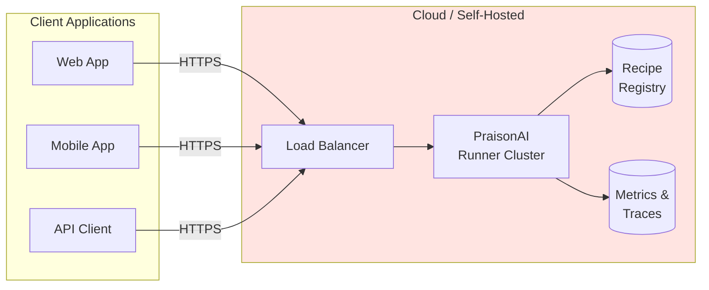

# Model 4: Remote Managed Runner

<Callout type="info">
**When to Use**: Multi-tenant production environments, cloud deployments, or when you need centralized recipe management with authentication, rate limiting, and observability.
</Callout>

## How It Works



The Remote Managed Runner is a production-grade deployment with authentication, rate limiting, metrics, and horizontal scaling.

## Pros & Cons

<Tabs>
  <Tab title="Pros">
    - **Multi-tenant** - Serve multiple clients with isolation
    - **Centralized management** - Single source of truth for recipes
    - **Production-ready** - Auth, rate limiting, metrics built-in
    - **Scalable** - Horizontal scaling with load balancer
    - **Secure** - TLS, API keys, JWT authentication
    - **Observable** - Prometheus metrics, distributed tracing
  </Tab>
  <Tab title="Cons">
    - **Network latency** - Remote calls add latency
    - **Operational complexity** - Requires infrastructure management
    - **Cost** - Cloud resources, monitoring, etc.
    - **Single point of failure** - Unless properly distributed
  </Tab>
</Tabs>

## Step-by-Step Tutorial

<Steps>
  <Step title="Deploy the Runner">
    <CodeGroup>
    ```bash Docker
    docker run -d \
      --name praisonai-runner \
      -p 8765:8765 \
      -e OPENAI_API_KEY=$OPENAI_API_KEY \
      -e PRAISONAI_API_KEY=your-secure-key \
      -e PRAISONAI_AUTH=api-key \
      praisonai/runner:latest
    ```

    ```yaml Kubernetes
    apiVersion: apps/v1
    kind: Deployment
    metadata:
      name: praisonai-runner
    spec:
      replicas: 3
      selector:
        matchLabels:
          app: praisonai-runner
      template:
        metadata:
          labels:
            app: praisonai-runner
        spec:
          containers:
          - name: runner
            image: praisonai/runner:latest
            ports:
            - containerPort: 8765
            env:
            - name: OPENAI_API_KEY
              valueFrom:
                secretKeyRef:
                  name: praisonai-secrets
                  key: openai-api-key
            - name: PRAISONAI_API_KEY
              valueFrom:
                secretKeyRef:
                  name: praisonai-secrets
                  key: api-key
            - name: PRAISONAI_AUTH
              value: "api-key"
            resources:
              requests:
                memory: "512Mi"
                cpu: "500m"
              limits:
                memory: "2Gi"
                cpu: "2000m"
    ---
    apiVersion: v1
    kind: Service
    metadata:
      name: praisonai-runner
    spec:
      selector:
        app: praisonai-runner
      ports:
      - port: 8765
        targetPort: 8765
    ```
    </CodeGroup>
  </Step>
  
  <Step title="Configure Authentication">
    ```yaml
    # serve.yaml
    host: 0.0.0.0
    port: 8765
    auth: api-key  # or "jwt" for JWT authentication
    api_key: ${PRAISONAI_API_KEY}
    
    # JWT configuration (if using jwt auth)
    jwt_secret: ${PRAISONAI_JWT_SECRET}
    jwt_algorithm: HS256
    ```
  </Step>
  
  <Step title="Set Up Load Balancer">
    ```nginx
    # nginx.conf
    upstream praisonai {
        least_conn;
        server runner1:8765;
        server runner2:8765;
        server runner3:8765;
    }

    server {
        listen 443 ssl;
        server_name api.example.com;

        ssl_certificate /etc/ssl/certs/cert.pem;
        ssl_certificate_key /etc/ssl/private/key.pem;

        location / {
            proxy_pass http://praisonai;
            proxy_http_version 1.1;
            proxy_set_header Upgrade $http_upgrade;
            proxy_set_header Connection "upgrade";
            proxy_set_header Host $host;
            proxy_set_header X-Real-IP $remote_addr;
            proxy_read_timeout 300s;
        }
    }
    ```
  </Step>
  
  <Step title="Connect from Client">
    ```python
    import os
    from praisonai.endpoints import EndpointsClient

    client = EndpointsClient(
        base_url="https://api.example.com",
        api_key=os.environ["PRAISONAI_API_KEY"]
    )

    # Check health
    health = client.health()
    print(f"Server status: {health['status']}")

    # Run recipe
    result = client.invoke(
        "my-recipe",
        input={"query": "Hello"},
        stream=False
    )
    print(result["output"])
    ```
  </Step>
</Steps>

## Production-Ready Example

```python
import os
import logging
from typing import Any, Dict, Optional
import requests
from requests.adapters import HTTPAdapter
from urllib3.util.retry import Retry

logging.basicConfig(level=logging.INFO)
logger = logging.getLogger(__name__)

class RemoteRecipeClient:
    """Production client for remote PraisonAI runner."""
    
    def __init__(
        self,
        base_url: str,
        api_key: str,
        timeout: int = 60,
        retries: int = 3
    ):
        self.base_url = base_url.rstrip("/")
        self.timeout = timeout
        
        # Configure session with retries
        self.session = requests.Session()
        self.session.headers.update({
            "Content-Type": "application/json",
            "X-API-Key": api_key,
        })
        
        retry_strategy = Retry(
            total=retries,
            backoff_factor=0.5,
            status_forcelist=[500, 502, 503, 504],
        )
        adapter = HTTPAdapter(max_retries=retry_strategy)
        self.session.mount("https://", adapter)
        self.session.mount("http://", adapter)
    
    def health(self) -> Dict[str, Any]:
        """Check server health."""
        resp = self.session.get(
            f"{self.base_url}/health",
            timeout=5
        )
        resp.raise_for_status()
        return resp.json()
    
    def run(
        self,
        recipe_name: str,
        input_data: Dict[str, Any],
        config: Dict[str, Any] = None,
        session_id: str = None,
        trace_id: str = None
    ) -> Dict[str, Any]:
        """Run a recipe with full error handling."""
        body = {
            "recipe": recipe_name,
            "input": input_data,
        }
        if config:
            body["config"] = config
        if session_id:
            body["session_id"] = session_id
        
        headers = {}
        if trace_id:
            headers["X-Trace-ID"] = trace_id
        
        try:
            resp = self.session.post(
                f"{self.base_url}/v1/recipes/run",
                json=body,
                headers=headers,
                timeout=self.timeout
            )
            
            if resp.status_code == 401:
                raise PermissionError("Invalid API key")
            elif resp.status_code == 404:
                raise ValueError(f"Recipe not found: {recipe_name}")
            elif resp.status_code == 429:
                raise RuntimeError("Rate limit exceeded")
            
            resp.raise_for_status()
            return resp.json()
            
        except requests.exceptions.Timeout:
            logger.error(f"Request timeout for recipe {recipe_name}")
            raise
        except requests.exceptions.ConnectionError as e:
            logger.error(f"Connection error: {e}")
            raise


# Usage with environment-based configuration
if __name__ == "__main__":
    client = RemoteRecipeClient(
        base_url=os.environ["PRAISONAI_ENDPOINTS_URL"],
        api_key=os.environ["PRAISONAI_ENDPOINTS_API_KEY"],
        timeout=60,
        retries=3
    )
    
    # Health check
    print(client.health())
    
    # Run recipe
    result = client.run(
        "support-reply-drafter",
        {"ticket_id": "T-123", "message": "I need help"},
        trace_id="req-12345"
    )
    print(result["output"])
```

## CLI Client

```bash
# Set environment variables
export PRAISONAI_ENDPOINTS_URL=https://api.example.com
export PRAISONAI_ENDPOINTS_API_KEY=your-api-key

# Check health
praisonai endpoints health

# List available recipes
praisonai endpoints list

# Invoke a recipe
praisonai endpoints invoke my-recipe \
  --input-json '{"query": "Hello"}' \
  --json

# Stream output
praisonai endpoints invoke my-recipe \
  --input-json '{"query": "Hello"}' \
  --stream
```

## Troubleshooting

<Accordion title="401 Unauthorized">
Verify your API key:
```bash
# Check if key is set
echo $PRAISONAI_ENDPOINTS_API_KEY

# Test with curl
curl -H "X-API-Key: $PRAISONAI_ENDPOINTS_API_KEY" \
  https://api.example.com/health
```
</Accordion>

<Accordion title="Connection timeout">
Check network connectivity and firewall rules:
```bash
# Test connectivity
curl -v https://api.example.com/health

# Check DNS
nslookup api.example.com
```
</Accordion>

<Accordion title="429 Rate Limited">
Implement exponential backoff:
```python
import time

def run_with_backoff(client, recipe, input_data, max_retries=5):
    for attempt in range(max_retries):
        try:
            return client.run(recipe, input_data)
        except RuntimeError as e:
            if "Rate limit" in str(e):
                wait = 2 ** attempt
                time.sleep(wait)
            else:
                raise
    raise RuntimeError("Max retries exceeded")
```
</Accordion>

<Accordion title="SSL certificate errors">
For self-signed certificates in development:
```python
# NOT recommended for production
client.session.verify = False

# Better: Add your CA certificate
client.session.verify = "/path/to/ca-bundle.crt"
```
</Accordion>

## Security & Ops Notes

<Callout type="warning">
**Security Considerations**
</Callout>

- **TLS everywhere** - Always use HTTPS in production
- **API key rotation** - Rotate keys regularly
- **Rate limiting** - Protect against abuse
- **IP allowlisting** - Restrict access by IP if possible
- **Audit logging** - Log all API calls with trace IDs
- **Secrets management** - Use vault/secrets manager for keys

```yaml
# serve.yaml - Production security configuration
host: 0.0.0.0
port: 8765
auth: api-key
api_key: ${PRAISONAI_API_KEY}
rate_limit: 100  # requests per minute
max_request_size: 10485760
enable_metrics: true
enable_admin: false  # Disable admin endpoints in production

# Observability
trace_exporter: otlp
otlp_endpoint: http://otel-collector:4317
```

## Monitoring

```yaml
# prometheus.yml
scrape_configs:
  - job_name: 'praisonai-runner'
    static_configs:
      - targets: ['runner1:8765', 'runner2:8765', 'runner3:8765']
    metrics_path: /metrics
```

Key metrics to monitor:
- `praisonai_recipe_duration_seconds` - Recipe execution time
- `praisonai_recipe_total` - Total recipe invocations
- `praisonai_recipe_errors_total` - Error count
- `praisonai_active_sessions` - Active sessions

## Next Steps

- [Event-Driven](/docs/guides/recipes/integration-models/event-driven) - For async processing
- [Plugin Mode](/docs/guides/recipes/integration-models/plugin-mode) - For IDE/CMS integration
- [Platform/DevOps Persona](/docs/guides/recipes/personas/platform-devops) - Deployment best practices
