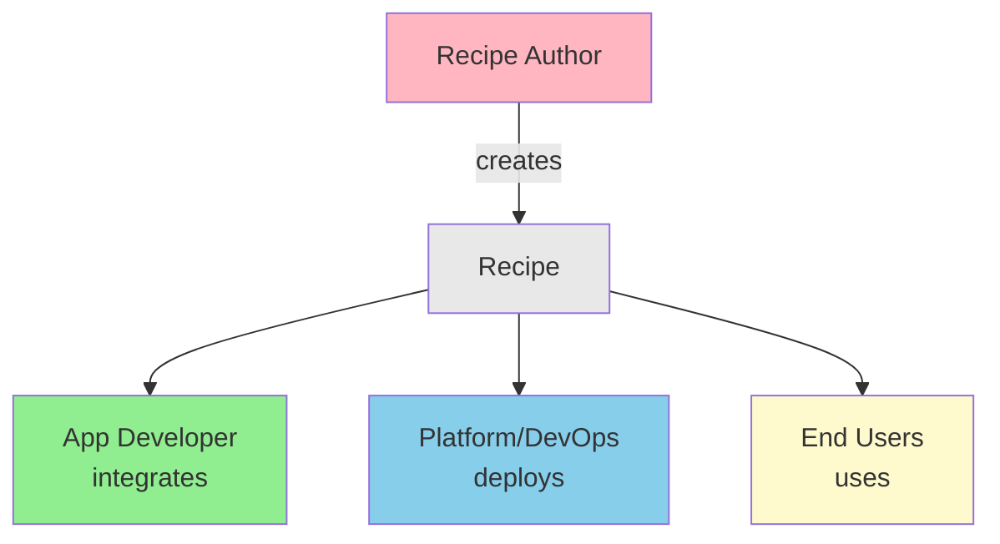

# Personas

This guide describes the three primary personas who work with PraisonAI recipes, their responsibilities, and recommended workflows.

---

## Persona 1: App Developer (Backend/Fullstack)

### Role Description
Backend or fullstack developers who integrate AI capabilities into applications. They consume recipes created by others and focus on reliable integration.

### Primary Goals
- Integrate AI features quickly
- Ensure reliability and error handling
- Minimize infrastructure complexity
- Meet performance requirements

### Recommended Integration Models
1. **Model 1 (Embedded SDK)** - For Python applications
2. **Model 3 (HTTP Sidecar)** - For polyglot microservices
3. **Model 2 (CLI)** - For scripts and automation

### Typical Workflow

<Steps>
  <Step title="Discover Available Recipes">
    ```bash
    # List all recipes
    praisonai recipe list

    # Get recipe details
    praisonai recipe info support-reply-drafter
    ```
  </Step>
  <Step title="Test Recipe Locally">
    ```bash
    # Dry run to validate
    praisonai recipe run support-reply-drafter \
      --input '{"ticket_id": "T-123", "message": "Test"}' \
      --dry-run

    # Full test run
    praisonai recipe run support-reply-drafter \
      --input '{"ticket_id": "T-123", "message": "Test"}' \
      --json
    ```
  </Step>
  <Step title="Integrate into Application">
    ```python
    from praisonai import recipe

    def handle_support_ticket(ticket):
        result = recipe.run(
            "support-reply-drafter",
            input={
                "ticket_id": ticket.id,
                "message": ticket.customer_message
            },
            options={"timeout_sec": 30}
        )
        
        if result.ok:
            return result.output["draft"]
        else:
            logger.error(f"Recipe failed: {result.error}")
            return None
    ```
  </Step>
  <Step title="Add Error Handling">
    ```python
    from praisonai.recipe import RecipeError, RecipeTimeoutError

    try:
        result = recipe.run("my-recipe", input=data)
    except RecipeTimeoutError:
        # Handle timeout
        return fallback_response()
    except RecipeError as e:
        # Handle other errors
        logger.error(f"Recipe error: {e}")
        raise
    ```
  </Step>
</Steps>

### Key Concerns
- **Latency**: Monitor recipe execution time
- **Error handling**: Graceful degradation when recipes fail
- **Observability**: Logging, metrics, tracing
- **Testing**: Mock recipes in unit tests

---

## Persona 2: Platform/DevOps Engineer

### Role Description
Engineers responsible for deploying, scaling, and operating recipe infrastructure. They manage servers, authentication, monitoring, and security.

### Primary Goals
- Reliable recipe server deployment
- Secure multi-tenant access
- Monitoring and alerting
- Cost optimization

### Recommended Integration Models
1. **Model 4 (Remote Runner)** - Production deployments
2. **Model 5 (Event-Driven)** - High-scale async processing

### Typical Workflow

<Steps>
  <Step title="Configure Server">
    ```yaml
    # serve.yaml (or agents.yaml)
    host: 0.0.0.0
    port: 8765
    auth: api-key
    api_key: ${PRAISONAI_API_KEY}
    
    # Recipe filtering
    recipes:
      - support-reply-drafter
      - meeting-action-items
    
    # Performance
    preload: true
    
    # CORS for web clients
    cors_origins: "https://app.example.com"
    ```
  </Step>
  <Step title="Deploy with Docker">
    ```dockerfile
    FROM python:3.11-slim
    RUN pip install praisonai[serve]
    COPY serve.yaml /app/
    WORKDIR /app
    ENV PRAISONAI_API_KEY=${PRAISONAI_API_KEY}
    ENV OPENAI_API_KEY=${OPENAI_API_KEY}
    EXPOSE 8765
    CMD ["praisonai", "recipe", "serve", "--config", "serve.yaml"]
    ```
  </Step>
  <Step title="Set Up Monitoring">
    ```bash
    # Health check endpoint
    curl http://localhost:8765/health

    # Prometheus metrics (if enabled)
    curl http://localhost:8765/metrics
    ```
  </Step>
  <Step title="Configure Load Balancer">
    ```nginx
    upstream recipe_servers {
        server recipe1:8765;
        server recipe2:8765;
        server recipe3:8765;
    }

    server {
        listen 443 ssl;
        location /v1/recipes {
            proxy_pass http://recipe_servers;
        }
    }
    ```
  </Step>
  <Step title="Set Up Alerts">
    ```yaml
    # alertmanager rules
    groups:
      - name: recipe-server
        rules:
          - alert: RecipeServerDown
            expr: up{job="recipe-server"} == 0
            for: 1m
          - alert: HighLatency
            expr: recipe_request_duration_seconds > 10
            for: 5m
    ```
  </Step>
</Steps>

### Key Concerns
- **Security**: API key rotation, TLS, network policies
- **Scaling**: Horizontal scaling, load balancing
- **Availability**: Health checks, failover
- **Cost**: Resource utilization, API costs

---

## Persona 3: Recipe Author / Solutions Engineer

### Role Description
Engineers who create and maintain recipes. They design AI workflows, configure agents, and ensure recipes meet business requirements.

### Primary Goals
- Create reusable, reliable recipes
- Document inputs/outputs clearly
- Ensure security and compliance
- Optimize for performance and cost

### Recommended Workflow

<Steps>
  <Step title="Initialize Recipe Project">
    ```bash
    praisonai recipe init my-new-recipe
    cd my-new-recipe
    ```
  </Step>
  <Step title="Define Recipe Schema">
    ```yaml
    # TEMPLATE.yaml
    schema_version: "1.0"
    name: my-new-recipe
    version: "1.0.0"
    description: |
      Detailed description of what this recipe does.
    author: your-name
    license: Apache-2.0
    tags: [category, use-case]

    requires:
      env: [OPENAI_API_KEY]
      packages: []

    tools:
      allow: [web_search]
      deny: [shell.exec, file.write]

    config:
      input:
        query:
          type: string
          required: true
          description: The user's query
        context:
          type: string
          required: false
          description: Optional context

    defaults:
      model: gpt-4o-mini
      temperature: 0.7

    outputs:
      - name: result
        type: text
        description: The generated response
    ```
  </Step>
  <Step title="Define Workflow">
    ```yaml
    # workflow.yaml
    framework: praisonai
    topic: My Recipe Workflow
    
    roles:
      analyst:
        role: Data Analyst
        goal: Analyze the input and provide insights
        backstory: Expert data analyst
        tasks:
          analyze:
            description: Analyze {query} with context {context}
            expected_output: Structured analysis
    ```
  </Step>
  <Step title="Validate Recipe">
    ```bash
    praisonai recipe validate my-new-recipe
    ```
  </Step>
  <Step title="Test Recipe">
    ```bash
    # Dry run
    praisonai recipe run my-new-recipe \
      --input '{"query": "test"}' \
      --dry-run

    # Full test
    praisonai recipe run my-new-recipe \
      --input '{"query": "test"}' \
      --json
    ```
  </Step>
  <Step title="Package and Distribute">
    ```bash
    # Create bundle
    praisonai recipe pack my-new-recipe --output my-recipe.praison

    # Share or deploy
    ```
  </Step>
</Steps>

### Key Concerns
- **Schema design**: Clear, well-documented inputs/outputs
- **Security**: Tool restrictions, data handling policies
- **Testing**: Comprehensive test cases
- **Versioning**: Semantic versioning, changelog

---

## Persona Collaboration



## Next Steps

- Review [Integration Models](/docs/guides/recipes/integration-models) for technical details
- Explore [Use Cases](/docs/guides/recipes/use-cases) for implementation patterns
- Check the [CLI Reference](/docs/cli/recipes) for command details
