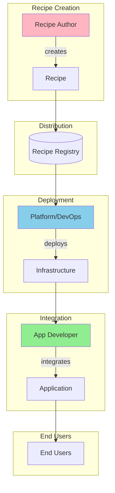

# Personas Overview

Different roles interact with PraisonAI recipes in different ways. This guide helps you find the right documentation based on your role and responsibilities.

## Choose Your Persona

<CardGroup cols={3}>
  <Card title="App Developer" icon="code" href="/docs/guides/recipes/personas/app-developer">
    **Build applications** that use recipes. Focus on SDK integration, error handling, and user experience.
  </Card>
  <Card title="Platform/DevOps" icon="server" href="/docs/guides/recipes/personas/platform-devops">
    **Deploy and operate** recipe infrastructure. Focus on scaling, monitoring, security, and reliability.
  </Card>
  <Card title="Recipe Author" icon="wand-magic-sparkles" href="/docs/guides/recipes/personas/recipe-author">
    **Create and maintain** recipes. Focus on agent design, testing, and documentation.
  </Card>
</CardGroup>

## Persona Collaboration

## Quick Reference

<Tabs>
  <Tab title="By Task">
    | Task | Primary Persona | Secondary |
    |------|-----------------|-----------|
    | Build app with recipes | App Developer | - |
    | Deploy recipe server | Platform/DevOps | - |
    | Create new recipe | Recipe Author | - |
    | Debug recipe failures | App Developer | Recipe Author |
    | Scale infrastructure | Platform/DevOps | - |
    | Optimize performance | Platform/DevOps | App Developer |
    | Add new AI capability | Recipe Author | App Developer |
  </Tab>
  <Tab title="By Integration Model">
    | Model | Primary Persona |
    |-------|-----------------|
    | Embedded SDK | App Developer |
    | CLI Invocation | App Developer, DevOps |
    | Local HTTP Sidecar | App Developer |
    | Remote Managed Runner | Platform/DevOps |
    | Event-Driven | Platform/DevOps |
    | Plugin Mode | App Developer |
  </Tab>
  <Tab title="By Concern">
    | Concern | Primary Persona |
    |---------|-----------------|
    | Latency | App Developer |
    | Reliability | Platform/DevOps |
    | Security | Platform/DevOps |
    | UX | App Developer |
    | AI Quality | Recipe Author |
    | Cost | Platform/DevOps |
  </Tab>
</Tabs>

## Recommended Learning Path

### App Developer
1. Start with [Embedded SDK](/docs/guides/recipes/integration-models/embedded-sdk)
2. Learn [CLI Invocation](/docs/guides/recipes/integration-models/cli-invocation) for scripts
3. Explore [Use Cases](/docs/guides/recipes/use-cases) for patterns

### Platform/DevOps
1. Start with [Local HTTP Sidecar](/docs/guides/recipes/integration-models/local-http-sidecar)
2. Progress to [Remote Managed Runner](/docs/guides/recipes/integration-models/remote-managed-runner)
3. Learn [Event-Driven](/docs/guides/recipes/integration-models/event-driven) for scale

### Recipe Author
1. Understand all [Integration Models](/docs/guides/recipes/integration-models)
2. Study [Use Cases](/docs/guides/recipes/use-cases) for inspiration
3. Review [Decision Guide](/docs/guides/recipes/decision-guide) for recommendations

## Cross-Persona Communication

Effective recipe deployment requires collaboration:

| From | To | Key Handoffs |
|------|-----|--------------|
| Recipe Author | App Developer | Recipe name, input/output schema, examples |
| Recipe Author | Platform/DevOps | Resource requirements, dependencies, SLAs |
| Platform/DevOps | App Developer | Endpoint URLs, API keys, rate limits |
| App Developer | Recipe Author | Bug reports, feature requests, usage patterns |

## Next Steps

Choose your persona above to get role-specific guidance, or explore:

- [Integration Models](/docs/guides/recipes/integration-models) - Technical integration options
- [Use Cases](/docs/guides/recipes/use-cases) - Real-world implementation patterns
- [Decision Guide](/docs/guides/recipes/decision-guide) - Choosing the right approach
