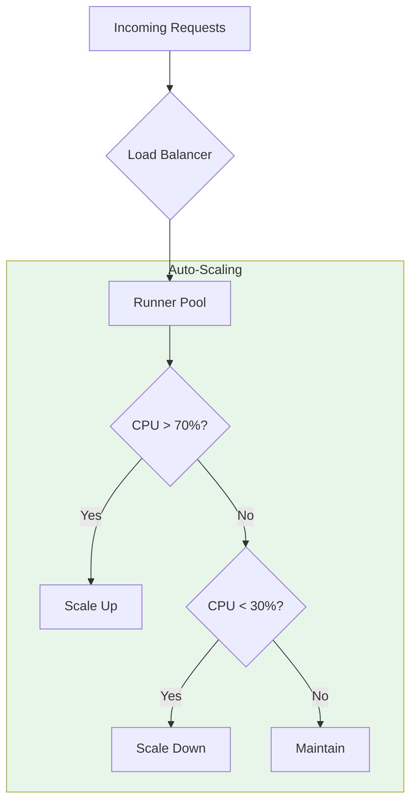

# Platform/DevOps Persona

<Callout type="info">
**Role**: Deploy, scale, secure, and monitor PraisonAI recipe infrastructure for production workloads.
</Callout>

## Primary Goals

- **Deploy reliably** with zero-downtime updates
- **Scale horizontally** to handle load spikes
- **Secure endpoints** with authentication and rate limiting
- **Monitor health** with metrics, logs, and alerts

## Recommended Integration Models

<CardGroup cols={2}>
  <Card title="Local HTTP Sidecar" icon="server" href="/docs/guides/recipes/integration-models/local-http-sidecar">
    **Development/Testing** - Quick local setup
  </Card>
  <Card title="Remote Managed Runner" icon="cloud" href="/docs/guides/recipes/integration-models/remote-managed-runner">
    **Production** - Centralized, scalable deployment
  </Card>
  <Card title="Event-Driven" icon="bolt" href="/docs/guides/recipes/integration-models/event-driven">
    **High Volume** - Queue-based async processing
  </Card>
  <Card title="CLI Invocation" icon="terminal" href="/docs/guides/recipes/integration-models/cli-invocation">
    **CI/CD** - Pipeline automation
  </Card>
</CardGroup>

## Typical Workflow

<Steps>
  <Step title="Set Up Infrastructure">
    ```yaml
    # docker-compose.yml
    version: '3.8'
    services:
      praisonai-runner:
        image: praisonai/runner:latest
        ports:
          - "8765:8765"
        environment:
          - OPENAI_API_KEY=${OPENAI_API_KEY}
          - PRAISONAI_API_KEY=${PRAISONAI_API_KEY}
          - PRAISONAI_AUTH=api-key
        volumes:
          - ./recipes:/root/.praison/templates
        healthcheck:
          test: ["CMD", "curl", "-f", "http://localhost:8765/health"]
          interval: 30s
          timeout: 10s
          retries: 3
        deploy:
          replicas: 3
          resources:
            limits:
              memory: 2G
              cpus: '2'
    ```
  </Step>
  
  <Step title="Configure Authentication">
    ```yaml
    # serve.yaml
    host: 0.0.0.0
    port: 8765
    auth: api-key
    api_key: ${PRAISONAI_API_KEY}
    
    # Rate limiting
    rate_limit: 100  # requests per minute per client
    
    # Request limits
    max_request_size: 10485760  # 10MB
    
    # CORS (if needed)
    cors_origins: "https://app.example.com"
    ```
  </Step>
  
  <Step title="Set Up Load Balancer">
    ```nginx
    # nginx.conf
    upstream praisonai {
        least_conn;
        server runner1:8765 weight=1;
        server runner2:8765 weight=1;
        server runner3:8765 weight=1;
        
        keepalive 32;
    }

    server {
        listen 443 ssl http2;
        server_name api.example.com;

        ssl_certificate /etc/ssl/certs/cert.pem;
        ssl_certificate_key /etc/ssl/private/key.pem;

        # Security headers
        add_header X-Content-Type-Options nosniff;
        add_header X-Frame-Options DENY;
        add_header X-XSS-Protection "1; mode=block";

        location / {
            proxy_pass http://praisonai;
            proxy_http_version 1.1;
            proxy_set_header Connection "";
            proxy_set_header Host $host;
            proxy_set_header X-Real-IP $remote_addr;
            proxy_set_header X-Forwarded-For $proxy_add_x_forwarded_for;
            proxy_read_timeout 300s;
            proxy_send_timeout 300s;
        }

        # SSE streaming
        location /v1/recipes/stream {
            proxy_pass http://praisonai;
            proxy_http_version 1.1;
            proxy_set_header Connection "";
            proxy_buffering off;
            proxy_cache off;
            chunked_transfer_encoding off;
        }
    }
    ```
  </Step>
  
  <Step title="Configure Monitoring">
    ```yaml
    # prometheus.yml
    global:
      scrape_interval: 15s

    scrape_configs:
      - job_name: 'praisonai'
        static_configs:
          - targets: ['runner1:8765', 'runner2:8765', 'runner3:8765']
        metrics_path: /metrics
    ```

    ```yaml
    # alertmanager rules
    groups:
      - name: praisonai
        rules:
          - alert: HighErrorRate
            expr: rate(praisonai_recipe_errors_total[5m]) > 0.1
            for: 5m
            labels:
              severity: warning
            annotations:
              summary: "High recipe error rate"
          
          - alert: SlowRecipes
            expr: histogram_quantile(0.95, praisonai_recipe_duration_seconds) > 30
            for: 10m
            labels:
              severity: warning
            annotations:
              summary: "Recipe execution slow"
    ```
  </Step>
  
  <Step title="Set Up Logging">
    ```yaml
    # fluent-bit.conf
    [INPUT]
        Name              tail
        Path              /var/log/praisonai/*.log
        Parser            json
        Tag               praisonai.*

    [FILTER]
        Name              modify
        Match             praisonai.*
        Add               service praisonai
        Add               environment production

    [OUTPUT]
        Name              elasticsearch
        Match             praisonai.*
        Host              elasticsearch
        Port              9200
        Index             praisonai-logs
    ```
  </Step>
</Steps>

## Key Concerns

### High Availability

```yaml
# Kubernetes deployment with anti-affinity
apiVersion: apps/v1
kind: Deployment
metadata:
  name: praisonai-runner
spec:
  replicas: 3
  selector:
    matchLabels:
      app: praisonai-runner
  template:
    metadata:
      labels:
        app: praisonai-runner
    spec:
      affinity:
        podAntiAffinity:
          preferredDuringSchedulingIgnoredDuringExecution:
            - weight: 100
              podAffinityTerm:
                labelSelector:
                  matchLabels:
                    app: praisonai-runner
                topologyKey: kubernetes.io/hostname
      containers:
        - name: runner
          image: praisonai/runner:latest
          ports:
            - containerPort: 8765
          livenessProbe:
            httpGet:
              path: /health
              port: 8765
            initialDelaySeconds: 10
            periodSeconds: 10
          readinessProbe:
            httpGet:
              path: /health
              port: 8765
            initialDelaySeconds: 5
            periodSeconds: 5
```

### Security Hardening

```yaml
# serve.yaml - Production security
host: 0.0.0.0
port: 8765

# Authentication
auth: api-key
api_key: ${PRAISONAI_API_KEY}

# Rate limiting
rate_limit: 100
rate_limit_burst: 20

# Request limits
max_request_size: 10485760
request_timeout: 300

# Disable admin endpoints in production
enable_admin: false
enable_metrics: true

# Logging
log_level: info
log_format: json
```

### Scaling Strategy



```yaml
# Kubernetes HPA
apiVersion: autoscaling/v2
kind: HorizontalPodAutoscaler
metadata:
  name: praisonai-runner-hpa
spec:
  scaleTargetRef:
    apiVersion: apps/v1
    kind: Deployment
    name: praisonai-runner
  minReplicas: 2
  maxReplicas: 10
  metrics:
    - type: Resource
      resource:
        name: cpu
        target:
          type: Utilization
          averageUtilization: 70
    - type: Resource
      resource:
        name: memory
        target:
          type: Utilization
          averageUtilization: 80
```

## Operational Runbooks

### Health Check

```bash
# Check all runners
for host in runner1 runner2 runner3; do
  echo "Checking $host..."
  curl -s "http://$host:8765/health" | jq .
done

# Using CLI
praisonai endpoints health --url http://runner1:8765
```

### Rolling Restart

```bash
# Kubernetes
kubectl rollout restart deployment/praisonai-runner

# Docker Compose
docker-compose up -d --no-deps --build praisonai-runner
```

### Log Analysis

```bash
# Find errors in last hour
kubectl logs -l app=praisonai-runner --since=1h | grep -i error

# Recipe execution times
kubectl logs -l app=praisonai-runner | \
  jq -r 'select(.event=="recipe_completed") | "\(.recipe): \(.duration_ms)ms"'
```

## Troubleshooting

<Accordion title="High memory usage">
- Check for memory leaks in long-running recipes
- Implement request size limits
- Add memory limits to containers
- Monitor with `kubectl top pods`
</Accordion>

<Accordion title="Connection timeouts">
- Increase proxy timeouts for long recipes
- Check network policies
- Verify health checks are passing
- Review load balancer configuration
</Accordion>

<Accordion title="Rate limiting issues">
- Adjust rate limits based on traffic patterns
- Implement client-specific limits
- Add burst allowance for spikes
- Monitor rate limit metrics
</Accordion>

<Accordion title="SSL/TLS errors">
- Verify certificate chain is complete
- Check certificate expiration
- Ensure correct SNI configuration
- Test with `openssl s_client`
</Accordion>

## Security Checklist

- [ ] TLS enabled for all external traffic
- [ ] API key authentication enabled
- [ ] Rate limiting configured
- [ ] Request size limits set
- [ ] Admin endpoints disabled in production
- [ ] Secrets stored in vault/secrets manager
- [ ] Network policies restrict pod communication
- [ ] Container runs as non-root user
- [ ] Security scanning in CI/CD pipeline
- [ ] Audit logging enabled

## Monitoring Dashboard

Key metrics to display:

| Metric | Description | Alert Threshold |
|--------|-------------|-----------------|
| `praisonai_recipe_total` | Total recipe invocations | - |
| `praisonai_recipe_errors_total` | Error count | > 5% of total |
| `praisonai_recipe_duration_seconds` | Execution time | p95 > 30s |
| `praisonai_active_sessions` | Concurrent sessions | > 80% capacity |
| `praisonai_rate_limit_exceeded` | Rate limit hits | > 10/min |

## Next Steps

- [Remote Managed Runner](/docs/guides/recipes/integration-models/remote-managed-runner) - Detailed deployment guide
- [Event-Driven](/docs/guides/recipes/integration-models/event-driven) - Queue-based scaling
- [App Developer Persona](/docs/guides/recipes/personas/app-developer) - Client integration
