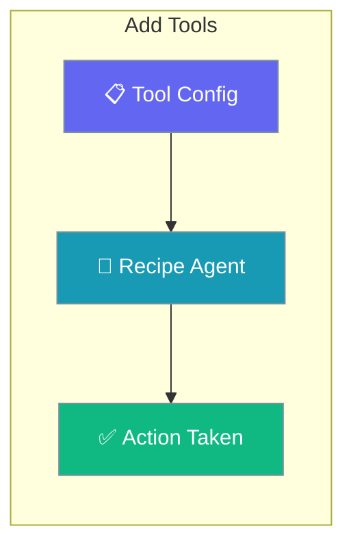
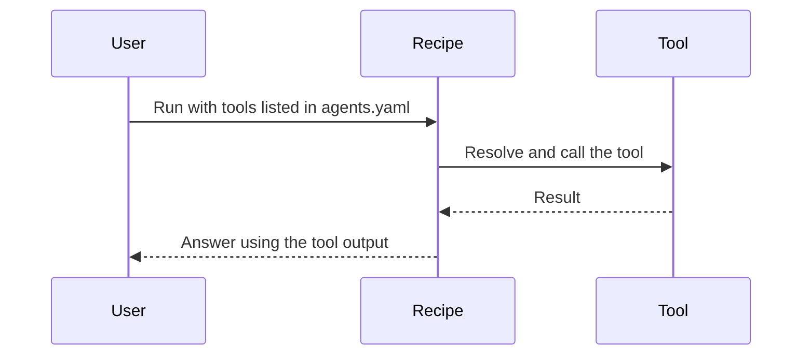

Register built-in or custom tools on recipe agents so templates can act on real data.

```python
from praisonaiagents import Agent, tool

@tool
def lookup_order(order_id: str) -> str:
    """Look up order status."""
    return f"Order {order_id} is shipped."

agent = Agent(name="Support", tools=[lookup_order])
agent.start("Check order 12345.")
```

The user adds tools to YAML or Python templates, then runs the recipe with those capabilities enabled.



## How It Works



---

## How to Add Built-in Tools

<Steps>
  <Step title="List Available Tools">
    ```bash
    praisonai tools list
    ```
  </Step>
  
  <Step title="Add Tools to agents.yaml">
    ```yaml
    # agents.yaml
    framework: praisonai
    topic: "{{task}}"
    
    roles:
      researcher:
        role: Research Agent
        goal: Research topics thoroughly
        tools:
          - internet_search
          - shell_tool
          - file_read_tool
        tasks:
          search_task:
            description: "Search for {{topic}}"
    ```
  </Step>
  
  <Step title="Run Recipe">
    ```bash
    praisonai recipe run ./my-recipe --var topic="AI agents"
    ```
  </Step>
</Steps>

## How to Add Custom Tools via tools.py

<Steps>
  <Step title="Create tools.py in Recipe Directory">
    ```python
    # tools.py
    def my_custom_tool(query: str) -> str:
        """Custom tool that processes a query.
        
        Args:
            query: The input query to process
            
        Returns:
            Processed result as string
        """
        return f"Processed: {query}"
    
    def another_tool(data: str) -> dict:
        """Another custom tool.
        
        Args:
            data: Input data
            
        Returns:
            Dictionary with results
        """
        return {"result": data, "status": "success"}
    ```
  </Step>
  
  <Step title="Reference in agents.yaml">
    ```yaml
    roles:
      processor:
        role: Data Processor
        tools:
          - my_custom_tool
          - another_tool
        tasks:
          process_task:
            description: "Process the data"
    ```
  </Step>
  
  <Step title="Run Recipe">
    ```bash
    praisonai recipe run ./my-recipe
    ```
  </Step>
</Steps>

## Tool Resolution Order

| Priority | Source | Description |
|----------|--------|-------------|
| 1 | `tools.py` | Recipe-local tools.py |
| 2 | Built-in | praisonaiagents built-in tools |
| 3 | Package | `praisonai_tools` package |

## Best Practices

<AccordionGroup>
<Accordion title="Prefer recipe-local tools.py for custom logic">
`tools.py` in the recipe directory wins resolution, so bundle recipe-specific tools there to keep them portable.
</Accordion>

<Accordion title="Write clear docstrings on every tool">
The agent reads the docstring to decide when and how to call a tool. Describe the arguments and return value so calls are accurate.
</Accordion>

<Accordion title="List only the tools a role needs">
Give each role the minimum tool set in `agents.yaml` so the agent stays focused and avoids unintended actions.
</Accordion>
</AccordionGroup>

---

## Related

<CardGroup cols={2}>
  <Card title="Create Custom Recipes" icon="plus" href="/docs/guides/templates/create-custom-templates">
    Build a recipe from scratch
  </Card>
  <Card title="Debug Recipes" icon="bug" href="/docs/guides/templates/debug-templates">
    Troubleshoot tool resolution
  </Card>
</CardGroup>