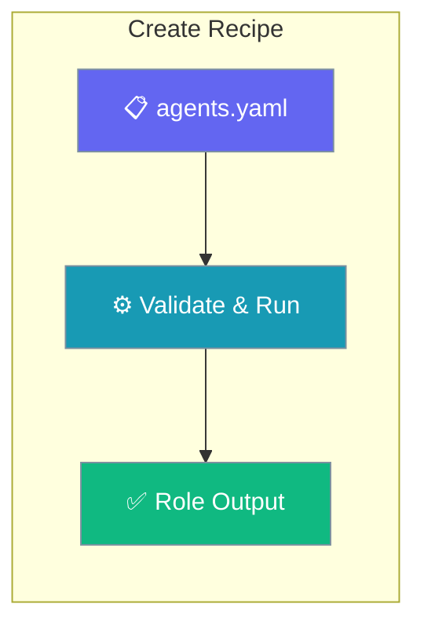
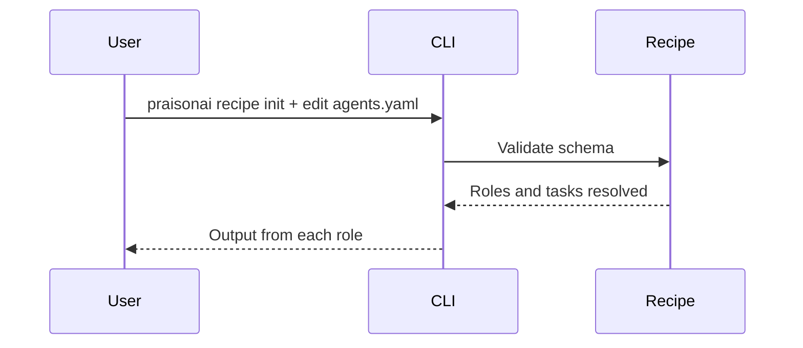

Define roles and tasks in `agents.yaml`, then run the recipe from the CLI.

```python
from praisonaiagents import Agent

agent = Agent(
    name="Recipe Author",
    instructions="Design multi-step recipe roles and validate outputs.",
)
agent.start("Outline a two-agent research recipe.")
```

The user authors `agents.yaml`, runs `praisonai recipe run`, and receives output from each role.



## How It Works



---

## How to Create a Custom Recipe from Scratch

<Steps>
  <Step title="Create Recipe Directory">
    Create a new directory for your recipe with the required structure:
    
    ```bash
    mkdir -p my-recipe
    cd my-recipe
    ```
  </Step>
  
  <Step title="Create agents.yaml">
    Create the main recipe configuration file:
    
    ```yaml
    # agents.yaml
    framework: praisonai
    topic: "{{task}}"
    
    roles:
      researcher:
        role: Research Specialist
        goal: Research the given topic thoroughly
        backstory: Expert researcher with attention to detail
        tools:
          - internet_search
        tasks:
          research_task:
            description: |
              Research: {{task}}
              Provide comprehensive findings.
            expected_output: "Detailed research report"
    ```
  </Step>
  
  <Step title="Test Your Recipe Locally">
    Run your recipe to verify it works:
    
    ```bash
    praisonai recipe run ./my-recipe --var task="AI trends 2024"
    ```
  </Step>
</Steps>

## How to Create a Recipe with CLI

<Steps>
  <Step title="Initialize Recipe">
    ```bash
    praisonai recipe init my-new-recipe
    ```
  </Step>
  
  <Step title="Edit Generated Files">
    ```bash
    cd my-new-recipe
    # Edit agents.yaml as needed
    ```
  </Step>
  
  <Step title="Validate Recipe">
    ```bash
    praisonai recipe validate ./my-new-recipe
    ```
  </Step>
  
  <Step title="Run Recipe">
    ```bash
    praisonai recipe run my-new-recipe --var task="Your task here"
    ```
  </Step>
</Steps>

## Recipe File Structure

```
my-recipe/
├── agents.yaml        # Agent definitions and tasks
├── tools.py           # Optional: custom tools
└── README.md          # Optional: documentation
```

## agents.yaml Schema

| Field | Type | Required | Description |
|-------|------|----------|-------------|
| `framework` | string | Yes | Should be `praisonai` |
| `topic` | string | Yes | Main topic/task |
| `roles` | object | Yes | Agent definitions |
| `roles.*.role` | string | Yes | Agent role name |
| `roles.*.goal` | string | Yes | Agent goal |
| `roles.*.tools` | array | No | Tools for agent |
| `roles.*.tasks` | object | Yes | Agent tasks |

## Best Practices

<AccordionGroup>
<Accordion title="Start from praisonai recipe init">
The scaffold gives you a valid `agents.yaml` to edit, so you avoid schema mistakes on the first pass.
</Accordion>

<Accordion title="Give each role a clear goal and expected_output">
Specific goals and `expected_output` fields keep multi-role recipes on track and make outputs predictable.
</Accordion>

<Accordion title="Validate before running">
Run `praisonai recipe validate ./my-recipe` after each change so schema errors surface before execution.
</Accordion>
</AccordionGroup>

---

## Related

<CardGroup cols={2}>
  <Card title="Add Tools to Recipes" icon="wrench" href="/docs/guides/templates/add-tools-to-templates">
    Give recipe agents real capabilities
  </Card>
  <Card title="Different Ways to Create" icon="layer-group" href="/docs/guides/templates/different-ways-to-create-templates">
    Other recipe creation methods
  </Card>
</CardGroup>
