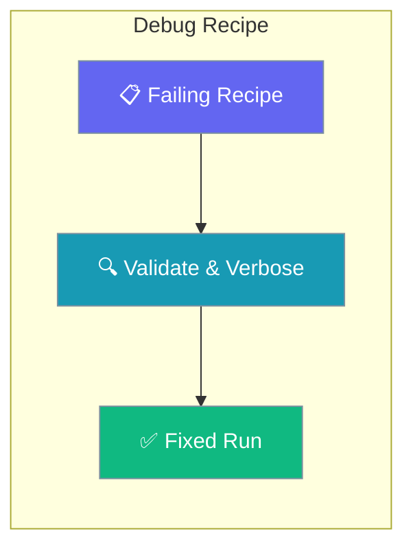
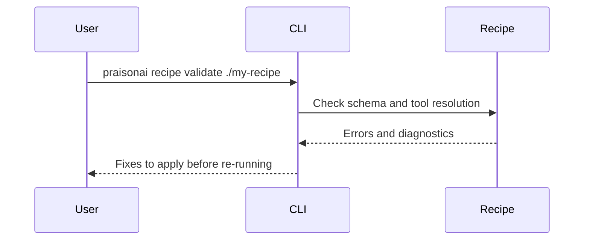

Run validation and verbose recipe commands when a template fails in production.

```python
from praisonaiagents import Agent

agent = Agent(name="Recipe Debugger", instructions="Explain recipe validation errors clearly.")
agent.start("Why did my recipe fail tool resolution?")
```

The user enables verbose mode, validates the recipe folder, and fixes configuration before re-running.



## How It Works



---

## How to Debug Recipe Execution

<Steps>
  <Step title="Enable Verbose Mode">
    ```bash
    praisonai recipe run my-recipe --verbose
    ```
  </Step>
  
  <Step title="Check Recipe Validation">
    ```bash
    praisonai recipe validate ./my-recipe
    ```
  </Step>
  
  <Step title="View Recipe Info">
    ```bash
    praisonai recipe info my-recipe
    ```
  </Step>
  
  <Step title="Check Tool Resolution">
    ```bash
    praisonai tools list
    ```
  </Step>
</Steps>

## How to Use Recipe Doctor

<Steps>
  <Step title="Run Doctor Command">
    ```bash
    praisonai tools doctor
    ```
  </Step>
  
  <Step title="Review Diagnostics">
    The doctor command will show:
    - Missing tools
    - Invalid tool references
    - Configuration issues
    - Dependency problems
  </Step>
  
  <Step title="Fix Issues">
    Based on doctor output, fix the identified issues in your recipe files.
  </Step>
</Steps>

## How to Debug Tool Resolution

When loading a template, PraisonAI now asks the full `ToolResolver` whether each referenced tool exists — not just the built-in `TOOL_MAPPINGS`. As of [PR #2642](https://github.com/MervinPraison/PraisonAI/pull/2642), templates that reference tools registered via `praisonai_tools`, `register_function`, or entry-point plugins load without spurious "missing / needs install" warnings.

<Steps>
  <Step title="List Available Tools">
    ```bash
    praisonai tools list
    ```
  </Step>
  
  <Step title="Resolve Specific Tool">
    ```bash
    praisonai tools resolve shell_tool
    ```
  </Step>
</Steps>

## How to Debug with Python

<Steps>
  <Step title="Enable Debug Logging">
    ```python
    import logging
    logging.basicConfig(level=logging.DEBUG)
    
    from praisonaiagents import Agent
    
    agent = Agent(
        name="test",
        role="Test Agent",
        verbose=True
    )
    ```
  </Step>
  
  <Step title="Test Agent Execution">
    ```python
    result = agent.start("Test task")
    print(result)
    ```
  </Step>
</Steps>

## Common Issues and Solutions

| Issue | Cause | Solution |
|-------|-------|----------|
| Tool not found | Tool not available | Check `praisonai tools list` |
| Variable undefined | Missing variable | Pass with `--var key=value` |
| Recipe not found | Wrong path | Use full path |
| Permission denied | File access | Check file permissions |

## Debug CLI Options

```bash
praisonai recipe run <recipe> [DEBUG OPTIONS]

Debug Options:
  --verbose              Enable verbose logging
```

## Best Practices

<AccordionGroup>
<Accordion title="Validate first, then run verbose">
`praisonai recipe validate` catches structural errors cheaply; reach for `--verbose` only when a valid recipe still misbehaves at run time.
</Accordion>

<Accordion title="Confirm tools resolve before blaming the recipe">
`praisonai tools list` and `praisonai tools resolve <name>` show whether a referenced tool is actually available, which is the most common recipe failure.
</Accordion>

<Accordion title="Reproduce failures with debug logging in Python">
Set `logging.basicConfig(level=logging.DEBUG)` and `verbose=True` on the agent to surface the exact step that fails.
</Accordion>
</AccordionGroup>

---

## Related

<CardGroup cols={2}>
  <Card title="Add Tools to Recipes" icon="wrench" href="/docs/guides/templates/add-tools-to-templates">
    Fix tool resolution issues
  </Card>
  <Card title="Manage Recipes" icon="gear" href="/docs/guides/templates/manage-templates">
    Update and edit recipes
  </Card>
</CardGroup>
