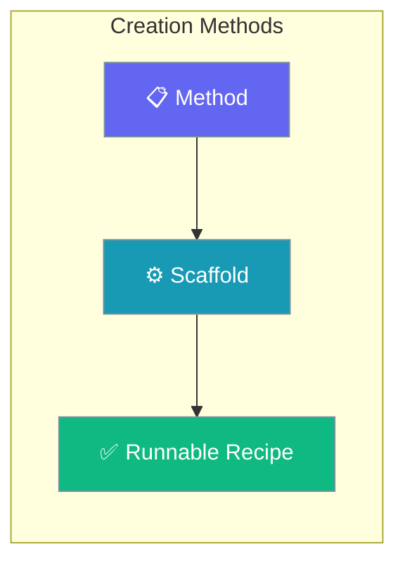
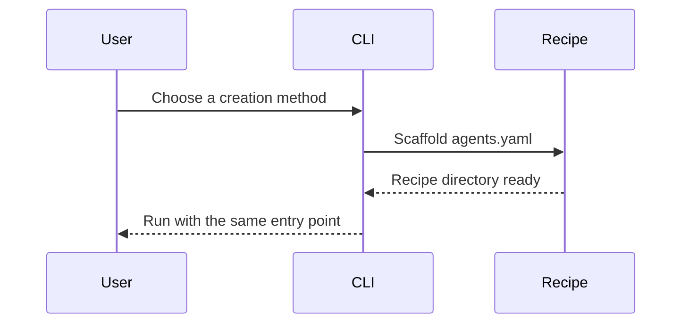

Create recipes with the CLI, by hand, or from existing examples—pick the path that fits your team.

```python
from praisonaiagents import Agent

agent = Agent(name="Recipe Planner", instructions="Compare recipe creation approaches.")
agent.start("Should I use recipe init or a manual folder?")
```

The user picks a creation method, scaffolds files, and runs the recipe with the same CLI entry point.



## How It Works



---

## How to Create Recipes Using CLI

<Steps>
  <Step title="Initialize New Recipe">
    ```bash
    praisonai recipe init my-recipe
    ```
  </Step>
  
  <Step title="Navigate to Recipe">
    ```bash
    cd my-recipe
    ```
  </Step>
  
  <Step title="Customize Generated Files">
    Edit `agents.yaml` to match your requirements.
  </Step>
</Steps>

## How to Create Recipes Manually

<Steps>
  <Step title="Create Directory Structure">
    ```bash
    mkdir my-recipe
    cd my-recipe
    touch agents.yaml
    ```
  </Step>
  
  <Step title="Write agents.yaml">
    ```yaml
    framework: praisonai
    topic: "{{task}}"
    
    roles:
      agent:
        role: Assistant
        goal: Complete the task
        tasks:
          main:
            description: "{{task}}"
            expected_output: "Task result"
    ```
  </Step>
  
  <Step title="Run Recipe">
    ```bash
    praisonai recipe run ./my-recipe --var task="Your task"
    ```
  </Step>
</Steps>

## How to Create Recipes from Existing Agents

<Steps>
  <Step title="Define Agent in Python">
    ```python
    from praisonaiagents import Agent
    
    agent = Agent(
        name="researcher",
        role="Research Specialist",
        goal="Research topics thoroughly",
        tools=["internet_search"]
    )
    ```
  </Step>
  
  <Step title="Convert to YAML">
    Create `agents.yaml` based on your agent:
    
    ```yaml
    framework: praisonai
    topic: "{{task}}"
    
    roles:
      researcher:
        role: Research Specialist
        goal: Research topics thoroughly
        tools:
          - internet_search
        tasks:
          research:
            description: "Research {{task}}"
    ```
  </Step>
</Steps>

## How to Create Recipes from GitHub

<Steps>
  <Step title="Fork Repository">
    Fork the Agent-Recipes repository on GitHub.
  </Step>
  
  <Step title="Clone Your Fork">
    ```bash
    git clone https://github.com/YOUR_USERNAME/Agent-Recipes
    cd Agent-Recipes
    ```
  </Step>
  
  <Step title="Create New Recipe Directory">
    ```bash
    mkdir my-new-recipe
    # Create agents.yaml
    ```
  </Step>
  
  <Step title="Customize and Push">
    ```bash
    # Edit files
    git add .
    git commit -m "Add my-new-recipe"
    git push
    ```
  </Step>
</Steps>

## Recipe Creation Methods Comparison

| Method | Best For | Complexity |
|--------|----------|------------|
| CLI `init` | Quick start | Low |
| Manual | Full control | Medium |
| From Agent | Converting existing code | Medium |
| GitHub Fork | Contributing to community | Medium |

## Best Practices

<AccordionGroup>
<Accordion title="Use recipe init for a fast, valid start">
The CLI scaffold produces a correct `agents.yaml`, so it is the lowest-risk way to begin a new recipe.
</Accordion>

<Accordion title="Go manual only when you need full control">
Hand-authoring pays off for unusual structures, but skip it for standard recipes where the scaffold already fits.
</Accordion>

<Accordion title="Every method ends at the same run command">
No matter how you create a recipe, `praisonai recipe run` executes it — so choose the method by authoring convenience, not runtime behaviour.
</Accordion>
</AccordionGroup>

---

## Related

<CardGroup cols={2}>
  <Card title="Create Custom Recipes" icon="plus" href="/docs/guides/templates/create-custom-templates">
    Full walkthrough for authoring recipes
  </Card>
  <Card title="Use Existing Recipes" icon="play" href="/docs/guides/templates/use-existing-templates">
    Run community and built-in recipes
  </Card>
</CardGroup>
