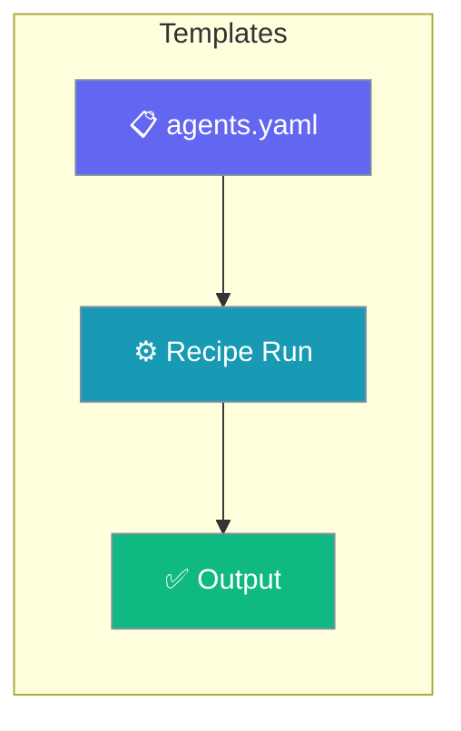
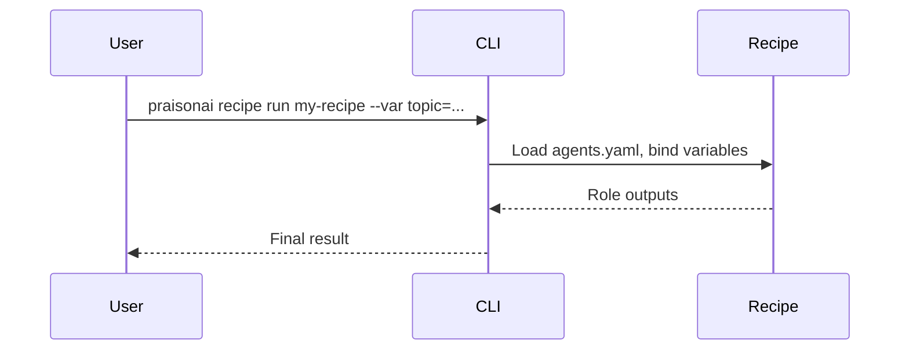

Recipes package agents, tasks, and tools so you can run repeatable workflows from YAML.

```python
from praisonaiagents import Agent

agent = Agent(name="Recipe Runner", instructions="Summarise what PraisonAI recipes provide.")
agent.start("What can I do with recipes?")
```

The user opens a recipe guide, configures roles, and runs `praisonai recipe run` with variables.



## Quick Start

<Steps>
<Step title="Simple Usage">

List and run a recipe from the CLI.

```bash
praisonai recipe list
praisonai recipe run my-recipe
```

</Step>

<Step title="With Configuration">

Pass variables into the recipe at run time.

```bash
praisonai recipe run my-recipe --var topic="AI agents"
```

</Step>
</Steps>

---

## How It Works



---

## Recipe Guides

Learn how to create, use, manage, and debug recipes in PraisonAI.

<CardGroup cols={2}>
  <Card title="Create Custom Recipes" icon="plus" href="/docs/guides/templates/create-custom-templates">
    Build your own recipes from scratch
  </Card>
  <Card title="Use Existing Recipes" icon="play" href="/docs/guides/templates/use-existing-templates">
    Run and configure existing recipes
  </Card>
  <Card title="Add Tools to Recipes" icon="wrench" href="/docs/guides/templates/add-tools-to-templates">
    Configure tools for your recipes
  </Card>
  <Card title="Manage Recipes" icon="gear" href="/docs/guides/templates/manage-templates">
    Update, edit, and delete recipes
  </Card>
  <Card title="Debug Recipes" icon="bug" href="/docs/guides/templates/debug-templates">
    Troubleshoot recipe issues
  </Card>
  <Card title="Different Ways to Create" icon="layer-group" href="/docs/guides/templates/different-ways-to-create-templates">
    Explore all recipe creation methods
  </Card>
</CardGroup>

## Quick Reference

| Task | Command |
|------|---------|
| List recipes | `praisonai recipe list` |
| Add from GitHub | `praisonai recipe add github:user/repo/recipe` |
| Add local | `praisonai recipe add ./my-recipe` |
| Run recipe | `praisonai recipe run <name>` |
| Get info | `praisonai recipe info <name>` |
| Validate | `praisonai recipe validate <path>` |
| Init new | `praisonai recipe init <name>` |

## Best Practices

<AccordionGroup>
<Accordion title="Keep agents.yaml the single source of truth">
Define roles, goals, tools, and tasks in one `agents.yaml`. Recipes stay portable when everything lives in the recipe directory.
</Accordion>

<Accordion title="Validate before you run">
`praisonai recipe validate <path>` catches schema errors before execution. Wire it into CI so broken recipes never ship.
</Accordion>

<Accordion title="Parameterise with variables">
Use `{{task}}`-style placeholders and pass values with `--var key=value` so one recipe serves many inputs.
</Accordion>
</AccordionGroup>
