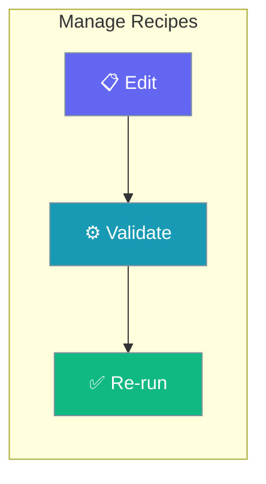
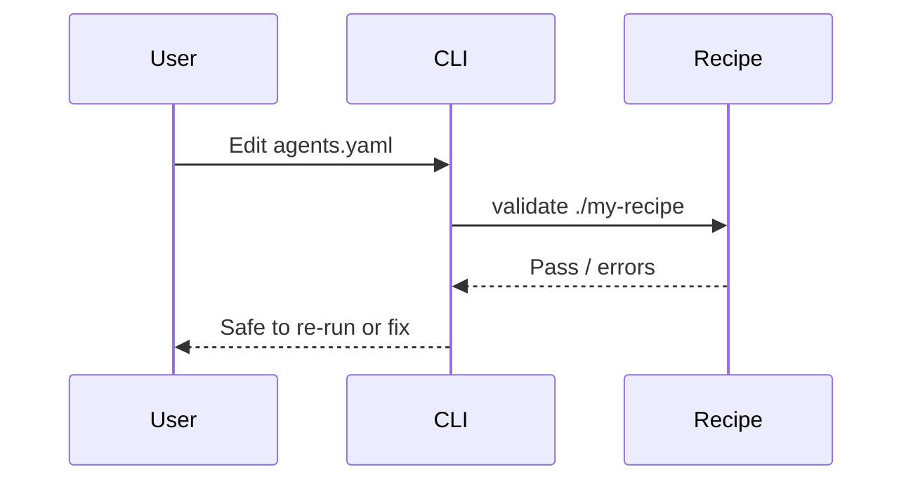

Update recipe versions, validate changes, and retire old templates safely.

```python
from praisonaiagents import Agent

agent = Agent(name="Recipe Maintainer", instructions="Guide safe recipe updates and rollbacks.")
agent.start("How do I version my recipe changes?")
```

The user edits `agents.yaml`, validates the folder, and re-runs the recipe with updated variables.



## How It Works



---

## How to Update a Recipe

<Steps>
  <Step title="Check Current Version">
    ```bash
    praisonai recipe info my-recipe
    ```
  </Step>
  
  <Step title="Edit agents.yaml">
    Update the configuration and make changes:
    
    ```yaml
    # agents.yaml
    framework: praisonai
    topic: "{{task}}"
    
    roles:
      agent:
        role: Updated Agent
        goal: Updated goal
        # ... modifications
    ```
  </Step>
  
  <Step title="Validate Changes">
    ```bash
    praisonai recipe validate ./my-recipe
    ```
  </Step>
  
  <Step title="Test Updated Recipe">
    ```bash
    praisonai recipe run ./my-recipe --var task="Test task"
    ```
  </Step>
</Steps>

## How to Edit Recipe Variables

<Steps>
  <Step title="View Current Variables">
    ```bash
    praisonai recipe info my-recipe
    ```
  </Step>
  
  <Step title="Use Variables in agents.yaml">
    ```yaml
    framework: praisonai
    topic: "{{task}}"
    
    roles:
      agent:
        role: "{{role_name}}"
        goal: Complete the task
        tasks:
          main_task:
            description: |
              Task: {{task}}
              Format: {{output_format}}
    ```
  </Step>
  
  <Step title="Run with Variables">
    ```bash
    praisonai recipe run my-recipe --var task="Research AI" --var output_format="markdown"
    ```
  </Step>
</Steps>

## How to Delete a Recipe

<Steps>
  <Step title="List Installed Recipes">
    ```bash
    praisonai recipe list
    ```
  </Step>
  
  <Step title="Remove Recipe">
    ```bash
    praisonai recipe remove my-recipe
    ```
  </Step>
  
  <Step title="Verify Removal">
    ```bash
    praisonai recipe list
    ```
  </Step>
</Steps>

## Recipe Management Commands

| Command | Description |
|---------|-------------|
| `praisonai recipe list` | List all recipes |
| `praisonai recipe info <name>` | Show recipe details |
| `praisonai recipe validate <path>` | Validate recipe |
| `praisonai recipe remove <name>` | Remove recipe |

## Best Practices

<AccordionGroup>
<Accordion title="Validate after every edit">
Run `praisonai recipe validate` before re-running so a bad change is caught while it is easy to fix.
</Accordion>

<Accordion title="Track recipes in version control">
Commit `agents.yaml` and `tools.py` so changes are reviewable and a broken update can be rolled back cleanly.
</Accordion>

<Accordion title="Confirm removal with list">
After `praisonai recipe remove`, run `praisonai recipe list` to verify the recipe is gone and no callers still reference it.
</Accordion>
</AccordionGroup>

---

## Related

<CardGroup cols={2}>
  <Card title="Debug Recipes" icon="bug" href="/docs/guides/templates/debug-templates">
    Troubleshoot a failing update
  </Card>
  <Card title="Create Custom Recipes" icon="plus" href="/docs/guides/templates/create-custom-templates">
    Author a new recipe
  </Card>
</CardGroup>
