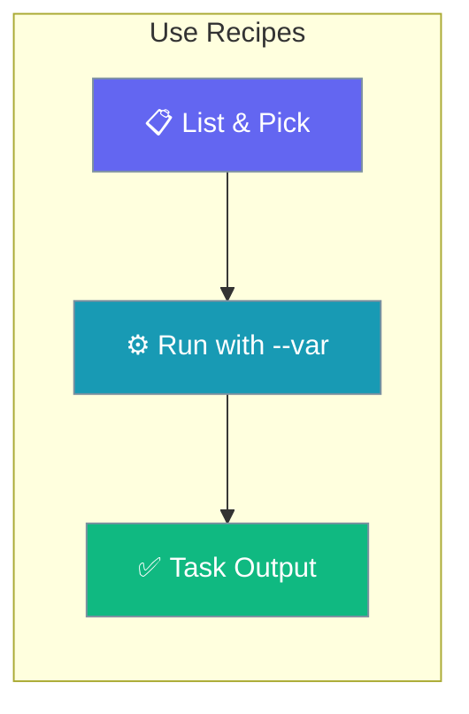
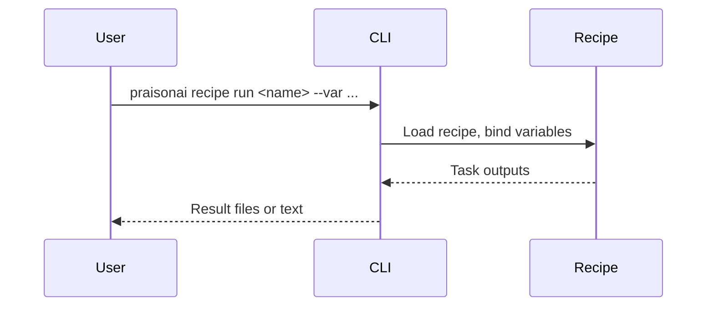

Discover community or built-in recipes and run them with your own inputs.

```python
from praisonaiagents import Agent

agent = Agent(name="Recipe Operator", instructions="Help run existing PraisonAI recipes.")
agent.start("List steps to run an existing recipe with custom variables.")
```

The user lists recipes, passes `--var` flags, and collects outputs from each task.



## How It Works



---

## How to Run an Existing Recipe

<Steps>
  <Step title="List Available Recipes">
    ```bash
    praisonai recipe list
    ```
  </Step>
  
  <Step title="Get Recipe Info">
    ```bash
    praisonai recipe info ai-video-editor
    ```
  </Step>
  
  <Step title="Run Recipe with Variables">
    ```bash
    praisonai recipe run ai-video-editor --var input=video.mp4 --var output=edited.mp4
    ```
  </Step>
  
  <Step title="View Output">
    Check the generated output in your working directory or specified output path.
  </Step>
</Steps>

## How to Run Recipes from GitHub

<Steps>
  <Step title="Run Directly from GitHub">
    ```bash
    praisonai recipe run github:MervinPraison/Agent-Recipes/ai-video-editor
    ```
  </Step>
  
  <Step title="Run with Custom Branch">
    ```bash
    praisonai recipe run github:MervinPraison/Agent-Recipes/ai-video-editor@main
    ```
  </Step>
  
  <Step title="Run with Variables">
    ```bash
    praisonai recipe run github:MervinPraison/Agent-Recipes/ai-video-editor --var input=video.mp4
    ```
  </Step>
</Steps>

## How to Run Recipes with Python

<Steps>
  <Step title="Import and Run">
    ```python
    from praisonaiagents import Agent, AgentTeam
    import yaml
    
    # Load recipe
    with open("agents.yaml") as f:
        config = yaml.safe_load(f)
    
    # Run agents based on config
    ```
  </Step>
</Steps>

## Common Recipe Variables

| Recipe | Variables | Example |
|--------|-----------|---------|
| `ai-video-editor` | `--var input`, `--var output` | `--var input=video.mp4` |
| `research-agent` | `--var topic`, `--var depth` | `--var topic="AI trends"` |
| `code-reviewer` | `--var repo`, `--var branch` | `--var repo=./myproject` |

## CLI Options

```bash
praisonai recipe run <recipe> [OPTIONS]

Options:
  --var KEY=VALUE        Set variable value
  --verbose              Enable verbose output
```

## Best Practices

<AccordionGroup>
<Accordion title="Read recipe info before running">
`praisonai recipe info <name>` lists the variables a recipe expects, so you pass the right `--var` flags on the first try.
</Accordion>

<Accordion title="Pin a branch when running from GitHub">
Append `@main` (or a tag) to a `github:` recipe reference so runs stay reproducible even as the upstream repo changes.
</Accordion>

<Accordion title="Add --verbose when output looks wrong">
Verbose mode shows each task and tool call, making it clear where an unexpected result came from.
</Accordion>
</AccordionGroup>

---

## Related

<CardGroup cols={2}>
  <Card title="Manage Recipes" icon="gear" href="/docs/guides/templates/manage-templates">
    Update and remove installed recipes
  </Card>
  <Card title="Debug Recipes" icon="bug" href="/docs/guides/templates/debug-templates">
    Troubleshoot a failing run
  </Card>
</CardGroup>
