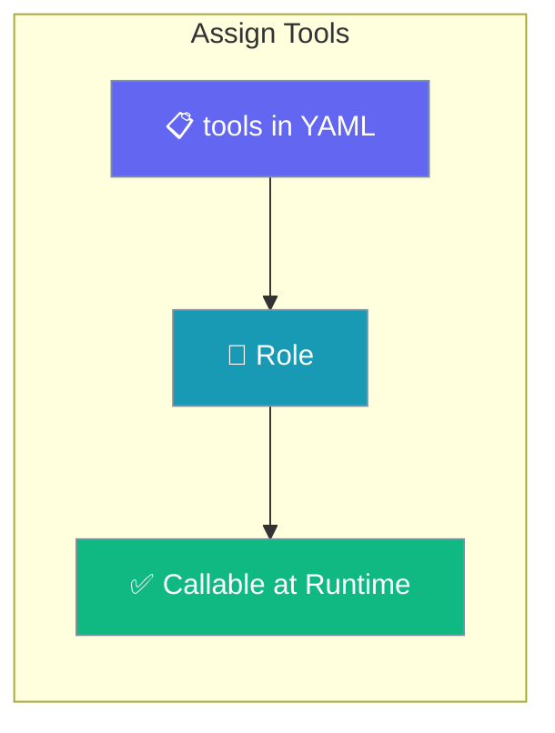
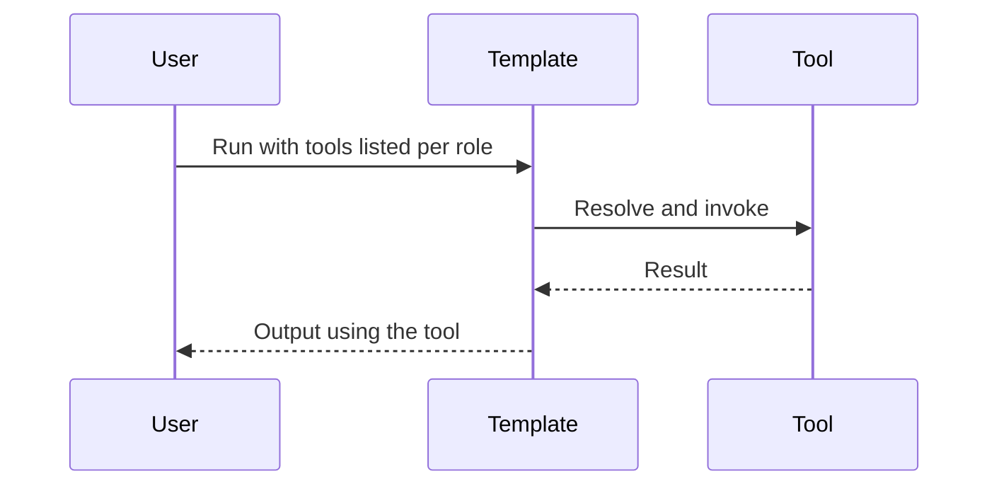

Wire built-in or custom tools into template manifests so agents can call them at runtime.

```python
from praisonaiagents import Agent, tool

@tool
def status_lookup(id: str) -> str:
    """Return item status."""
    return f"Status for {id}: ready"

agent = Agent(name="Template Agent", tools=[status_lookup])
agent.start("Check status for item 99.")
```

The user declares tools in YAML, assigns them to roles, and runs the template with those capabilities.



## How It Works



---

## How to Assign Built-in Tools

<Steps>
  <Step title="List Available Built-in Tools">
    ```bash
    praisonai tools list
    ```
  </Step>
  
  <Step title="Add to TEMPLATE.yaml">
    ```yaml
    # TEMPLATE.yaml
    name: my-template
    version: "1.0.0"
    
    requires:
      tools:
        - internet_search
        - shell_tool
        - file_read_tool
    ```
  </Step>
  
  <Step title="Assign to Agents">
    ```yaml
    # agents.yaml
    roles:
      researcher:
        role: Research Agent
        tools:
          - internet_search
      executor:
        role: Executor Agent
        tools:
          - shell_tool
          - file_read_tool
    ```
  </Step>
</Steps>

## How to Assign Custom Tools from tools.py

<Steps>
  <Step title="Create tools.py">
    ```python
    # tools.py
    def analyze_data(data: str) -> dict:
        """Analyze input data.
        
        Args:
            data: Data to analyze
            
        Returns:
            Analysis results
        """
        return {"analysis": "complete", "data": data}
    ```
  </Step>
  
  <Step title="Assign to Agent">
    ```yaml
    # agents.yaml
    roles:
      analyst:
        role: Data Analyst
        tools:
          - analyze_data
        tasks:
          analyze:
            description: "Analyze the provided data"
    ```
  </Step>
  
  <Step title="Run Template">
    ```bash
    praisonai templates run ./my-template
    ```
  </Step>
</Steps>

## How to Assign Tools from External Sources

<Steps>
  <Step title="Add tools_sources">
    ```yaml
    # TEMPLATE.yaml
    requires:
      tools_sources:
        - praisonai_tools.video
        - ./extra_tools.py
    ```
  </Step>
  
  <Step title="Assign External Tools">
    ```yaml
    # agents.yaml
    roles:
      video_editor:
        role: Video Editor
        tools:
          - shell_tool
        tasks:
          edit:
            description: |
              Use python -m praisonai_tools.video to edit videos
    ```
  </Step>
</Steps>

## How to Assign Tools Dynamically with Python

<Steps>
  <Step title="Load Template">
    ```python
    from praisonai.templates.loader import TemplateLoader
    
    loader = TemplateLoader()
    template = loader.load_template("my-template")
    ```
  </Step>
  
  <Step title="Create Custom Tools">
    ```python
    def custom_tool(input: str) -> str:
        """Custom processing tool."""
        return f"Processed: {input}"
    ```
  </Step>
  
  <Step title="Run with Additional Tools">
    ```python
    result = template.run(
        task="Process data",
        additional_tools=[custom_tool]
    )
    ```
  </Step>
</Steps>

## Best Practices

<AccordionGroup>
<Accordion title="Assign only the tools a role needs">
Listing the minimum tool set per role keeps the agent focused and avoids unintended actions.
</Accordion>

<Accordion title="Use descriptive tool names">
Clear names help both the model and the reader understand what each assigned tool does at a glance.
</Accordion>

<Accordion title="Verify tools resolve before assigning">
Run `praisonai tools list` (or `doctor`) so every name in the manifest actually resolves at runtime.
</Accordion>

<Accordion title="Group related tools together">
Keeping related tools on the same role makes recipes easier to reason about and maintain.
</Accordion>
</AccordionGroup>

---

## Related

<CardGroup cols={2}>
  <Card title="Create Custom Tools" icon="plus" href="/docs/guides/tools/create-custom-tools">
    Build the tools you assign
  </Card>
  <Card title="Debug Tools" icon="bug" href="/docs/guides/tools/debug-tools">
    Fix tools that fail to resolve
  </Card>
</CardGroup>
