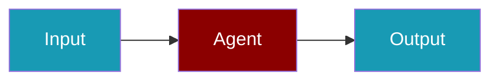

Turn Python functions into agent-callable tools with clear parameters and docstrings.

```python
from praisonaiagents import Agent, tool

@tool
def echo(query: str) -> str:
    """Return the query uppercased."""
    return query.upper()

agent = Agent(name="Tool Demo", tools=[echo])
agent.start("Use echo on hello world.")
```

The user defines a tool, registers it on an agent, and verifies the model invokes it correctly.




## How to Create a Simple Tool Function

<Steps>
  <Step title="Define Tool Function">
    ```python
    def my_tool(query: str) -> str:
        """Process a query and return result.
        
        Args:
            query: The input query to process
            
        Returns:
            Processed result as string
        """
        # Your tool logic here
        return f"Processed: {query}"
    ```
  </Step>
  
  <Step title="Use with Agent">
    ```python
    from praisonaiagents import Agent
    
    agent = Agent(
        name="processor",
        role="Data Processor",
        tools=[my_tool]
    )
    
    result = agent.start("Process this data")
    print(result)
    ```
  </Step>
</Steps>

## How to Create Tools with Multiple Parameters

<Steps>
  <Step title="Define Multi-Parameter Tool">
    ```python
    def search_tool(query: str, max_results: int = 10, language: str = "en") -> dict:
        """Search for information with options.
        
        Args:
            query: Search query
            max_results: Maximum number of results
            language: Language code
            
        Returns:
            Dictionary with search results
        """
        return {
            "query": query,
            "results": [f"Result {i}" for i in range(max_results)],
            "language": language
        }
    ```
  </Step>
  
  <Step title="Use with Agent">
    ```python
    from praisonaiagents import Agent
    
    agent = Agent(
        name="searcher",
        role="Search Agent",
        tools=[search_tool]
    )
    
    result = agent.start("Search for AI news")
    print(result)
    ```
  </Step>
</Steps>

## How to Create Tools as Classes

<Steps>
  <Step title="Define Tool Class">
    ```python
    class DatabaseTool:
        """Tool for database operations."""
        
        def __init__(self, connection_string: str):
            self.connection = connection_string
        
        def query(self, sql: str) -> list:
            """Execute SQL query.
            
            Args:
                sql: SQL query string
                
            Returns:
                List of results
            """
            # Database logic here
            return [{"id": 1, "data": "example"}]
        
        def insert(self, table: str, data: dict) -> bool:
            """Insert data into table.
            
            Args:
                table: Table name
                data: Data to insert
                
            Returns:
                Success status
            """
            return True
    ```
  </Step>
  
  <Step title="Use Class Methods as Tools">
    ```python
    from praisonaiagents import Agent
    
    db_tool = DatabaseTool("postgresql://localhost/mydb")
    
    agent = Agent(
        name="db_agent",
        role="Database Agent",
        tools=[db_tool.query, db_tool.insert]
    )
    ```
  </Step>
</Steps>

## How to Create Async Tools

<Steps>
  <Step title="Define Async Tool">
    ```python
    import asyncio
    import aiohttp
    
    async def async_fetch_tool(url: str) -> str:
        """Fetch content from URL asynchronously.
        
        Args:
            url: URL to fetch
            
        Returns:
            Response content
        """
        async with aiohttp.ClientSession() as session:
            async with session.get(url) as response:
                return await response.text()
    ```
  </Step>
  
  <Step title="Use with Async Agent">
    ```python
    from praisonaiagents import Agent
    
    agent = Agent(
        name="fetcher",
        role="Web Fetcher",
        tools=[async_fetch_tool]
    )
    
    # Run async
    result = await agent.astart("Fetch https://example.com")
    ```
  </Step>
</Steps>

## How to Use Optional, Literal, and Enum Parameters

<Steps>
<Step title="Create Tool with Choice Parameters">
```python
from typing import Optional, Literal
from enum import Enum
from praisonaiagents import Agent, tool

class Priority(str, Enum):
    LOW = "low"
    MEDIUM = "medium"
    HIGH = "high"

@tool
def create_task(
    title: str,
    priority: Priority = Priority.MEDIUM,
    deadline: Optional[str] = None,
    mode: Literal["draft", "active"] = "draft"
) -> str:
    """Create a task with flexible parameters."""
    result = f"Task '{title}' created with priority: {priority.value}, mode: {mode}"
    if deadline:
        result += f", deadline: {deadline}"
    return result

agent = Agent(
    instructions="You manage tasks",
    tools=[create_task]
)

agent.start("Create a high priority task with deadline tomorrow")
```
</Step>
</Steps>

See the [Tool Parameter Types](/docs/features/tool-parameter-types) page for complete reference on using Optional, Union, Literal, Enum, List, and Dict types.

## Tool Function Requirements

| Requirement | Description |
|-------------|-------------|
| Type hints | All parameters must have type hints. Supports Optional, Union, Literal, Enum, List[T] and Dict[K, V] with proper JSON Schema translation |
| Docstring | Must include description and Args section |
| Return type | Must specify return type |
| Serializable | Return value must be JSON-serializable |
