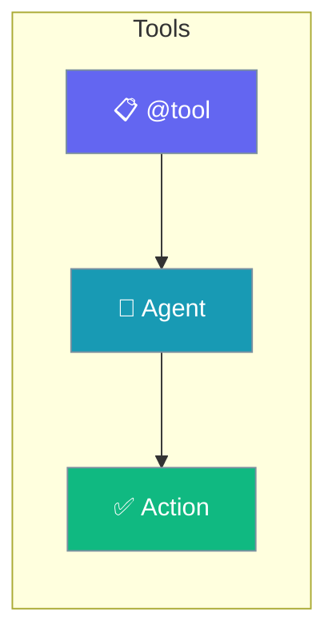
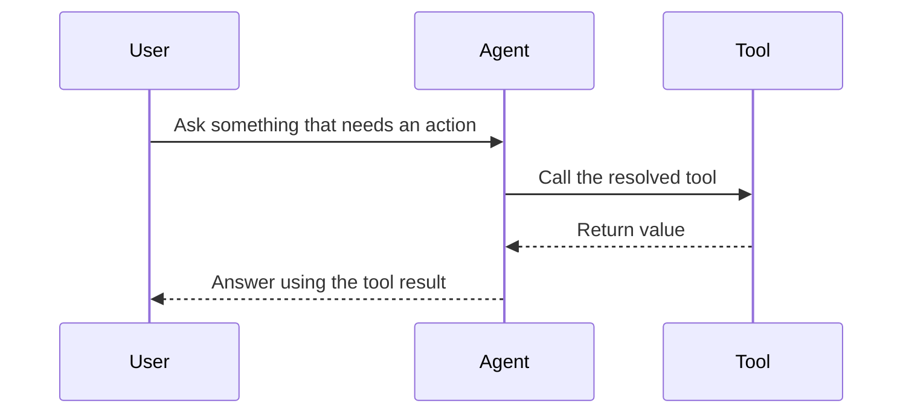

Tools let agents read data, call APIs, and run code—this hub links every tools how-to.

```python
from praisonaiagents import Agent, tool

@tool
def ping() -> str:
    """Health check tool."""
    return "pong"

agent = Agent(name="Tools Intro", tools=[ping])
agent.start("Run the ping tool.")
```

The user follows a tools guide, attaches capabilities to agents, and validates behaviour with doctor.



## Quick Start

<Steps>
<Step title="Simple Usage">

Decorate a function with `@tool` and hand it to an agent.

```python
from praisonaiagents import Agent, tool

@tool
def ping() -> str:
    """Health check tool."""
    return "pong"

agent = Agent(name="Tools Intro", tools=[ping])
agent.start("Run the ping tool.")
```

</Step>

<Step title="With Configuration">

Add tools from a package or file with the CLI, then verify resolution.

```bash
praisonai tools add ./my_tools.py
praisonai tools doctor
```

</Step>
</Steps>

---

## How It Works



---

## Tools Guides

Learn how to create, configure, debug, and manage tools in PraisonAI.

<CardGroup cols={2}>
  <Card title="Create Custom Tools" icon="plus" href="/docs/guides/tools/create-custom-tools">
    Build your own tools from scratch
  </Card>
  <Card title="Assign Tools to Templates" icon="link" href="/docs/guides/tools/assign-tools-to-templates">
    Configure tools for templates
  </Card>
  <Card title="Debug Tools" icon="bug" href="/docs/guides/tools/debug-tools">
    Troubleshoot tool issues
  </Card>
  <Card title="Different Ways to Create" icon="layer-group" href="/docs/guides/tools/different-ways-to-create-tools">
    Explore all tool creation methods
  </Card>
  <Card title="Remote Tools from GitHub" icon="github" href="/docs/guides/tools/remote-tools-github">
    Use tools from GitHub and remote URLs
  </Card>
</CardGroup>

## Quick Reference

| Task | Command |
|------|---------|
| List tools | `praisonai tools list` |
| Add package | `praisonai tools add pandas` |
| Add file | `praisonai tools add ./my_tools.py` |
| Add from GitHub | `praisonai tools add github:user/repo` |
| Add source | `praisonai tools add-sources <source>` |
| Get info | `praisonai tools info <name>` |
| Search | `praisonai tools search <query>` |
| Doctor | `praisonai tools doctor` |
| Resolve | `praisonai tools resolve <name>` |
| Discover | `praisonai tools discover` |
| Show sources | `praisonai tools show-sources` |

## Best Practices

<AccordionGroup>
<Accordion title="Decorate functions with @tool">
`@tool` registers a function as agent-callable and reads its type hints and docstring to build the schema — the fastest path to a working tool.
</Accordion>

<Accordion title="Type-hint every parameter and return">
The model relies on type hints to call tools correctly. Include them, plus a JSON-serializable return type.
</Accordion>

<Accordion title="Verify with tools doctor before shipping">
`praisonai tools doctor` walks the full resolver chain, so it confirms a tool is reachable before an agent tries to call it.
</Accordion>
</AccordionGroup>
