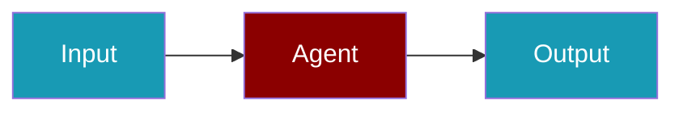

Pull tool implementations from GitHub URLs and reference them in template manifests.

```python
from praisonaiagents import Agent, tool

agent = Agent(name="Remote Tools", instructions="Use tools loaded from remote sources.")
agent.start("Which remote tool sources are configured?")
```

The user adds `tools_sources` entries, lists tools in `agents.yaml`, and runs the template.




## How to Reference Tools from GitHub

<Steps>
  <Step title="Add GitHub URL to tools_sources">
    ```yaml
    # TEMPLATE.yaml
    name: my-template
    version: "1.0.0"
    
    requires:
      tools_sources:
        - github:MervinPraison/PraisonAI-tools/praisonai_tools/video
    ```
  </Step>
  
  <Step title="Reference Tools in agents.yaml">
    ```yaml
    roles:
      agent:
        tools:
          - shell_tool
        tasks:
          main:
            description: "Use video tools from GitHub"
    ```
  </Step>
  
  <Step title="Run Template">
    ```bash
    praisonai templates run ./my-template
    ```
  </Step>
</Steps>

## How to Use Tools from Raw GitHub URLs

<Steps>
  <Step title="Get Raw URL">
    Navigate to the tools.py file on GitHub and click "Raw" to get the raw URL:
    ```
    https://raw.githubusercontent.com/MervinPraison/PraisonAI-tools/main/tools.py
    ```
  </Step>
  
  <Step title="Add to tools_sources">
    ```yaml
    # TEMPLATE.yaml
    requires:
      tools_sources:
        - https://raw.githubusercontent.com/user/repo/main/tools.py
    ```
  </Step>
  
  <Step title="Run Template">
    ```bash
    praisonai templates run ./my-template
    ```
  </Step>
</Steps>

## How to Use Tools via CLI Override

<Steps>
  <Step title="Run with Remote Tool Source">
    ```bash
    praisonai templates run my-template \
      --tools-source github:MervinPraison/PraisonAI-tools/praisonai_tools
    ```
  </Step>
  
  <Step title="Run with Multiple Sources">
    ```bash
    praisonai templates run my-template \
      --tools-source github:user/repo/tools \
      --tools-source ./local_tools.py
    ```
  </Step>
</Steps>

## How to Install Tools from PyPI

<Steps>
  <Step title="Install Package">
    ```bash
    pip install praisonai-tools
    ```
  </Step>
  
  <Step title="Add to tools_sources">
    ```yaml
    # TEMPLATE.yaml
    requires:
      packages:
        - praisonai-tools
      tools_sources:
        - praisonai_tools.video
    ```
  </Step>
  
  <Step title="Use Tools">
    ```bash
    praisonai templates run ./my-template
    ```
  </Step>
</Steps>

## How to Create Shareable Tool Packages

<Steps>
  <Step title="Create Package Structure">
    ```
    my-tools/
    ├── pyproject.toml
    ├── my_tools/
    │   ├── __init__.py
    │   └── tools.py
    ```
  </Step>
  
  <Step title="Define pyproject.toml">
    ```toml
    [project]
    name = "my-tools"
    version = "1.0.0"
    
    [project.entry-points."praisonai.tools"]
    my_tools = "my_tools:tools"
    ```
  </Step>
  
  <Step title="Publish to PyPI">
    ```bash
    pip install build twine
    python -m build
    twine upload dist/*
    ```
  </Step>
  
  <Step title="Use in Templates">
    ```yaml
    requires:
      packages:
        - my-tools
      tools_sources:
        - my_tools
    ```
  </Step>
</Steps>

## Remote Tool Source Formats

| Format | Example |
|--------|---------|
| GitHub shorthand | `github:user/repo/path` |
| GitHub with branch | `github:user/repo/path@branch` |
| Raw URL | `https://raw.githubusercontent.com/...` |
| PyPI package | `package_name.module` |
| Local path | `./tools.py` or `./tools_dir/` |
