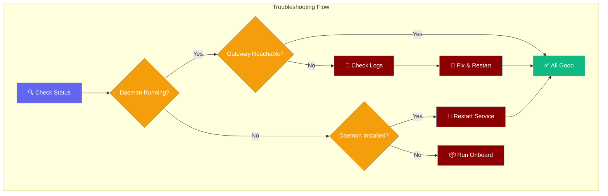

Common issues with the PraisonAI Gateway daemon and server, with step-by-step troubleshooting guides.

```python
from praisonaiagents import Agent

agent = Agent(
    name="Gateway Helper",
    instructions="Diagnose PraisonAI Gateway connectivity issues.",
)
agent.start("Gateway health check: is the daemon reachable?")
```

The user checks gateway status, reads logs, and restarts the daemon until channels respond again.




## Common Issues

### Port Already In Use / Two Gateways Running

**Symptom:** Gateway fails to start with a clear error message about port conflicts.

```
Error: Gateway port 8765 is already in use.

  Another gateway may be running (PID 8864).
  Stop it:  praisonai gateway stop
  Or use a different port:  GATEWAY_PORT=8766 praisonai gateway start

  Only ONE gateway process should poll each Telegram bot token.
```

<Steps>
<Step title="Check PID lock and port status">
```bash
praisonai gateway status
```

Look for lines like:
- `Gateway PID lock: Process 12345 running (127.0.0.1:8765)`
- `Port 127.0.0.1:8765: In use`
</Step>

<Step title="Stop the existing gateway gracefully">
```bash
praisonai gateway stop
```

This sends SIGTERM and waits for graceful shutdown. The gateway drains active sessions for up to **10 seconds** — in-flight turns and queued inbox messages are persisted before exit. Sessions that exceed the timeout are force-persisted with a `SESSION_END` event (`had_pending_work`, `was_executing`). Use `--force` to skip the drain. See [Gateway Session Continuity](/docs/features/gateway-session-continuity).
</Step>

<Step title="If gateway is stuck, force stop">
```bash
praisonai gateway stop --force
```

This sends SIGKILL directly (SIGTERM on Windows) for immediate termination.
</Step>

<Step title="If port is used by non-gateway process">
```bash
# Find what's using the port
lsof -i :8765
# Linux alternative:
netstat -ano | findstr :8765

# Either kill that process or use a different port
GATEWAY_PORT=8766 praisonai gateway start
# Or:
praisonai gateway start --port 8766
```
</Step>

<Step title="Clean up stale lock file (if needed)">
```bash
# Check the PID lock file
cat ~/.praisonai/gateway-127_0_0_1-8765.pid

# Remove stale lock manually (auto-cleaned on next start)
rm ~/.praisonai/gateway-127_0_0_1-8765.pid
```

Stale locks are automatically detected and removed, but you can clean them manually if needed.
</Step>
</Steps>

---

### SSL Certificate Verify Failed on Start (Corporate Proxy / MITM)

**Symptom:** `praisonai gateway start --config gateway.yaml` fails with an `SSLCertVerificationError` in `gateway doctor`, but the same channel token works fine with `--no-preflight`.

**Cause:** Your network intercepts TLS with a corporate CA the probe's HTTP client does not trust yet. The runtime bot adapter is often more permissive, so the token itself is usually fine.

**Fix (pick one):**

<Steps>
<Step title="Point PraisonAI at your corporate CA (preferred)">

```bash
export PRAISONAI_SSL_CA_BUNDLE=/path/to/corp-ca.pem
praisonai gateway start --config gateway.yaml
```

`PRAISONAI_SSL_CA_BUNDLE` overrides any pre-existing `SSL_CERT_FILE` and `REQUESTS_CA_BUNDLE` for the probe.

</Step>

<Step title="Use the standard SSL env vars">

```bash
export SSL_CERT_FILE=/path/to/corp-ca.pem   # or REQUESTS_CA_BUNDLE
praisonai gateway start --config gateway.yaml
```

</Step>

<Step title="Skip the preflight check">

```bash
praisonai gateway start --config gateway.yaml --no-preflight
```

Skips channel-credential validation on start. Use only when you know the tokens are good.

</Step>
</Steps>

<Note>
Preflight **soft-fails on SSL-only errors** — it prints a warning naming these three env vars and continues to start automatically. You only need the fixes above if you also want a clean `gateway doctor` run. A **mixed** SSL + token/network failure still hard-aborts. See [Corporate CA bundle (SSL-inspecting networks)](/docs/features/gateway-cli#corporate-ca-bundle-ssl-inspecting-networks).
</Note>

<Warning>
A configured-but-missing CA bundle path prints `Warning: CA bundle path '<path>' does not exist — SSL_CERT_FILE / REQUESTS_CA_BUNDLE not updated for probe.` and does **not** touch the SSL env vars. Double-check the path resolves before restarting.
</Warning>

---

### Telegram Bot Goes Silent After Restart

**Symptom:** Gateway `/health` endpoint returns healthy, but Telegram messages aren't received after a restart or crash.

**Cause:** Two processes are polling the same Telegram bot token. Telegram delivers messages to only one poller, causing the bot to appear "silent" when the wrong process gets the messages.

<Steps>
<Step title="Stop all gateway instances">
```bash
praisonai gateway stop --force
```

This ensures all instances are terminated, even if PID files are corrupted.
</Step>

<Step title="Verify no processes are running">
```bash
praisonai gateway status
```

Should show:
- `Gateway PID lock: No lock file found`
- `Port 127.0.0.1:8765: Available`
</Step>

<Step title="Start a single gateway instance">
```bash
praisonai gateway start
```

Only start one instance to ensure exclusive bot token polling.
</Step>

<Step title="Test bot responsiveness">
Send a message to your Telegram bot. It should respond normally now that only one process is polling the token.
</Step>
</Steps>

---

### Daemon Running But Gateway Unreachable

**Symptom:** `praisonai gateway status` shows `Daemon service: Running (launchd)` but `Gateway not reachable at http://127.0.0.1:8765/health`.

<Steps>
<Step title="Verify daemon is actually running">
```bash
praisonai gateway status --daemon-only
```

Look for `Running` status and process ID.
</Step>

<Step title="Check daemon logs for errors">
```bash
praisonai gateway logs

# Or check raw log files:
# macOS: tail ~/.praisonai/logs/bot-stderr.log
# Linux: journalctl --user -u praisonai-bot
```

Look for Python tracebacks or port binding errors.
</Step>

<Step title="Check port and PID lock status">
```bash
praisonai gateway status
```

This now reports both port usage and PID lock status directly. Look for:
- `Gateway PID lock: Process <pid> running` or `No lock file found`
- `Port 127.0.0.1:8765: In use` or `Available`

If another process is using the port, use `praisonai gateway stop` to stop an existing gateway, or choose a different port.
</Step>

<Step title="Verify PraisonAI version">
```bash
praisonai --version
```

Upgrade to ≥ v4.6.23 if you see older versions - earlier versions had IndentationError bugs fixed in PR #1484.
</Step>

<Step title="Restart the daemon">
```bash
# macOS
launchctl kickstart -k gui/$(id -u)/ai.praison.bot

# Linux  
systemctl --user restart praisonai-bot

# Or reinstall completely
praisonai onboard
```
</Step>
</Steps>

---

### Rapidly Growing Log Files

**Symptom:** `~/.praisonai/logs/bot-stderr.log` grows to multiple MB per minute.

<Steps>
<Step title="Check log file size">
```bash
ls -lh ~/.praisonai/logs/bot-stderr.log
```

If growing rapidly (>1MB/min), this indicates a crash loop.
</Step>

<Step title="View recent errors">
```bash
tail -50 ~/.praisonai/logs/bot-stderr.log
```

Look for repeated Python tracebacks, especially IndentationError.
</Step>

<Step title="Stop the daemon">
```bash
# macOS
launchctl unload ~/Library/LaunchAgents/ai.praison.bot.plist

# Linux
systemctl --user stop praisonai-bot
```
</Step>

<Step title="Clear logs and restart">
```bash
# Clear the log file
> ~/.praisonai/logs/bot-stderr.log

# Upgrade PraisonAI
pip install --upgrade praisonai

# Restart daemon
praisonai gateway install --start
```
</Step>
</Steps>

---

### Daemon Not Installed

**Symptom:** `praisonai gateway status` shows `Daemon service: Not installed (systemd)`.

<Steps>
<Step title="Run the onboarding wizard">
```bash
praisonai onboard
```

This installs the daemon service for your platform.
</Step>

<Step title="Verify installation">
```bash
praisonai gateway status --daemon-only
```

Should show `Installed but not running` or `Running`.
</Step>

<Step title="Start the service">
```bash
# Manual start
praisonai gateway install --start

# Or check platform-specific commands
praisonai gateway status
```
</Step>
</Steps>

---

### HTTP 500 on Health Endpoint

**Symptom:** `curl http://127.0.0.1:8765/health` returns 500 Internal Server Error.

<Steps>
<Step title="Check PraisonAI version">
```bash
praisonai --version
```

Versions before v4.6.23 had AttributeError bugs in the health endpoint.
</Step>

<Step title="Upgrade PraisonAI">
```bash
pip install --upgrade praisonai
```
</Step>

<Step title="Restart the gateway">
```bash
praisonai gateway install --start
```
</Step>

<Step title="Test health endpoint">
```bash
curl http://127.0.0.1:8765/health
```

Should return JSON with status, uptime, agents, sessions, clients, and channels.
</Step>
</Steps>

---

### Windows: 'charmap' codec error from Telegram bot replies

**Symptom:** Telegram users receive `Error: 'charmap' codec can't encode character '⚠' in position N: character maps to <undefined>` instead of the real error message.

**Root cause:** Windows default console encoding is `cp1252`, not UTF-8. When agent exceptions contained warning symbols (⚠), emoji, or accented text, the error formatter crashed before the real error could be reported.

<Steps>
<Step title="Verify your version contains the fix">
```bash
python -c "from praisonai.gateway.unicode_utils import safe_error_message; print('OK')"
```

If this command runs without error, you have the fix from PR #1754.
</Step>

<Step title="Upgrade to a fixed version">
```bash
pip install --upgrade praisonai
```

Upgrade to PraisonAI version that contains PR #1754 — Gateway and Telegram bot error handlers now sanitize exception text to ASCII-safe form for transport, while preserving full Unicode in logs.
</Step>

<Step title="Restart the gateway">
```bash
praisonai gateway install --start
```
</Step>

<Step title="Test the fix">
Users will now see clean error messages instead of charmap crashes:
- `Error: API quota exceeded. Check billing.` (was: charmap crash hiding OpenAI 429)
- `Error: Rate limit exceeded. Try again later.`
- `Error: Authentication failed. Check API key.`
- `Error: Request timeout. Try again.`
</Step>
</Steps>

<Note>
**No workaround needed** on supported versions. The previously recommended `PYTHONUTF8=1` / `PYTHONIOENCODING=utf-8` workaround is no longer required for the bot reply path (still useful for general console output).
</Note>

---

### Permission Denied Errors

**Symptom:** Daemon fails to start with permission errors in logs.

<Tabs>
<Tab title="macOS">
```bash
# Check LaunchAgent permissions
ls -la ~/Library/LaunchAgents/ai.praison.bot.plist

# Reload LaunchAgent
launchctl unload ~/Library/LaunchAgents/ai.praison.bot.plist
launchctl load ~/Library/LaunchAgents/ai.praison.bot.plist
```
</Tab>

<Tab title="Linux">
```bash
# Check systemd user service
systemctl --user status praisonai-bot

# Enable user lingering (allows services to run when not logged in)
sudo loginctl enable-linger $(whoami)

# Restart service
systemctl --user daemon-reload
systemctl --user restart praisonai-bot
```
</Tab>

<Tab title="Windows">
```powershell
# Run as administrator
# Check Task Scheduler for PraisonAI task
schtasks /Query /TN PraisonAIGateway

# Delete and recreate
praisonai gateway uninstall
praisonai gateway install
```
</Tab>
</Tabs>

---

### Clean Reinstall Process

When all else fails, perform a clean reinstall:

<Steps>
<Step title="Stop and uninstall">
```bash
praisonai gateway uninstall
```
</Step>

<Step title="Clear configuration">
```bash
# Backup first if needed
rm -rf ~/.praisonai/logs
rm -rf ~/.praisonai/config
```
</Step>

<Step title="Upgrade PraisonAI">
```bash
pip install --upgrade praisonai
```
</Step>

<Step title="Run onboarding">
```bash
praisonai onboard
```

Follow the wizard to reinstall the daemon service.
</Step>

<Step title="Verify installation">
```bash
praisonai gateway status
```

Should show daemon running and gateway reachable.
</Step>
</Steps>

---

## Reading the hello_error Envelope

When the gateway rejects a connection, it sends a structured `hello_error` frame before closing. Each `(code, next_step)` pair maps to a specific operator action.

| `code` | `next_step` | Action |
|--------|-------------|--------|
| `rate_limited` | `wait_then_retry` | Wait `retry_after_seconds` then reconnect; if persistent, raise the rate limiter ceiling |
| `origin_not_allowed` | `do_not_retry` | Add the client origin to `allowed_origins` in `gateway.yaml` |
| `configuration_error` | `do_not_retry` | External bind without `allowed_origins` configured; bind to loopback or set the allowlist |
| `auth_required` | `reauthenticate` | Fetch a token (CLI or pairing flow) and reconnect |
| `protocol_unsupported` | `upgrade_client` | Update the client SDK to a newer version |
| `protocol_unsupported` | `downgrade_client` | Server is older than the client; pin the client to an older release or upgrade the server |
| `agent_not_found` | `do_not_retry` | Fix the `agent_id` in the hello frame |

Example envelope received on rate-limit:

```json
{
  "type": "hello_error",
  "code": "rate_limited",
  "message": "Too many connection attempts",
  "next_step": "wait_then_retry",
  "retry_after_seconds": 30,
  "next": "wait_then_retry"
}
```

See [Gateway Handshake Protocol](/docs/features/gateway-handshake-protocol) for the full field reference and `ConnectRecoveryStep` values.

---

## Authentication Errors

### GatewayStartupError: Cannot bind to 0.0.0.0 without an auth token

**Symptom:** Gateway fails to start when binding to external interfaces without authentication.

<Steps>
<Step title="Use onboarding wizard">
```bash
praisonai onboard
```
This automatically generates and saves a secure token.
</Step>

<Step title="Or set token manually">
```bash
export GATEWAY_AUTH_TOKEN=$(openssl rand -hex 16)
praisonai gateway start --host 0.0.0.0
```
</Step>
</Steps>

### UIStartupError: Cannot bind to 0.0.0.0 with default admin/admin credentials

**Symptom:** Chainlit UI fails to start on external interface with default credentials.

<Steps>
<Step title="Set custom credentials">
```bash
export CHAINLIT_USERNAME=myuser
export CHAINLIT_PASSWORD=mypass
praisonai chat --host 0.0.0.0
```
</Step>

<Step title="Or allow defaults for demos (unsafe)">
```bash
export PRAISONAI_ALLOW_DEFAULT_CREDS=1
praisonai chat --host 0.0.0.0
```
</Step>
</Steps>

### My gateway logs show `gw_****xxxx` instead of the full token

This is intentional for security — tokens are fingerprinted in logs to prevent exposure.

<Steps>
<Step title="Retrieve full token from environment file">
```bash
cat ~/.praisonai/.env | grep GATEWAY_AUTH_TOKEN
```
</Step>

<Step title="Or check environment variables">
```bash
echo $GATEWAY_AUTH_TOKEN
```
</Step>
</Steps>

### Magic-link login works in WebSocket but fails over HTTP (or vice versa)

**Symptom:** One auth method works but the other fails, even with the same token.

**Cause (pre-fix):** HTTP/magic-link and WebSocket used different secret sources before PR #1744.

<Steps>
<Step title="Upgrade PraisonAI">
Upgrade to PraisonAI ≥ v4.6.47 (ships PR #1744). Config token now exports to env, unifying all auth paths.
</Step>

<Step title="Restart the gateway">
```bash
praisonai gateway restart
```
Config token precedence is now enforced on restart.
</Step>
</Steps>

---

## Restart After Config Change

When you update bot configuration files, restart the daemon using these OS-specific commands (matching the onboard Done panel):

<Tabs>
<Tab title="macOS">
```bash
launchctl kickstart -k gui/$(id -u)/ai.praison.bot
```
</Tab>

<Tab title="Linux">
```bash
systemctl --user restart praisonai-bot
```
</Tab>

<Tab title="Windows">
```bash
schtasks /End /TN PraisonAIGateway && schtasks /Run /TN PraisonAIGateway
```
</Tab>
</Tabs>

---

## Diagnostic Commands

Quick commands for gathering diagnostic information:

```bash
# Full status check
praisonai gateway status

# Daemon-only check (for scripts)
praisonai gateway status --daemon-only

# Recent logs (last 50 lines)
praisonai gateway logs -n 50

# Check the PID lock file
cat ~/.praisonai/gateway-127_0_0_1-8765.pid

# Stop a running gateway
praisonai gateway stop
praisonai gateway stop --force

# Check port usage
lsof -i :8765

# Test health endpoint directly
curl -v http://127.0.0.1:8765/health

# Check PraisonAI version
praisonai --version

# Platform daemon status
# macOS: launchctl list | grep ai.praison
# Linux: systemctl --user status praisonai-bot
# Windows: schtasks /Query /TN PraisonAIGateway
```

---

## Platform-Specific Notes

<Tabs>
<Tab title="macOS">
**LaunchAgent Path:** `~/Library/LaunchAgents/ai.praison.bot.plist`
**Log Path:** `~/.praisonai/logs/bot-stderr.log`

```bash
# Manual management
launchctl load ~/Library/LaunchAgents/ai.praison.bot.plist
launchctl unload ~/Library/LaunchAgents/ai.praison.bot.plist
launchctl kickstart -k gui/$(id -u)/ai.praison.bot

# Check if loaded
launchctl list | grep ai.praison
```
</Tab>

<Tab title="Linux">
**Service Path:** `~/.config/systemd/user/praisonai-bot.service`
**Logs:** `journalctl --user -u praisonai-bot`

```bash
# Manual management
systemctl --user start praisonai-bot
systemctl --user stop praisonai-bot
systemctl --user restart praisonai-bot
systemctl --user enable praisonai-bot

# Check status
systemctl --user status praisonai-bot
```
</Tab>

<Tab title="Windows">
**Task Path:** Task Scheduler → PraisonAIGateway
**Logs:** Windows Event Log

```powershell
# Manual management via Task Scheduler or:
schtasks /Run /TN PraisonAIGateway
schtasks /End /TN PraisonAIGateway

# Check status
schtasks /Query /TN PraisonAIGateway
```
</Tab>
</Tabs>

---


## Config reload did not apply

**Symptom:** You edited `gateway.yaml` or sent `SIGHUP`, but channels or agents still run the old configuration.

| Check | What to look for |
|-------|------------------|
| Log line | A successful reload logs a summary such as `reload applied: agents; restart[telegram]` — if absent, the watcher may not have fired or SIGHUP was ignored (Windows has no SIGHUP) |
| Drain window | Channel restarts wait up to `gateway.reload_drain_timeout` (falls back to `drain_timeout`) — a slow turn can delay the visible restart |
| Install | `pip install "praisonai[gateway]"` enables `watchdog`; without it, mtime polling (about 5 s) still reloads but more slowly |

See [Gateway Config Reload](/docs/features/gateway-config-reload) for file-watch vs SIGHUP paths and YAML keys.

---

## Multi-Channel Troubleshooting

Common failure modes when using multiple bots on the same platform:

| Symptom | Cause | Fix |
|---------|-------|-----|
| `Token ${X} is used by multiple channels` | Two channels reference the same env var in `bot.yaml` | Give each channel its own env var and create a separate bot in @BotFather |
| `Same bot token value is used by multiple channels` | Two different env vars resolve to the same actual token | Generate a fresh token from @BotFather for the duplicate channel |
| `Channel '<x>' token '<env>' doesn't follow naming convention` | Custom env var name | Rename to `PLATFORM_<ROLE>_BOT_TOKEN` (e.g. `TELEGRAM_CFO_BOT_TOKEN`) |
| `Missing token: <env>` | Env var referenced in `bot.yaml` is unset | Add it to `~/.praisonai/.env` |

**Example Fix:**
```bash
# Problem: Both channels use the same token
# Error: "Token TELEGRAM_BOT_TOKEN is used by multiple channels"

# Solution: Create unique tokens per role
# 1. Create new bot in @BotFather for CFO role
# 2. Add unique environment variable
export TELEGRAM_CFO_BOT_TOKEN="987654321:DEF..."

# 3. Update bot.yaml
channels:
  telegram_cfo:
    platform: telegram
    token: ${TELEGRAM_CFO_BOT_TOKEN}  # Unique token
    routes:
      default: cfo
```

**Validation:**
```bash
# Check multi-channel configuration
praisonai doctor multi_channel_tokens

# ✅ Expected output:
# "Multi-channel configuration looks good (N channels)"
```

---

## Channel Supervision Issues

### Channel goes silent but /health shows running: true

**Symptom:** Channel stops receiving messages but `/health` still reports `"running": true`.

**Cause:** Pre-PR-2041 behaviour, or the `health:` block is missing from `gateway.yaml` — hung sockets are not detected until an exception is raised.

**Fix:** Add the proactive health block:

```yaml
gateway:
  health:
    interval: 300
    stale_after: 120
    enabled: true
```

See [Proactive Health Monitoring](/docs/features/gateway-channel-supervision#proactive-health-monitoring).

### Channel keeps restarting every 5 minutes

**Symptom:** Channel restarts on a regular interval visible in logs.

**Cause:** `stale_after` too low for a quiet channel, or `interval` too aggressive for a slow remote API.

**Fix:** Raise `stale_after` to e.g. `600`, or lower `max_restarts_per_hour` so the cap kicks in and surfaces the issue:

```yaml
gateway:
  health:
    stale_after: 600
    max_restarts_per_hour: 3
```

### Channel Shows state: failed in /health

**Symptom:** When checking `GET /health`, a channel shows `"state": "failed"` with error details.

**Common Causes:**
- **Telegram Conflict**: Multiple bot instances using the same token
- **Invalid Credentials**: Bot token revoked or incorrect
- **Permission Issues**: Bot lacks required permissions

**Investigation Steps:**

<Steps>
<Step title="Check Error Details">
```bash
curl http://127.0.0.1:8765/health | jq '.channels.telegram.supervision'
```

Look for `last_error` and `last_error_time` fields.
</Step>

<Step title="Telegram Conflict Resolution">
If error contains "Conflict: terminated by other getUpdates":

```bash
# Stop any other bot instances using the same token
# Then force reconnect to reset state
praisonai gateway reconnect telegram
```
</Step>

<Step title="Credential Verification">
For invalid token errors, verify your bot token:

```bash
# Test token directly
curl "https://api.telegram.org/bot${TELEGRAM_BOT_TOKEN}/getMe"
```
</Step>
</Steps>

### Channel Keeps Retrying Forever

**Symptom:** High `total_recoveries` count, constant retry attempts visible in logs.

**Investigation:**

```bash
# Check supervision status
curl http://127.0.0.1:8765/health | jq '.channels'

# Look for:
# - High total_recoveries value
# - next_retry_at timestamp
# - last_error details
```

**Resolution:**

```bash
# Temporarily pause while investigating
praisonai gateway pause telegram

# Investigate root cause (network, DNS, etc.)
# Fix underlying issue

# Resume when ready
praisonai gateway resume telegram
```

---

## Config Migration

When `praisonai doctor --only gateway_config_migration` reports **Config can be migrated**, your YAML uses a legacy shape that loads correctly but can be rewritten to the canonical format.

<Steps>
<Step title="Detect migration opportunities">

```bash
praisonai doctor --only gateway_config_migration
```

Example WARN output:

```
⚠ Gateway Config Migration [MEDIUM]
  Config can be migrated: 2 change(s)
  • telegram: allowed_users string → list migration available
  • Set telegram.group_policy to secure default 'mention_only'
```

</Step>

<Step title="Understand auto-normalisation">

At load time, `GatewayConfigSchema` already normalises legacy formats — your bot runs without rewriting the file. Persist the canonical form when you want the on-disk YAML to match what the schema produces.

</Step>

<Step title="Apply canonical YAML">

| Legacy shape | Canonical form |
|--------------|----------------|
| Top-level `platform` + `token` | `channels:` dict with one entry |
| BotOS `platforms:` dict | `channels:` dict (same keys) |
| `allowed_users: "id1,id2"` (string) | `allowed_users: ["id1", "id2"]` (list) |

See [Gateway Config Migration](/docs/features/gateway-config-migration) for before/after YAML.

</Step>
</Steps>

---

## Environment Variables in Config

Gateway and bot configs support `${VAR}` substitution in any string value. Resolution order:

1. Process environment variables
2. `~/.praisonai/.env` (loaded automatically; override path with `PRAISONAI_ENV_FILE`)

```bash
# Verify all referenced variables resolve
praisonai doctor --only gateway_env_substitution
```

Unset variables cause validation to **FAIL** at load time and in the `gateway_env_substitution` doctor check.

---


## Best Practices

<AccordionGroup>
  <Accordion title="Use praisonai gateway status first">
    Always run `praisonai gateway status` before diving into logs - it shows port, PID, and daemon state in one command.
  </Accordion>
  <Accordion title="Stop before restart">
    Always use `praisonai gateway stop` before restarting - this drains active sessions and prevents data loss.
  </Accordion>
  <Accordion title="Use onboard for fresh installs">
    When in doubt, run `praisonai onboard` - it handles daemon setup, credentials, and port configuration automatically.
  </Accordion>
  <Accordion title="Check logs for crash loops">
    If `bot-stderr.log` grows rapidly, you have a crash loop - stop the daemon, upgrade PraisonAI, then restart.
  </Accordion>
</AccordionGroup>


## Related

<CardGroup cols={2}>
  <Card title="Gateway CLI" icon="tower-broadcast" href="/docs/features/gateway-cli">
    Gateway command reference
  </Card>
  <Card title="Gateway Server" icon="settings" href="/docs/features/gateway">
    Gateway configuration and setup
  </Card>
</CardGroup>