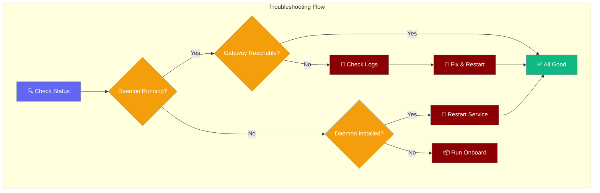

Common issues with the PraisonAI Gateway daemon and server, with step-by-step troubleshooting guides.



## Common Issues

### Daemon Running But Gateway Unreachable

**Symptom:** `praisonai gateway status` shows `Daemon service: Running (launchd)` but `Gateway not reachable at http://127.0.0.1:8765/health`.

<Steps>
<Step title="Verify daemon is actually running">
```bash
praisonai gateway status --daemon-only
```

Look for `Running` status and process ID.
</Step>

<Step title="Check daemon logs for errors">
```bash
praisonai gateway logs

# Or check raw log files:
# macOS: tail ~/.praisonai/logs/bot-stderr.log
# Linux: journalctl --user -u praisonai-bot
```

Look for Python tracebacks or port binding errors.
</Step>

<Step title="Check if another process is using the port">
```bash
lsof -i :8765
# or
netstat -tulpn | grep :8765
```

If another process is using port 8765, either stop it or change the gateway port.
</Step>

<Step title="Verify PraisonAI version">
```bash
praisonai --version
```

Upgrade to ≥ v4.6.23 if you see older versions - earlier versions had IndentationError bugs fixed in PR #1484.
</Step>

<Step title="Restart the daemon">
```bash
# macOS
launchctl kickstart -k gui/$(id -u)/ai.praison.bot

# Linux  
systemctl --user restart praisonai-bot

# Or reinstall completely
praisonai onboard
```
</Step>
</Steps>

---

### Rapidly Growing Log Files

**Symptom:** `~/.praisonai/logs/bot-stderr.log` grows to multiple MB per minute.

<Steps>
<Step title="Check log file size">
```bash
ls -lh ~/.praisonai/logs/bot-stderr.log
```

If growing rapidly (>1MB/min), this indicates a crash loop.
</Step>

<Step title="View recent errors">
```bash
tail -50 ~/.praisonai/logs/bot-stderr.log
```

Look for repeated Python tracebacks, especially IndentationError.
</Step>

<Step title="Stop the daemon">
```bash
# macOS
launchctl unload ~/Library/LaunchAgents/ai.praison.bot.plist

# Linux
systemctl --user stop praisonai-bot
```
</Step>

<Step title="Clear logs and restart">
```bash
# Clear the log file
> ~/.praisonai/logs/bot-stderr.log

# Upgrade PraisonAI
pip install --upgrade praisonai

# Restart daemon
praisonai gateway install --start
```
</Step>
</Steps>

---

### Daemon Not Installed

**Symptom:** `praisonai gateway status` shows `Daemon service: Not installed (systemd)`.

<Steps>
<Step title="Run the onboarding wizard">
```bash
praisonai onboard
```

This installs the daemon service for your platform.
</Step>

<Step title="Verify installation">
```bash
praisonai gateway status --daemon-only
```

Should show `Installed but not running` or `Running`.
</Step>

<Step title="Start the service">
```bash
# Manual start
praisonai gateway install --start

# Or check platform-specific commands
praisonai gateway status
```
</Step>
</Steps>

---

### HTTP 500 on Health Endpoint

**Symptom:** `curl http://127.0.0.1:8765/health` returns 500 Internal Server Error.

<Steps>
<Step title="Check PraisonAI version">
```bash
praisonai --version
```

Versions before v4.6.23 had AttributeError bugs in the health endpoint.
</Step>

<Step title="Upgrade PraisonAI">
```bash
pip install --upgrade praisonai
```
</Step>

<Step title="Restart the gateway">
```bash
praisonai gateway install --start
```
</Step>

<Step title="Test health endpoint">
```bash
curl http://127.0.0.1:8765/health
```

Should return JSON with status, uptime, agents, sessions, clients, and channels.
</Step>
</Steps>

---

### Permission Denied Errors

**Symptom:** Daemon fails to start with permission errors in logs.

<Tabs>
<Tab title="macOS">
```bash
# Check LaunchAgent permissions
ls -la ~/Library/LaunchAgents/ai.praison.bot.plist

# Reload LaunchAgent
launchctl unload ~/Library/LaunchAgents/ai.praison.bot.plist
launchctl load ~/Library/LaunchAgents/ai.praison.bot.plist
```
</Tab>

<Tab title="Linux">
```bash
# Check systemd user service
systemctl --user status praisonai-bot

# Enable user lingering (allows services to run when not logged in)
sudo loginctl enable-linger $(whoami)

# Restart service
systemctl --user daemon-reload
systemctl --user restart praisonai-bot
```
</Tab>

<Tab title="Windows">
```powershell
# Run as administrator
# Check Task Scheduler for PraisonAI task
schtasks /Query /TN PraisonAIGateway

# Delete and recreate
praisonai gateway uninstall
praisonai gateway install
```
</Tab>
</Tabs>

---

### Clean Reinstall Process

When all else fails, perform a clean reinstall:

<Steps>
<Step title="Stop and uninstall">
```bash
praisonai gateway uninstall
```
</Step>

<Step title="Clear configuration">
```bash
# Backup first if needed
rm -rf ~/.praisonai/logs
rm -rf ~/.praisonai/config
```
</Step>

<Step title="Upgrade PraisonAI">
```bash
pip install --upgrade praisonai
```
</Step>

<Step title="Run onboarding">
```bash
praisonai onboard
```

Follow the wizard to reinstall the daemon service.
</Step>

<Step title="Verify installation">
```bash
praisonai gateway status
```

Should show daemon running and gateway reachable.
</Step>
</Steps>

---

## Restart After Config Change

When you update bot configuration files, restart the daemon using these OS-specific commands (matching the onboard Done panel):

<Tabs>
<Tab title="macOS">
```bash
launchctl kickstart -k gui/$(id -u)/ai.praison.bot
```
</Tab>

<Tab title="Linux">
```bash
systemctl --user restart praisonai-bot
```
</Tab>

<Tab title="Windows">
```bash
schtasks /End /TN PraisonAIGateway && schtasks /Run /TN PraisonAIGateway
```
</Tab>
</Tabs>

---

## Diagnostic Commands

Quick commands for gathering diagnostic information:

```bash
# Full status check
praisonai gateway status

# Daemon-only check (for scripts)
praisonai gateway status --daemon-only

# Recent logs (last 50 lines)
praisonai gateway logs -n 50

# Check port usage
lsof -i :8765

# Test health endpoint directly
curl -v http://127.0.0.1:8765/health

# Check PraisonAI version
praisonai --version

# Platform daemon status
# macOS: launchctl list | grep ai.praison
# Linux: systemctl --user status praisonai-bot
# Windows: schtasks /Query /TN PraisonAIGateway
```

---

## Platform-Specific Notes

<Tabs>
<Tab title="macOS">
**LaunchAgent Path:** `~/Library/LaunchAgents/ai.praison.bot.plist`
**Log Path:** `~/.praisonai/logs/bot-stderr.log`

```bash
# Manual management
launchctl load ~/Library/LaunchAgents/ai.praison.bot.plist
launchctl unload ~/Library/LaunchAgents/ai.praison.bot.plist
launchctl kickstart -k gui/$(id -u)/ai.praison.bot

# Check if loaded
launchctl list | grep ai.praison
```
</Tab>

<Tab title="Linux">
**Service Path:** `~/.config/systemd/user/praisonai-bot.service`
**Logs:** `journalctl --user -u praisonai-bot`

```bash
# Manual management
systemctl --user start praisonai-bot
systemctl --user stop praisonai-bot
systemctl --user restart praisonai-bot
systemctl --user enable praisonai-bot

# Check status
systemctl --user status praisonai-bot
```
</Tab>

<Tab title="Windows">
**Task Path:** Task Scheduler → PraisonAIGateway
**Logs:** Windows Event Log

```powershell
# Manual management via Task Scheduler or:
schtasks /Run /TN PraisonAIGateway
schtasks /End /TN PraisonAIGateway

# Check status
schtasks /Query /TN PraisonAIGateway
```
</Tab>
</Tabs>

---

## Related

<CardGroup cols={2}>
  <Card title="Gateway CLI" icon="tower-broadcast" href="/features/gateway-cli">
    Gateway command reference
  </Card>
  <Card title="Gateway Server" icon="settings" href="/features/gateway">
    Gateway configuration and setup
  </Card>
</CardGroup>