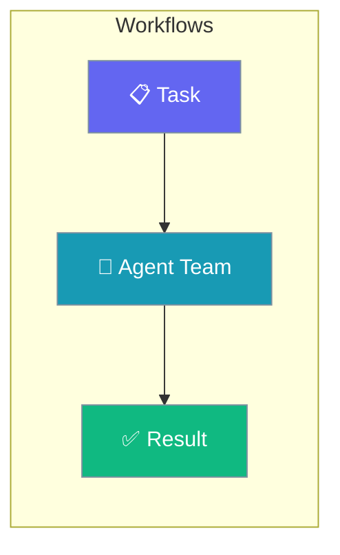
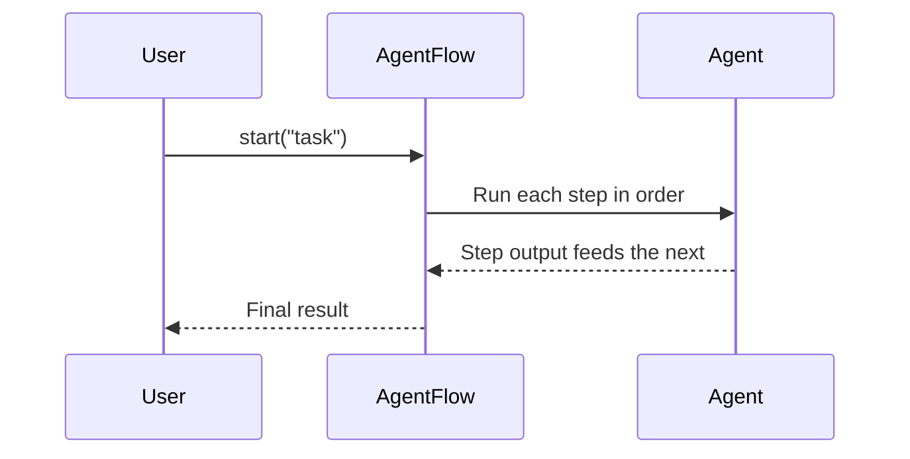
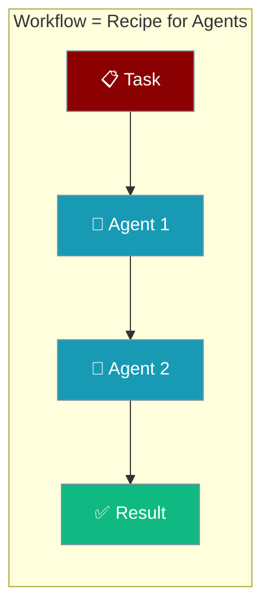

Pick a workflow pattern and connect agents so they share context across steps.

```python
from praisonaiagents import Agent, AgentFlow

researcher = Agent(name="Researcher", instructions="Research topics.")
writer = Agent(name="Writer", instructions="Write clear summaries.")
flow = AgentFlow(steps=[researcher, writer])
flow.start("Explain workflow patterns in one paragraph.")
```

The user chooses a pattern, configures agents, and submits a task that flows through the team.


```mermaid
graph LR
    subgraph "Workflows"
        U[📋 Task] --> A[🤖 Agent Team]
        A --> O[✅ Result]
    end

    classDef input fill:#6366F1,stroke:#7C90A0,color:#fff
    classDef process fill:#189AB4,stroke:#7C90A0,color:#fff
    classDef output fill:#10B981,stroke:#7C90A0,color:#fff

    class U input
    class A process
    class O output
```

## Quick Start

<Steps>
<Step title="Simple Usage">

Chain two agents so the second builds on the first.

```python
from praisonaiagents import Agent, AgentFlow

researcher = Agent(name="Researcher", instructions="Research topics.")
writer = Agent(name="Writer", instructions="Write clear summaries.")
flow = AgentFlow(steps=[researcher, writer])
flow.start("Explain workflow patterns in one paragraph.")
```

</Step>

<Step title="With Configuration">

Run independent agents together with the top-level `parallel` primitive.

```python
from praisonaiagents import Agent, AgentFlow, parallel

ai = Agent(name="AI", instructions="Research AI trends")
ml = Agent(name="ML", instructions="Research ML trends")
summary = Agent(name="Summary", instructions="Combine research")
flow = AgentFlow(steps=[parallel([ai, ml]), summary])
flow.start("Research latest developments")
```

</Step>
</Steps>

---

## How It Works


```mermaid
sequenceDiagram
    participant User
    participant AgentFlow
    participant Agent

    User->>AgentFlow: start("task")
    AgentFlow->>Agent: Run each step in order
    Agent-->>AgentFlow: Step output feeds the next
    AgentFlow-->>User: Final result
```

---

# Workflows

Workflows define **how multiple agents work together** to complete a task. Just like a team of people in an office, agents can collaborate in different ways depending on the task.

## What is a Workflow?

Think of a workflow as a **recipe** that tells your agents:
- Who does what
- In what order
- How they share information


```mermaid
graph LR
    subgraph "Workflow = Recipe for Agents"
        A["📋 Task"] --> B["🤖 Agent 1"]
        B --> C["🤖 Agent 2"]
        C --> D["✅ Result"]
    end
    
    classDef task fill:#8B0000,stroke:#7C90A0,color:#fff
    classDef agent fill:#189AB4,stroke:#7C90A0,color:#fff
    classDef result fill:#10B981,stroke:#7C90A0,color:#fff
    
    class A task
    class B,C agent
    class D result
```

## The Four Main Patterns

<CardGroup cols={2}>
  <Card title="🔀 Routing" icon="route" href="/docs/guides/workflows/routing">
    **"Send to the right expert"**
    
    Like a receptionist directing calls to the right department.
  </Card>
  <Card title="⚡ Parallel" icon="arrows-split-up-and-left" href="/docs/guides/workflows/parallel">
    **"Everyone works at once"**
    
    Like a team researching different topics simultaneously.
  </Card>
  <Card title="➡️ Sequential" icon="arrow-right" href="/docs/guides/workflows/sequential">
    **"One step at a time"**
    
    Like passing a document from person to person for review.
  </Card>
  <Card title="👔 Orchestrator" icon="sitemap" href="/docs/guides/workflows/orchestrator">
    **"Manager delegates work"**
    
    Like a project manager assigning tasks to team members.
  </Card>
</CardGroup>

---

## Which Pattern Should I Use?

| I want to... | Use this pattern |
|--------------|------------------|
| Send requests to different specialists | **Routing** |
| Do multiple independent things at once | **Parallel** |
| Process step-by-step (A → B → C) | **Sequential** |
| Let an AI decide how to break down work | **Orchestrator** |

---

## Real-World Examples

### Example 1: Customer Support Bot

A customer asks: *"Why is my order delayed?"*

| Pattern | How it works |
|---------|--------------|
| **Routing** | Classify the question → Send to Shipping Agent |
| **Sequential** | Lookup Order → Check Status → Write Response |

### Example 2: Research Report

You ask: *"Create a report on AI trends"*

| Pattern | How it works |
|---------|--------------|
| **Parallel** | Research AI + Research ML + Research NLP (all at once) |
| **Sequential** | Research → Analyze → Write → Edit (step by step) |
| **Orchestrator** | Manager assigns: "You research, you analyze, you write" |

---

## Two Ways to Build Workflows

PraisonAI offers two approaches:

| Approach | Class | Best for |
|----------|-------|----------|
| **Deterministic Pipelines** | `AgentFlow` | You define exactly what happens |
| **Dynamic Delegation** | `AgentTeam` + `hierarchical` | AI manager decides |

<Tip>
**Start simple**: Use Sequential for your first workflow, then explore other patterns as needed.
</Tip>

---

## Best Practices

<AccordionGroup>
<Accordion title="Match the pattern to the task shape">
Independent subtasks fit `parallel`; ordered steps fit sequential; expert routing fits routing. Choosing the shape first keeps flows simple.
</Accordion>

<Accordion title="Use AgentFlow for deterministic pipelines">
`AgentFlow(steps=[...])` runs exactly the steps you list. Reach for `AgentTeam` + hierarchical only when you want an AI manager to decide.
</Accordion>

<Accordion title="Import primitives from the top level">
`from praisonaiagents import parallel` (and `when`, `loop`) uses the friendly re-exports, so samples stay short and portable.
</Accordion>
</AccordionGroup>

---

## Next Steps

<CardGroup cols={2}>
  <Card title="Sequential Workflow" icon="arrow-right" href="/docs/guides/workflows/sequential">
    Start with the simplest pattern
  </Card>
  <Card title="Full Reference" icon="book" href="/docs/features/workflows">
    Technical API documentation
  </Card>
</CardGroup>
