# Workflows

Workflows define **how multiple agents work together** to complete a task. Just like a team of people in an office, agents can collaborate in different ways depending on the task.

## What is a Workflow?

Think of a workflow as a **recipe** that tells your agents:
- Who does what
- In what order
- How they share information

```mermaid
graph LR
    subgraph "Workflow = Recipe for Agents"
        A["📋 Task"] --> B["🤖 Agent 1"]
        B --> C["🤖 Agent 2"]
        C --> D["✅ Result"]
    end
    
    classDef task fill:#8B0000,stroke:#7C90A0,color:#fff
    classDef agent fill:#189AB4,stroke:#7C90A0,color:#fff
    classDef result fill:#10B981,stroke:#7C90A0,color:#fff
    
    class A task
    class B,C agent
    class D result
```

## The Four Main Patterns

<CardGroup cols={2}>
  <Card title="🔀 Routing" icon="route" href="/docs/guides/workflows/routing">
    **"Send to the right expert"**
    
    Like a receptionist directing calls to the right department.
  </Card>
  <Card title="⚡ Parallel" icon="arrows-split-up-and-left" href="/docs/guides/workflows/parallel">
    **"Everyone works at once"**
    
    Like a team researching different topics simultaneously.
  </Card>
  <Card title="➡️ Sequential" icon="arrow-right" href="/docs/guides/workflows/sequential">
    **"One step at a time"**
    
    Like passing a document from person to person for review.
  </Card>
  <Card title="👔 Orchestrator" icon="sitemap" href="/docs/guides/workflows/orchestrator">
    **"Manager delegates work"**
    
    Like a project manager assigning tasks to team members.
  </Card>
</CardGroup>

---

## Which Pattern Should I Use?

| I want to... | Use this pattern |
|--------------|------------------|
| Send requests to different specialists | **Routing** |
| Do multiple independent things at once | **Parallel** |
| Process step-by-step (A → B → C) | **Sequential** |
| Let an AI decide how to break down work | **Orchestrator** |

---

## Real-World Examples

### Example 1: Customer Support Bot

A customer asks: *"Why is my order delayed?"*

| Pattern | How it works |
|---------|--------------|
| **Routing** | Classify the question → Send to Shipping Agent |
| **Sequential** | Lookup Order → Check Status → Write Response |

### Example 2: Research Report

You ask: *"Create a report on AI trends"*

| Pattern | How it works |
|---------|--------------|
| **Parallel** | Research AI + Research ML + Research NLP (all at once) |
| **Sequential** | Research → Analyze → Write → Edit (step by step) |
| **Orchestrator** | Manager assigns: "You research, you analyze, you write" |

---

## Two Ways to Build Workflows

PraisonAI offers two approaches:

| Approach | Class | Best for |
|----------|-------|----------|
| **Deterministic Pipelines** | `AgentFlow` | You define exactly what happens |
| **Dynamic Delegation** | `AgentTeam` + `hierarchical` | AI manager decides |

<Tip>
**Start simple**: Use Sequential for your first workflow, then explore other patterns as needed.
</Tip>

---

## Next Steps

<CardGroup cols={2}>
  <Card title="Sequential Workflow" icon="arrow-right" href="/docs/guides/workflows/sequential">
    Start with the simplest pattern
  </Card>
  <Card title="Full Reference" icon="book" href="/docs/features/workflows">
    Technical API documentation
  </Card>
</CardGroup>
