# Orchestrator Pattern

Like a **project manager** who assigns work to team members.

```mermaid
graph TB
    Input([📝 Complex Task]) --> Manager[👔 Manager]
    
    Manager -->|"Research this"| W1[🔍 Researcher]
    Manager -->|"Analyze this"| W2[📊 Analyst]
    Manager -->|"Write this"| W3[✍️ Writer]
    
    W1 -->|"Here's what I found"| Manager
    W2 -->|"Here's my analysis"| Manager
    W3 -->|"Here's the content"| Manager
    
    Manager --> Output([✅ Final Result])
    
    classDef io fill:#8B0000,stroke:#7C90A0,color:#fff
    classDef manager fill:#6366F1,stroke:#7C90A0,color:#fff
    classDef worker fill:#189AB4,stroke:#7C90A0,color:#fff
    
    class Input,Output io
    class Manager manager
    class W1,W2,W3 worker
```



---

## How It Works


---

## Key Difference

```mermaid
graph TB
    subgraph AgentFlow["AgentFlow (You Define)"]
        direction LR
        AF1[Step 1] --> AF2[Step 2] --> AF3[Step 3]
    end
    
    subgraph Orchestrator["Orchestrator (AI Decides)"]
        direction TB
        M[👔 Manager]
        M --> O1[Worker?]
        M --> O2[Worker?]
        M --> O3[Worker?]
    end
    
    classDef fixed fill:#189AB4,stroke:#7C90A0,color:#fff
    classDef dynamic fill:#6366F1,stroke:#7C90A0,color:#fff
    
    class AF1,AF2,AF3 fixed
    class M,O1,O2,O3 dynamic
```



| Aspect | AgentFlow | Orchestrator |
|--------|-----------|--------------|
| **Who decides?** | You | AI Manager |
| **Flow** | Fixed steps | Dynamic |
| **Token usage** | Lower | Higher |
| **Best for** | Predictable tasks | Complex, unclear tasks |

---

## Code

```python
from praisonaiagents import Agent, Task, AgentTeam

# Workers
researcher = Agent(name="Researcher", instructions="Research topics")
analyst = Agent(name="Analyst", instructions="Analyze data")
writer = Agent(name="Writer", instructions="Write content")

# The task
task = Task(
    description="Create a comprehensive report on AI trends",
    expected_output="A detailed report"
)

# Hierarchical team - manager decides who does what
team = AgentTeam(
    agents=[researcher, analyst, writer],
    tasks=[task],
    process="hierarchical",
    manager_llm="gpt-4o"
)

result = team.start()
```

---

## Manager Decision Flow

```mermaid
graph TB
    Task[📋 Big Task] --> Think{🧠 Manager thinks}
    
    Think -->|"Need facts"| R[🔍 Ask Researcher]
    Think -->|"Need analysis"| A[📊 Ask Analyst]
    Think -->|"Need content"| W[✍️ Ask Writer]
    
    R --> Combine[📋 Combine Results]
    A --> Combine
    W --> Combine
    
    Combine --> Final[✅ Deliver]
    
    classDef task fill:#8B0000,stroke:#7C90A0,color:#fff
    classDef think fill:#F59E0B,stroke:#7C90A0,color:#fff
    classDef worker fill:#189AB4,stroke:#7C90A0,color:#fff
    classDef result fill:#10B981,stroke:#7C90A0,color:#fff
    
    class Task task
    class Think think
    class R,A,W worker
    class Combine,Final result
```



---

## When to Use

| Use Orchestrator | Use AgentFlow |
|------------------|---------------|
| Complex, unclear tasks | Simple, clear steps |
| Don't know order upfront | Know exact order |
| Need flexibility | Need predictability |
| Higher budget OK | Cost-sensitive |

---

## Related

<CardGroup cols={2}>
  <Card title="Sequential" icon="arrow-right" href="/docs/guides/workflows/sequential">
    Fixed step-by-step
  </Card>
  <Card title="Routing" icon="route" href="/docs/guides/workflows/routing">
    Send to specialists
  </Card>
</CardGroup>
