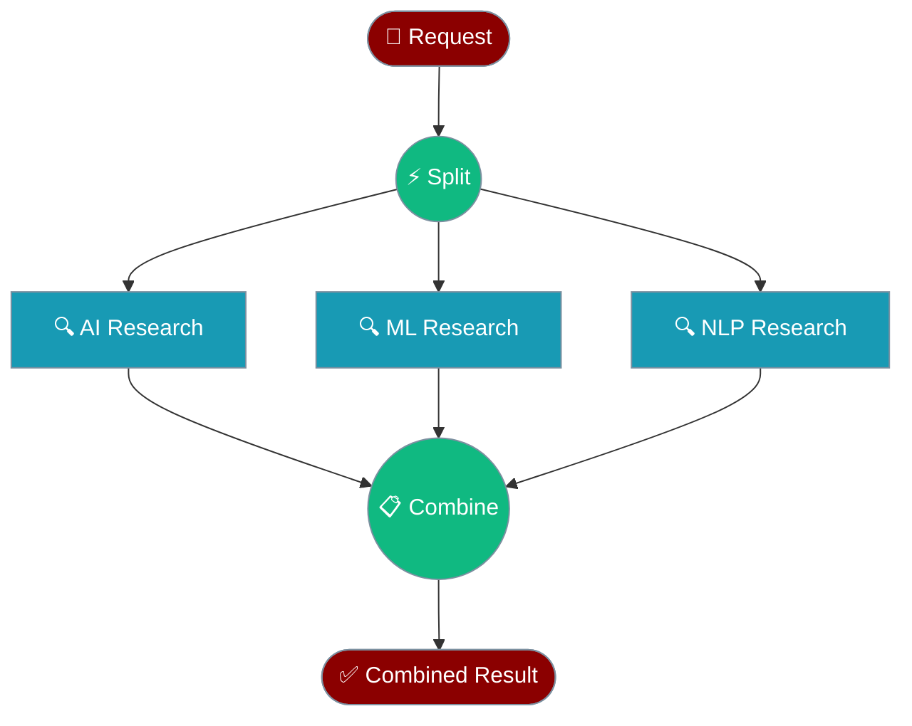
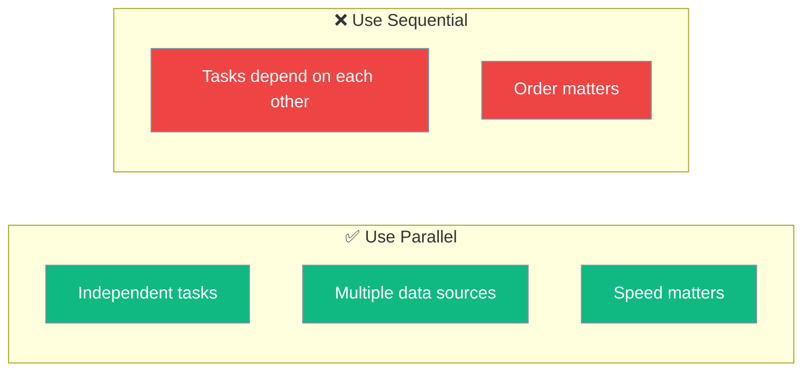
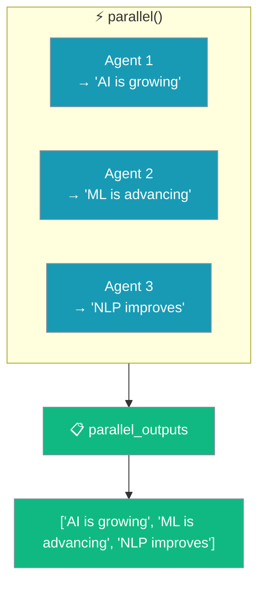
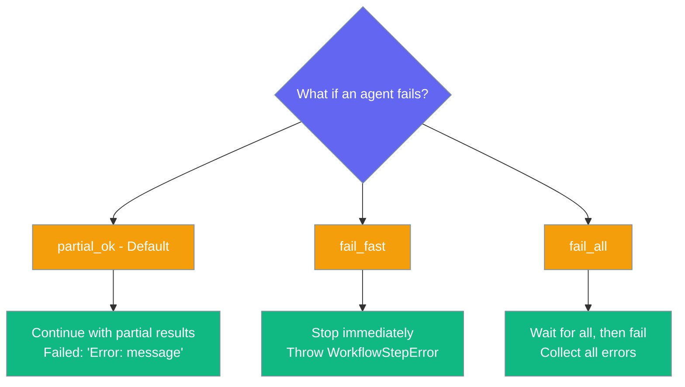

# Parallel Workflow

Run multiple agents **at the same time** instead of waiting for each one.


```mermaid
graph TB
    Input([📝 Request]) --> Split((⚡ Split))
    
    Split --> A1[🔍 AI Research]
    Split --> A2[🔍 ML Research]
    Split --> A3[🔍 NLP Research]
    
    A1 --> Merge((📋 Combine))
    A2 --> Merge
    A3 --> Merge
    
    Merge --> Output([✅ Combined Result])
    
    classDef io fill:#8B0000,stroke:#7C90A0,color:#fff
    classDef agent fill:#189AB4,stroke:#7C90A0,color:#fff
    classDef split fill:#10B981,stroke:#7C90A0,color:#fff
    
    class Input,Output io
    class A1,A2,A3 agent
    class Split,Merge split
```

---

## Speed Comparison


```mermaid
gantt
    title Sequential vs Parallel (3 tasks × 1 second each)
    dateFormat ss
    axisFormat %S

    section Sequential
    Agent 1    :a1, 00, 1s
    Agent 2    :a2, after a1, 1s
    Agent 3    :a3, after a2, 1s

    section Parallel
    Agent 1    :b1, 00, 1s
    Agent 2    :b2, 00, 1s
    Agent 3    :b3, 00, 1s
```

| | Sequential | Parallel |
|-----|------------|----------|
| **Time** | 3 seconds | ~1 second |
| **Speed** | 1x | 3x faster |

---

## When to Use


```mermaid
graph LR
    subgraph "✅ Use Parallel"
        A[Independent tasks]
        B[Multiple data sources]
        C[Speed matters]
    end
    
    subgraph "❌ Use Sequential"
        D[Tasks depend on each other]
        E[Order matters]
    end
    
    classDef good fill:#10B981,stroke:#7C90A0,color:#fff
    classDef bad fill:#EF4444,stroke:#7C90A0,color:#fff
    
    class A,B,C good
    class D,E bad
```

---

## Code

```python
from praisonaiagents import Agent, AgentFlow
from praisonaiagents import parallel

# Create agents
ai_researcher = Agent(name="AI", instructions="Research AI trends")
ml_researcher = Agent(name="ML", instructions="Research ML trends")
nlp_researcher = Agent(name="NLP", instructions="Research NLP trends")
summarizer = Agent(name="Summary", instructions="Combine all research")

# Run in parallel, then summarize
flow = AgentFlow(steps=[
    parallel([ai_researcher, ml_researcher, nlp_researcher]),
    summarizer
])

result = flow.start("Research latest developments")
```

---

## How Results Combine


```mermaid
graph TB
    subgraph Parallel["⚡ parallel()"]
        A1["Agent 1<br/>→ 'AI is growing'"]
        A2["Agent 2<br/>→ 'ML is advancing'"]
        A3["Agent 3<br/>→ 'NLP improves'"]
    end
    
    Parallel --> Results["📋 parallel_outputs"]
    Results --> List["['AI is growing', 'ML is advancing', 'NLP improves']"]
    
    classDef agent fill:#189AB4,stroke:#7C90A0,color:#fff
    classDef result fill:#10B981,stroke:#7C90A0,color:#fff
    
    class A1,A2,A3 agent
    class Results,List result
```

---

## Failure Handling

Choose how parallel execution responds to failures.


```mermaid
graph TB
    A{What if an agent fails?} --> B[partial_ok - Default]
    A --> C[fail_fast]
    A --> D[fail_all]
    
    B --> B1[Continue with partial results<br/>Failed: 'Error: message']
    C --> C1[Stop immediately<br/>Throw WorkflowStepError]
    D --> D1[Wait for all, then fail<br/>Collect all errors]
    
    classDef decision fill:#6366F1,stroke:#7C90A0,color:#fff
    classDef strategy fill:#F59E0B,stroke:#7C90A0,color:#fff
    classDef result fill:#10B981,stroke:#7C90A0,color:#fff
    
    class A decision
    class B,C,D strategy
    class B1,C1,D1 result
```

### Strategy Examples

```python
from praisonaiagents import WorkflowStepError

# Default: Continue with partial results
flow = AgentFlow(steps=[
    parallel([agent_a, agent_b, agent_c]),  # Some might fail
    summarizer  # Gets whatever succeeded
])

# Stop fast: First failure cancels others
flow = AgentFlow(steps=[
    parallel([agent_a, agent_b, agent_c], on_failure="fail_fast"),
    # This step never runs if any agent fails
])

# Fail all: Wait for everything, then report errors
try:
    flow = AgentFlow(steps=[
        parallel([agent_a, agent_b, agent_c], on_failure="fail_all"),
    ])
    result = flow.start("Process")
except WorkflowStepError as e:
    print(f"Failed agents: {len(e.errors)}")
```

---

## Related

<CardGroup cols={2}>
  <Card title="Sequential" icon="arrow-right" href="/docs/guides/workflows/sequential">
    One step at a time
  </Card>
  <Card title="Routing" icon="route" href="/docs/guides/workflows/routing">
    Send to the right expert
  </Card>
</CardGroup>
