# Parallel Workflow

Run multiple agents **at the same time** instead of waiting for each one.

```mermaid
graph TB
    Input([📝 Request]) --> Split((⚡ Split))
    
    Split --> A1[🔍 AI Research]
    Split --> A2[🔍 ML Research]
    Split --> A3[🔍 NLP Research]
    
    A1 --> Merge((📋 Combine))
    A2 --> Merge
    A3 --> Merge
    
    Merge --> Output([✅ Combined Result])
    
    classDef io fill:#8B0000,stroke:#7C90A0,color:#fff
    classDef agent fill:#189AB4,stroke:#7C90A0,color:#fff
    classDef split fill:#10B981,stroke:#7C90A0,color:#fff
    
    class Input,Output io
    class A1,A2,A3 agent
    class Split,Merge split
```



---

## Speed Comparison


| | Sequential | Parallel |
|-----|------------|----------|
| **Time** | 3 seconds | ~1 second |
| **Speed** | 1x | 3x faster |

---

## When to Use


---

## Code

```python
from praisonaiagents import Agent, AgentFlow
from praisonaiagents import parallel

# Create agents
ai_researcher = Agent(name="AI", instructions="Research AI trends")
ml_researcher = Agent(name="ML", instructions="Research ML trends")
nlp_researcher = Agent(name="NLP", instructions="Research NLP trends")
summarizer = Agent(name="Summary", instructions="Combine all research")

# Run in parallel, then summarize
flow = AgentFlow(steps=[
    parallel([ai_researcher, ml_researcher, nlp_researcher]),
    summarizer
])

result = flow.start("Research latest developments")
```

---

## How Results Combine

```mermaid
graph TB
    subgraph Parallel["⚡ parallel()"]
        A1["Agent 1<br/>→ 'AI is growing'"]
        A2["Agent 2<br/>→ 'ML is advancing'"]
        A3["Agent 3<br/>→ 'NLP improves'"]
    end
    
    Parallel --> Results["📋 parallel_outputs"]
    Results --> List["['AI is growing', 'ML is advancing', 'NLP improves']"]
    
    classDef agent fill:#189AB4,stroke:#7C90A0,color:#fff
    classDef result fill:#10B981,stroke:#7C90A0,color:#fff
    
    class A1,A2,A3 agent
    class Results,List result
```



---

## Related

<CardGroup cols={2}>
  <Card title="Sequential" icon="arrow-right" href="/docs/guides/workflows/sequential">
    One step at a time
  </Card>
  <Card title="Routing" icon="route" href="/docs/guides/workflows/routing">
    Send to the right expert
  </Card>
</CardGroup>
