# Routing Workflow

Like a **receptionist** directing calls to the right department.

```mermaid
graph TB
    Input([📝 User Request]) --> Classifier[🧠 Classifier]
    Classifier --> Router{🔀 route()}
    
    Router -->|"technical"| Tech[🔧 Tech Support]
    Router -->|"billing"| Billing[💳 Billing Team]
    Router -->|"general"| General[💬 General Help]
    
    Tech --> Output([✅ Response])
    Billing --> Output
    General --> Output
    
    classDef io fill:#8B0000,stroke:#7C90A0,color:#fff
    classDef classifier fill:#F59E0B,stroke:#7C90A0,color:#fff
    classDef router fill:#6366F1,stroke:#7C90A0,color:#fff
    classDef agent fill:#189AB4,stroke:#7C90A0,color:#fff
    
    class Input,Output io
    class Classifier classifier
    class Router router
    class Tech,Billing,General agent
```

---

## How It Works


---

## Pattern Matching

```mermaid
graph LR
    subgraph "Previous Output: 'priority: high'"
        A["'high'"] -->|"✅ matches"| B["high route"]
        C["'low'"] -->|"❌ no match"| D["skipped"]
    end
    
    classDef match fill:#10B981,stroke:#7C90A0,color:#fff
    classDef skip fill:#EF4444,stroke:#7C90A0,color:#fff
    
    class A,B match
    class C,D skip
```



The router looks for **keywords** in the previous step's output.

---

## Code

```python
from praisonaiagents import Agent, AgentFlow
from praisonaiagents import route

# Classifier decides where to route
def classify(ctx):
    text = ctx.input.lower()
    if "api" in text or "code" in text:
        return StepResult(output="technical")
    elif "price" in text or "bill" in text:
        return StepResult(output="billing")
    return StepResult(output="general")

# Specialist agents
tech = Agent(name="Tech", instructions="Handle technical questions")
billing = Agent(name="Billing", instructions="Handle billing questions")
general = Agent(name="General", instructions="Handle general questions")

# Create routing workflow
flow = AgentFlow(steps=[
    classify,
    route({
        "technical": [tech],
        "billing": [billing],
        "general": [general],
        "default": [general]
    })
])

result = flow.start("How do I integrate the API?")
```

---

## Multi-Step Routes

Each route can have multiple agents:

```mermaid
graph TB
    Router{🔀 route}
    
    Router -->|"approve"| A1[✓ Validate]
    A1 --> A2[📧 Notify]
    A2 --> A3[💾 Save]
    
    Router -->|"reject"| B1[📝 Log]
    B1 --> B2[📧 Notify User]
    
    classDef router fill:#6366F1,stroke:#7C90A0,color:#fff
    classDef step fill:#189AB4,stroke:#7C90A0,color:#fff
    
    class Router router
    class A1,A2,A3,B1,B2 step
```



---

## Nested Routes

For complex decisions:


---

## Use Cases

| Scenario | Routes |
|----------|--------|
| Customer support | Technical, Billing, General |
| Content moderation | Safe, Review, Block |
| Approval workflow | Approve, Reject, Escalate |
| Language routing | English, Spanish, French |

---

## Related

<CardGroup cols={2}>
  <Card title="Parallel" icon="arrows-split-up-and-left" href="/docs/guides/workflows/parallel">
    All at once
  </Card>
  <Card title="Orchestrator" icon="sitemap" href="/docs/guides/workflows/orchestrator">
    Manager delegates
  </Card>
</CardGroup>
