# Sequential Workflow

Pass work from one agent to the next, like an **assembly line**.

```mermaid
graph LR
    Input([📝 Request]) --> A1[🔍 Researcher]
    A1 --> A2[📊 Analyst]
    A2 --> A3[✍️ Writer]
    A3 --> A4[📋 Editor]
    A4 --> Output([✅ Result])
    
    classDef io fill:#8B0000,stroke:#7C90A0,color:#fff
    classDef agent fill:#189AB4,stroke:#7C90A0,color:#fff
    
    class Input,Output io
    class A1,A2,A3,A4 agent
```



---

## How Context Flows


Each agent receives the **previous output** automatically.

---

## When to Use


---

## Code

```python
from praisonaiagents import Agent, AgentFlow

researcher = Agent(name="Researcher", instructions="Research topics")
analyst = Agent(name="Analyst", instructions="Analyze research findings")
writer = Agent(name="Writer", instructions="Write based on analysis")

# Sequential: researcher → analyst → writer
flow = AgentFlow(steps=[researcher, analyst, writer])
result = flow.start("AI trends in 2024")
```

---

## Example: Blog Post Pipeline

```mermaid
graph LR
    Topic([📝 Topic]) --> R[🔍 Research]
    R --> A[📊 Analyze]
    A --> W[✍️ Write]
    W --> E[📋 Edit]
    E --> Post([✅ Published])
    
    classDef io fill:#8B0000,stroke:#7C90A0,color:#fff
    classDef step fill:#189AB4,stroke:#7C90A0,color:#fff
    
    class Topic,Post io
    class R,A,W,E step
```



| Step | Agent | Receives | Outputs |
|------|-------|----------|---------|
| 1 | Researcher | Topic | Facts, data |
| 2 | Analyst | Facts | Key insights |
| 3 | Writer | Insights | Draft article |
| 4 | Editor | Draft | Polished post |

---

## With Callbacks

```python
from praisonaiagents import AgentFlow, WorkflowHooksConfig

flow = AgentFlow(
    steps=[researcher, analyst, writer],
    hooks=WorkflowHooksConfig(
        on_step_complete=lambda name, r: print(f"✅ {name} done")
    )
)
```

---

## Related

<CardGroup cols={2}>
  <Card title="Parallel" icon="arrows-split-up-and-left" href="/docs/guides/workflows/parallel">
    All at once (faster)
  </Card>
  <Card title="Routing" icon="route" href="/docs/guides/workflows/routing">
    Send to specialists
  </Card>
</CardGroup>
