<div className="flex justify-start w-full max-w-xs sm:max-w-sm md:max-w-md">
  
  
</div>
<div className="flex flex-wrap gap-4 my-8">
  <div className="hover:opacity-80 transition-opacity">
    
  </div>
  <div className="hover:opacity-80 transition-opacity">
    
  </div>
  <div className="hover:opacity-80 transition-opacity">
    
  </div>
  <div className="hover:opacity-80 transition-opacity">
    
  </div>
  <div className="hover:opacity-80 transition-opacity">
    
  </div>
</div>

<div className="text-lg text-gray-600 dark:text-gray-400 mb-8 max-w-3xl">
  Build production-ready AI agents that reason, remember, and act autonomously — with just a few lines of code.
</div>

---

## Why PraisonAI?

<CardGroup cols={3}>
  <Card title="Runs Anywhere" icon="laptop" color="#8B0000">
    Your machine, cloud, or edge. Self-hosted with full control over your data.
  </Card>
  <Card title="100+ LLM Models" icon="brain" color="#189AB4">
    OpenAI, Anthropic, Google, Ollama, Groq — seamlessly switch between any provider.
  </Card>
  <Card title="Memory & Knowledge" icon="database" color="#2E8B57">
    Persistent memory, RAG knowledge bases, and context-aware conversations.
  </Card>
  <Card title="Self-Reflection" icon="rotate" color="#6366F1">
    Agents that evaluate and improve their own responses for higher accuracy.
  </Card>
  <Card title="140+ Built-in Tools" icon="screwdriver-wrench" color="#F59E0B">
    Web search, file operations, databases, APIs — all ready to use out of the box.
  </Card>
  <Card title="Multi-Agent Workflows" icon="diagram-project" color="#EC4899">
    Sequential, parallel, hierarchical orchestration with autonomous coordination.
  </Card>
</CardGroup>

---

## Differentiators

<AccordionGroup>
  <Accordion title="🧠 Self-Reflection & Reasoning" icon="brain-circuit">
    Unlike simple chatbots, PraisonAI agents can **reflect on their outputs** and iteratively improve them. Built-in reasoning capabilities enable multi-step problem solving without manual prompting.
    
    ```python
    agent = Agent(
        name="analyst",
        self_reflect=True,      # Enable self-correction
        reasoning=True,         # Enable chain-of-thought
        max_reflect=3           # Up to 3 reflection cycles
    )
    ```
  </Accordion>

  <Accordion title="💾 Persistent Memory" icon="hard-drive">
    Agents remember past interactions across sessions. Short-term, long-term, and episodic memory systems keep context without re-prompting.
    
    ```python
    agent = Agent(
        name="assistant",
        memory=True,             # Enable persistent memory
        user_id="user_123"       # Scoped to specific user
    )
    ```
  </Accordion>

  <Accordion title="📚 Knowledge Bases (RAG)" icon="book">
    Connect agents to your documents, databases, and APIs. Built-in RAG with auto-chunking, embeddings, and semantic search.
    
    ```python
    agent = Agent(
        name="researcher",
        knowledge="./docs/",       # Local documents
        knowledge_sources=[        # Or multiple sources
            "https://example.com/api",
            "./pdfs/"
        ]
    )
    ```
  </Accordion>

  <Accordion title="🌐 Browser Control" icon="globe">
    Agents can navigate websites, fill forms, click buttons, and extract data — fully automated browser automation.
    
    ```python
    agent = Agent(
        name="web_agent",
        tools=["browser_tool"],   # Built-in browser
        llm="gpt-4o"
    )
    agent.run("Book a flight from NYC to LA for next Tuesday")
    ```
  </Accordion>

  <Accordion title="💬 11+ Messaging Platforms" icon="comments">
    Deploy agents to Slack, Discord, Telegram, WhatsApp, Signal, LINE, iMessage, and more — with a single command.
    
    ```bash
    praisonai bot slack --token $SLACK_BOT_TOKEN --app-token $SLACK_APP_TOKEN
    ```
  </Accordion>

  <Accordion title="🔌 Extensible Plugins" icon="plug">
    Write custom tools in Python or use any of the 140+ pre-built integrations. MCP protocol support for external tool servers.
    
    ```python
    from praisonaiagents import Agent

    def custom_tool(query: str) -> str:
        """My custom tool description."""
        return f"Result for {query}"

    agent = Agent(tools=[custom_tool])
    ```
  </Accordion>
</AccordionGroup>

---

## Quick Start

<Tabs>
  <Tab title="No Code">
    <Steps>
      <Step title="Install">
        ```bash
        pip install praisonai
        ```
      </Step>
      <Step title="Set API Key">
        ```bash
        export OPENAI_API_KEY=sk-xxx
        ```
      </Step>
      <Step title="Run">
        ```bash
        praisonai --auto "Research the top 5 AI trends in 2025 and create a report"
        ```
        
        That's it! Agents are automatically created and orchestrated.
      </Step>
    </Steps>
  </Tab>
  <Tab title="Python SDK">
    <Steps>
      <Step title="Install">
        ```bash
        pip install praisonaiagents
        ```
      </Step>
      <Step title="Create Agent">
        ```python
        from praisonaiagents import Agent

        agent = Agent(
            name="researcher",
            instructions="You are a research analyst specializing in AI trends.",
            llm="gpt-4o"
        )

        result = agent.start("What are the top AI trends for 2025?")
        print(result)
        ```
      </Step>
    </Steps>
  </Tab>
  <Tab title="Multi-Agent">
    ```python
    from praisonaiagents import Agent, Task, Agents

    # Create specialized agents
    researcher = Agent(
        name="Researcher",
        role="Research Analyst",
        goal="Find accurate, up-to-date information",
        llm="gpt-4o"
    )

    writer = Agent(
        name="Writer",
        role="Content Writer",
        goal="Create engaging, clear content",
        llm="gpt-4o"
    )

    # Define tasks
    research_task = Task(
        name="research",
        description="Research AI trends for 2025",
        agent=researcher
    )

    write_task = Task(
        name="write",
        description="Write a blog post based on the research",
        agent=writer
    )

    # Orchestrate
    agents = Agents(
        agents=[researcher, writer],
        tasks=[research_task, write_task],
        process="sequential"
    )

    result = agents.start()
    ```
  </Tab>
</Tabs>

---

## Platform Integrations

<CardGroup cols={4}>
  <Card title="Slack" icon="slack" href="/features/messaging-bots">
    Deploy AI bots to Slack workspaces
  </Card>
  <Card title="Discord" icon="discord" href="/features/messaging-bots">
    Create Discord bots with agent intelligence
  </Card>
  <Card title="Telegram" icon="telegram" href="/features/messaging-bots">
    Build Telegram bots in minutes
  </Card>
  <Card title="WhatsApp" icon="whatsapp" href="/features/messaging-bots">
    Send messages via WhatsApp Business
  </Card>
</CardGroup>

<CardGroup cols={4}>
  <Card title="GitHub" icon="github" href="/tools">
    Automate repos, issues, and PRs
  </Card>
  <Card title="Google" icon="google" href="/tools">
    Calendar, Sheets, Drive, Gmail
  </Card>
  <Card title="Notion" icon="file-lines" href="/tools">
    Read and write Notion pages
  </Card>
  <Card title="Jira" icon="jira" href="/tools">
    Manage Jira issues and projects
  </Card>
</CardGroup>

---

## Architecture

```mermaid
graph TB
    subgraph "Your Application"
        U[👤 User] --> A[🤖 PraisonAI Agents]
    end
    
    subgraph "Agent Capabilities"
        A --> T[🔧 140+ Tools]
        A --> M[💾 Memory]
        A --> K[📚 Knowledge]
        A --> R[🧠 Reasoning]
    end
    
    subgraph "Deployment Options"
        A --> CLI[⌨️ CLI]
        A --> API[🌐 REST API]
        A --> BOT[💬 Messaging Bots]
        A --> UI[🖥️ Web UI]
    end
    
    subgraph "LLM Providers"
        A --> LLM[OpenAI / Anthropic / Google / Ollama / 100+]
    end
    
    classDef user fill:#6366F1,stroke:#7C90A0,color:#fff
    classDef agent fill:#8B0000,stroke:#7C90A0,color:#fff
    classDef capability fill:#2E8B57,stroke:#7C90A0,color:#fff
    classDef deploy fill:#189AB4,stroke:#7C90A0,color:#fff
    classDef llm fill:#F59E0B,stroke:#7C90A0,color:#fff
    
    class U user
    class A agent
    class T,M,K,R capability
    class CLI,API,BOT,UI deploy
    class LLM llm
```



---

## Use Cases

<CardGroup cols={2}>
  <Card title="Customer Support" icon="headset" href="/examples">
    Build intelligent support agents that resolve issues autonomously, escalate when needed, and learn from interactions.
  </Card>
  <Card title="Research & Analysis" icon="chart-line" href="/examples">
    Create agents that gather data, analyze trends, and produce detailed reports with citations.
  </Card>
  <Card title="Content Creation" icon="pen-nib" href="/examples">
    Deploy agents that research, write, edit, and optimize content across formats — blogs, docs, social media.
  </Card>
  <Card title="Process Automation" icon="gears" href="/examples">
    Automate complex workflows with multi-agent coordination — from data pipelines to deployment.
  </Card>
  <Card title="Code Generation" icon="code" href="/examples">
    Agents that understand your codebase, write tests, fix bugs, and implement features.
  </Card>
  <Card title="Personal Assistant" icon="user-robot" href="/examples">
    Build assistants that manage calendars, emails, reminders, and integrate with your tools.
  </Card>
</CardGroup>

---

## Explore

<CardGroup cols={3}>
  <Card title="Agents" icon="robot" href="/agents/agents" cta="Learn more">
    Create and configure intelligent agents
  </Card>
  <Card title="Tools" icon="screwdriver-wrench" href="/tools" cta="Browse tools">
    140+ built-in tools and integrations
  </Card>
  <Card title="Memory" icon="database" href="/features/memory" cta="Set up memory">
    Persistent memory and knowledge bases
  </Card>
  <Card title="MCP" icon="plug" href="/mcp/mcp" cta="Connect services">
    Model Context Protocol integrations
  </Card>
  <Card title="Messaging Bots" icon="comments" href="/features/messaging-bots" cta="Deploy bots">
    Slack, Discord, Telegram, and more
  </Card>
  <Card title="API Reference" icon="code" href="/api" cta="View API">
    Full SDK documentation
  </Card>
</CardGroup>

---

<div className="relative w-full aspect-video overflow-hidden rounded-lg shadow-lg mb-8">
  <iframe
    className="absolute top-0 left-0 w-full h-full border-0"
    src="https://www.youtube.com/embed/Fn1lQjC0GO0"
    title="PraisonAI Introduction"
    allow="accelerometer; autoplay; clipboard-write; encrypted-media; gyroscope; picture-in-picture"
    allowFullScreen
    style={{
      maxWidth: '100vw',
      margin: '0 auto'
    }}
  ></iframe>
</div>
