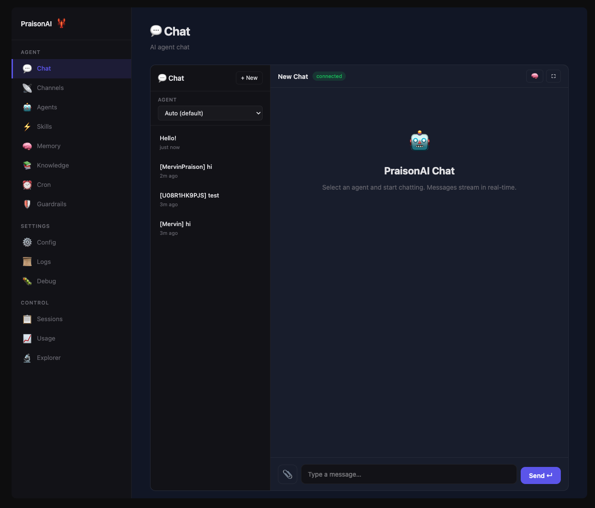

<div className="relative mx-[calc(50%-50vw)] w-screen overflow-hidden">
  <div className="max-w-4xl mx-auto px-4">

{/* Hero Section */}
<div className="text-center py-12">
  <div className="flex justify-center mb-6">
    
    
  </div>
  
  <h1 className="text-4xl md:text-5xl font-bold text-gray-900 dark:text-white mb-4">
    🦞 AI Agents That Work For You, 24/7
  </h1>
  
  <p className="text-xl text-gray-600 dark:text-gray-400 mb-6 max-w-2xl mx-auto">
    Multi-agent teams that solve complex tasks, automate workflows, and deliver to Telegram, Discord, Slack — with low-code simplicity.
  </p>
  
  <div className="flex justify-center gap-3 flex-wrap mb-6">
    
    
    
  </div>
  
  {/* Search Bar */}
  <div className="max-w-xl mx-auto mb-8">
    <button
      onClick={() => {
        const event = new KeyboardEvent('keydown', { key: 'k', metaKey: true, bubbles: true });
        document.dispatchEvent(event);
      }}
      className="w-full flex items-center gap-3 px-4 py-3 rounded-lg border border-gray-300 dark:border-gray-600 bg-white dark:bg-gray-800 text-gray-500 dark:text-gray-400 hover:border-gray-400 dark:hover:border-gray-500 transition-colors cursor-pointer"
    >
      <svg className="w-5 h-5" fill="none" stroke="currentColor" viewBox="0 0 24 24">
        <path strokeLinecap="round" strokeLinejoin="round" strokeWidth={2} d="M21 21l-6-6m2-5a7 7 0 11-14 0 7 7 0 0114 0z" />
      </svg>
      <span>Search documentation...</span>
      <span className="ml-auto text-xs bg-gray-100 dark:bg-gray-700 px-2 py-1 rounded">⌘K</span>
    </button>
  </div>
</div>

{/* 3 Main Entry Cards */}
<CardGroup cols={3}>
  <Card title="Get Started" icon="rocket" href="/docs/quickstart">
    Build your first AI agent in minutes. Install, configure, and run.
  </Card>
  <Card title="Explore SDK" icon="code" href="/docs/introduction">
    Agents, Tools, Workflows, Memory, Knowledge, and RAG capabilities.
  </Card>
  <Card title="Deploy" icon="cloud" href="/docs/deploy/index">
    Docker, Cloud, MCP Server, A2A Protocol, and production patterns.
  </Card>
</CardGroup>

{/* Quick Install */}
<div className="mt-16">
  <h2 className="text-2xl font-bold text-center mb-6">Quick Start</h2>

  <p className="text-center text-gray-600 dark:text-gray-400 mb-4">
    One‑line install — includes guided onboarding for Telegram, Discord, Slack, WhatsApp and the Claw dashboard.
  </p>

  <Tabs>
    <Tab title="macOS / Linux / WSL2">
      ```bash
      curl -fsSL https://praison.ai/install.sh | bash
      ```
    </Tab>
    <Tab title="Windows (PowerShell)">
      ```powershell
      iwr -useb https://praison.ai/install.ps1 | iex
      ```
    </Tab>
    <Tab title="pip">
      ```bash
      pip install "praisonai[all]"
      praisonai onboard
      ```
    </Tab>
  </Tabs>

{/* Arrow Annotations pointing to Tabs */}
<div className="flex justify-center gap-6 mb-0">
  <div className="flex flex-col items-center">
    <div className="px-3 py-1 rounded-full bg-orange-500 text-white text-xs font-bold shadow-lg">
      Single Agent
    </div>
    <svg width="20" height="24" className="mt-1">
      <line x1="10" y1="0" x2="10" y2="18" stroke="#f97316" strokeWidth="2" strokeOpacity="0.6"/>
      <polygon points="5,14 10,22 15,14" fill="#f97316" fillOpacity="0.6"/>
    </svg>
  </div>
  <div className="flex flex-col items-center">
    <div className="px-3 py-1 rounded-full bg-cyan-500 text-white text-xs font-bold shadow-lg">
      Multi-Agent
    </div>
    <svg width="20" height="24" className="mt-1">
      <line x1="10" y1="0" x2="10" y2="18" stroke="#06b6d4" strokeWidth="2" strokeOpacity="0.6"/>
      <polygon points="5,14 10,22 15,14" fill="#06b6d4" fillOpacity="0.6"/>
    </svg>
  </div>
  <div className="flex flex-col items-center">
    <div className="px-3 py-1 rounded-full bg-purple-500 text-white text-xs font-bold shadow-lg">
      Workflow
    </div>
    <svg width="20" height="24" className="mt-1">
      <line x1="10" y1="0" x2="10" y2="18" stroke="#a855f7" strokeWidth="2" strokeOpacity="0.6"/>
      <polygon points="5,14 10,22 15,14" fill="#a855f7" fillOpacity="0.6"/>
    </svg>
  </div>
  <div className="flex flex-col items-center">
    <div className="px-3 py-1 rounded-full bg-emerald-500 text-white text-xs font-bold shadow-lg">
      App
    </div>
    <svg width="20" height="24" className="mt-1">
      <line x1="10" y1="0" x2="10" y2="18" stroke="#10b981" strokeWidth="2" strokeOpacity="0.6"/>
      <polygon points="5,14 10,22 15,14" fill="#10b981" fillOpacity="0.6"/>
    </svg>
  </div>
  <div className="flex flex-col items-center">
    <div className="px-3 py-1 rounded-full bg-red-500 text-white text-xs font-bold shadow-lg">
      AgentClaw
    </div>
    <svg width="20" height="24" className="mt-1">
      <line x1="10" y1="0" x2="10" y2="18" stroke="#ef4444" strokeWidth="2" strokeOpacity="0.6"/>
      <polygon points="5,14 10,22 15,14" fill="#ef4444" fillOpacity="0.6"/>
    </svg>
  </div>
</div>

  <Tabs>
    <Tab title="Agent">
      ```python
      from praisonaiagents import Agent

      agent = Agent(instructions="You are a helpful AI assistant")
      agent.start("Write a movie script about a robot on Mars")
      ```
    </Tab>
    <Tab title="🦞 AgentClaw">
      ```bash
      pip install "praisonai[claw]"
      praisonai claw
      ```
      Open **http://localhost:8082** — full UI with chat, agents, memory,
      knowledge, and channels for Telegram, Discord, Slack.
    </Tab>
    <Tab title="AgentTeam">
      ```python
      from praisonaiagents import Agent, AgentTeam

      researcher = Agent(name="Researcher", instructions="Research topics thoroughly")
      writer = Agent(name="Writer", instructions="Write engaging content")

      team = AgentTeam(agents=[researcher, writer])
      team.start("Create a blog post about AI agents")
      ```
    </Tab>
    <Tab title="AgentFlow">
      ```python
      from praisonaiagents import Agent, AgentFlow

      researcher = Agent(name="Researcher", instructions="Research topics")
      writer = Agent(name="Writer", instructions="Write content")

      workflow = AgentFlow(steps=[researcher, writer])
      workflow.start("Create a blog post about AI agents")
      ```
    </Tab>
    <Tab title="AgentOS">
      ```python
      from praisonai import AgentOS
      from praisonaiagents import Agent

      # Deploy as web API
      app = AgentOS(
          agents=[Agent(instructions="You are a helpful assistant")]
      )
      app.serve(port=8080)
      ```
    </Tab>
  </Tabs>
</div>

{/* Dashboard */}
<div className="mt-16">
  <h2 className="text-2xl font-bold text-center mb-6">Dashboard</h2>
  <div className="rounded-lg overflow-hidden border border-gray-200 dark:border-gray-700 shadow-lg">
    
  </div>
</div>

{/* LLM Providers */}
<div className="mt-16 text-center">
  <h2 className="text-2xl font-bold mb-2">Works With Every AI Provider</h2>
  <p className="text-gray-600 dark:text-gray-400 mb-8">100+ LLM providers supported out of the box</p>
  
  <div className="flex flex-wrap justify-center items-center gap-3">
    
    
    
    
    
    
    
    
    
    
    
    
    
    
    
    
    
    
    
    
    
    <a href="/docs/models" className="no-underline"></a>
  </div>
</div>

{/* Use Cases */}
<div className="mt-16">
  <h2 className="text-2xl font-bold text-center mb-2">Use Cases</h2>
  <p className="text-gray-600 dark:text-gray-400 text-center mb-6">AI agents solving real-world problems across industries</p>

  <CardGroup cols={3}>
    <Card title="Research & Analysis" icon="magnifying-glass">
      Conduct deep research, gather information, and generate insights from multiple sources automatically.
    </Card>
    <Card title="Code Generation" icon="code">
      Write, debug, and refactor code with AI agents that understand your codebase and requirements.
    </Card>
    <Card title="Content Creation" icon="pen-nib">
      Generate blog posts, documentation, marketing copy, and technical writing with multi-agent teams.
    </Card>
    <Card title="Data Pipelines" icon="chart-bar">
      Extract, transform, and analyze data from APIs, databases, and web sources automatically.
    </Card>
    <Card title="Customer Support" icon="headset">
      Deploy 24/7 support bots on Telegram, Discord, Slack with memory and knowledge-backed responses.
    </Card>
    <Card title="Workflow Automation" icon="gears">
      Automate multi-step business processes with agents that hand off tasks, verify results, and self-correct.
    </Card>
  </CardGroup>
</div>

{/* Why PraisonAI */}
<div className="mt-16 p-6 rounded-lg bg-gray-50 dark:bg-gray-800/50">
  <h2 className="text-2xl font-bold text-center mb-6">Why PraisonAI?</h2>
  
  <CardGroup cols={3}>
    <Card title="Runs Anywhere" icon="laptop">
      Your machine, cloud, or edge. Self-hosted with full control over your data.
    </Card>
    <Card title="100+ LLM Models" icon="brain">
      OpenAI, Anthropic, Google, Ollama, Groq — seamlessly switch between any provider.
    </Card>
    <Card title="Memory & Knowledge" icon="database">
      Persistent memory, RAG knowledge bases, and context-aware conversations.
    </Card>
    <Card title="Self-Reflection" icon="rotate">
      Agents that evaluate and improve their own responses for higher accuracy.
    </Card>
    <Card title="140+ Built-in Tools" icon="screwdriver-wrench">
      Web search, file operations, databases, APIs — all ready to use out of the box.
    </Card>
    <Card title="Multi-Agent Workflows" icon="diagram-project">
      Sequential, parallel, hierarchical orchestration with autonomous coordination.
    </Card>
  </CardGroup>
</div>

{/* Install Options */}
<div className="mt-16">
  <h2 className="text-2xl font-bold text-center mb-6">Install</h2>
  
  <Tabs>
    <Tab title="Python">
      ```bash
      pip install praisonaiagents
      export OPENAI_API_KEY=your_key
      ```
      ```python
      from praisonaiagents import Agent

      agent = Agent(instructions="You are a helpful AI assistant")
      agent.start("Write a movie script about a robot on Mars")
      ```
    </Tab>
    <Tab title="JavaScript">
      ```bash
      npm install praisonai
      export OPENAI_API_KEY=your_key
      ```
      ```javascript
      const { Agent } = require('praisonai');
      const agent = new Agent({ instructions: 'You are a helpful AI assistant' });
      agent.start('Write a movie script about a robot on Mars');
      ```
    </Tab>
    <Tab title="No Code">
      ```bash
      pip install praisonai
      export OPENAI_API_KEY=your_key
      praisonai "Summarize the latest AI news"
      ```
    </Tab>
    <Tab title="Low Code">
      ```bash
      pip install praisonai
      export OPENAI_API_KEY=your_key
      ```
      ```yaml agents.yaml
      agents:
        researcher:
          instructions: Research about AI trends
        writer:
          instructions: Write a blog post about the findings
      ```
      ```bash
      praisonai agents.yaml
      ```
    </Tab>
  </Tabs>
</div>

{/* Explore Sections */}
<div className="mt-16">
  <h2 className="text-2xl font-bold text-center mb-6">Explore</h2>
  
  <CardGroup cols={3}>
    <Card title="Agents" icon="users" href="/docs/agents/agents">
      Single agents, multi-agent teams, coordination
    </Card>
    <Card title="Tools" icon="toolbox" href="/docs/tools/tools">
      Built-in tools, custom tools, MCP integration
    </Card>
    <Card title="Workflows" icon="sitemap" href="/docs/features/workflows">
      Multi-step pipelines, routing, loops
    </Card>
    <Card title="Memory & RAG" icon="database" href="/docs/features/rag">
      Vector stores, knowledge bases, retrieval
    </Card>
    <Card title="🦞 AgentClaw" icon="layout-dashboard" href="/docs/ui/claw">
      Full UI with chat, agents, Telegram, Discord, Slack
    </Card>
    <Card title="Recipes" icon="wand-magic-sparkles" href="/docs/examples/agent-recipes/index">
      55+ production-ready AI tools
    </Card>
  </CardGroup>
</div>

{/* Platform Integrations */}
<div className="mt-16">
  <h2 className="text-2xl font-bold text-center mb-6">Platform Integrations</h2>
  
  <CardGroup cols={4}>
    <Card title="Slack" icon="slack" href="/docs/ui/claw">
      Deploy AI bots to Slack workspaces
    </Card>
    <Card title="Discord" icon="discord" href="/docs/ui/claw">
      Create Discord bots with agent intelligence
    </Card>
    <Card title="Telegram" icon="telegram" href="/docs/ui/claw">
      Build Telegram bots in minutes
    </Card>
    <Card title="WhatsApp" icon="whatsapp" href="/docs/ui/claw">
      Connect via WhatsApp Business
    </Card>
  </CardGroup>
  
  <CardGroup cols={4}>
    <Card title="GitHub" icon="github" href="/docs/tools/tools">
      Automate repos, issues, and PRs
    </Card>
    <Card title="Google" icon="google" href="/docs/tools/tools">
      Calendar, Sheets, Drive, Gmail
    </Card>
    <Card title="Notion" icon="file-lines" href="/docs/tools/tools">
      Read and write Notion pages
    </Card>
    <Card title="Jira" icon="jira" href="/docs/tools/tools">
      Manage Jira issues and projects
    </Card>
  </CardGroup>
</div>

{/* CLI Commands */}
<div className="mt-16 mb-12">
  <h2 className="text-2xl font-bold text-center mb-6">CLI Commands</h2>
  <p className="text-center text-gray-600 dark:text-gray-400 mb-6">Full-featured CLI for deploying and managing AI agents</p>
  
  <Tabs>
    <Tab title="🦞 AgentClaw">
      ```bash
      pip install "praisonai[claw]"
      praisonai claw

      # Custom port
      praisonai claw --port 9000

      # Add channels from the UI — Telegram, Discord, Slack, WhatsApp
      ```
    </Tab>
    <Tab title="Messaging Bots">
      ```bash
      # Start a Telegram bot
      praisonai bot telegram --token $TELEGRAM_BOT_TOKEN

      # Slack with full capabilities
      praisonai bot slack --token $SLACK_BOT_TOKEN --app-token $SLACK_APP_TOKEN \
        --agent agents.yaml --browser --web --memory --model gpt-4o

      # Discord with custom tools
      praisonai bot discord --token $DISCORD_BOT_TOKEN \
        --tools DuckDuckGoTool WikipediaTool
      ```
    </Tab>
    <Tab title="Browser Control">
      ```bash
      praisonai browser navigate https://example.com
      praisonai browser run "Click the submit button"
      praisonai browser screenshot --output page.png
      praisonai browser doctor
      ```
    </Tab>
    <Tab title="Skills & Plugins">
      ```bash
      praisonai skills list
      praisonai skills check --verbose
      praisonai plugins list --enabled
      praisonai plugins doctor
      ```
    </Tab>
    <Tab title="Sandbox">
      ```bash
      praisonai "Run code" --sandbox strict
      praisonai sandbox status
      praisonai sandbox explain --agent work
      ```
    </Tab>
  </Tabs>
  
  <CardGroup cols={4}>
    <Card title="🦞 AgentClaw" icon="layout-dashboard" href="/docs/ui/claw">
      Full UI with bots and agents
    </Card>
    <Card title="Bot CLI" icon="robot" href="/docs/cli/bot">
      Deploy messaging bots
    </Card>
    <Card title="Browser CLI" icon="globe" href="/docs/cli/browser">
      Browser automation
    </Card>
    <Card title="Plugins CLI" icon="plug" href="/docs/cli/plugins">
      Plugin management
    </Card>
  </CardGroup>
</div>


{/* Community */}
<div className="mt-16 mb-12 text-center">
  <h2 className="text-2xl font-bold mb-2">Join the Community</h2>
  <p className="text-gray-600 dark:text-gray-400 mb-6">Connect with developers building with PraisonAI</p>
  
  <div className="flex justify-center gap-6 flex-wrap">
    <a href="https://github.com/MervinPraison/PraisonAI" target="_blank" className="flex items-center gap-2 px-4 py-2 rounded-lg border border-gray-300 dark:border-gray-600 hover:border-gray-400 dark:hover:border-gray-500 transition-colors">
      <svg className="w-5 h-5" fill="currentColor" viewBox="0 0 24 24"><path d="M12 0c-6.626 0-12 5.373-12 12 0 5.302 3.438 9.8 8.207 11.387.599.111.793-.261.793-.577v-2.234c-3.338.726-4.033-1.416-4.033-1.416-.546-1.387-1.333-1.756-1.333-1.756-1.089-.745.083-.729.083-.729 1.205.084 1.839 1.237 1.839 1.237 1.07 1.834 2.807 1.304 3.492.997.107-.775.418-1.305.762-1.604-2.665-.305-5.467-1.334-5.467-5.931 0-1.311.469-2.381 1.236-3.221-.124-.303-.535-1.524.117-3.176 0 0 1.008-.322 3.301 1.23.957-.266 1.983-.399 3.003-.404 1.02.005 2.047.138 3.006.404 2.291-1.552 3.297-1.23 3.297-1.23.653 1.653.242 2.874.118 3.176.77.84 1.235 1.911 1.235 3.221 0 4.609-2.807 5.624-5.479 5.921.43.372.823 1.102.823 2.222v3.293c0 .319.192.694.801.576 4.765-1.589 8.199-6.086 8.199-11.386 0-6.627-5.373-12-12-12z"/></svg>
      GitHub
    </a>
    <a href="https://youtube.com/@MervinPraison" target="_blank" className="flex items-center gap-2 px-4 py-2 rounded-lg border border-gray-300 dark:border-gray-600 hover:border-gray-400 dark:hover:border-gray-500 transition-colors">
      <svg className="w-5 h-5" fill="currentColor" viewBox="0 0 24 24"><path d="M23.498 6.186a3.016 3.016 0 0 0-2.122-2.136C19.505 3.545 12 3.545 12 3.545s-7.505 0-9.377.505A3.017 3.017 0 0 0 .502 6.186C0 8.07 0 12 0 12s0 3.93.502 5.814a3.016 3.016 0 0 0 2.122 2.136c1.871.505 9.376.505 9.376.505s7.505 0 9.377-.505a3.015 3.015 0 0 0 2.122-2.136C24 15.93 24 12 24 12s0-3.93-.502-5.814zM9.545 15.568V8.432L15.818 12l-6.273 3.568z"/></svg>
      YouTube
    </a>
    <a href="https://x.com/MervinPraison" target="_blank" className="flex items-center gap-2 px-4 py-2 rounded-lg border border-gray-300 dark:border-gray-600 hover:border-gray-400 dark:hover:border-gray-500 transition-colors">
      <svg className="w-5 h-5" fill="currentColor" viewBox="0 0 24 24"><path d="M18.244 2.25h3.308l-7.227 8.26 8.502 11.24H16.17l-5.214-6.817L4.99 21.75H1.68l7.73-8.835L1.254 2.25H8.08l4.713 6.231zm-1.161 17.52h1.833L7.084 4.126H5.117z"/></svg>
      X
    </a>
    <a href="https://linkedin.com/in/mervinpraison" target="_blank" className="flex items-center gap-2 px-4 py-2 rounded-lg border border-gray-300 dark:border-gray-600 hover:border-gray-400 dark:hover:border-gray-500 transition-colors">
      <svg className="w-5 h-5" fill="currentColor" viewBox="0 0 24 24"><path d="M20.447 20.452h-3.554v-5.569c0-1.328-.027-3.037-1.852-3.037-1.853 0-2.136 1.445-2.136 2.939v5.667H9.351V9h3.414v1.561h.046c.477-.9 1.637-1.85 3.37-1.85 3.601 0 4.267 2.37 4.267 5.455v6.286zM5.337 7.433c-1.144 0-2.063-.926-2.063-2.065 0-1.138.92-2.063 2.063-2.063 1.14 0 2.064.925 2.064 2.063 0 1.139-.925 2.065-2.064 2.065zm1.782 13.019H3.555V9h3.564v11.452zM22.225 0H1.771C.792 0 0 .774 0 1.729v20.542C0 23.227.792 24 1.771 24h20.451C23.2 24 24 23.227 24 22.271V1.729C24 .774 23.2 0 22.222 0h.003z"/></svg>
      LinkedIn
    </a>
  </div>
</div>

</div>
</div>
