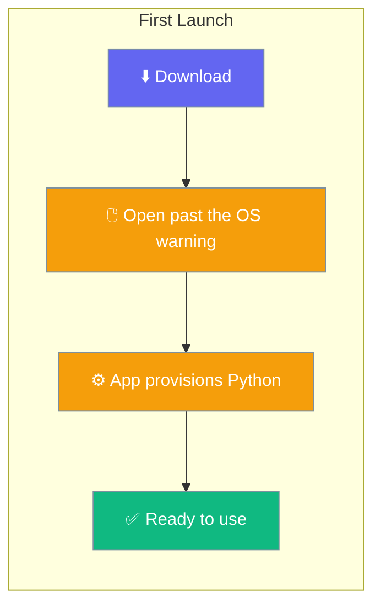
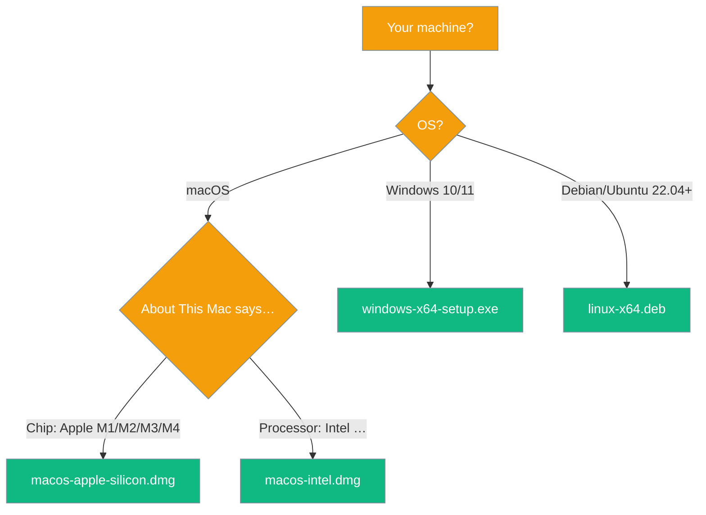
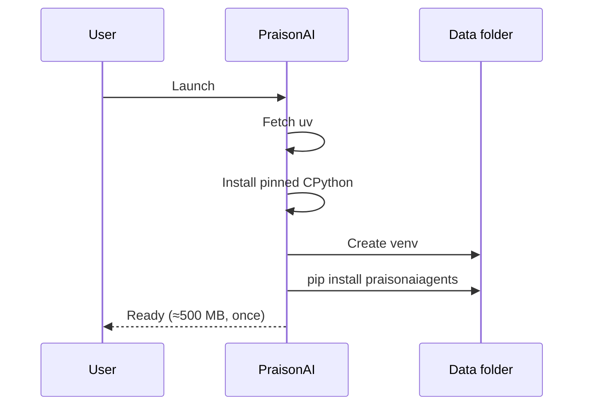

Download the app, run it, and the Python engine sets itself up on first launch. That's it.



## Download

Grab the latest build from the [Releases page](https://github.com/MervinPraison/PraisonAI/releases/latest), then pick the file for your platform:

| Platform | Download |
|---|---|
| macOS, Apple silicon (M1–M4) | `PraisonAI-<version>-macos-apple-silicon.dmg` |
| macOS, Intel | `PraisonAI-<version>-macos-intel.dmg` |
| Windows 10/11, 64-bit | `PraisonAI-<version>-windows-x64-setup.exe` |
| Linux, 64-bit (Debian/Ubuntu 22.04+) | `PraisonAI-<version>-linux-x64.deb` |

<Note>
There is no universal build. Each download targets one architecture, and a wrong-arch download fails when you launch it — not when you install it, which is a worse place to find out. Match the file to your machine using the table above.
</Note>

## Which download do I need?

Follow the branch for your machine.



## Open it

The builds are unsigned, so each OS shows a warning the first time. Here's the one-time click for yours.

<Tabs>
  <Tab title="macOS">
    Not sure which Mac you have? Open the Apple menu → **About This Mac**. "Chip" means Apple silicon; "Processor" means Intel.

    <Steps>
      <Step title="Move it to Applications">
        Drag **PraisonAI** to Applications.
      </Step>
      <Step title="Open it once">
        **Right-click** it → **Open** → **Open**. That once is enough; afterwards it launches normally.
      </Step>
    </Steps>

    <Warning>
    Gatekeeper says the app is unverified or that the developer is unidentified — nothing is wrong. The app simply has no trusted signature yet.
    </Warning>

    If macOS still refuses, clear the quarantine attribute your browser added when it downloaded the file:

    ```sh
    xattr -dr com.apple.quarantine /Applications/PraisonAI.app
    ```

    <Warning>
    If you see *"PraisonAI is damaged and can't be opened"*, right-click → Open will **not** get past it — macOS says "damaged" when a signature is invalid, not merely untrusted. This affected v4.7.2; use v4.7.3 or later.
    </Warning>
  </Tab>

  <Tab title="Windows">
    <Steps>
      <Step title="Run the installer">
        Double-click `PraisonAI-<version>-windows-x64-setup.exe`.
      </Step>
      <Step title="Get past SmartScreen">
        Click **More info**, then **Run anyway**.
      </Step>
    </Steps>

    <Warning>
    SmartScreen shows a full-screen *"Windows protected your PC"* with the Run button hidden until you click **More info**. This is because the installer isn't signed yet, not because it's malicious.
    </Warning>

    It installs for the current user only, into `%LOCALAPPDATA%`, so it never asks for an administrator password.

    <Note>
    If the WebView2 runtime is missing, the installer fetches it. Windows 11 and up-to-date Windows 10 already have it.
    </Note>
  </Tab>

  <Tab title="Linux">
    <Steps>
      <Step title="Install with apt">
        ```sh
        sudo apt install ./PraisonAI-<version>-linux-x64.deb
        ```
      </Step>
    </Steps>

    Use `apt` rather than `dpkg -i` so the WebKitGTK dependencies are resolved rather than just reported.

    <Note>
    The `.deb` is built on Ubuntu 22.04, so it runs on 22.04, Debian 12, and anything newer. On an older distribution glibc will refuse it, and no runtime flag fixes that — build from source instead.
    </Note>

    <Note>
    There is no `.rpm` and no AppImage. AppImage needs `libfuse2`, which Ubuntu 24.04 removed, and renders a blank window on some Wayland and Mesa combinations.
    </Note>
  </Tab>
</Tabs>

## What happens the first time you open it

The app needs a Python environment to run its engine and offers to build one: it fetches `uv`, installs a pinned CPython, creates a virtual environment, and installs `praisonaiagents` into it. Nothing is installed system-wide, and nothing is written inside the app itself — everything lives in one folder.



| Platform | Data folder |
|---|---|
| macOS | `~/Library/Application Support/PraisonAI` |
| Windows | `%APPDATA%\PraisonAI` |
| Linux | `~/.local/share/PraisonAI` (or `$XDG_DATA_HOME/PraisonAI`) |

The folder appears as soon as you open the app; the ≈500 MB environment lands inside it once you click **Get started**.

To remove the app completely, uninstall it and delete that folder.

## If it will not start

The window shows the reason and the engine log. Two common ones:

<AccordionGroup>
  <Accordion title="No usable Python">
    The setup screen offers to build the environment. If it fails, the step that failed is named along with what it printed.
  </Accordion>
  <Accordion title="Engine did not report ready in time">
    The first import of the ML stack is slow on a cold machine. Give it a minute; if it persists, the Engine log in the sidebar has the traceback.
  </Accordion>
</AccordionGroup>

## Signing status

<Info>
The builds are intentionally unsigned today: signing needs an Apple Developer ID on one side and a hardware-backed certificate or a hosted signing service on the other, and shipping builds you can open past a warning is better than shipping none. Signed builds are a planned improvement.
</Info>

## Related

<CardGroup cols={2}>
  <Card title="Install the Python SDK instead" icon="bolt" href="/install/quickstart">
    For developers who want the library
  </Card>
  <Card title="All install options" icon="download" href="/installation">
    Top-level installation index
  </Card>
</CardGroup>
