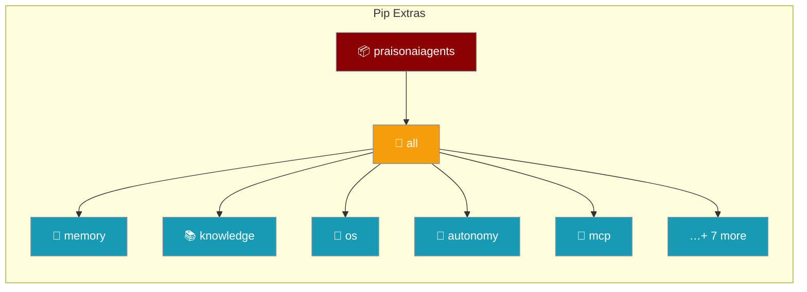

Pick the features you need, or install `[all]` to get everything in one go.



## Quick Start

<Steps>
<Step title="Install everything">
```bash
pip install "praisonaiagents[all]"
```
</Step>

<Step title="Or install only what you need">
```bash
pip install "praisonaiagents[memory,mcp]"
```
</Step>
</Steps>

## Available Extras

| Extra | What it adds | Use when… |
|-------|--------------|-----------|
| `all` | Every extra below in one go | You want zero friction |
| `memory` | ChromaDB + LiteLLM | Storing agent memory |
| `knowledge` | Mem0 + Markitdown + Chonkie | RAG over documents |
| `graph` | Mem0 with graph capabilities | Graph-based memory |
| `llm` | LiteLLM provider | Using non-OpenAI LLMs |
| `mcp` | MCP protocol (`mcp`, `fastapi`, `uvicorn`, `websockets`) | Connecting MCP tool servers |
| `api` | FastAPI + Uvicorn | Exposing agents over HTTP |
| `os` | `api` + `PyJWT` | Running AgentOS / a2a / agui servers |
| `auth` | PyJWT + bcrypt + python-jose + python-multipart | Securing endpoints |
| `autonomy` | `ast-grep-cli` | Autonomy mode + code-intelligence tools |
| `search` | `ddgs` | Zero-config DuckDuckGo web search |
| `crawl` | `crawl4ai` + Playwright (run `playwright install chromium`) | Web crawling |
| `mongodb` | `pymongo` + `motor` | MongoDB persistence |
| `telemetry` | PostHog | Anonymous usage telemetry |

<Note>
As of praisonaiagents `v1.6.37` (PraisonAI PR #1632), `[all]` includes
both `[autonomy]` and `[os]`. Earlier versions did not, and
`from praisonaiagents.config import AutonomyConfig` raised `ImportError`
after `pip install "praisonaiagents[all]"`. Upgrade to ≥ `1.6.37` to fix.
</Note>

## Common Patterns

### Autonomy Mode

```bash
pip install "praisonaiagents[autonomy]"
# or grab everything:
pip install "praisonaiagents[all]"
```

### AgentOS Server

```bash
pip install "praisonaiagents[os]"
# or grab everything:
pip install "praisonaiagents[all]"
```

### Web Crawling

```bash
pip install "praisonaiagents[crawl]"
playwright install chromium
# or grab everything:
pip install "praisonaiagents[all]"
```

## Related

<CardGroup cols={2}>
  <Card title="Quick Install" icon="bolt" href="/install/quickstart">
    The one-line installer
  </Card>
  <Card title="Autonomy Loop" icon="robot" href="/features/autonomy-loop">
    Uses the `[autonomy]` extra
  </Card>
</CardGroup>