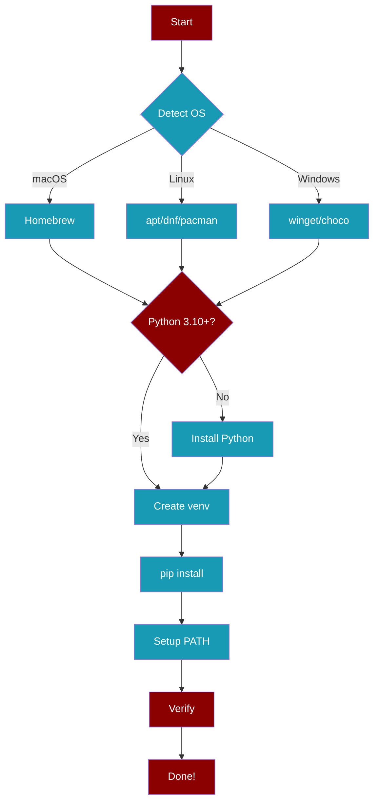

<Info>
This page explains how `install.sh` and `install.ps1` work under the hood.
</Info>



## install.sh (macOS/Linux)

### What It Does

<Steps>
  <Step title="Detect OS">
    Identifies macOS, Linux distro, or WSL
  </Step>
  <Step title="Check Python">
    Looks for Python 3.10+ in common locations
  </Step>
  <Step title="Install Python (if needed)">
    - **macOS**: Homebrew (`brew install python@3.12`)
    - **Ubuntu/Debian**: apt (`apt install python3`)
    - **Fedora/RHEL**: dnf (`dnf install python3`)
    - **Arch**: pacman (`pacman -S python`)
    - **Alpine**: apk (`apk add python3`)
  </Step>
  <Step title="Create Virtual Environment">
    Creates isolated environment at `~/.praisonai/venv`
  </Step>
  <Step title="Install PraisonAI">
    Runs `pip install praisonaiagents`
  </Step>
  <Step title="Configure PATH">
    Adds venv to shell rc file (`.zshrc`, `.bashrc`, etc.)
  </Step>
  <Step title="Verify Installation">
    Tests import and CLI availability
  </Step>
</Steps>

### CLI Flags

```bash
curl -fsSL https://praison.ai/install.sh | bash -s -- --help
```

| Flag | Description |
|------|-------------|
| `--version VERSION` | Install specific version |
| `--extras EXTRAS` | Install with extras (e.g., `ui,chat`) |
| `--no-venv` | Skip virtual environment |
| `--python PATH` | Use specific Python |
| `--dry-run` | Preview without changes |
| `--no-prompt` | Non-interactive mode |
| `-h, --help` | Show help |

### Environment Variables

| Variable | Description |
|----------|-------------|
| `PRAISONAI_VERSION` | Version to install |
| `PRAISONAI_EXTRAS` | Comma-separated extras |
| `PRAISONAI_SKIP_VENV` | Skip venv (`1` to enable) |
| `PRAISONAI_PYTHON` | Python executable path |
| `PRAISONAI_DRY_RUN` | Dry run mode (`1` to enable) |
| `PRAISONAI_NO_PROMPT` | Skip prompts (`1` to enable) |

## install.ps1 (Windows)

### What It Does

<Steps>
  <Step title="Detect Package Manager">
    Checks for winget, Chocolatey, or Scoop
  </Step>
  <Step title="Check Python">
    Looks for Python 3.10+ using `py` launcher
  </Step>
  <Step title="Install Python (if needed)">
    - **winget**: `winget install Python.Python.3.12`
    - **Chocolatey**: `choco install python`
    - **Scoop**: `scoop install python`
  </Step>
  <Step title="Create Virtual Environment">
    Creates at `%USERPROFILE%\.praisonai\venv`
  </Step>
  <Step title="Install PraisonAI">
    Runs `pip install praisonaiagents`
  </Step>
  <Step title="Configure PATH">
    Adds venv Scripts folder to user PATH
  </Step>
</Steps>

### PowerShell Parameters

```powershell
& ([scriptblock]::Create((iwr -useb https://praison.ai/install.ps1))) -Help
```

| Parameter | Description |
|-----------|-------------|
| `-Version` | Install specific version |
| `-Extras` | Install with extras |
| `-NoVenv` | Skip virtual environment |
| `-Python` | Use specific Python |
| `-DryRun` | Preview without changes |
| `-Help` | Show help |

## CI/CD Usage

<Tabs>
  <Tab title="GitHub Actions">
    ```yaml
    - name: Install PraisonAI
      run: |
        curl -fsSL https://praison.ai/install.sh | bash -s -- --no-prompt
      env:
        PRAISONAI_SKIP_VENV: "1"
    ```
  </Tab>
  <Tab title="GitLab CI">
    ```yaml
    install:
      script:
        - curl -fsSL https://praison.ai/install.sh | bash -s -- --no-prompt
      variables:
        PRAISONAI_SKIP_VENV: "1"
    ```
  </Tab>
  <Tab title="Docker">
    ```dockerfile
    FROM python:3.12-slim
    RUN curl -fsSL https://praison.ai/install.sh | bash -s -- --no-venv
    ```
  </Tab>
</Tabs>

## Troubleshooting

<AccordionGroup>
  <Accordion title="praisonai not found after install">
    The installer adds the venv to your shell rc file. Either:
    1. **Restart your terminal**, or
    2. **Source the rc file**: `source ~/.zshrc` (or `.bashrc`)
    3. **Activate manually**: `source ~/.praisonai/venv/bin/activate`
  </Accordion>
  
  <Accordion title="Python version too old">
    The installer requires Python 3.10+. If auto-install fails:
    ```bash
    # macOS
    brew install python@3.12
    
    # Ubuntu/Debian
    sudo apt install python3.12
    
    # Then re-run installer
    curl -fsSL https://praison.ai/install.sh | bash
    ```
  </Accordion>
  
  <Accordion title="Permission denied on Linux">
    If npm/pip global install fails with permission errors, the installer creates a user-local venv. If you still have issues:
    ```bash
    # Use --no-venv and install to user site
    pip install --user praisonaiagents
    ```
  </Accordion>
  
  <Accordion title="Windows: Script execution disabled">
    Enable script execution in PowerShell:
    ```powershell
    Set-ExecutionPolicy -ExecutionPolicy RemoteSigned -Scope CurrentUser
    ```
  </Accordion>
</AccordionGroup>

## Uninstall

<Tabs>
  <Tab title="macOS/Linux">
    ```bash
    # Remove venv
    rm -rf ~/.praisonai
    
    # Remove PATH entry from shell rc
    # Edit ~/.zshrc or ~/.bashrc and remove the PraisonAI line
    ```
  </Tab>
  <Tab title="Windows">
    ```powershell
    # Remove venv
    Remove-Item -Recurse -Force "$env:USERPROFILE\.praisonai"
    
    # Remove from PATH (System Properties > Environment Variables)
    ```
  </Tab>
  <Tab title="pip only">
    ```bash
    pip uninstall praisonaiagents praisonai
    ```
  </Tab>
</Tabs>
