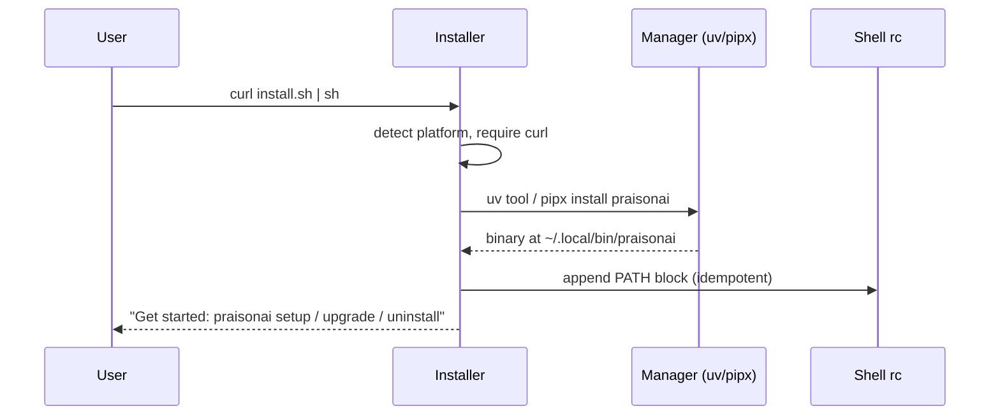
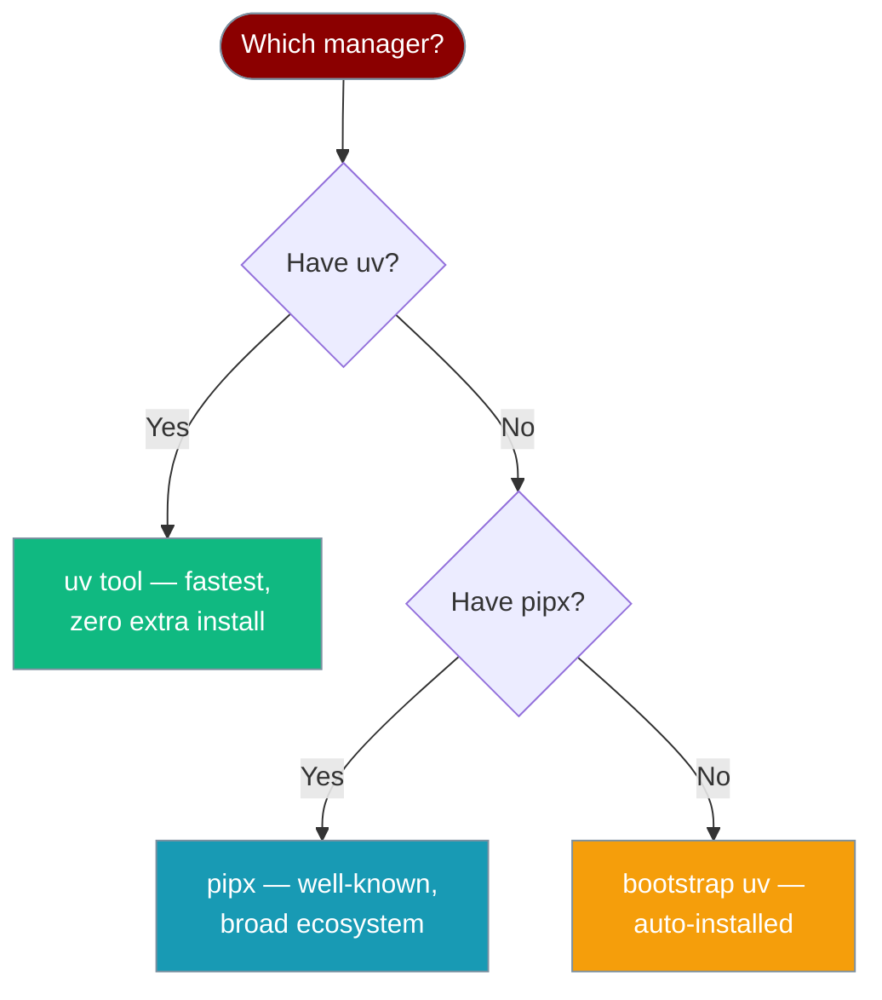

The PraisonAI installer picks a tool manager (`uv tool` → `pipx` → bootstrap `uv`) so you get a working `praisonai` CLI in an isolated environment without touching your global Python. Windows has its own `install.ps1` that installs `praisonai[all]` into a per-user venv.

```mermaid
flowchart TD
    S{Which OS?}:::agent
    S -->|macOS / Linux / WSL| A[curl install.sh | sh]:::tool
    S -->|Windows| W[iwr install.ps1 | iex]:::tool

    A --> B[Detect platform via uname]:::agent
    B --> C{Have uv?}:::agent
    C -->|Yes| U[uv tool install --force praisonai]:::tool
    C -->|No| D{Have pipx?}:::agent
    D -->|Yes| P[pipx install --force praisonai]:::tool
    D -->|No| E[Bootstrap uv from astral.sh]:::process
    E --> U
    U --> H[Wire ~/.local/bin onto PATH]:::process
    P --> H
    H --> K[Print Get started panel]:::success

    W --> WV[Create ~/.praisonai/venv]:::process
    WV --> WI[pip install praisonai&#91;all&#93;]:::tool
    WI --> WP[Prepend venv Scripts to PATH]:::process
    WP --> WO[Run praisonai setup wizard]:::process
    WO --> K

    classDef agent fill:#8B0000,stroke:#7C90A0,color:#fff
    classDef tool fill:#189AB4,stroke:#7C90A0,color:#fff
    classDef process fill:#F59E0B,stroke:#7C90A0,color:#fff
    classDef success fill:#10B981,stroke:#7C90A0,color:#fff
```

## install.sh (macOS / Linux / WSL)

Run it with:

```bash
curl -fsSL https://raw.githubusercontent.com/MervinPraison/PraisonAI/main/install.sh | sh
```

### How It Works

<Steps>
  <Step title="Detect platform">
    Reads `uname -s` / `uname -m` to report the OS and architecture.
  </Step>
  <Step title="Require curl">
    Errors out immediately if `curl` is not available.
  </Step>
  <Step title="Check PRAISONAI_INSTALLER override">
    If set to `uv` or `pipx`, forces that manager. `pipx` errors if not installed; `uv` bootstraps itself when missing. Any other value errors.
  </Step>
  <Step title="Pick a tool manager">
    In auto mode: use `uv tool` if `uv` is present → else `pipx` if present → else bootstrap `uv`.
  </Step>
  <Step title="Bootstrap uv (only if neither exists)">
    Downloads `https://astral.sh/uv/install.sh` to a temp file first, so a failed or empty download fails loudly instead of a later `uv: command not found`. Runs it, then verifies `uv` is on PATH.
  </Step>
  <Step title="Install praisonai">
    - **uv**: `uv tool install --force praisonai`
    - **pipx**: `pipx install --force praisonai` + `pipx ensurepath`

    Add `PRAISONAI_VERSION=x.y.z` to install `praisonai==x.y.z`.
  </Step>
  <Step title="Wire ~/.local/bin onto PATH">
    Appends an idempotent block (grepped for the bin dir before writing) to the correct rc file(s):
    - **zsh** → `~/.zshrc`
    - **fish** → `~/.config/fish/config.fish` (`fish_add_path` when available, POSIX-safe fallback otherwise)
    - **bash** → both `~/.bashrc` **and** the applicable login profile (`~/.bash_profile` → `~/.bash_login` → `~/.profile`, first that exists)
    - anything else → `~/.profile`
  </Step>
  <Step title="Print Get started panel">
    Points at `praisonai setup`, `praisonai upgrade`, `praisonai upgrade --check`, and `praisonai uninstall`.
  </Step>
</Steps>

<Note>
Bash gets **both** `~/.bashrc` **and** a login profile wired, so login shells find the binary too. Fish uses `fish_add_path` when available with a POSIX-safe fallback for older fish. A failed `uv` bootstrap surfaces a clear error rather than a later "uv: command not found".
</Note>

---

## User Interaction Flow


```mermaid
sequenceDiagram
    participant U as User
    participant I as Installer
    participant M as Manager (uv/pipx)
    participant S as Shell rc

    U->>I: curl install.sh | sh
    I->>I: detect platform, require curl
    I->>M: uv tool / pipx install praisonai
    M-->>I: binary at ~/.local/bin/praisonai
    I->>S: append PATH block (idempotent)
    I-->>U: "Get started: praisonai setup / upgrade / uninstall"
```

---

## Environment Variables (the only knobs)

The installer has **no CLI flags**. Its only inputs are three environment variables.

| Variable | Values | Behaviour |
|----------|--------|-----------|
| `PRAISONAI_VERSION` | `x.y.z` | Pin a specific version. Appended as `praisonai==VERSION` (default: latest from PyPI). |
| `PRAISONAI_INSTALLER` | `uv` \| `pipx` | Force a tool manager. `pipx` errors if not installed; `uv` bootstraps itself if missing. Any other value errors. |
| `PRAISONAI_NONINTERACTIVE` | any truthy | Non-interactive/CI mode (only changes an info message during `uv` bootstrap; the script never prompts). |

```bash
# Pin a version
PRAISONAI_VERSION=0.14.0 curl -fsSL https://raw.githubusercontent.com/MervinPraison/PraisonAI/main/install.sh | sh

# Force pipx
PRAISONAI_INSTALLER=pipx curl -fsSL https://raw.githubusercontent.com/MervinPraison/PraisonAI/main/install.sh | sh
```

---

## Power-User Alternatives (No Installer Needed)

These are first-class supported paths — no installer required:

```bash
# Zero-install one-shot via uv
uvx praisonai "2+2"

# Isolated persistent install
pipx install praisonai

# Install into the active Python environment
pip install praisonai
```

---

## Manage Your Install

After installation, the installer's "Get started" panel points at these self-management commands:

```bash
praisonai upgrade          # update in place
praisonai upgrade --check  # is a newer version available?
praisonai uninstall        # remove cleanly
```

See [praisonai upgrade](/docs/features/praisonai-upgrade) and [praisonai uninstall](/docs/features/praisonai-uninstall).

---

## Choosing a Manager

<Note>
Not sure which manager to pick? The installer chooses automatically. Read more in [Isolation Backends](/docs/install/isolation-backends).
</Note>


```mermaid
graph TB
    Start([Which manager?]):::agent
    Start --> Q1{Have uv?}
    Q1 -->|Yes| UV[uv tool — fastest,\nzero extra install]:::success
    Q1 -->|No| Q2{Have pipx?}
    Q2 -->|Yes| PIPX[pipx — well-known,\nbroad ecosystem]:::tool
    Q2 -->|No| BOOT[bootstrap uv —\nauto-installed]:::process

    classDef agent fill:#8B0000,stroke:#7C90A0,color:#fff
    classDef tool fill:#189AB4,stroke:#7C90A0,color:#fff
    classDef process fill:#F59E0B,stroke:#7C90A0,color:#fff
    classDef success fill:#10B981,stroke:#7C90A0,color:#fff
```

---

## CI/CD Usage

<Tabs>
  <Tab title="GitHub Actions">
    ```yaml
    - name: Install PraisonAI
      run: curl -fsSL https://raw.githubusercontent.com/MervinPraison/PraisonAI/main/install.sh | sh
      env:
        PRAISONAI_NONINTERACTIVE: "1"
    ```
  </Tab>
  <Tab title="GitLab CI">
    ```yaml
    install:
      script:
        - curl -fsSL https://raw.githubusercontent.com/MervinPraison/PraisonAI/main/install.sh | sh
      variables:
        PRAISONAI_NONINTERACTIVE: "1"
    ```
  </Tab>
  <Tab title="Docker">
    ```dockerfile
    FROM python:3.12-slim
    RUN apt-get update && apt-get install -y curl \
      && curl -fsSL https://raw.githubusercontent.com/MervinPraison/PraisonAI/main/install.sh | sh
    ```
  </Tab>
</Tabs>

---

## Uninstall

Use the built-in self-management command, which removes the managed install via the detected manager:

```bash
praisonai uninstall        # confirms first
praisonai uninstall --yes  # CI-safe, no prompt
```

See the [praisonai uninstall](/docs/features/praisonai-uninstall) page for details and JSON output.

---

## Troubleshooting

<AccordionGroup>
  <Accordion title="praisonai not found after install">
    Restart your terminal or source your shell rc:
    ```bash
    source ~/.zshrc   # zsh
    source ~/.bashrc  # bash
    ```
    Or add `~/.local/bin` to PATH manually:
    ```bash
    export PATH="$HOME/.local/bin:$PATH"
    ```
  </Accordion>

  <Accordion title="Force a specific manager">
    ```bash
    PRAISONAI_INSTALLER=pipx curl -fsSL https://raw.githubusercontent.com/MervinPraison/PraisonAI/main/install.sh | sh
    ```
  </Accordion>

  <Accordion title="I have both uv and pipx — which runs?">
    The installer picks `uv` first. Override with `PRAISONAI_INSTALLER=pipx`.
  </Accordion>

  <Accordion title="uv bootstrap failed (network/DNS)">
    The installer downloads `astral.sh/uv/install.sh` to a temp file and fails loudly if the download is empty or the network is unreachable. Install `uv` or `pipx` manually, then re-run:
    ```bash
    # https://docs.astral.sh/uv/getting-started/installation/
    curl -fsSL https://raw.githubusercontent.com/MervinPraison/PraisonAI/main/install.sh | sh
    ```
  </Accordion>
</AccordionGroup>

---

## install.ps1 (Windows)

Run it with:

```powershell
iwr -useb https://praison.ai/install.ps1 | iex
```

To pass parameters, use the script-block form so the params are honoured:

```powershell
& ([scriptblock]::Create((iwr -useb https://praison.ai/install.ps1))) -Extras "ui,chat"
```

<Note>
Default install is `praisonai[all]` — the wrapper package is included so `python -m praisonai setup` runs on first launch. Fixed in [PraisonAI PR #3029](https://github.com/MervinPraison/PraisonAI/pull/3029); earlier installs shipped only `praisonaiagents` and the setup wizard would fail with `No module named praisonai`.
</Note>

### How It Works

<Steps>
  <Step title="Detect Python">
    Requires Python >= 3.10. If missing, tries `winget install Python.Python.3.12` → `choco install python` → `scoop install python`.
  </Step>
  <Step title="Ensure pip">
    Bootstraps pip via `ensurepip`, falling back to `get-pip.py`.
  </Step>
  <Step title="Create venv">
    Creates a venv at `%USERPROFILE%\.praisonai\venv` (unless `-NoVenv`).
  </Step>
  <Step title="Install praisonai[all]">
    Installs `praisonai[all]` into the venv — this is the PR #3029 fix. Previously it installed `praisonaiagents`, leaving the `praisonai` wrapper absent.
  </Step>
  <Step title="Wire PATH">
    Prepends `<venv>\Scripts` to the user `Path` environment variable.
  </Step>
  <Step title="Verify">
    Confirms the install can `import praisonaiagents` and (if on PATH) `praisonai --version`.
  </Step>
  <Step title="Run onboarding">
    Runs `python -m praisonai setup`. Skipped if `-NoOnboard`, `-DryRun`, `PRAISONAI_NO_PROMPT` is set, or the session is non-interactive / stdin-redirected.
  </Step>
  <Step title="Print Next steps">
    Prints the venv activate command, a quick-start Python one-liner, the docs link, and an `OPENAI_API_KEY` reminder.
  </Step>
</Steps>

### Parameters

| Parameter | Env var | Default | Behaviour |
|-----------|---------|---------|-----------|
| `-Version <x.y.z>` | `PRAISONAI_VERSION` | `latest` | Pins a specific version. Appended as `praisonai[all]==<x.y.z>`. |
| `-Extras <csv>` | `PRAISONAI_EXTRAS` | *(none — install is `praisonai[all]`)* | Comma-separated extras. Overrides the default `[all]` to `[<csv>]`. If the extras include `ui`, `chat`, or `code`, the wrapper is *also* installed with those extras. |
| `-NoVenv` | `PRAISONAI_SKIP_VENV=1` | off | Skip creating `%USERPROFILE%\.praisonai\venv`. Installs into the detected Python instead. |
| `-NoOnboard` | `PRAISONAI_NO_ONBOARD=1` | off | Skip the interactive `python -m praisonai setup` wizard. |
| `-Python <path>` | `PRAISONAI_PYTHON` | auto-detect | Use a specific Python executable. Otherwise the script probes `python`, `python3`, `py -3.12`, `py -3.11`, `py -3.10`, `py`. |
| `-DryRun` | `PRAISONAI_DRY_RUN=1` | off | Print every command that would run without making changes. |
| `-Help` | — | — | Print the built-in help panel and exit. |

<Warning>
Upgrading from a pre-#3029 install? If your `~/.praisonai/venv` was created before this fix, re-run the installer or `pip install --upgrade 'praisonai[all]'` inside that venv — a `praisonaiagents`-only install still shims but cannot run `praisonai setup`.
</Warning>

### Choosing Extras


```mermaid
graph TB
    Start([Which extras?]):::agent
    Start --> Q1{Want the full stack?}
    Q1 -->|Yes| ALL[default &#91;all&#93; — everything included]:::success
    Q1 -->|No| Q2{Need a lean install?}
    Q2 -->|Yes| CORE[-Extras core — minimal footprint]:::tool
    Q2 -->|No| PICK[-Extras ui,chat,code — pick what you use]:::process

    classDef agent fill:#8B0000,stroke:#7C90A0,color:#fff
    classDef tool fill:#189AB4,stroke:#7C90A0,color:#fff
    classDef process fill:#F59E0B,stroke:#7C90A0,color:#fff
    classDef success fill:#10B981,stroke:#7C90A0,color:#fff
```

---

## Related

<CardGroup cols={2}>
  <Card title="Quick Install" icon="bolt" href="/docs/install/quickstart">
    One-liner install with options
  </Card>
  <Card title="Isolation Backends" icon="box" href="/docs/install/isolation-backends">
    Choose between uv and pipx
  </Card>
  <Card title="Upgrade" icon="arrow-up" href="/docs/features/praisonai-upgrade">
    Update the CLI in place
  </Card>
  <Card title="Uninstall" icon="trash" href="/docs/features/praisonai-uninstall">
    Remove the managed install
  </Card>
</CardGroup>
