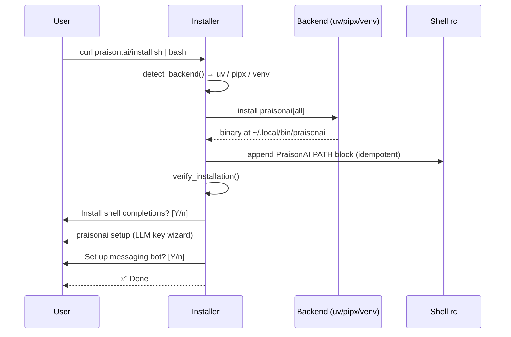
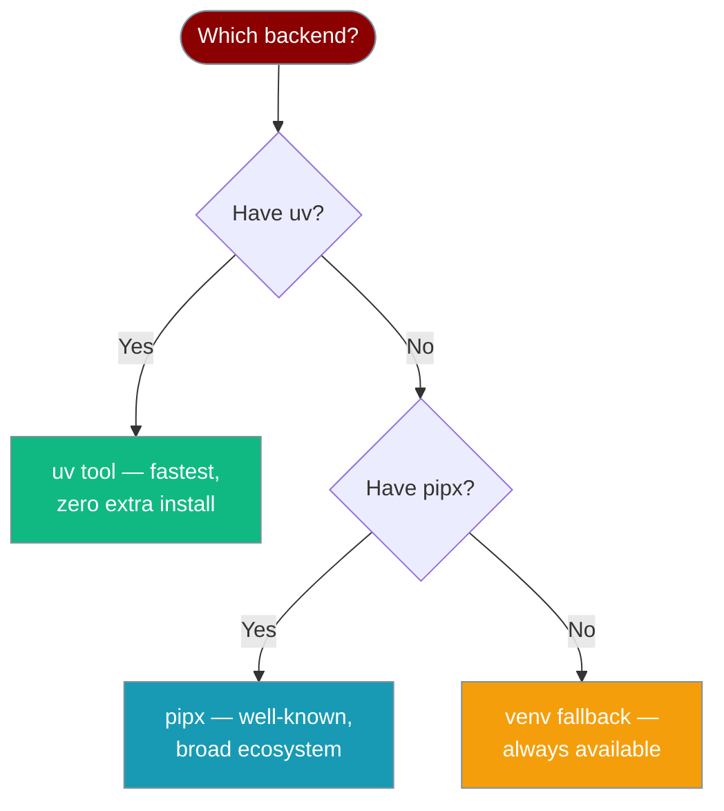

The PraisonAI installer automatically picks the best isolation backend (`uv tool` → `pipx` → venv fallback) so you get a working `praisonai` CLI without touching your global Python environment.

```mermaid
flowchart TD
    A[curl praison.ai/install.sh | bash]:::tool --> B{Detect Backend}:::agent
    B -->|uv found| C[uv tool install praisonai\[all\]]:::tool
    B -->|pipx found| D[pipx install praisonai\[all\]]:::tool
    B -->|neither| E[Create venv at ~/.praisonai/venv]:::tool
    E --> F[pip install praisonai\[all\]]:::tool
    F --> G[Shim → ~/.local/bin/praisonai]:::process
    C --> H[Ensure ~/.local/bin on PATH]:::process
    D --> H
    G --> H
    H --> I[Verify install]:::agent
    I --> J[Offer shell completions]:::process
    J --> K[Interactive onboarding]:::process
    K --> L[✅ Ready]:::success

    classDef agent fill:#8B0000,stroke:#7C90A0,color:#fff
    classDef tool fill:#189AB4,stroke:#7C90A0,color:#fff
    classDef process fill:#F59E0B,stroke:#7C90A0,color:#fff
    classDef success fill:#10B981,stroke:#7C90A0,color:#fff
```

## install.sh (macOS / Linux / WSL)

### How It Works

<Steps>
  <Step title="Detect OS">
    Identifies macOS, Linux distro, or WSL via `uname -s` and `/proc/version`.
  </Step>
  <Step title="Detect isolation backend">
    Checks `PRAISONAI_BACKEND` / `--backend` first. In `auto` mode (default), prefers `uv tool` → `pipx` → venv fallback.
  </Step>
  <Step title="Build package spec">
    Defaults to `praisonai[all]` for a full install. Respects `PRAISONAI_EXTRAS` / `--extras` and `PRAISONAI_VERSION` / `--version`.
  </Step>
  <Step title="Install via chosen backend">
    - **uv**: `uv tool install --force praisonai[all]` + `uv tool update-shell`
    - **pipx**: `pipx install --force praisonai[all]` + `pipx ensurepath`
    - **venv**: Python check → `python -m venv ~/.praisonai/venv` → `pip install praisonai[all]` → symlink `~/.local/bin/praisonai → ~/.praisonai/venv/bin/praisonai`
  </Step>
  <Step title="Ensure ~/.local/bin on PATH">
    Adds `~/.local/bin` to the current shell session and appends an idempotent block to your shell rc (unless `--no-modify-path`):
    ```
    # >>> PraisonAI PATH >>>
    export PATH="$HOME/.local/bin:$PATH"
    # <<< PraisonAI PATH <<<
    ```
  </Step>
  <Step title="Verify installation">
    - **venv backend**: imports `praisonaiagents` via the venv python.
    - **uv / pipx backends**: checks that the resolved `praisonai` CLI runs (isolated env, not system Python).
  </Step>
  <Step title="Offer shell completions">
    Prompts once (TTY only, skipped under `--no-prompt` / `--no-onboard` / `--dry-run`) to install tab-completions for bash, zsh, or fish.
  </Step>
  <Step title="Interactive onboarding">
    Runs `praisonai setup` for LLM API key configuration, then offers `praisonai onboard` for Telegram / Discord / Slack / WhatsApp bot setup.

    <Tip>
    Any one of the supported provider keys is enough — OpenAI is no longer required. PraisonAI auto-selects a model that matches whichever credential you set (`ANTHROPIC_API_KEY`, `GEMINI_API_KEY`, `GROQ_API_KEY`, `OLLAMA_HOST`, etc.).
    </Tip>
  </Step>
</Steps>

---

## User Interaction Flow


```mermaid
sequenceDiagram
    participant U as User
    participant I as Installer
    participant B as Backend (uv/pipx/venv)
    participant S as Shell rc

    U->>I: curl praison.ai/install.sh | bash
    I->>I: detect_backend() → uv / pipx / venv
    I->>B: install praisonai[all]
    B-->>I: binary at ~/.local/bin/praisonai
    I->>S: append PraisonAI PATH block (idempotent)
    I->>I: verify_installation()
    I->>U: Install shell completions? [Y/n]
    I->>U: praisonai setup (LLM key wizard)
    I->>U: Set up messaging bot? [Y/n]
    I-->>U: ✅ Done
```

---

## CLI Flags

```bash
curl -fsSL https://praison.ai/install.sh | bash -s -- --help
```

| Flag | Description |
|------|-------------|
| `--version VERSION` | Install specific version (default: `latest`) |
| `--extras EXTRAS` | Install with extras, e.g. `ui,chat` (default: `all`) |
| `--backend BACKEND` | Force isolation backend: `uv`, `pipx`, `venv`, `system`, or `auto` |
| `--install-dir DIR` | Base dir for the venv fallback (default: `~/.praisonai`) |
| `--no-modify-path` | Do not append a PATH block to your shell rc |
| `--no-venv` | Skip isolation — install into the active Python environment |
| `--no-onboard` | Skip interactive onboarding after install |
| `--python PATH` | Use a specific Python executable |
| `--dry-run` | Print what would happen without making any changes |
| `--no-prompt` | Non-interactive mode — skip all prompts |
| `-h, --help` | Show help |

---

## Environment Variables

| Variable | Default | Description |
|----------|---------|-------------|
| `PRAISONAI_VERSION` | `latest` | Version to install |
| `PRAISONAI_EXTRAS` | `""` | Comma-separated extras (defaults to `all`) |
| `PRAISONAI_BACKEND` | `auto` | Force backend: `uv` / `pipx` / `venv` / `system` / `auto` |
| `PRAISONAI_INSTALL_DIR` | `~/.praisonai` | Base dir for the venv fallback |
| `PRAISONAI_NO_MODIFY_PATH` | `0` | Skip shell rc PATH modification (`1` to enable) |
| `PRAISONAI_SKIP_VENV` | `0` | Skip isolation entirely (`1` to enable, same as `--no-venv`) |
| `PRAISONAI_PYTHON` | auto-detect | Path to Python executable |
| `PRAISONAI_DRY_RUN` | `0` | Preview mode (`1` to enable) |
| `PRAISONAI_NO_PROMPT` | `0` | Skip all prompts (`1` to enable) |
| `PRAISONAI_NO_ONBOARD` | `0` | Skip interactive onboarding (`1` to enable) |

---

## Power-User Alternatives (No Installer Needed)

These are first-class supported paths — no installer required:

```bash
# Zero-install one-shot via uv
uvx praisonai "2+2"

# Isolated persistent install
pipx install praisonai

# Install into the active Python environment
pip install praisonai
```

---

## Shell Completions

The installer offers to install tab-completions after a successful install:

```
Install bash shell completions for praisonai? [Y/n]
```

The prompt is **auto-skipped** when any of the following apply: `--no-onboard`, `--no-prompt`, `--dry-run`, or no TTY is available (e.g. CI).

Re-run anytime:

```bash
praisonai completion bash    # append to ~/.bashrc
praisonai completion zsh     # append to ~/.zshrc
praisonai completion fish    # write ~/.config/fish/completions/praisonai.fish
```

**Idempotency**: bash/zsh completions are only appended if `_praisonai_completion` or `#compdef praisonai` is not already present. Fish completions are overwritten.

---

## Choosing a Backend

<Note>
Not sure which backend to pick? The installer chooses the best one automatically. Read more in [Isolation Backends](/docs/install/isolation-backends).
</Note>


```mermaid
graph TB
    Start([Which backend?]):::agent
    Start --> Q1{Have uv?}
    Q1 -->|Yes| UV[uv tool — fastest,\nzero extra install]:::success
    Q1 -->|No| Q2{Have pipx?}
    Q2 -->|Yes| PIPX[pipx — well-known,\nbroad ecosystem]:::tool
    Q2 -->|No| VENV[venv fallback —\nalways available]:::process

    classDef agent fill:#8B0000,stroke:#7C90A0,color:#fff
    classDef tool fill:#189AB4,stroke:#7C90A0,color:#fff
    classDef process fill:#F59E0B,stroke:#7C90A0,color:#fff
    classDef success fill:#10B981,stroke:#7C90A0,color:#fff
```

---

## CI/CD Usage

<Tabs>
  <Tab title="GitHub Actions">
    ```yaml
    - name: Install PraisonAI
      run: curl -fsSL https://praison.ai/install.sh | bash -s -- --no-prompt
      env:
        PRAISONAI_SKIP_VENV: "1"
    ```
  </Tab>
  <Tab title="GitLab CI">
    ```yaml
    install:
      script:
        - curl -fsSL https://praison.ai/install.sh | bash -s -- --no-prompt
      variables:
        PRAISONAI_SKIP_VENV: "1"
    ```
  </Tab>
  <Tab title="Docker">
    ```dockerfile
    FROM python:3.12-slim
    RUN curl -fsSL https://praison.ai/install.sh | bash -s -- --no-venv
    ```
  </Tab>
</Tabs>

---

## Uninstall

<Tabs>
  <Tab title="uv">
    ```bash
    uv tool uninstall praisonai
    ```
  </Tab>
  <Tab title="pipx">
    ```bash
    pipx uninstall praisonai
    ```
  </Tab>
  <Tab title="venv">
    ```bash
    # Remove venv and shim
    rm -rf ~/.praisonai
    rm -f ~/.local/bin/praisonai

    # Remove the PATH block from your shell rc
    # Edit ~/.zshrc or ~/.bashrc and remove the lines between:
    # # >>> PraisonAI PATH >>> ... # <<< PraisonAI PATH <<<
    ```
  </Tab>
  <Tab title="pip only">
    ```bash
    pip uninstall praisonaiagents praisonai
    ```
  </Tab>
</Tabs>

---

## Troubleshooting

<AccordionGroup>
  <Accordion title="praisonai not found after install">
    Restart your terminal or source your shell rc:
    ```bash
    source ~/.zshrc   # zsh
    source ~/.bashrc  # bash
    ```
    Or add `~/.local/bin` to PATH manually:
    ```bash
    export PATH="$HOME/.local/bin:$PATH"
    ```
  </Accordion>

  <Accordion title="Force a specific backend">
    ```bash
    # Via flag
    curl -fsSL https://praison.ai/install.sh | bash -s -- --backend pipx

    # Via env var
    PRAISONAI_BACKEND=pipx curl -fsSL https://praison.ai/install.sh | bash
    ```
  </Accordion>

  <Accordion title="Don't want PATH modified">
    ```bash
    curl -fsSL https://praison.ai/install.sh | bash -s -- --no-modify-path
    # or
    PRAISONAI_NO_MODIFY_PATH=1 curl -fsSL https://praison.ai/install.sh | bash
    ```
    Then add `~/.local/bin` to PATH manually in your shell rc.
  </Accordion>

  <Accordion title="I have both uv and pipx — which runs?">
    The installer picks `uv` first in `auto` mode. Override with `--backend pipx` or `PRAISONAI_BACKEND=pipx`.
  </Accordion>

  <Accordion title="Python version too old">
    The installer requires Python 3.10+. If auto-install fails:
    ```bash
    # macOS
    brew install python@3.12

    # Ubuntu/Debian
    sudo apt install python3.12

    # Then re-run installer
    curl -fsSL https://praison.ai/install.sh | bash
    ```
  </Accordion>

  <Accordion title="Permission denied on Linux">
    ```bash
    # Install into active env without root
    curl -fsSL https://praison.ai/install.sh | bash -s -- --no-venv
    # or
    pip install --user praisonai
    ```
  </Accordion>
</AccordionGroup>

---

## install.ps1 (Windows)

### What It Does

<Steps>
  <Step title="Detect Package Manager">
    Checks for winget, Chocolatey, or Scoop.
  </Step>
  <Step title="Check Python">
    Looks for Python 3.10+ using the `py` launcher.
  </Step>
  <Step title="Install Python (if needed)">
    - **winget**: `winget install Python.Python.3.12`
    - **Chocolatey**: `choco install python`
    - **Scoop**: `scoop install python`
  </Step>
  <Step title="Create Virtual Environment">
    Creates at `%USERPROFILE%\.praisonai\venv`.
  </Step>
  <Step title="Install PraisonAI">
    Runs `pip install praisonai[all]`.
  </Step>
  <Step title="Configure PATH">
    Adds venv Scripts folder to user PATH.
  </Step>
</Steps>

### PowerShell Parameters

```powershell
& ([scriptblock]::Create((iwr -useb https://praison.ai/install.ps1))) -Help
```

| Parameter | Description |
|-----------|-------------|
| `-Version` | Install specific version |
| `-Extras` | Install with extras |
| `-NoVenv` | Skip virtual environment |
| `-Python` | Use specific Python |
| `-DryRun` | Preview without changes |
| `-Help` | Show help |

---

## Post-Install Flow

After installation and verification, the installer runs an interactive onboarding sequence:

1. **Shell completions** — offered once, idempotent
2. **Setup wizard** (`praisonai setup`) — configure LLM API keys
3. **Bot onboarding** (`praisonai onboard`) — set up Telegram / Discord / Slack / WhatsApp (default: Yes). See the [onboard guide](/docs/features/onboard).
4. **Final summary** — the onboard wizard's ✅ Done panel, or the installer's Next Steps block if onboarding was skipped.

<Note>
If you skip the setup wizard (`--no-prompt`), the next `praisonai` invocation will detect missing credentials and offer to launch the wizard — or exit with a clear error in CI.
</Note>

<Tip>
If you have not configured an LLM provider yet, run `praisonai setup` first, or follow the on-screen guidance from `--init`. Running `praisonai --init "task"` without a provider key now prints step-by-step setup instructions instead of crashing.
</Tip>

---

## Related

<CardGroup cols={2}>
  <Card title="Quick Install" icon="bolt" href="/docs/install/quickstart">
    One-liner install with options
  </Card>
  <Card title="Isolation Backends" icon="box" href="/docs/install/isolation-backends">
    Choose between uv, pipx, and venv
  </Card>
  <Card title="Onboarding" icon="rocket" href="/docs/features/onboard">
    Bot setup wizard
  </Card>
  <Card title="Scripts Reference" icon="terminal" href="/docs/developers/scripts">
    All developer scripts
  </Card>
</CardGroup>
