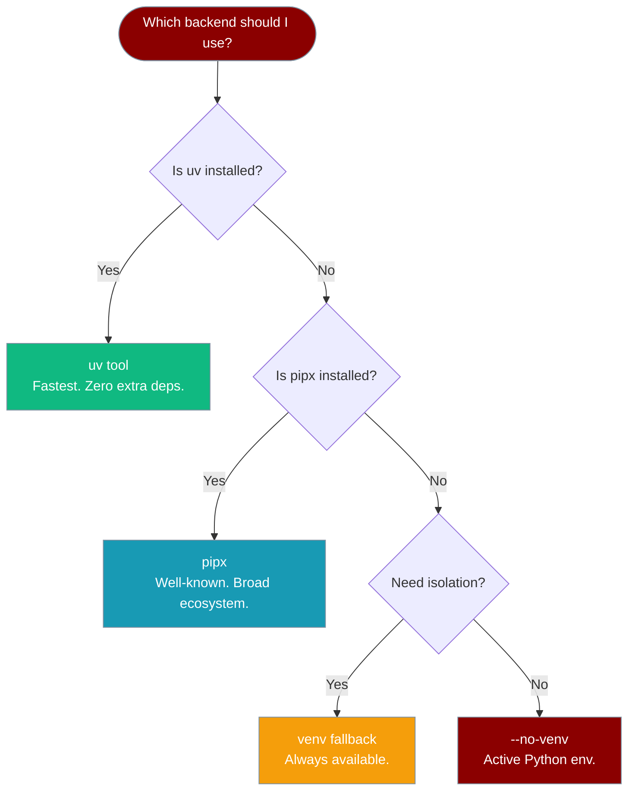

PraisonAI's installer keeps the CLI isolated from your global Python environment. Pick the backend that fits your workflow.



## Backend Comparison

| | **uv tool** | **pipx** | **venv** | **--no-venv** |
|---|---|---|---|---|
| **Isolation** | ✅ Isolated | ✅ Isolated | ✅ Isolated | ❌ None |
| **Persistence** | ✅ Permanent | ✅ Permanent | ✅ Permanent | ✅ Permanent |
| **Speed** | ⚡ Fastest | 🐢 Slower | 🐢 Slower | ⚡ Fast |
| **PATH management** | `uv tool update-shell` | `pipx ensurepath` | `~/.local/bin` shim | Depends on active env |
| **Extra install** | [uv](https://github.com/astral-sh/uv) | [pipx](https://pipx.pypa.io/) | None | None |
| **Who manages env** | uv | pipx | Installer | You |
| **When to pick** | You use uv already | You use pipx already | No uv/pipx available | CI, Docker, scripts |

## Using Each Backend

### uv tool (recommended)

`uv tool install` creates a fully isolated environment managed by uv. The fastest option.

```bash
# Auto-detected if uv is installed
curl -fsSL https://praison.ai/install.sh | bash

# Force explicitly
curl -fsSL https://praison.ai/install.sh | bash -s -- --backend uv

# Or directly (no installer needed)
uv tool install praisonai
```

### pipx

`pipx install` creates an isolated venv managed by pipx. Familiar to Python developers.

```bash
# Auto-detected if uv is absent and pipx is installed
curl -fsSL https://praison.ai/install.sh | bash

# Force explicitly
curl -fsSL https://praison.ai/install.sh | bash -s -- --backend pipx

# Or directly (no installer needed)
pipx install praisonai
```

### venv (fallback)

The installer creates `~/.praisonai/venv` and symlinks `~/.local/bin/praisonai → venv/bin/praisonai`.

```bash
# Auto-selected when uv and pipx are absent
curl -fsSL https://praison.ai/install.sh | bash

# Force explicitly
curl -fsSL https://praison.ai/install.sh | bash -s -- --backend venv

# Custom install directory
curl -fsSL https://praison.ai/install.sh | bash -s -- --backend venv --install-dir /opt/praisonai
```

### No isolation (--no-venv)

Installs directly into the active Python environment. Useful in Docker, CI, or when you manage your own venv.

```bash
curl -fsSL https://praison.ai/install.sh | bash -s -- --no-venv

# Or directly
pip install "praisonai[all]"
```

### uvx (zero-install one-shot)

Runs PraisonAI in a temporary environment without a persistent install. Good for one-off commands.

```bash
uvx praisonai "2+2"
```

## Environment Variable

Override the backend without changing the install command:

```bash
PRAISONAI_BACKEND=pipx curl -fsSL https://praison.ai/install.sh | bash
PRAISONAI_BACKEND=venv curl -fsSL https://praison.ai/install.sh | bash
PRAISONAI_BACKEND=uv   curl -fsSL https://praison.ai/install.sh | bash
```

Valid values: `uv`, `pipx`, `venv`, `system`, `auto` (default).

## PATH Management

All backends expose the CLI at `~/.local/bin/praisonai`. The installer appends an idempotent block to your shell rc (unless `--no-modify-path`):

```bash
# >>> PraisonAI PATH >>>
export PATH="$HOME/.local/bin:$PATH"
# <<< PraisonAI PATH <<<
```

Fish shell variant:
```fish
# >>> PraisonAI PATH >>>
set -gx PATH $HOME/.local/bin $PATH
# <<< PraisonAI PATH <<<
```

Skip PATH modification:
```bash
curl -fsSL https://praison.ai/install.sh | bash -s -- --no-modify-path
# or
PRAISONAI_NO_MODIFY_PATH=1 curl -fsSL https://praison.ai/install.sh | bash
```

## Uninstalling

<Tabs>
  <Tab title="uv">
    ```bash
    uv tool uninstall praisonai
    ```
  </Tab>
  <Tab title="pipx">
    ```bash
    pipx uninstall praisonai
    ```
  </Tab>
  <Tab title="venv">
    ```bash
    rm -rf ~/.praisonai
    rm -f ~/.local/bin/praisonai
    ```
  </Tab>
</Tabs>

---

## Related

<CardGroup cols={2}>
  <Card title="Quick Install" icon="bolt" href="/docs/install/quickstart">
    One-liner install command
  </Card>
  <Card title="Installer Internals" icon="gear" href="/docs/install/installer">
    Full install.sh reference
  </Card>
</CardGroup>
