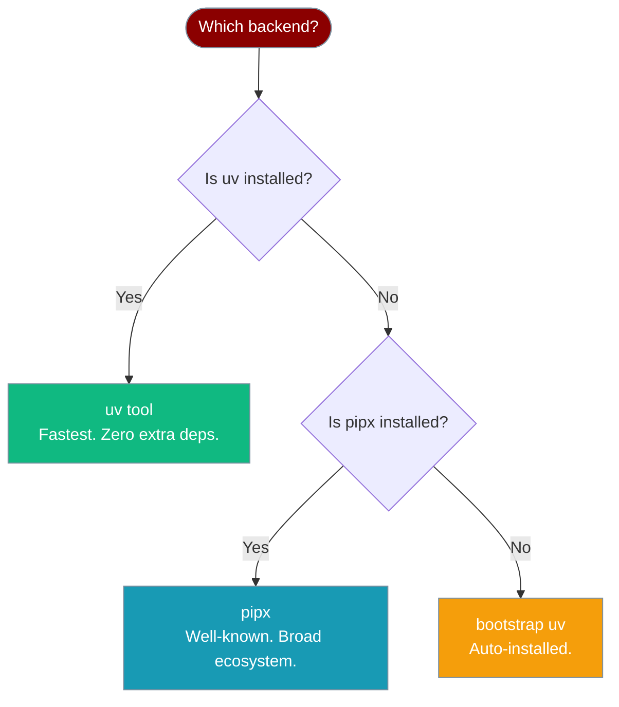

PraisonAI's installer keeps the CLI isolated from your global Python environment. It picks `uv tool` or `pipx`, bootstrapping `uv` when neither is present.



## Backend Comparison

| | **uv tool** | **pipx** |
|---|---|---|
| **Isolation** | ✅ Isolated | ✅ Isolated |
| **Persistence** | ✅ Permanent | ✅ Permanent |
| **Speed** | ⚡ Fastest | 🐢 Slower |
| **PATH management** | `~/.local/bin` shim | `pipx ensurepath` + `~/.local/bin` shim |
| **Extra install** | [uv](https://github.com/astral-sh/uv) (auto-bootstrapped) | [pipx](https://pipx.pypa.io/) |
| **Who manages env** | uv | pipx |
| **When it's picked** | `uv` present, or neither (bootstrapped) | `uv` absent, `pipx` present |

## Using Each Backend

### uv tool (recommended)

`uv tool install` creates a fully isolated environment managed by uv. The fastest option, and the installer auto-bootstraps `uv` when neither `uv` nor `pipx` is present.

```bash
# Auto-detected if uv is installed (or bootstrapped if neither exists)
curl -fsSL https://raw.githubusercontent.com/MervinPraison/PraisonAI/main/install.sh | sh

# Force explicitly
PRAISONAI_INSTALLER=uv curl -fsSL https://raw.githubusercontent.com/MervinPraison/PraisonAI/main/install.sh | sh

# Or directly (no installer needed)
uv tool install praisonai
```

### pipx

`pipx install` creates an isolated venv managed by pipx. Familiar to Python developers.

```bash
# Auto-detected if uv is absent and pipx is installed
curl -fsSL https://raw.githubusercontent.com/MervinPraison/PraisonAI/main/install.sh | sh

# Force explicitly
PRAISONAI_INSTALLER=pipx curl -fsSL https://raw.githubusercontent.com/MervinPraison/PraisonAI/main/install.sh | sh

# Or directly (no installer needed)
pipx install praisonai
```

### uvx (zero-install one-shot)

Runs PraisonAI in a temporary environment without a persistent install. Good for one-off commands.

```bash
uvx praisonai "2+2"
```

## Environment Variable

Force a manager without changing the install command:

```bash
PRAISONAI_INSTALLER=pipx curl -fsSL https://raw.githubusercontent.com/MervinPraison/PraisonAI/main/install.sh | sh
PRAISONAI_INSTALLER=uv   curl -fsSL https://raw.githubusercontent.com/MervinPraison/PraisonAI/main/install.sh | sh
```

Valid values: `uv`, `pipx`. `pipx` errors if not installed; `uv` bootstraps itself when missing.

## PATH Management

Both backends expose the CLI at `~/.local/bin/praisonai`. The installer appends an idempotent block (grepped before writing) to your shell rc:

- **zsh** → `~/.zshrc`
- **bash** → `~/.bashrc` **and** the applicable login profile (`~/.bash_profile` → `~/.bash_login` → `~/.profile`)
- **fish** → `~/.config/fish/config.fish`
- anything else → `~/.profile`

```bash
# bash / zsh
export PATH="$HOME/.local/bin:$PATH"
```

```fish
# fish (fish_add_path when available, POSIX-safe fallback otherwise)
if type -q fish_add_path
    fish_add_path $HOME/.local/bin
else
    set -gx PATH $HOME/.local/bin $PATH
end
```

## Uninstalling

Use the built-in self-management command — it removes any managed install via the detected manager.

<Card title="praisonai uninstall" icon="trash" href="/docs/features/praisonai-uninstall">
  `praisonai uninstall` (or `--yes` for CI) removes the managed install cleanly
</Card>

---

## Related

<CardGroup cols={2}>
  <Card title="Quick Install" icon="bolt" href="/docs/install/quickstart">
    One-liner install command
  </Card>
  <Card title="Installer Internals" icon="gear" href="/docs/install/installer">
    Full install.sh reference
  </Card>
  <Card title="Upgrade" icon="arrow-up" href="/docs/features/praisonai-upgrade">
    Update the CLI in place
  </Card>
  <Card title="Uninstall" icon="trash" href="/docs/features/praisonai-uninstall">
    Remove the managed install
  </Card>
</CardGroup>
