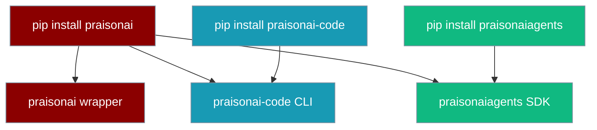

<RequestExample>
```bash pip
pip install praisonai
```
```bash npm
npm install praisonai
```
```bash One-Liner
curl -fsSL https://praison.ai/install.sh | bash
```
</RequestExample>

<Info>
**Works everywhere. Installs everything. You're welcome. 🚀**
</Info>

# Installing PraisonAI

Follow these steps to set up PraisonAI in your development environment.
<Tabs>
  <Tab title="Code">

    <Steps>
      <Step title="Create Virtual Environment (Optional)">
        First, create and activate a virtual environment:
        <CodeGroup>
        ```bash Mac/Linux
        python -m venv praisonai-env
        source praisonai-env/bin/activate
        ```

        ```bash Windows
        python -m venv praisonai-env
        .\praisonai-env\Scripts\activate
        ```
        </CodeGroup>
      </Step>

      <Step title="Install PraisonAI Agents">
        Install the core PraisonAI Package:
        ```bash Terminal
        pip install praisonaiagents
        ```
      </Step>

      <Step title="Configure Environment">
        Set your API key as an environment variable in your terminal. PraisonAI auto-detects whichever provider credential is present, so you only need to set the key for the provider you use:

  ```bash OpenAI
  export OPENAI_API_KEY=your_openai_key
  ```

  ```bash Anthropic
  export ANTHROPIC_API_KEY=your_anthropic_key
  ```

  ```bash Gemini
  export GEMINI_API_KEY=your_gemini_key
  ```

  ```bash Groq
  export GROQ_API_KEY=your_groq_key
  ```

  ```bash Ollama
  export OLLAMA_HOST=http://localhost:11434
  ```

<Note>
If you only set `ANTHROPIC_API_KEY` (or `GEMINI_API_KEY`, `GOOGLE_API_KEY`, `GROQ_API_KEY`, `COHERE_API_KEY`, or `OLLAMA_HOST`), `praisonai run` picks the matching provider's default model automatically — no `--model` flag required. See [Provider Auto-Detection](/docs/models#provider-auto-detection-no-config-first-run) for the full lookup table.
</Note>
      </Step>

    </Steps>
  </Tab>
  <Tab title="No Code">

    <Steps>
        <Step title="Create Virtual Environment (Optional)">
        First, create and activate a virtual environment:
        <CodeGroup>
        ```bash Mac/Linux
        python -m venv praisonai-env
        source praisonai-env/bin/activate
        ```

        ```bash Windows
        python -m venv praisonai-env
        .\praisonai-env\Scripts\activate
        ```
        </CodeGroup>
      </Step>
        <Step title="Install PraisonAI">
            Install the PraisonAI package:
            ```bash
            pip install praisonai
            ```
        </Step>
        <Step title="Set API Key">
            Set your API key for the provider you want to use. PraisonAI auto-detects whichever credential is present:
            ```bash
            export OPENAI_API_KEY=your_openai_key
            ```
            Use Anthropic, Gemini, Groq, or Ollama instead? Just set that provider's key and `praisonai run` picks the right model automatically. See [Provider Auto-Detection](/docs/models#provider-auto-detection-no-config-first-run).
        </Step>
    </Steps>
  </Tab>
  <Tab title="JavaScript">
    <Steps>
        <Step title="Install PraisonAI">
            Install the PraisonAI package:
            ```bash
            npm install praisonai
            ```
        </Step>
        <Step title="Set API Key">
            Set your OpenAI API key as an environment variable in your terminal:
            ```bash
            export OPENAI_API_KEY=your_openai_key
            ```
        </Step>
    </Steps>
  </Tab>
  <Tab title="TypeScript">
    <Steps>
        <Step title="Install PraisonAI">
            Install the PraisonAI package:
            ```bash
            npm install praisonai
            ```
        </Step>
        <Step title="Set API Key">
            Set your OpenAI API key as an environment variable in your terminal:
            ```bash
            export OPENAI_API_KEY=your_openai_key
            ```
        </Step>
    </Steps>
  </Tab>
</Tabs>

Generate your OpenAI API key from [OpenAI](https://platform.openai.com/api-keys)
You can also use other LLM providers like Anthropic, Google, etc. Please refer to the [Models](/models) for more information.

## Next Steps

<CardGroup cols={2}>
  <Card
    title="Quick Start Guide"
    icon="bolt"
    href="/docs/quickstart"
  >
    Build your first AI agent
  </Card>
  <Card
    title="API Reference"
    icon="code"
    href="/docs/api/praisonaiagents/index"
  >
    Explore the API documentation
  </Card>
</CardGroup>

---

## Quick Install

<Note>
The one-liner installer uses an isolated backend (`uv tool` → `pipx` → venv fallback) and exposes `praisonai` via a `~/.local/bin/praisonai` shim — your global Python environment is untouched. See [Isolation Backends](/docs/install/isolation-backends) for details.
</Note>

<Tabs>
  <Tab title="macOS/Linux">
    ```bash
    curl -fsSL https://praison.ai/install.sh | bash
    ```
  </Tab>
  <Tab title="Windows">
    ```powershell
    iwr -useb https://praison.ai/install.ps1 | iex
    ```
    
    <Note>
    **Windows terminals:** PraisonAI automatically detects legacy Windows code pages (CP1252, CP850, etc.) and falls back to ASCII-safe output. For full emoji and box-drawing rendering, switch your terminal to UTF-8:

    <CodeGroup>
    ```powershell PowerShell
    $env:PYTHONIOENCODING='utf-8'
    chcp 65001
    ```
    ```cmd CMD
    set PYTHONIOENCODING=utf-8
    chcp 65001
    ```
    </CodeGroup>
    </Note>
  </Tab>
</Tabs>

<Check>
The installer automatically detects your OS, picks the best isolation backend (`uv tool` → `pipx` → venv fallback), installs Python if needed, and drops a `~/.local/bin/praisonai` shim on your PATH.
</Check>

<Note>
  **Requirements**
  
  - Python 3.10 or higher (auto-installed if missing)
  - macOS, Linux, or Windows
</Note>

---

## Package Structure

PraisonAI ships as three separate PyPI packages. Understanding which to install avoids surprises at runtime.



| Install command | What you get | Agentic CLI (`run`, `chat`, `code`, …) | Bot / gateway / pairing |
|-----------------|--------------|----------------------------------------|-------------------------|
| `pip install praisonai` | Wrapper + code + agents | ✅ Full | ✅ Yes |
| `pip install praisonai-code` | Terminal-native agent CLI | ⚠️ Partial — wrapper commands hidden at runtime | ❌ No |
| `pip install praisonaiagents` | Core SDK — Python API only | ❌ No CLI | N/A |

<Warning>
**`praisonai-code` standalone is not yet production-ready.** Running `pip install praisonai-code` without `praisonai` hides wrapper-required commands (`bot`, `gateway`, `pairing`, …) and leaves ~170 reverse imports unsatisfied. Use `pip install praisonai` for production deployments. Standalone `praisonai-code` support is planned for a future release (C7).
</Warning>

### PyPI publish order

Packages are published in dependency order:

```
1. praisonaiagents  →  2. praisonai-code  →  3. praisonai
```

If you pin versions, ensure all three packages resolve to the same release cycle.