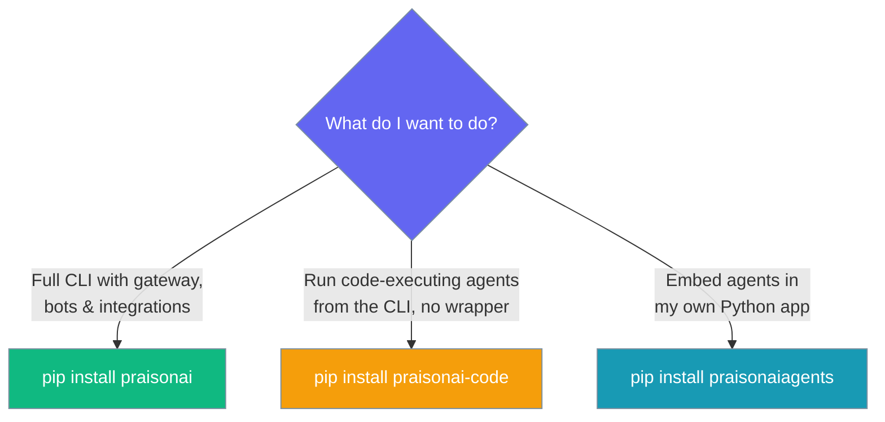
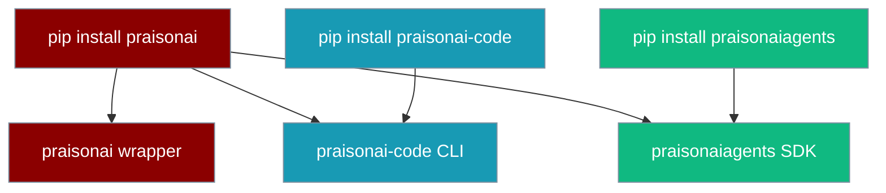

<RequestExample>
```bash Full (wrapper)
pip install praisonai
```
```bash Code (runtime)
pip install praisonai-code
```
```bash Agents (SDK)
pip install praisonaiagents
```
```bash npm
npm install praisonai
```
```bash One-Liner
curl -fsSL https://praison.ai/install.sh | bash
```
</RequestExample>

<Info>
**Three packages, one ecosystem. Pick the one that fits.** `pip install praisonai` pulls everything. Lighter options below.
</Info>

<CardGroup cols={2}>
  <Card title="Terminal-only (smaller)" icon="terminal" href="/docs/features/praisonai-code-cli">
    `pip install praisonai-code` — agentic CLI without gateway or bots
  </Card>
  <Card title="Full (default)" icon="box" href="/docs/installation">
    `pip install praisonai` — wrapper, code runtime, and SDK together
  </Card>
</CardGroup>

<Note>
`pip install praisonai` transitively installs `praisonai-code` and `praisonaiagents`. You do not need to install them separately.
</Note>

# Installing PraisonAI

PraisonAI is published as three PyPI packages. Pick the one that matches what you want to do:



<Tabs>
  <Tab title="Full (praisonai)">

    The complete package — CLI, gateway, bots, integrations, YAML-driven multi-bot orchestration. Pulls `praisonai-code` and `praisonaiagents` automatically.

<Note>
For gateway hot reload (event-driven `gateway.yaml` watching via `watchdog`), install the gateway extra: `pip install "praisonai[gateway]"`.
</Note>

    <Steps>
      <Step title="Create Virtual Environment (Optional)">
        <CodeGroup>
        ```bash Mac/Linux
        python -m venv praisonai-env
        source praisonai-env/bin/activate
        ```

        ```bash Windows
        python -m venv praisonai-env
        .\praisonai-env\Scripts\activate
        ```
        </CodeGroup>
      </Step>

      <Step title="Install">
        ```bash Terminal
        pip install praisonai
        ```
      </Step>

      <Step title="Configure Environment">
        Set your API key. PraisonAI auto-detects whichever provider credential is present:

  ```bash OpenAI
  export OPENAI_API_KEY=your_openai_key
  ```

  ```bash Anthropic
  export ANTHROPIC_API_KEY=your_anthropic_key
  ```

  ```bash Gemini
  export GEMINI_API_KEY=your_gemini_key
  ```

  ```bash Groq
  export GROQ_API_KEY=your_groq_key
  ```

  ```bash Ollama
  export OLLAMA_HOST=http://localhost:11434
  ```

<Note>
If you only set `ANTHROPIC_API_KEY` (or `GEMINI_API_KEY`, `GOOGLE_API_KEY`, `GROQ_API_KEY`, `COHERE_API_KEY`, or `OLLAMA_HOST`), `praisonai run` picks the matching provider's default model automatically — no `--model` flag required. See [Provider Auto-Detection](/docs/models#provider-auto-detection-no-config-first-run) for the full lookup table.
</Note>
      </Step>

    </Steps>
  </Tab>
  <Tab title="Code (praisonai-code)">

    The standalone agent runtime — `run`, `chat`, `code`, and the full CLI backend, without the gateway/bot integrations. Depends only on `praisonaiagents`.

    <Steps>
      <Step title="Create Virtual Environment (Optional)">
        <CodeGroup>
        ```bash Mac/Linux
        python -m venv praisonai-env
        source praisonai-env/bin/activate
        ```

        ```bash Windows
        python -m venv praisonai-env
        .\praisonai-env\Scripts\activate
        ```
        </CodeGroup>
      </Step>

      <Step title="Install">
        ```bash Terminal
        pip install praisonai-code
        ```
      </Step>

      <Step title="Configure Environment">
        ```bash
        export OPENAI_API_KEY=your_openai_key
        ```
        Any supported provider key works. See [Provider Auto-Detection](/docs/models#provider-auto-detection-no-config-first-run).
      </Step>

      <Step title="Run an agent">
        ```python
        from praisonaiagents import Agent

        agent = Agent(name="assistant", instructions="Be helpful")
        response = agent.start("Summarise the top AI news today")
        print(response)
        ```
      </Step>
    </Steps>
  </Tab>
  <Tab title="Agents (SDK only)">

    The pure Python SDK — no CLI, no gateway, no heavy dependencies. Import directly in your own application.

    <Steps>
      <Step title="Create Virtual Environment (Optional)">
        <CodeGroup>
        ```bash Mac/Linux
        python -m venv praisonai-env
        source praisonai-env/bin/activate
        ```

        ```bash Windows
        python -m venv praisonai-env
        .\praisonai-env\Scripts\activate
        ```
        </CodeGroup>
      </Step>

      <Step title="Install">
        ```bash Terminal
        pip install praisonaiagents
        ```
      </Step>

      <Step title="Configure Environment">
        ```bash
        export OPENAI_API_KEY=your_openai_key
        ```
      </Step>

      <Step title="Use in your app">
        ```python
        from praisonaiagents import Agent

        agent = Agent(name="assistant", instructions="Be helpful")
        response = agent.start("Hello!")
        print(response)
        ```
      </Step>
    </Steps>
  </Tab>
  <Tab title="No Code">

    <Steps>
        <Step title="Create Virtual Environment (Optional)">
        <CodeGroup>
        ```bash Mac/Linux
        python -m venv praisonai-env
        source praisonai-env/bin/activate
        ```

        ```bash Windows
        python -m venv praisonai-env
        .\praisonai-env\Scripts\activate
        ```
        </CodeGroup>
      </Step>
        <Step title="Install PraisonAI">
            ```bash
            pip install praisonai
            ```
        </Step>
        <Step title="Set API Key">
            Set your API key for the provider you want to use. PraisonAI auto-detects whichever credential is present:
            ```bash
            export OPENAI_API_KEY=your_openai_key
            ```
            Use Anthropic, Gemini, Groq, or Ollama instead? Just set that provider's key and `praisonai run` picks the right model automatically. See [Provider Auto-Detection](/docs/models#provider-auto-detection-no-config-first-run).
        </Step>
    </Steps>
  </Tab>
  <Tab title="JavaScript">
    <Steps>
        <Step title="Install PraisonAI">
            ```bash
            npm install praisonai
            ```
        </Step>
        <Step title="Set API Key">
            ```bash
            export OPENAI_API_KEY=your_openai_key
            ```
        </Step>
    </Steps>
  </Tab>
  <Tab title="TypeScript">
    <Steps>
        <Step title="Install PraisonAI">
            ```bash
            npm install praisonai
            ```
        </Step>
        <Step title="Set API Key">
            ```bash
            export OPENAI_API_KEY=your_openai_key
            ```
        </Step>
    </Steps>
  </Tab>
</Tabs>

<Note>
All existing `praisonai` CLI verbs (`run`, `chat`, `code`, `gateway`, `bot`, …) continue to work unchanged — the wrapper routes them through the `praisonai-code` runtime. You do not need to change any scripts.
</Note>

## Package dependency chain


Each layer depends on the one to its left. Installing `praisonai` pulls all three; installing `praisonai-code` pulls only `praisonaiagents`; installing `praisonaiagents` has no PraisonAI dependencies.

Generate your OpenAI API key from [OpenAI](https://platform.openai.com/api-keys)
You can also use other LLM providers like Anthropic, Google, etc. Please refer to the [Models](/models) for more information.

## Next Steps

<CardGroup cols={2}>
  <Card
    title="Quick Start Guide"
    icon="bolt"
    href="/docs/quickstart"
  >
    Build your first AI agent
  </Card>
  <Card
    title="API Reference"
    icon="code"
    href="/docs/api/praisonaiagents/index"
  >
    Explore the API documentation
  </Card>
</CardGroup>

---

## Quick Install

<Note>
The one-liner installer uses an isolated backend (`uv tool` → `pipx` → venv fallback) and exposes `praisonai` via a `~/.local/bin/praisonai` shim — your global Python environment is untouched. See [Isolation Backends](/docs/install/isolation-backends) for details.
</Note>

<Tabs>
  <Tab title="macOS/Linux">
    ```bash
    curl -fsSL https://praison.ai/install.sh | bash
    ```
  </Tab>
  <Tab title="Windows">
    ```powershell
    iwr -useb https://praison.ai/install.ps1 | iex
    ```
    
    <Note>
    **Windows terminals:** PraisonAI automatically detects legacy Windows code pages (CP1252, CP850, etc.) and falls back to ASCII-safe output. For full emoji and box-drawing rendering, switch your terminal to UTF-8:

    <CodeGroup>
    ```powershell PowerShell
    $env:PYTHONIOENCODING='utf-8'
    chcp 65001
    ```
    ```cmd CMD
    set PYTHONIOENCODING=utf-8
    chcp 65001
    ```
    </CodeGroup>
    </Note>
  </Tab>
</Tabs>

<Check>
The installer automatically detects your OS, picks the best isolation backend (`uv tool` → `pipx` → venv fallback), installs Python if needed, and drops a `~/.local/bin/praisonai` shim on your PATH.
</Check>

<Note>
  **Requirements**
  
  - Python 3.10 or higher (auto-installed if missing)
  - macOS, Linux, or Windows
</Note>

---

## Package Structure

PraisonAI ships as three separate PyPI packages. Understanding which to install avoids surprises at runtime.



| Install command | What you get | Agentic CLI (`run`, `chat`, `code`, …) | Bot / gateway / pairing |
|-----------------|--------------|----------------------------------------|-------------------------|
| `pip install praisonai` | Wrapper + code + agents | ✅ Full | ✅ Yes |
| `pip install praisonai-code` | Terminal-native agent CLI | ✅ Hot path — `run`, `chat`, `code` | ❌ No (graceful skip) |
| `pip install praisonaiagents` | Core SDK — Python API only | ❌ No CLI | N/A |

<Note>
**Standalone `pip install praisonai-code` is supported for the code/run/chat hot path as of PraisonAI 4.6.108+ (C7.1).** Wrapper-only features (`bot`, `gateway`, `pairing`, framework adapters, YAML `--framework crewai/autogen`) require `pip install praisonai`, but they now **degrade gracefully** rather than raising — doctor checks skip with a "wrapper not installed" reason, and features like the recipe creator fall back to defaults.
</Note>

### C7.1 invocation matrix

| Invocation | Standalone (`pip install praisonai-code`) | Full (`pip install praisonai`) |
|------------|-------------------------------------------|--------------------------------|
| `praisonai-code run "prompt"` | ✅ Yes | ✅ Yes |
| `praisonai-code run --help` | ✅ Yes | ✅ Yes |
| `praisonai run "prompt"` | ❌ N/A (needs wrapper meta) | ✅ Yes |
| `praisonai run --file agents.yaml --framework crewai` | ❌ Needs wrapper adapters | ✅ Yes |
| `praisonai agents.yaml` (legacy) | ❌ No | ✅ Yes |
| `praisonai gateway …` / `praisonai bot …` | ❌ No | ✅ Yes |
| `python -m praisonai_code.cli.main --help` | ✅ Help only (framework paths need wrapper) | ✅ Yes |

For the full three-tier boundary model and the `_wrapper_bridge` API, see [Package Boundaries (C7.1)](/docs/sdk/praisonai-code#package-boundaries-c71).

### PyPI publish order

Packages are published in dependency order:

```
1. praisonaiagents  →  2. praisonai-code  →  3. praisonai
```

If you pin versions, ensure all three packages resolve to the same release cycle.