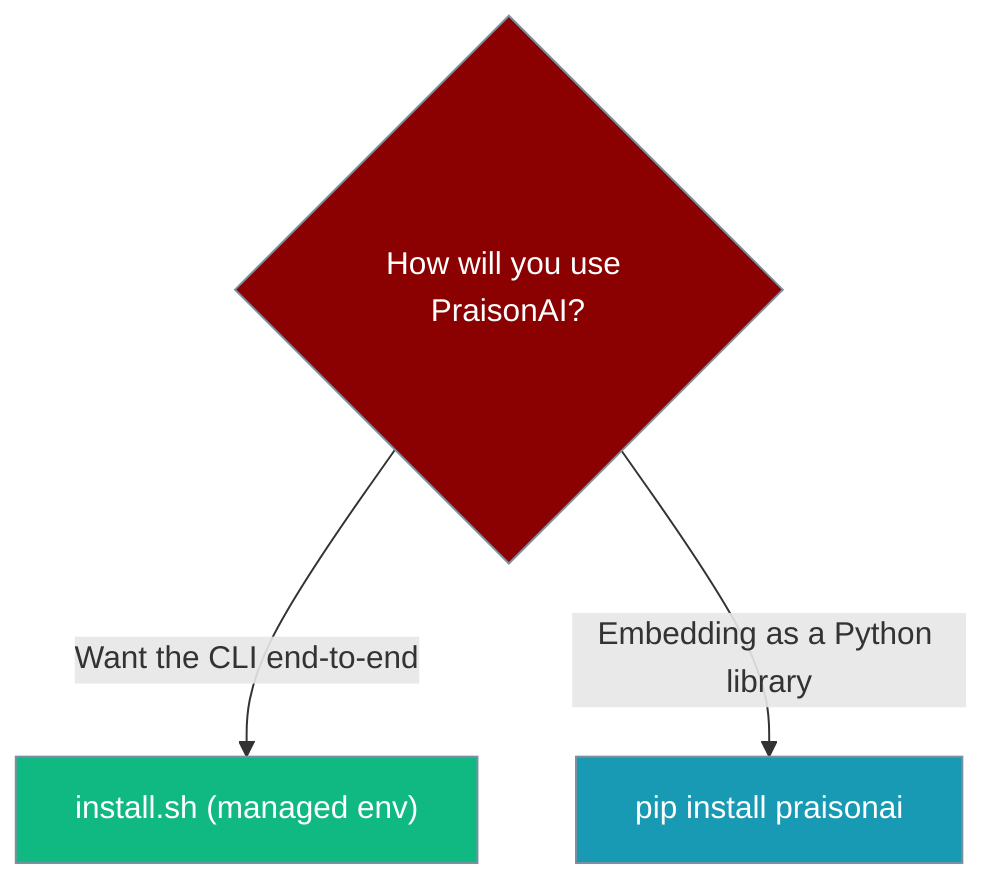
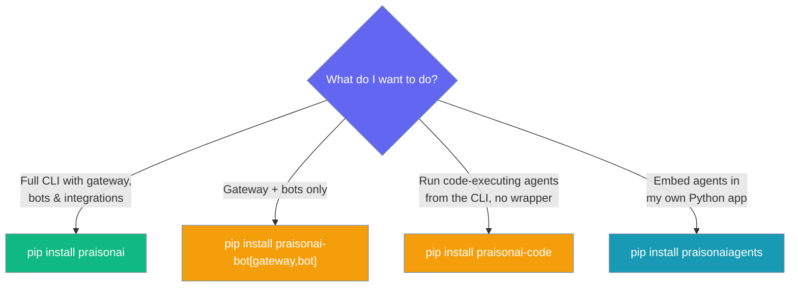
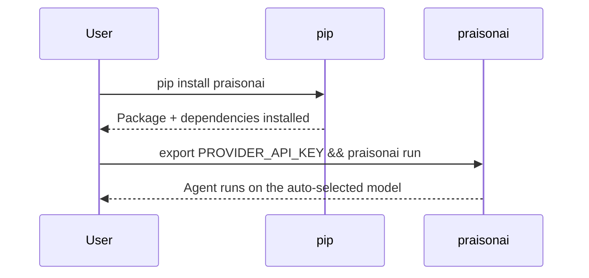
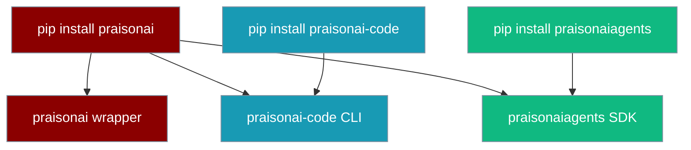

Install PraisonAI, set one provider key, and run an Agent in your own app.

**Fastest start — one line, no Python knowledge needed:**

```bash
curl -fsSL https://raw.githubusercontent.com/MervinPraison/PraisonAI/main/install.sh | sh
```

<Note>
The one-liner installs a managed, isolated CLI and adds `praisonai` to your PATH. Keep it current with `praisonai upgrade` and remove it with `praisonai uninstall` — see [Upgrade & Uninstall](/docs/features/upgrade-uninstall). Prefer `pip`? That still works exactly as before — pick a package below.
</Note>

```python
from praisonaiagents import Agent

agent = Agent(instructions="Be helpful")
agent.start("Summarise the top AI news today")
```

<RequestExample>
```bash Bot (gateway + channels)
pip install "praisonai-bot[gateway,bot]"
```
```bash Full (wrapper)
pip install praisonai
```
```bash Code (runtime)
pip install praisonai-code
```
```bash Agents (SDK)
pip install praisonaiagents
```
```bash npm
npm install praisonai
```
```bash One-Liner
curl -fsSL https://raw.githubusercontent.com/MervinPraison/PraisonAI/main/install.sh | sh
```
</RequestExample>

<Info>
**Four packages, one ecosystem.** `pip install praisonai` pulls code, bot, and SDK. Lighter options below.
</Info>

<CardGroup cols={2}>
  <Card title="Terminal-only (smaller)" icon="terminal" href="/docs/features/praisonai-code-cli">
    `pip install praisonai-code` — agentic CLI without gateway or bots
  </Card>
  <Card title="Bots + gateway only" icon="comments" href="/docs/sdk/praisonai-bot/index">
    `pip install "praisonai-bot[gateway,bot]"` — channel runtime without the wrapper
  </Card>
  <Card title="Full (default)" icon="box" href="/docs/installation">
    `pip install praisonai` — wrapper, code, bot, and SDK together
  </Card>
</CardGroup>

<Note>
`pip install praisonai` transitively installs `praisonai-code`, `praisonai-bot`, and `praisonaiagents`. You do not need to install them separately.
</Note>

## One-line installer (recommended for CLI users)

If you want the CLI end-to-end, the one-line installer provisions an isolated managed environment (`uv tool` → `pipx`) and wires your `PATH` — no changes to your global Python:

```bash
curl -fsSL https://raw.githubusercontent.com/MervinPraison/PraisonAI/main/install.sh | sh
```

It is idempotent and safe to re-run. **`pip install praisonai` is untouched** — keep using it if you embed PraisonAI as a Python library.



**Environment-variable overrides:**

| Variable | Purpose |
|---|---|
| `PRAISONAI_VERSION=x.y.z` | Pin a specific version (default: latest) |
| `PRAISONAI_INSTALLER=uv\|pipx` | Force a specific tool manager |
| `PRAISONAI_NONINTERACTIVE=1` | Never prompt — suitable for CI |

After installing, configure a provider key:

```bash
praisonai setup
```

<Tip>
Keep the managed install current with [`praisonai upgrade`](/docs/cli/upgrade), or remove it cleanly with [`praisonai uninstall`](/docs/cli/uninstall).
</Tip>

# Installing PraisonAI

PraisonAI is published as **four** PyPI packages. Pick the one that matches what you want to do:



<Tabs>
  <Tab title="Full (praisonai)">

    The complete package — CLI, gateway, bots, integrations, YAML-driven multi-bot orchestration. Pulls `praisonai-code` and `praisonaiagents` automatically.

<Note>
For gateway hot reload (event-driven `gateway.yaml` watching via `watchdog`), install the gateway extra: `pip install "praisonai[gateway]"`.

**`[claw]` extra:** `pip install "praisonai[claw]"` installs the full wrapper plus `praisonai-bot[gateway,bot]` — the WebSocket gateway and Telegram/Discord/Slack channel bots. Use this when you want the full wrapper and all channel runtime features in one command. For gateway + bots **without** the wrapper, use `pip install "praisonai-bot[gateway,bot]"` directly (see [Standalone Bot Gateway](/docs/features/standalone-bot-gateway)).
</Note>

    <Steps>
      <Step title="Create Virtual Environment (Optional)">
        <CodeGroup>
        ```bash Mac/Linux
        python -m venv praisonai-env
        source praisonai-env/bin/activate
        ```

        ```bash Windows
        python -m venv praisonai-env
        .\praisonai-env\Scripts\activate
        ```
        </CodeGroup>
      </Step>

      <Step title="Install">
        ```bash Terminal
        pip install praisonai
        ```
      </Step>

      <Step title="Configure Environment">
        Set your API key. PraisonAI auto-detects whichever provider credential is present:

  ```bash OpenAI
  export OPENAI_API_KEY="${OPENAI_API_KEY:?Set OPENAI_API_KEY in your shell}"
  ```

  ```bash Anthropic
  export ANTHROPIC_API_KEY="${ANTHROPIC_API_KEY:?Set ANTHROPIC_API_KEY in your shell}"
  ```

  ```bash Gemini
  export GEMINI_API_KEY="${GEMINI_API_KEY:?Set GEMINI_API_KEY in your shell}"
  ```

  ```bash Groq
  export GROQ_API_KEY="${GROQ_API_KEY:?Set GROQ_API_KEY in your shell}"
  ```

  ```bash Ollama
  export OLLAMA_HOST=http://localhost:11434
  ```

<Note>
If you only set `ANTHROPIC_API_KEY` (or `GEMINI_API_KEY`, `GOOGLE_API_KEY`, `GROQ_API_KEY`, `COHERE_API_KEY`, or `OLLAMA_HOST`), `praisonai run` picks the matching provider's default model automatically — no `--model` flag required. See [Provider Auto-Detection](/docs/models#provider-auto-detection-no-config-first-run) for the full lookup table.
</Note>
      </Step>

    </Steps>
  </Tab>
  <Tab title="Code (praisonai-code)">

    The standalone agent runtime — `run`, `chat`, `code`, and the full CLI backend, without the gateway/bot integrations. Depends only on `praisonaiagents`.

    <Steps>
      <Step title="Create Virtual Environment (Optional)">
        <CodeGroup>
        ```bash Mac/Linux
        python -m venv praisonai-env
        source praisonai-env/bin/activate
        ```

        ```bash Windows
        python -m venv praisonai-env
        .\praisonai-env\Scripts\activate
        ```
        </CodeGroup>
      </Step>

      <Step title="Install">
        ```bash Terminal
        pip install praisonai-code
        ```
      </Step>

      <Step title="Configure Environment">
        ```bash
        export OPENAI_API_KEY="${OPENAI_API_KEY:?Set OPENAI_API_KEY in your shell}"
        ```
        Any supported provider key works. See [Provider Auto-Detection](/docs/models#provider-auto-detection-no-config-first-run).
      </Step>

      <Step title="Run an agent">
        ```python
        from praisonaiagents import Agent

        agent = Agent(name="assistant", instructions="Be helpful")
        response = agent.start("Summarise the top AI news today")
        print(response)
        ```
      </Step>
    </Steps>
  </Tab>
  <Tab title="Bot (praisonai-bot)">

    Standalone bots and gateway — no full wrapper. Depends on `praisonaiagents` only at PyPI level.

    <Steps>
      <Step title="Install">
        ```bash Terminal
        pip install "praisonai-bot[gateway,bot]"
        ```
      </Step>

      <Step title="Configure Environment">
        ```bash
        export OPENAI_API_KEY="${OPENAI_API_KEY:?Set OPENAI_API_KEY in your shell}"
        export TELEGRAM_BOT_TOKEN="${TELEGRAM_BOT_TOKEN:?Set TELEGRAM_BOT_TOKEN in your shell}"
        ```
      </Step>

      <Step title="Start gateway">
        ```bash Terminal
        praisonai-bot gateway start --host 127.0.0.1 --port 8765
        ```
      </Step>
    </Steps>

    See the [praisonai-bot SDK page](/docs/sdk/praisonai-bot/index) for Python API details.
  </Tab>
  <Tab title="Agents (SDK only)">

    The pure Python SDK — no CLI, no gateway, no heavy dependencies. Import directly in your own application.

    <Steps>
      <Step title="Create Virtual Environment (Optional)">
        <CodeGroup>
        ```bash Mac/Linux
        python -m venv praisonai-env
        source praisonai-env/bin/activate
        ```

        ```bash Windows
        python -m venv praisonai-env
        .\praisonai-env\Scripts\activate
        ```
        </CodeGroup>
      </Step>

      <Step title="Install">
        ```bash Terminal
        pip install praisonaiagents
        ```
      </Step>

      <Step title="Configure Environment">
        ```bash
        export OPENAI_API_KEY="${OPENAI_API_KEY:?Set OPENAI_API_KEY in your shell}"
        ```
      </Step>

      <Step title="Use in your app">
        ```python
        from praisonaiagents import Agent

        agent = Agent(name="assistant", instructions="Be helpful")
        response = agent.start("Hello!")
        print(response)
        ```
      </Step>
    </Steps>
  </Tab>
  <Tab title="No Code">

    <Steps>
        <Step title="Create Virtual Environment (Optional)">
        <CodeGroup>
        ```bash Mac/Linux
        python -m venv praisonai-env
        source praisonai-env/bin/activate
        ```

        ```bash Windows
        python -m venv praisonai-env
        .\praisonai-env\Scripts\activate
        ```
        </CodeGroup>
      </Step>
        <Step title="Install PraisonAI">
            ```bash
            pip install praisonai
            ```
        </Step>
        <Step title="Set API Key">
            Set your API key for the provider you want to use. PraisonAI auto-detects whichever credential is present:
            ```bash
            export OPENAI_API_KEY="${OPENAI_API_KEY:?Set OPENAI_API_KEY in your shell}"
            ```
            Use Anthropic, Gemini, Groq, or Ollama instead? Just set that provider's key and `praisonai run` picks the right model automatically. See [Provider Auto-Detection](/docs/models#provider-auto-detection-no-config-first-run).
        </Step>
    </Steps>
  </Tab>
  <Tab title="JavaScript">
    <Steps>
        <Step title="Install PraisonAI">
            ```bash
            npm install praisonai
            ```
        </Step>
        <Step title="Set API Key">
            ```bash
            export OPENAI_API_KEY="${OPENAI_API_KEY:?Set OPENAI_API_KEY in your shell}"
            ```
        </Step>
    </Steps>
  </Tab>
  <Tab title="TypeScript">
    <Steps>
        <Step title="Install PraisonAI">
            ```bash
            npm install praisonai
            ```
        </Step>
        <Step title="Set API Key">
            ```bash
            export OPENAI_API_KEY="${OPENAI_API_KEY:?Set OPENAI_API_KEY in your shell}"
            ```
        </Step>
    </Steps>
  </Tab>
</Tabs>

<Note>
All existing `praisonai` CLI verbs (`run`, `chat`, `code`, `gateway`, `bot`, …) continue to work unchanged — the wrapper routes them through the `praisonai-code` runtime. You do not need to change any scripts.
</Note>

## Package dependency chain


Each layer depends on the one to its left. Installing `praisonai` pulls all three; installing `praisonai-code` pulls only `praisonaiagents`; installing `praisonaiagents` has no PraisonAI dependencies.

Generate your OpenAI API key from [OpenAI](https://platform.openai.com/api-keys)
You can also use other LLM providers like Anthropic, Google, etc. Please refer to the [Models](/models) for more information.

## Which Install Do You Need?

<CardGroup cols={2}>
  <Card
    title="Terminal-only (smaller)"
    icon="terminal"
    href="/docs/features/praisonai-code-cli"
  >
    `pip install praisonai-code` — agentic CLI: run, chat, code, runtime. No bots or gateway.
  </Card>
  <Card
    title="Full (default)"
    icon="package"
    href="/docs/installation"
  >
    `pip install praisonai` — everything: bots, gateway, kanban, dashboard, and the agentic CLI.
  </Card>
</CardGroup>

<Note>
`pip install praisonai` transitively installs `praisonai-code` and `praisonaiagents`. You do not need to install them separately.
</Note>

## How It Works

Pip installs the package, you export one provider key, and the CLI or SDK resolves the matching model at run time.



## Best Practices

<AccordionGroup>
<Accordion title="Install only what you need">
Use `praisonaiagents` for a pure Python SDK, `praisonai-code` for the terminal runtime, and `praisonai` for the full wrapper with bots and gateway.
</Accordion>

<Accordion title="Use a virtual environment">
Create a `venv` before installing to keep PraisonAI isolated from your system Python.
</Accordion>

<Accordion title="Export keys, don't hard-code them">
Set `OPENAI_API_KEY` (or your provider's key) in your shell or `.env`. Never inline the raw value in code.
</Accordion>

<Accordion title="Skip --model on first runs">
PraisonAI auto-detects the provider from whichever key is present and picks a sensible default model.
</Accordion>
</AccordionGroup>

## Related

<CardGroup cols={2}>
  <Card title="Quick Start" icon="bolt" href="/docs/quickstart">
    Build your first AI agent.
  </Card>
  <Card title="Models" icon="brain" href="/docs/models">
    Choose a provider and model.
  </Card>
</CardGroup>

---

## Quick Install

<Note>
The one-liner installer uses an isolated tool manager (`uv tool` → `pipx` → bootstrap `uv`) and exposes `praisonai` via a `~/.local/bin/praisonai` shim — your global Python environment is untouched. See [Isolation Backends](/docs/install/isolation-backends) for details.
</Note>

<Tabs>
  <Tab title="macOS / Linux / WSL">
    ```bash
    curl -fsSL https://raw.githubusercontent.com/MervinPraison/PraisonAI/main/install.sh | sh
    ```
  </Tab>
  <Tab title="Windows">
    ```powershell
    iwr -useb https://praison.ai/install.ps1 | iex
    ```
    Installs `praisonai[all]` into `%USERPROFILE%\.praisonai\venv`, wires PATH, and runs `praisonai setup` on first install. See [Installer Internals](/docs/install/installer#install-ps1-windows) for parameters and env-var overrides.

    To install with specific extras only:
    ```powershell
    & ([scriptblock]::Create((iwr -useb https://praison.ai/install.ps1))) -Extras "ui,chat"
    ```

    Alternative (no installer): `pipx install praisonai` or `pip install "praisonai[all]"`.

    <Note>
    **Windows terminals:** PraisonAI automatically detects legacy Windows code pages (CP1252, CP850, etc.) and falls back to ASCII-safe output. For full emoji and box-drawing rendering, switch your terminal to UTF-8:

    <CodeGroup>
    ```powershell PowerShell
    $env:PYTHONIOENCODING='utf-8'
    chcp 65001
    ```
    ```cmd CMD
    set PYTHONIOENCODING=utf-8
    chcp 65001
    ```
    </CodeGroup>
    </Note>
  </Tab>
</Tabs>

<Check>
The installer detects your platform, picks a tool manager (`uv tool` → `pipx` → bootstrap `uv`), installs `praisonai` into an isolated environment, and drops a `~/.local/bin/praisonai` shim on your PATH.
</Check>

<Note>
  **Requirements**

  - Python 3.10 or higher
  - macOS, Linux, or WSL (the one-liner is POSIX; on Windows use `pipx`/`pip`)
</Note>

## Manage Your Install

<CardGroup cols={2}>
  <Card title="Upgrade" icon="arrow-up" href="/docs/features/praisonai-upgrade">
    `praisonai upgrade` — update the CLI in place, or `--check` for a newer version
  </Card>
  <Card title="Uninstall" icon="trash" href="/docs/features/praisonai-uninstall">
    `praisonai uninstall` — remove the managed install cleanly
  </Card>
</CardGroup>

---

## Package Structure

PraisonAI ships as three separate PyPI packages. Understanding which to install avoids surprises at runtime.



| Install command | What you get | Agentic CLI (`run`, `chat`, `code`, …) | Bot / gateway / pairing |
|-----------------|--------------|----------------------------------------|-------------------------|
| `pip install praisonai` | Wrapper + code + agents | ✅ Full | ✅ Yes |
| `pip install praisonai-code` | Terminal-native agent CLI + LLM runtime | ✅ Default `run "…"`, `run --output plain|verbose|silent|actions|json|stream|stream-json`, `daemon`, `doctor`, `config`, `version` — `chat` and `code` need the wrapper | ❌ No — needs `pip install praisonai` |
| `pip install praisonaiagents` | Core SDK — Python API only | ❌ No CLI | N/A |

<Note>
**Standalone `pip install praisonai-code` supports the actions/daemon path as of PraisonAI 4.6.123+ (C7 + C9 four-tier).** Use `praisonai-code run --output actions|json|stream|stream-json "your prompt"` for the standalone in-process `Agent` path, and `praisonai-code daemon start --background` (spawns `python -m praisonai_code.runtime`) for the warm runtime. `run --help`, `config`, `doctor`, and `version` also work standalone.
</Note>

<Note>
`chat` and `code` require the wrapper (`pip install praisonai`) and print a clear install hint if invoked standalone (for example, `Error: chat requires the praisonai wrapper. Install the full wrapper: pip install praisonai`). Default `run "prompt"` and all `--output` modes now route through the in-process `Agent` on a standalone install (PR #2853). Wrapper-only features (`bot`, `claw`, `dashboard`, `gateway`, `identity`, `kanban`, `onboard`, `pairing`, framework adapters, YAML `--framework crewai/autogen`) still require `pip install praisonai` — they degrade gracefully rather than raising raw import errors. See [Standalone LLM Modules](/docs/features/standalone-llm-modules) and the [praisonai-code CLI](/docs/features/praisonai-code-cli).
</Note>

<Note>
The stub command groups `agents`, `workflow`, `registry`, `memory`, `skills`, `hooks`, `rules`, `eval`, `package`, `templates`, `todo`, `research`, `commit`, and `call` show a single-line install hint (`<group> requires the full wrapper. Install the full wrapper: pip install praisonai`) and `exit 1` on standalone ([PR #2854](https://github.com/MervinPraison/PraisonAI/pull/2854)). Their native standalone-safe subcommands (`memory learn`, `skills bundle/check/eligible`, `eval list-judges`, `eval list`) are unaffected. See the [`praisonai-code` CLI reference](/docs/features/praisonai-code-cli#standalone-limits).
</Note>

### PyPI publish order

Packages are published in dependency order:

```
1. praisonaiagents  →  2. praisonai-code  →  3. praisonai
```

If you pin versions, ensure all three packages resolve to the same release cycle.

Since 4.6.104, `praisonai` pins `praisonai-code>=0.0.2`, so `pip install praisonai` always pulls a compatible runtime automatically. See [`praisonaiagents` SDK page](/docs/api/praisonaiagents/index) for the release-cycle notes.