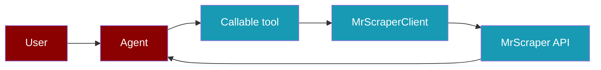

An Agent usually needs only a few MrScraper tools. Give it the four bounded callables that match its task, and call the remaining client methods from your application when you need account, scraper, or result management.

```python
from praisonaiagents import Agent
from praisonai_mrscraper import MrScraperClient, make_mrscraper_tools

with MrScraperClient() as client:
    read_web_page, extract_page, crawl_urls, search_google = make_mrscraper_tools(client)
    agent = Agent(instructions="Find and summarize public pages", tools=[read_web_page, search_google])
    agent.start("Summarize https://example.com")
```



## Contract and authentication

This page documents the [MrScraper n8n node's](https://github.com/mrscraper-com/n8n-nodes-mrscraper) 15 operations. The [installable Python example](https://github.com/MervinPraison/PraisonAI/tree/main/examples/tools/external/mrscraper) implements this contract. The n8n package itself is not a Python SDK. Install `praisonaiagents` and the example package as shown in the [quickstart](/docs/mrscraper).

| Host | Calls | Authentication |
| --- | --- | --- |
| `https://api.app.mrscraper.com` | Account, AI creation, rerun, Results | `x-api-token: $MRSCRAPER_API_TOKEN` |
| `https://sync.scraper.mrscraper.com` | Google SERP | `Authorization: Bearer <token>` and `x-api-token: <token>` to match the n8n credential |
| `https://api.mrscraper.com` | Rendered HTML | Query `token=<token>` and `x-api-token: <token>` to match the n8n credential |

All methods request JSON with `Accept: application/json` and send `Content-Type: application/json` when there is a JSON body. `http_timeout` on `MrScraperClient` is the Python request deadline; `page_timeout` and rerun `timeout` are MrScraper page controls. Path and query values are URL encoded. The client raises `MrScraperError` with a status code for HTTP errors and suppresses token-bearing URLs and server bodies in errors.

<Note>
  The n8n credential check calls `GET https://api.mrscraper.com/subscription-accounts`. This is distinct from the Account resource's `GET https://api.app.mrscraper.com/api/v1/subscription-accounts`, which `get_account_info()` implements.
</Note>

The n8n source does not define a uniform response schema for these operations. Methods therefore return the decoded JSON value, plain text when the response is not JSON, or `None` for an empty response. This sanitized response fixture is from the example package's mocked tests, **not** a promise about the live response:

```json
{"data":{"sample":true}}
```

For each operation below, a success returns that permissive value. HTTP failures raise `MrScraperError` and expose `status_code`; invalid local options raise `ValueError`. Do not assume a creation response is a completed result or infer a `scraperId`, `resultId`, job status, or polling schedule without inspecting your account's actual response.

## Account

### 1. Get Account Info

Get subscription and account information. `GET https://api.app.mrscraper.com/api/v1/subscription-accounts`; platform `x-api-token` auth. No operation parameters.

```python
client.get_account_info()
```

## Discovery

### 2. Crawl Website URLs

Create a Map AI scraper to discover URLs. `POST https://api.app.mrscraper.com/api/v1/scrapers-ai`; platform auth. This shares its server endpoint with operation 13.

| Python parameter | JSON body | Type | Required / default |
| --- | --- | --- | --- |
| `url` | `url` | string | Required |
| fixed | `graph` | string | `"map"` |
| `max_depth` | `maxDepth` | integer | 2 |
| `max_pages` | `maxPages` | integer | 50 |
| `limit` | `limit` | integer | 50 |
| `include_patterns`, `exclude_patterns` | `includePatterns`, `excludePatterns` | list of regex strings | Optional; joined with `|` |

```python
client.crawl_website_urls("https://example.com", max_depth=2)
```

### 3. Search Google SERP

Return Google search results as JSON or HTML. `POST https://sync.scraper.mrscraper.com/api/google/serp/v2/sync`; Bearer and credential header auth.

| Python parameter | JSON body | Type | Required / default |
| --- | --- | --- | --- |
| `query` | `query` | string | Required |
| `region`, `language` | same | string | `"us"`, `"en"` |
| `page` | `page` | integer | 1 |
| `format` | `format` | `"json"` or `"html"` | `"json"` |
| `render_js` | `renderJs` | boolean | `false` |

```python
client.search_google_serp("site:example.com example", format="json")
```

## Extraction

### 4. Extract Page by Prompt

Create a General AI scraper for a page. `POST https://api.app.mrscraper.com/api/v1/scrapers-ai`; platform auth. This is the same request family as operation 11.

| Python parameter | JSON body | Type | Required / default |
| --- | --- | --- | --- |
| fixed | `graph` | string | `"general"` |
| `url`, `message` | same | string | Both required |
| `mode` | `mode` | `"Super"` or `"Cheap"` | `"Super"` |
| `proxy_country` | `proxyCountry` | string | Optional |
| `output_schema` | Appended to `message` | JSON object | Optional; not a separate API field |

```python
client.extract_page_by_prompt("https://example.com", "Extract the main heading")
```

### 5. Extract Listings and Paginated Content

Create a Listing AI scraper. `POST https://api.app.mrscraper.com/api/v1/scrapers-ai`; platform auth. This is the same request family as operation 12.

| Python parameter | JSON body | Type | Required / default |
| --- | --- | --- | --- |
| fixed | `graph` | string | `"listing"` |
| `url`, `message` | same | string | Both required |
| `max_pages` | `maxPages` | integer | 1 |
| `proxy_country` | `proxyCountry` | string | Optional |
| `item_schema` | Appended to `message` | JSON object | Optional |

```python
client.extract_listings("https://example.com", "Extract linked items", max_pages=1)
```

### 6. Extract Structured Data

Create a General AI scraper with a bundled local prompt preset. `POST https://api.app.mrscraper.com/api/v1/scrapers-ai`; platform auth. Categories are selected **client side**, not sent as a server enum.

| Python parameter | JSON body | Type | Required / default |
| --- | --- | --- | --- |
| `url` | `url` | string | Required |
| `category` | Chooses `message` text | string | Required: `article`, `forumThread`, `hotel`, `jobPosting`, `post`, `product`, `property`, `restaurant`, `socialMediaProfile`, `tourAttraction` |
| fixed | `graph` | string | `"general"` |
| `mode`, `proxy_country` | `mode`, `proxyCountry` | string | `"Super"`, optional |

```python
client.extract_structured_data("https://example.com", "article")
```

### 7. Fetch Rendered HTML

Render a page, optionally returning Markdown, HTML, or a screenshot. `POST https://api.mrscraper.com/`; token query and credential header auth. The screenshot response may be very large; inspect it in application code.

| Python parameter | Location / API key | Type | Required / default |
| --- | --- | --- | --- |
| `url` | body `url` | string | Required |
| `max_retries` | body `maxRetries` | integer | 3 |
| `home_page`, `token_cap` | body `homePage`, `tokenCap` | string, integer | Optional |
| `page_timeout`, `geo_code` | query `timeout`, `geoCode` | integer, string | 300, `"us"` |
| `html`, `markdown` | query | boolean strings | `true`, `false` |
| `screenshot` | query | `"full"` or `"top"` | Optional |
| `proxy_country` | query `proxyCountry` | string | `"us"` |
| `block_resources`, `return_cookie`, `super_mode` | query `blockResources`, `returnCookie`, `super` | boolean strings | Optional |
| `wait_for_selector`, `wait_until` | query `waitForSelector`, `waitUntil` | string | Optional; `wait_until` is `domcontentloaded`, `load`, or `networkidle` |
| fixed | query `browserRendering`, `token` | string | `"true"`, secret token |

```python
client.fetch_rendered_html("https://example.com", html=False, markdown=True)
```

## Results

### 8. Get Results

List stored results for one scraper. `GET https://api.app.mrscraper.com/api/v1/results`; platform auth.

| Python parameter | Query key | Type | Required / default |
| --- | --- | --- | --- |
| `scraper_id` | `filters[scraperId]` | string | Required |
| `page`, `page_size` | `page`, `pageSize` | integer | 1, 10 |
| `sort`, `sort_order` | `sort`, `sortOrder` | string | `"createdAt"`, `"DESC"` (`"ASC"` also accepted) |

```python
client.get_results("your-scraper-id", page=1)
```

### 9. Get Latest Results

List newest stored results. `GET https://api.app.mrscraper.com/api/v1/results`; platform auth. Same endpoint as operation 8, with `page=1`, `sort=createdAt`, and `sortOrder=DESC` fixed.

| Python parameter | Query key | Type | Required / default |
| --- | --- | --- | --- |
| `scraper_id` | `filters[scraperId]` | string | Required |
| `page_size` | `pageSize` | integer | 10 |

```python
client.get_latest_results("your-scraper-id")
```

### 10. Get Result Detail

Get one stored result by ID. `GET https://api.app.mrscraper.com/api/v1/results/{resultId}`; platform auth.

| Python parameter | Location | Type | Required / default |
| --- | --- | --- | --- |
| `result_id` | Encoded path segment `{resultId}` | string | Required |

```python
client.get_result_detail("your-result-id")
```

## Scraper creation

### 11. Create Prompt-Based Scraper

Create a General AI scraper. `POST https://api.app.mrscraper.com/api/v1/scrapers-ai`; platform auth. Parameters, body mapping, and defaults are identical to [operation 4](#4-extract-page-by-prompt).

```python
client.create_prompt_scraper("https://example.com", "Extract the title")
```

### 12. Create Listing Scraper

Create a Listing AI scraper. `POST https://api.app.mrscraper.com/api/v1/scrapers-ai`; platform auth. Parameters, body mapping, and defaults are identical to [operation 5](#5-extract-listings-and-paginated-content).

```python
client.create_listing_scraper("https://example.com", "Extract linked items")
```

### 13. Create Website Crawl Scraper

Create a Map AI scraper. `POST https://api.app.mrscraper.com/api/v1/scrapers-ai`; platform auth. Parameters, body mapping, and defaults are identical to [operation 2](#2-crawl-website-urls).

```python
client.create_crawl_scraper("https://example.com")
```

## Scraper runs

### 14. Run Existing Scraper

Run a saved scraper for one URL. AI uses `POST https://api.app.mrscraper.com/api/v1/scrapers-ai-rerun`; manual uses `POST https://api.app.mrscraper.com/api/v1/scrapers-manual-rerun`. Both use platform auth.

| Python parameter | JSON body | Type | Required / default |
| --- | --- | --- | --- |
| `scraper_id`, `url` | `scraperId`, `url` | string | Both required |
| `scraper_type` | Selects route | `"ai"` or `"manual"` | `"ai"` |
| `agent_type` | Selects allowed AI options locally | `"general"`, `"listing"`, `"map"` | `"general"` |
| `max_retry` | `maxRetry` | integer | 3 |
| `proxy_country` | `proxyCountry` | string | Optional |
| `options` | Additional body fields | dictionary | Optional; keys below |

General AI options: `bypassProxy`, `html`, `markdown`, `renderJavascript`, `returnCookies`, `screenshot`, `useHomePage`, `waitForSelector`. Listing accepts those plus `maxPages` (default 5), `timeout` (default 300), and `stream`. Map accepts `maxDepth` (default 2), `maxPages` (default 50), `limit` (default 50), `includePatterns`, and `excludePatterns`. Pattern lists are joined with `|`.

Manual options: `bypassProxy`, `cookieJar`, `cookies` (JSON array), `homePage`, `homePageTimeout`, `html`, `markdown`, `paginator` (JSON object), `proxy`, `record`, `returnCookie`, `screenshot`, `stream`, `timeout`, `tokenCap`. The n8n manual route sends `screenshot` as lowercase string `"true"` or `"false"`; the example client matches that wire format.

```python
client.run_existing_scraper("your-scraper-id", "https://example.com",
                            scraper_type="ai", agent_type="listing",
                            options={"maxPages": 2, "stream": False})
```

### 15. Run Existing Scraper in Batch

Run a saved scraper for multiple URLs. AI uses `POST https://api.app.mrscraper.com/api/v1/scrapers-ai-rerun/bulk`; manual uses `POST https://api.app.mrscraper.com/api/v1/scrapers-manual-rerun/bulk`. Both use platform auth.

| Python parameter | JSON body | Type | Required / default |
| --- | --- | --- | --- |
| `scraper_id` | `scraperId` | string | Required |
| `urls` | `urls` | nonempty array of strings | Required |
| `scraper_type` | Selects route | `"ai"` or `"manual"` | `"ai"` |

```python
client.run_existing_scraper_batch("your-scraper-id",
                                  ["https://example.com/a", "https://example.com/b"])
```

## Compatibility notes

The [current MrScraper API reference](https://docs.mrscraper.com/docs/api/overview) also describes newer Scraper API and platform v3 routes, including request bodies with `agent`/`prompt`. The n8n node used here sends `graph`/`message` to the platform AI creation endpoint. The [official Python SDK](https://docs.mrscraper.com/docs/integrations/python) is a separate async package and does not use this example's synchronous method names. The current [SERP docs](https://docs.mrscraper.com/docs/api/seo/google/sync) may show a platform host while the n8n node uses the dedicated sync host. Without a paid token, cross-version live compatibility and response envelopes cannot be confirmed; use this integration for the n8n-compatible contract and inspect actual responses in your account.

## Manual smoke test

With a valid token, run these from a local PraisonAI checkout after installing the example package. These calls can consume MrScraper quota.

```python
from praisonai_mrscraper import MrScraperClient

with MrScraperClient() as client:
    print(type(client.get_account_info()).__name__)
    print(type(client.fetch_rendered_html("https://example.com", html=False,
                                          markdown=True)).__name__)
    print(type(client.search_google_serp("example.com")).__name__)
```

Verify the three requests succeed, then inspect the envelopes locally before using any returned identifiers. For automated verification, run `PYTHONPATH=examples/tools/external/mrscraper python -m pytest -q examples/tools/external/mrscraper/tests/test_client.py` in the PraisonAI checkout; it uses mocked HTTP requests and no paid API access.
