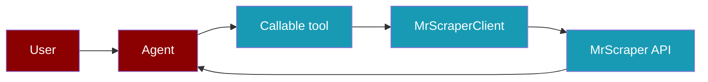

Give an Agent only the MrScraper operations it needs. The example package provides four concise tools by default and 11 complete API operation tools on request.

```python
from praisonaiagents import Agent
from praisonai_mrscraper import MrScraperClient, make_mrscraper_tools

with MrScraperClient() as client:
    read_web_page, extract_page, crawl_urls, search_google = make_mrscraper_tools(client)
    agent = Agent(instructions="Summarize a public page", tools=[read_web_page])
    agent.start("Summarize https://example.com")
```



## Install and response contract

<Steps>
  <Step title="Install the example client">
    Install `praisonaiagents` and the [MrScraper example package](https://github.com/MervinPraison/PraisonAI/tree/main/examples/tools/external/mrscraper) from a PraisonAI source checkout:

    ```bash
    pip install praisonaiagents
    pip install -e examples/tools/external/mrscraper
    ```
  </Step>
  <Step title="Set credentials">
    Set `MRSCRAPER_API_TOKEN` and your Agent's model provider key. You can also pass `token=` when creating `MrScraperClient`.
  </Step>
</Steps>

The example client is **synchronous**, so ordinary Agent tools can call it directly. Its HTTP request fields follow the supplied [MrScraper Python SDK](https://github.com/mrscraper/mrscraper-python) source; the official SDK's methods are asynchronous and require `await`. This example is an integration package, not the SDK itself.

Every client method returns a dictionary with `status_code`, `data`, and `headers`. The structure of `data` depends on the operation and may be text or JSON. Only `None` values are omitted from request JSON; `False`, `0`, and empty strings are retained. The Agent tool layer limits output to `max_chars=12000` and removes sensitive fields from its result.

| Host | Operations | Authentication |
| --- | --- | --- |
| `https://api.app.mrscraper.com` | Scrapers, reruns, results, account, analytics | `x-api-token` |
| `https://sync.scraper.mrscraper.com` | Google SERP | `Authorization: Bearer <token>` and `x-api-token` |
| `https://api.mrscraper.com` | Rendered page | Bearer and `x-api-token`; token also in JSON body |

HTTP status 401 raises `AuthenticationError`; other non-2xx responses raise `APIError` with `status_code`; connection and timeout failures raise `NetworkError`. All inherit `MrScraperError`. Error messages omit request URLs containing secrets and server response bodies. Do not print the unfiltered `headers` or `data` in logs if they may contain sensitive content.

## Agent tool selection

`make_mrscraper_tools(client, max_chars=12000)` returns `read_web_page(url)`, `extract_page(url, prompt)`, `crawl_urls(url)`, and `search_google(query)`. The first asks for Markdown; the last asks for JSON search results. Each returns a bounded string.

`make_mrscraper_tools(client, include_all=True)` retains those four and adds named callables with the same parameters and defaults as these 11 client methods: `fetch_html`, `fetch_google_serp`, `create_scraper`, `rerun_scraper`, `bulk_rerun_ai_scraper`, `rerun_manual_scraper`, `bulk_rerun_manual_scraper`, `get_all_results`, `get_result_by_id`, `get_subscription_account`, and `get_analytic_statuses`. Select them by name:

```python
with MrScraperClient() as client:
    tools = {tool.__name__: tool for tool in make_mrscraper_tools(client, include_all=True)}
    agent = Agent(
        instructions="Find pages about example.com and summarize them",
        tools=[tools["fetch_google_serp"], tools["fetch_html"]],
    )
    agent.start("Find and summarize example.com")
```

The functions under `include_all=True` can create scrapers or start runs, which can consume account quota. Keep the Agent's tool list scoped to its task. Call `MrScraperClient` directly when your application needs unfiltered responses, screenshots, cookies, or response headers.

## Rendered pages

### `fetch_html`

`POST https://api.mrscraper.com/`. All page settings go in the **JSON body**. `screenshot=true` is additionally sent in the query string only when screenshots are enabled.

| Python parameter | JSON field | Type; default |
| --- | --- | --- |
| `url` | `url` | string; required |
| `html`, `markdown` | same | boolean; `True`, `False` |
| `timeout` | `timeout` | integer 1–300 seconds; `120` |
| `geo_code` | `geoCode` | string; `"US"` |
| `proxy_country` | `proxyCountry` | string or `None`; omitted by default |
| `block_resources` | `blockResources` | boolean or `None`; `False` |
| `browser_rendering` | `browserRendering` | boolean or `None`; omitted by default |
| `super_mode` | `super` | boolean; `False` |
| `use_proxy` | `useProxy` | boolean; `True` |
| `proxy` | `proxy` | string or `None`; omitted by default |
| `wait_for_selector` | `waitForSelector` | CSS selector or `None` |
| `home_page` | `homePage` | boolean; `False` |
| `screenshot` | `screenshot` | boolean; `False` omits body and query fields |
| `bypass_proxy` | `bypassProxy` | boolean; `False` |
| `cookie_jar` | `cookieJar` | string or `None` |
| `headers` | `headers` | target-site header dictionary/string or `None` |
| `max_retries` | `maxRetries` | nonnegative integer; `3` |
| `token_cap` | `tokenCap` | nonnegative integer or `None` |
| `stream` | `stream` | boolean or `None` |
| `discard_token_secret` | request header `x-discard-token-secret` | string; `""` omits header |
| internal | `token` | API token in JSON body |

```python
response = client.fetch_html(
    "https://example.com", html=False, markdown=True,
    browser_rendering=True, timeout=120, wait_for_selector="main"
)
print(response["status_code"], type(response["data"]).__name__)
```

The `http_timeout` constructor option sets the HTTPX inactivity timeout, not an overall wall-clock deadline. For `fetch_html`, the client uses `timeout + 30` seconds as its HTTPX timeout; a response that keeps streaming can take longer overall. This setting is separate from the `timeout` body field, which the API uses for page processing.

## Google search

### `fetch_google_serp`

`POST https://sync.scraper.mrscraper.com/api/google/serp/v2/sync`.

| Python parameter | JSON field | Type; default |
| --- | --- | --- |
| `url` | `query` | query text or Google search URL; required |
| `raw` | selects `format` | boolean; `True` forces `"html"` |
| `region` | `region` | string or `None`; may come from URL `gl` |
| `language` | `language` | string or `None`; may come from URL `hl` |
| `page` | `page` | positive integer or `None`; may come from URL `start` |
| `format` | `format` | `"json"` or `"html"`; `"json"` if `raw=False` |
| `render_js` | `renderJs` | boolean; `False` |
| `timeout` | HTTP request only | seconds; `600.0` |

With the SDK-compatible `raw=True` default, the outgoing format is **HTML**. Set `raw=False, format="json"` for parsed JSON results. A Google search URL is converted to `query`, `region`, `language`, and page number.

```python
response = client.fetch_google_serp("best hotels in Bali", raw=False, format="json")
```

## Create and run AI scrapers

### `create_scraper`

`POST https://api.app.mrscraper.com/api/v1/scrapers-ai`. Creates and starts a scraper. `agent` selects `"general"`, `"listing"`, or `"map"`.

| Python parameter | JSON field | Type; default |
| --- | --- | --- |
| `url` | `url` | string; required |
| `message` | `message` | string; required for general/listing, forbidden for map |
| `agent` | `agent` | `"general"`, `"listing"`, `"map"`; `"general"` |
| `mode` | `mode` | `"Cheap"`, `"Super"`, or `None`; omitted by default |
| `schema_prompt` | appended to `message` | JSON object or `None`; not a separate API field |
| `proxy_country` | `proxyCountry` | string or `None`; general/listing only |
| `home_page` | `homePage` | boolean; `False`; general/listing only |
| `max_depth` | `maxDepth` | integer; `2`; map only |
| `max_pages` | `maxPages` | integer; `50`; listing/map only |
| `limit` | `limit` | integer; `1000`; map only |
| `include_patterns`, `exclude_patterns` | `includePatterns`, `excludePatterns` | `||`-separated regex strings; `""`; map only |

```python
listing = client.create_scraper(
    "https://example.com/products", "Extract names and prices",
    agent="listing", max_pages=5, home_page=True,
)
mapping = client.create_scraper("https://example.com", agent="map", limit=1000)
```

The backend receives `agent`, not `graph`. For general/listing, a `schema_prompt` is appended to `message` as best-effort guidance. Map requests omit `message`, `proxyCountry`, and `homePage`.

### `rerun_scraper`

`POST https://api.app.mrscraper.com/api/v1/scrapers-ai-rerun`. Reuses an existing AI scraper.

| Python parameter | JSON field | Type; default |
| --- | --- | --- |
| `scraper_id`, `url` | `scraperId`, `url` | strings; required |
| `max_depth`, `max_pages`, `limit` | `maxDepth`, `maxPages`, `limit` | integers; `2`, `50`, `1000` |
| `include_patterns`, `exclude_patterns` | `includePatterns`, `excludePatterns` | strings; `""` |
| `proxy_country` | `proxyCountry` | string or `None` |
| `max_retries` | `maxRetry` | integer or `None`; omitted by default |
| `timeout` | `timeout` | integer or `None`; omitted by default |
| `home_page` | `useHomePage` | boolean; `False` |
| `html`, `markdown`, `screenshot` | same | booleans; all `False` |
| `bypass_proxy` | `bypassProxy` | boolean; `False` |
| `wait_for_selector` | `waitForSelector` | string or `None` |
| `render_javascript` | `renderJavascript` | boolean; `False` |
| `use_proxy` | `useProxy` | boolean; `True` |
| `proxy` | `proxy` | string or `None` |
| `return_cookies` | `returnCookies` | boolean; `False` |
| `show_modal` | `showModal` | boolean; `False` |
| `stream` | `stream` | boolean; `False` |

All fields are serialized by the SDK-style method; backend effects depend on the saved scraper's agent type. The `max_retries` argument maps to singular `maxRetry`.

```python
response = client.rerun_scraper("your-ai-scraper-id", "https://example.com/new",
                                markdown=True, max_retries=2)
```

### `bulk_rerun_ai_scraper`

`POST https://api.app.mrscraper.com/api/v1/scrapers-ai-rerun/bulk`. Required `scraper_id: str` and nonempty `urls: list[str]` become `scraperId` and `urls` in JSON.

```python
client.bulk_rerun_ai_scraper("your-ai-scraper-id", ["https://example.com/a", "https://example.com/b"])
```

## Run manual scrapers

### `rerun_manual_scraper`

`POST https://api.app.mrscraper.com/api/v1/scrapers-manual-rerun`.

| Python parameter | JSON field | Type; default |
| --- | --- | --- |
| `scraper_id`, `url` | `scraperId`, `url` | strings; required |
| `proxy`, `proxy_country` | `proxy`, `proxyCountry` | strings or `None` |
| `max_retries` | `maxRetry` **and** `maxRetries` | nonnegative integer; `3` |
| `return_cookies` | `returnCookie` | boolean; `False` |
| `global_domain`, `use_proxy`, `bypass_proxy` | `globalDomain`, `useProxy`, `bypassProxy` | booleans; all `True` |
| `home_page` | `homePage` | boolean; `False` |
| `home_page_timeout` | `homePageTimeout` | integer or `None`; `10` |
| `html`, `markdown` | same | booleans or `None`; `False` |
| `screenshot` | `screenshot` | mode string or `None`; omitted by default |
| `cookie_jar` | `cookieJar` | string or `None` |
| `browser_flags` | `browserFlags` | JSON object or `None` |
| `token_cap` | `tokenCap` | integer or `None` |
| `stream` | `stream` | boolean or `None` |
| `timeout` | `timeout` | number or `None` |

```python
client.rerun_manual_scraper(
    "your-manual-scraper-id", "https://example.com/new",
    screenshot="top", browser_flags={"headless": True},
)
```

### `bulk_rerun_manual_scraper`

`POST https://api.app.mrscraper.com/api/v1/scrapers-manual-rerun/bulk`. Required `scraper_id: str` and nonempty `urls: list[str]` become `scraperId` and `urls` in JSON.

## Results, account, and analytics

### `get_all_results`

`GET https://api.app.mrscraper.com/api/v1/results`.

| Python parameter | Query field | Type; default |
| --- | --- | --- |
| `sort_field` | `sortField` | `createdAt`, `updatedAt`, `id`, `type`, `url`, `status`, `error`, `tokenUsage`, `runtime`; `"updatedAt"` |
| `sort_order` | `sortOrder` | `"ASC"` or `"DESC"`; `"DESC"` |
| `page_size`, `page` | `pageSize`, `page` | positive integers; `10`, `1` |
| `search` | `search` | string or `None` |
| `date_range_column` | `dateRangeColumn` | string or `None` |
| `start_at`, `end_at` | `startAt`, `endAt` | date/time strings or `None` |
| `scraper_id` | `filters[scraperId]` | string or `None` |
| `status`, `type`, `url` | `filters[status]`, `filters[type]`, `filters[url]` | strings or `None` |

```python
page = client.get_all_results(scraper_id="your-scraper-id", page=1,
                              sort_field="updatedAt")
```

`get_results(scraper_id, page=1, page_size=10, sort="createdAt", sort_order="DESC")` and `get_latest_results(scraper_id, page_size=10)` remain as convenience adapters.

### `get_result_by_id`

`GET https://api.app.mrscraper.com/api/v1/results/{resultId}`. Required `result_id: str` is URL encoded. `include_html: bool = True` is sent as query `includeHtml=true` or `false`.

```python
response = client.get_result_by_id("your-result-id", include_html=False)
```

`get_result_detail(result_id, include_html=True)` remains as a convenience adapter.

### `get_subscription_account`

`GET https://api.app.mrscraper.com/api/v1/subscription-accounts`. No operation parameters. `get_account_info()` is an alias.

### `get_analytic_statuses`

`GET https://api.app.mrscraper.com/api/v1/analytic/statuses`.

| Python parameter | Query field | Type; default |
| --- | --- | --- |
| `domain` | `domain` | string; required |
| `start_date`, `end_date` | `startDate`, `endDate` | date/time strings; required |
| `action`, `api_token_name` | `action`, `apiTokenName` | strings; `""` |

```python
client.get_analytic_statuses("example.com", "2026-01-01", "2026-01-31")
```

## Compatibility and verification

The earlier n8n-based example exposed names such as `extract_page_by_prompt`, `extract_listings`, `crawl_website_urls`, `search_google_serp`, `fetch_rendered_html`, and `run_existing_scraper`. Those adapters remain in `MrScraperClient`, but their outgoing requests now follow the supplied Python SDK contract. In particular, AI create uses `agent` instead of n8n's `graph`; rendered-page settings and token are JSON body fields rather than query fields; map regex strings use `||`; and the default SDK SERP request uses HTML via `raw=True`. Prefer the primary methods above for new code.

The reference used here is the SDK source supplied with this integration work. Verify live behavior with your own account before relying on a particular `data` shape or job status. The example's mocked tests verify request construction without consuming MrScraper quota:

```bash
PYTHONPATH=examples/tools/external/mrscraper python3 -m pytest -q \
  examples/tools/external/mrscraper/tests/test_client.py
```

<AccordionGroup>
  <Accordion title="HTTP 401">
    Confirm `MRSCRAPER_API_TOKEN` and the account it belongs to. Rendered and SERP calls use Bearer plus `x-api-token`; platform calls use `x-api-token`.
  </Accordion>
  <Accordion title="Result not ready">
    Inspect the actual `data` from create or rerun and use `get_all_results` or `get_result_by_id` with identifiers returned by your account. Do not assume an undocumented polling schedule.
  </Accordion>
</AccordionGroup>
