## What is PraisonAI?

PraisonAI is a powerful Multi-Agent Framework for building and deploying AI agents that can understand, reason, and execute complex tasks autonomously.

<CardGroup cols={1}>
  <Card title="Welcome to PraisonAI" icon="wand-magic-sparkles">
    Build powerful autonomous agents that understand, decide, and execute with unprecedented capability.
  </Card>
</CardGroup>

---

# Core Components


<CardGroup cols={2}>
  <Card title="🤖 Agent" icon="robot">
    **Single AI worker** with tools and instructions
  </Card>
  <Card title="👥 AgentTeam" icon="users">
    **Multi-agent orchestration** with sequential/hierarchical process
  </Card>
  <Card title="🔄 AgentFlow" icon="diagram-project">
    **Step-based pipelines** with route, parallel, loop patterns
  </Card>
  <Card title="⚡ AgentOS" icon="server">
    **Production deployment** with API, webhooks, scheduler
  </Card>
</CardGroup>

---

## When to Use What

```mermaid
graph LR
    Q{What do you need?}
    
    Q -->|"One agent, one task"| A["🤖 Agent"]
    Q -->|"Multiple agents collaborate"| B["👥 AgentTeam"]
    Q -->|"Complex pipelines"| C["🔄 AgentFlow"]
    Q -->|"Production API"| D["⚡ AgentOS"]
    
    classDef question fill:#F59E0B,stroke:#7C90A0,color:#fff
    classDef agent fill:#189AB4,stroke:#7C90A0,color:#fff
    classDef prod fill:#8B0000,stroke:#7C90A0,color:#fff
    
    class Q question
    class A,B,C agent
    class D prod
```



| Scenario | Use This |
|----------|----------|
| Chat with one AI | `Agent` |
| Research → Analyze → Write | `AgentTeam` or `AgentFlow` |
| Route to specialists | `AgentFlow` + `route()` |
| Parallel processing | `AgentFlow` + `parallel()` |
| Production API | `AgentOS` |

---

## Use Cases

<CardGroup cols={2}>
  <Card title="Customer Service" icon="headset">
    Build intelligent support agents that can handle customer inquiries and resolve issues autonomously.
  </Card>
  <Card title="Data Analysis" icon="chart-line">
    Create agents that can process, analyze, and derive insights from complex datasets.
  </Card>
  <Card title="Content Creation" icon="pen-nib">
    Deploy agents that can generate, edit, and optimize content across various formats.
  </Card>
  <Card title="Process Automation" icon="gears">
    Automate complex workflows with intelligent agents that can coordinate and execute tasks.
  </Card>
</CardGroup>

---

## Getting Started

<Tabs>
  <Tab title="Python">
    <Steps>
      <Step title="Install">
        ```bash
        pip install praisonaiagents
        ```
      </Step>

      <Step title="Set API Key">
        ```bash
        export OPENAI_API_KEY=your_openai_key
        ```
      </Step>

      <Step title="Create Agent">
<CodeGroup>
```python Single Agent
from praisonaiagents import Agent

agent = Agent(instructions="You are a helpful assistant")
agent.start("Write a haiku about AI")
```

```python Multi-Agent Team
from praisonaiagents import Agent, AgentTeam

researcher = Agent(instructions="Research topics")
writer = Agent(instructions="Write content")

team = AgentTeam(agents=[researcher, writer])
team.start()
```

```python AgentFlow Pipeline
from praisonaiagents import Agent, AgentFlow

researcher = Agent(instructions="Research topics")
writer = Agent(instructions="Write content")

flow = AgentFlow(steps=[researcher, writer])
flow.start("Research AI trends")
```
</CodeGroup>
      </Step>
    </Steps>
  </Tab>
  
  <Tab title="TypeScript">
    <Steps>
      <Step title="Install">
        ```bash
        npm install praisonai
        ```
      </Step>

      <Step title="Set API Key">
        ```bash
        export OPENAI_API_KEY=your_openai_key
        ```
      </Step>

      <Step title="Create Agent">
<CodeGroup>
```typescript Single Agent
import { Agent } from 'praisonai';

const agent = new Agent({ instructions: 'You are a helpful assistant' });
agent.start('Write a haiku about AI');
```

```typescript Multi-Agent Team
import { Agent, AgentTeam } from 'praisonai';

const researcher = new Agent({ instructions: 'Research topics' });
const writer = new Agent({ instructions: 'Write content' });

const team = new AgentTeam({ agents: [researcher, writer] });
team.start();
```
</CodeGroup>
      </Step>
    </Steps>
  </Tab>
  
  <Tab title="No Code (YAML)">
    <Steps>
      <Step title="Install">
        ```bash
        pip install praisonai
        ```
      </Step>

      <Step title="Create agents.yaml">
```yaml
agents:
  researcher:
    instructions: Research AI trends
  writer:
    instructions: Write content based on research
```
      </Step>

      <Step title="Run">
        ```bash
        praisonai agents.yaml
        ```
      </Step>
    </Steps>
  </Tab>
</Tabs>

---

## Key Features

<CardGroup cols={3}>
  <Card title="Autonomous Agents" icon="robot">
    - Understand natural language
    - Make decisions
    - Execute tasks
  </Card>

  <Card title="Flexible Architecture" icon="cubes">
    - Modular components
    - Extensible tools
    - Custom workflows
  </Card>

  <Card title="Advanced Capabilities" icon="wand-sparkles">
    - Multi-agent collaboration
    - Memory management
    - Tool integration
  </Card>
</CardGroup>

---

## Why PraisonAI?

<CardGroup cols={2}>
  <Card title="Developer First" icon="code">
    Modern SDK designed to be intuitive and powerful
  </Card>
  <Card title="Production Ready" icon="shield">
    Enterprise-grade with built-in security and scale
  </Card>
  <Card title="Open Source" icon="github">
    Available on [GitHub](https://github.com/MervinPraison/PraisonAI)
  </Card>
  <Card title="Low Code Friendly" icon="wand-magic">
    Easy for non-technical users
  </Card>
</CardGroup>

---

## Next Steps

<CardGroup cols={2}>
  <Card title="Quick Start" icon="play" href="/code/quickstart">
    Build your first AI agent in minutes
  </Card>
  <Card title="Core Concepts" icon="book" href="/concepts/agents">
    Understand Agent, AgentTeam, AgentFlow
  </Card>
  <Card title="Workflows" icon="diagram-project" href="/docs/guides/workflows">
    Learn workflow patterns
  </Card>
  <Card title="API Reference" icon="code" href="/docs/features/workflows">
    Full technical documentation
  </Card>
</CardGroup>

<Tip>
  Join our community on [Discord](https://discord.gg/nNZu5gGT59) to connect with other developers and get help!
</Tip>