Enable seamless agent-to-agent communication with the A2A (Agent-to-Agent) protocol.

```mermaid
graph LR
    subgraph "A2A Communication"
        A[🤖 Agent A] --> B[📨 Message]
        B --> C[🔄 A2A Protocol]
        C --> D[📬 Message]
        D --> E[🤖 Agent B]
    end
    
    classDef agent fill:#8B0000,stroke:#7C90A0,color:#fff
    classDef message fill:#F59E0B,stroke:#7C90A0,color:#fff
    classDef protocol fill:#189AB4,stroke:#7C90A0,color:#fff
    
    class A,E agent
    class B,D message
    class C protocol
```



## Quick Start

<Steps>

<Step title="Create an A2A Server">
```typescript
import { A2A, A2AAgentCard } from 'praisonai';

const a2a = new A2A({
  name: "Research Assistant",
  description: "Helps with research tasks",
  url: "http://localhost:8000",
  version: "1.0.0",
  skills: [
    {
      id: "search",
      name: "Web Search",
      description: "Search the web for information"
    }
  ]
});

// Get agent card
const card = a2a.getAgentCard();
console.log(card);
```
</Step>

<Step title="Send Messages">
```typescript
import { A2AMessage, A2ARole } from 'praisonai';

const message: A2AMessage = {
  role: A2ARole.USER,
  parts: [
    { type: 'text', text: 'Search for AI news' }
  ]
};
```
</Step>

</Steps>

---

## A2A Types

### Task States

```typescript
import { A2ATaskState } from 'praisonai';

A2ATaskState.PENDING    // Task is waiting
A2ATaskState.RUNNING    // Task is executing
A2ATaskState.COMPLETED  // Task finished successfully
A2ATaskState.FAILED     // Task failed
A2ATaskState.CANCELED   // Task was canceled
```

### Roles

```typescript
import { A2ARole } from 'praisonai';

A2ARole.USER   // User message
A2ARole.AGENT  // Agent message
```

---

## Message Parts

### Text Part

```typescript
import { A2ATextPart } from 'praisonai';

const textPart: A2ATextPart = {
  type: 'text',
  text: 'Hello, agent!'
};
```

### File Part

```typescript
import { A2AFilePart } from 'praisonai';

const filePart: A2AFilePart = {
  type: 'file',
  file: {
    name: 'document.pdf',
    mimeType: 'application/pdf',
    uri: 'https://example.com/doc.pdf'
  }
};
```

### Data Part

```typescript
import { A2ADataPart } from 'praisonai';

const dataPart: A2ADataPart = {
  type: 'data',
  data: {
    results: [1, 2, 3],
    metadata: { source: 'api' }
  }
};
```

---

## A2A Message

```typescript
interface A2AMessage {
  role: A2ARole;              // USER or AGENT
  parts: A2APart[];           // Message parts
  metadata?: Record<string, any>;
}
```

---

## A2A Task

```typescript
interface A2ATask {
  id: string;                 // Task ID
  sessionId?: string;         // Session ID
  status: A2ATaskStatus;      // Current status
  artifacts?: A2AArtifact[];  // Generated artifacts
  history?: A2AMessage[];     // Message history
  metadata?: Record<string, any>;
}

interface A2ATaskStatus {
  state: A2ATaskState;        // Task state
  message?: A2AMessage;       // Status message
  timestamp?: string;         // When updated
}
```

---

## Agent Card

Describe your agent's capabilities:

```typescript
interface A2AAgentCard {
  name: string;               // Agent name
  description?: string;       // What the agent does
  url: string;                // Agent endpoint
  version: string;            // Version
  provider?: {
    organization: string;
    url?: string;
  };
  capabilities?: {
    streaming?: boolean;
    pushNotifications?: boolean;
    stateTransitionHistory?: boolean;
  };
  skills?: A2AAgentSkill[];   // Agent skills
}
```

### Agent Skills

```typescript
interface A2AAgentSkill {
  id: string;                 // Skill ID
  name: string;               // Skill name
  description?: string;       // What it does
  tags?: string[];            // Tags for discovery
  examples?: string[];        // Example prompts
  inputModes?: string[];      // Accepted input types
  outputModes?: string[];     // Output types
}
```

---

## Send Message Request

```typescript
interface A2ASendMessageRequest {
  id: string;
  jsonrpc: '2.0';
  method: 'message/send';
  params: {
    id: string;
    sessionId?: string;
    message: A2AMessage;
    acceptedOutputModes?: string[];
    pushNotificationConfig?: {
      url: string;
      token?: string;
    };
    metadata?: Record<string, any>;
  };
}
```

---

## Common Patterns

<Tabs>

<Tab title="Research Agent">
```typescript
import { A2A, A2AAgentSkill } from 'praisonai';

const skills: A2AAgentSkill[] = [
  {
    id: "web-search",
    name: "Web Search",
    description: "Search the web for information",
    tags: ["search", "research"],
    examples: ["Find latest AI news", "Search for Python tutorials"]
  },
  {
    id: "summarize",
    name: "Summarize",
    description: "Summarize long documents",
    tags: ["text", "summary"]
  }
];

const a2a = new A2A({
  name: "Research Agent",
  description: "AI-powered research assistant",
  url: "http://localhost:8000",
  version: "1.0.0",
  skills
});
```
</Tab>

<Tab title="Task Handling">
```typescript
import { A2ATask, A2ATaskState, A2AMessage, A2ARole } from 'praisonai';

function handleTask(task: A2ATask): A2ATask {
  // Update task status
  task.status = {
    state: A2ATaskState.RUNNING,
    timestamp: new Date().toISOString()
  };
  
  // Process and complete
  const response: A2AMessage = {
    role: A2ARole.AGENT,
    parts: [{ type: 'text', text: 'Task completed!' }]
  };
  
  task.status = {
    state: A2ATaskState.COMPLETED,
    message: response,
    timestamp: new Date().toISOString()
  };
  
  return task;
}
```
</Tab>

</Tabs>

---

## Best Practices

<AccordionGroup>
  <Accordion title="Define clear skills">
    Each skill should have a clear description and examples for discovery.
  </Accordion>
  
  <Accordion title="Use appropriate message parts">
    Use `text` for simple messages, `file` for documents, `data` for structured data.
  </Accordion>
  
  <Accordion title="Track task state">
    Always update task state to keep clients informed of progress.
  </Accordion>
</AccordionGroup>

---

## Related

<CardGroup cols={2}>
  <Card title="Agent Team" icon="users" href="/js/agent-team">
    Multi-agent orchestration
  </Card>
  <Card title="AGUI" icon="display" href="/js/advanced/agui">
    Agent GUI protocol
  </Card>
</CardGroup>
