Build visual interfaces for your agents with the AGUI (Agent GUI) protocol.

```mermaid
graph LR
    subgraph "AGUI Architecture"
        A[👤 User] --> B[🖥️ GUI]
        B --> C[🔌 AGUI]
        C --> D[🤖 Agent]
        D --> E[📤 Response]
        E --> B
    end
    
    classDef user fill:#6366F1,stroke:#7C90A0,color:#fff
    classDef gui fill:#F59E0B,stroke:#7C90A0,color:#fff
    classDef agui fill:#189AB4,stroke:#7C90A0,color:#fff
    classDef agent fill:#8B0000,stroke:#7C90A0,color:#fff
    classDef response fill:#10B981,stroke:#7C90A0,color:#fff
    
    class A user
    class B gui
    class C agui
    class D agent
    class E response
```



## Quick Start

<Steps>

<Step title="Create an AGUI Instance">
```typescript
import { AGUI } from 'praisonai';

const agui = new AGUI({
  name: "Assistant UI",
  description: "Visual interface for the assistant"
});

console.log(agui.getName());  // "Assistant UI"
```
</Step>

<Step title="Integrate with Agent">
```typescript
import { Agent, AGUI } from 'praisonai';

const agui = new AGUI({
  name: "Research UI",
  description: "Research assistant interface"
});

const agent = new Agent({
  name: "Researcher",
  instructions: "Help with research tasks"
});
```
</Step>

</Steps>

---

## AGUI Configuration

```typescript
interface AGUIConfig {
  name: string;           // UI name
  description?: string;   // UI description
}
```

---

## AGUI Class

```typescript
import { AGUI } from 'praisonai';

const agui = new AGUI({
  name: "My Agent UI",
  description: "A beautiful agent interface"
});

// Get the UI name
const name = agui.getName();
```

---

## Common Patterns

<Tabs>

<Tab title="Chat Interface">
```typescript
import { AGUI, Agent } from 'praisonai';

class ChatUI {
  private agui: AGUI;
  private agent: Agent;
  
  constructor() {
    this.agui = new AGUI({
      name: "Chat UI",
      description: "Conversational interface"
    });
    
    this.agent = new Agent({
      name: "ChatBot",
      instructions: "Be helpful and friendly"
    });
  }
  
  async sendMessage(message: string): Promise<string> {
    return await this.agent.start(message);
  }
}
```
</Tab>

<Tab title="Dashboard">
```typescript
import { AGUI, Agent } from 'praisonai';

class DashboardUI {
  private agui: AGUI;
  private agents: Map<string, Agent> = new Map();
  
  constructor() {
    this.agui = new AGUI({
      name: "Dashboard",
      description: "Multi-agent dashboard"
    });
  }
  
  addAgent(name: string, agent: Agent) {
    this.agents.set(name, agent);
  }
  
  async queryAgent(name: string, query: string) {
    const agent = this.agents.get(name);
    if (!agent) throw new Error(`Agent ${name} not found`);
    return await agent.start(query);
  }
}
```
</Tab>

</Tabs>

---

## API Reference

<CardGroup cols={2}>
  <Card title="AGUI" icon="code" href="/docs/sdk/reference/typescript/classes/AGUI">
    AGUI protocol class reference
  </Card>
</CardGroup>

---

## Best Practices

<AccordionGroup>
  <Accordion title="Use descriptive names">
    Give your AGUI instances clear, descriptive names for better debugging.
  </Accordion>
  
  <Accordion title="Separate UI from logic">
    Keep AGUI configuration separate from agent business logic.
  </Accordion>
</AccordionGroup>

---

## Related

<CardGroup cols={2}>
  <Card title="A2A Protocol" icon="arrows-left-right" href="/js/advanced/a2a">
    Agent-to-Agent communication
  </Card>
  <Card title="Streaming" icon="wave-pulse" href="/js/streaming">
    Stream agent responses
  </Card>
</CardGroup>
