Automatically retrieve relevant context based on query analysis with AutoRagAgent.

```mermaid
graph LR
    subgraph "AutoRag Flow"
        A[📝 Query] --> B{🔍 Analyze}
        B -->|Needs Context| C[📚 Retrieve]
        B -->|No Context| D[🤖 Direct]
        C --> E[🧠 Generate]
        D --> E
        E --> F[📤 Response]
    end
    
    classDef query fill:#6366F1,stroke:#7C90A0,color:#fff
    classDef analyze fill:#F59E0B,stroke:#7C90A0,color:#fff
    classDef retrieve fill:#189AB4,stroke:#7C90A0,color:#fff
    classDef generate fill:#8B0000,stroke:#7C90A0,color:#fff
    classDef response fill:#10B981,stroke:#7C90A0,color:#fff
    
    class A query
    class B analyze
    class C,D retrieve
    class E generate
    class F response
```



## Quick Start

<Steps>

<Step title="Create AutoRagAgent">
```typescript
import { AutoRagAgent, RetrievalPolicy } from 'praisonai';

const autoRag = new AutoRagAgent({
  retrievalPolicy: RetrievalPolicy.AUTO,
  topK: 5,
  rerank: true
});
```
</Step>

<Step title="Check if Retrieval Needed">
```typescript
// Queries that trigger retrieval
autoRag.shouldRetrieve("What is machine learning?");  // true
autoRag.shouldRetrieve("Explain the document");       // true
autoRag.shouldRetrieve("Find information about AI");  // true

// Queries that don't trigger retrieval
autoRag.shouldRetrieve("Hi");                         // false
autoRag.shouldRetrieve("Thanks");                     // false
```
</Step>

</Steps>

---

## Retrieval Policies

```mermaid
graph TB
    subgraph "Choose Your Policy"
        A{When to retrieve?}
        A -->|Smart detection| B[🔮 AUTO]
        A -->|Every query| C[📚 ALWAYS]
        A -->|Never| D[🚫 NEVER]
    end
    
    classDef question fill:#6366F1,stroke:#7C90A0,color:#fff
    classDef auto fill:#10B981,stroke:#7C90A0,color:#fff
    classDef always fill:#F59E0B,stroke:#7C90A0,color:#fff
    classDef never fill:#8B0000,stroke:#7C90A0,color:#fff
    
    class A question
    class B auto
    class C always
    class D never
```



```typescript
import { RetrievalPolicy } from 'praisonai';

RetrievalPolicy.AUTO    // Smart detection based on query
RetrievalPolicy.ALWAYS  // Always retrieve context
RetrievalPolicy.NEVER   // Never retrieve context
```

---

## Configuration

```typescript
import { AutoRagAgent, AutoRagAgentConfig, RetrievalPolicy } from 'praisonai';

const config: AutoRagAgentConfig = {
  retrievalPolicy: RetrievalPolicy.AUTO,
  topK: 5,                    // Number of results to retrieve
  hybrid: false,              // Use hybrid search
  rerank: true,               // Rerank results
  includeCitations: true,     // Include citations in response
  citationsMode: 'append',    // 'append' | 'hidden' | 'none'
  maxContextTokens: 4000,     // Max tokens for context
  autoMinLength: 10           // Min query length for auto mode
};

const autoRag = new AutoRagAgent(config);
```

### Configuration Options

| Option | Type | Default | Description |
|--------|------|---------|-------------|
| `retrievalPolicy` | `RetrievalPolicy` | `AUTO` | When to retrieve context |
| `topK` | `number` | `5` | Number of results to retrieve |
| `hybrid` | `boolean` | `false` | Use hybrid (keyword + semantic) search |
| `rerank` | `boolean` | `false` | Rerank results for relevance |
| `includeCitations` | `boolean` | `true` | Include source citations |
| `citationsMode` | `string` | `'append'` | How to show citations |
| `maxContextTokens` | `number` | `4000` | Max context window |
| `autoMinLength` | `number` | `10` | Min query length for AUTO |

---

## Auto Keywords

Queries containing these keywords trigger retrieval in AUTO mode:

```typescript
import { DEFAULT_AUTO_KEYWORDS } from 'praisonai';

// Default keywords that trigger retrieval
const keywords = [
  'what', 'how', 'why', 'when', 'where', 'who', 'which',
  'explain', 'describe', 'summarize', 'find', 'search',
  'tell me', 'show me', 'according to', 'based on',
  'cite', 'source', 'reference', 'document', 'paper'
];
```

### Custom Keywords

```typescript
const autoRag = new AutoRagAgent({
  retrievalPolicy: RetrievalPolicy.AUTO,
  autoKeywords: new Set([
    'what', 'how', 'explain',
    'my custom keyword',
    'another trigger'
  ])
});
```

---

## Methods

### shouldRetrieve

Check if a query should trigger retrieval:

```typescript
const autoRag = new AutoRagAgent();

// Returns true for questions
autoRag.shouldRetrieve("What is the capital of France?");  // true

// Returns true for search queries
autoRag.shouldRetrieve("Find documents about AI");         // true

// Returns false for short queries
autoRag.shouldRetrieve("Hi");                              // false

// Returns false for non-question statements
autoRag.shouldRetrieve("Thanks for your help");            // false
```

### getConfig

Get the current configuration:

```typescript
const config = autoRag.getConfig();
console.log(config.topK);           // 5
console.log(config.retrievalPolicy); // 'auto'
```

---

## Common Patterns

<Tabs>

<Tab title="With Knowledge Base">
```typescript
import { AutoRagAgent, RetrievalPolicy, Knowledge } from 'praisonai';

const knowledge = new Knowledge({
  sources: ['./docs'],
  embeddings: 'text-embedding-3-small'
});

const autoRag = new AutoRagAgent({
  retrievalPolicy: RetrievalPolicy.AUTO,
  topK: 5,
  rerank: true
});

async function answer(query: string) {
  if (autoRag.shouldRetrieve(query)) {
    const context = await knowledge.search(query, { topK: 5 });
    return generateWithContext(query, context);
  }
  return generateDirect(query);
}
```
</Tab>

<Tab title="With Agent">
```typescript
import { Agent, AutoRagAgent, RetrievalPolicy } from 'praisonai';

const autoRag = new AutoRagAgent({
  retrievalPolicy: RetrievalPolicy.AUTO
});

const agent = new Agent({
  name: "RAG Assistant",
  instructions: "Answer questions using retrieved context"
});

async function chat(query: string) {
  const needsContext = autoRag.shouldRetrieve(query);
  
  if (needsContext) {
    // Add context to the query
    const context = await retrieveContext(query);
    return agent.start(`Context: ${context}\n\nQuestion: ${query}`);
  }
  
  return agent.start(query);
}
```
</Tab>

</Tabs>

---

## Best Practices

<AccordionGroup>
  <Accordion title="Use AUTO for general chatbots">
    AUTO mode balances retrieval costs with response quality for most use cases.
  </Accordion>
  
  <Accordion title="Use ALWAYS for document Q&A">
    When every query relates to documents, use ALWAYS to ensure context is included.
  </Accordion>
  
  <Accordion title="Enable reranking for accuracy">
    Reranking improves result relevance at a small latency cost.
  </Accordion>
  
  <Accordion title="Tune autoMinLength">
    Increase `autoMinLength` to avoid retrieval for very short queries.
  </Accordion>
</AccordionGroup>

---

## Related

<CardGroup cols={2}>
  <Card title="RAG Agent" icon="magnifying-glass" href="/js/rag-agent">
    Full RAG implementation
  </Card>
  <Card title="Knowledge Base" icon="book" href="/js/knowledge-base">
    Build knowledge bases
  </Card>
</CardGroup>
