Create flexible conditions for routing, filtering, and controlling agent workflow execution.

```mermaid
graph LR
    subgraph "Condition Evaluation"
        A[📥 Context] --> B{🔍 Condition}
        B -->|True| C[✅ Action A]
        B -->|False| D[❌ Action B]
    end
    
    classDef context fill:#6366F1,stroke:#7C90A0,color:#fff
    classDef condition fill:#F59E0B,stroke:#7C90A0,color:#fff
    classDef action fill:#10B981,stroke:#7C90A0,color:#fff
    
    class A context
    class B condition
    class C,D action
```



## Quick Start

<Steps>

<Step title="Create a Dictionary Condition">
```typescript
import { DictCondition } from 'praisonai';

const condition = new DictCondition({
  status: "active",
  priority: (v) => v > 5
});

const result = condition.evaluate({
  status: "active",
  priority: 8
});

console.log(result);  // true
```
</Step>

<Step title="Create an Expression Condition">
```typescript
import { ExpressionCondition } from 'praisonai';

const condition = new ExpressionCondition("score >= 80");

console.log(condition.evaluate({ score: 85 }));  // true
console.log(condition.evaluate({ score: 70 }));  // false
```
</Step>

</Steps>

---

## Condition Types

```mermaid
graph TB
    subgraph "Choose Your Condition Type"
        A{What do you need?}
        A -->|Key-value matching| B[📋 DictCondition]
        A -->|Expression evaluation| C[📝 ExpressionCondition]
        A -->|Custom logic| D[⚙️ FunctionCondition]
    end
    
    classDef question fill:#6366F1,stroke:#7C90A0,color:#fff
    classDef dict fill:#10B981,stroke:#7C90A0,color:#fff
    classDef expr fill:#F59E0B,stroke:#7C90A0,color:#fff
    classDef func fill:#189AB4,stroke:#7C90A0,color:#fff
    
    class A question
    class B dict
    class C expr
    class D func
```



### DictCondition

Match context values against expected values:

```typescript
import { DictCondition } from 'praisonai';

// Simple equality
const simple = new DictCondition({
  role: "admin",
  active: true
});

// With functions
const withFunctions = new DictCondition({
  age: (v) => v >= 18,
  score: (v) => v > 50 && v < 100
});

// With regex
const withRegex = new DictCondition({
  email: /^[\w.-]+@[\w.-]+\.\w+$/
});

// OR operator (any condition matches)
const orCondition = new DictCondition({
  role: "admin",
  superuser: true
}, 'or');
```

### ExpressionCondition

Evaluate string expressions:

```typescript
import { ExpressionCondition } from 'praisonai';

// Comparison operators
const gt = new ExpressionCondition("count > 10");
const eq = new ExpressionCondition("status == 'active'");
const ne = new ExpressionCondition("error != null");

// Evaluate
gt.evaluate({ count: 15 });     // true
eq.evaluate({ status: "active" }); // true
ne.evaluate({ error: "failed" }); // true
```

### FunctionCondition

Custom function-based conditions:

```typescript
import { FunctionCondition } from 'praisonai';

const condition = new FunctionCondition(
  (ctx) => ctx.items.length > 0 && ctx.total > 100,
  "Has items and total > 100"
);

condition.evaluate({ items: [1, 2], total: 150 });  // true
condition.evaluate({ items: [], total: 200 });      // false
```

---

## Condition Protocol

All conditions implement the `ConditionProtocol`:

```typescript
interface ConditionProtocol {
  evaluate(context: Record<string, any>): boolean | Promise<boolean>;
  describe(): string;
}
```

---

## Combining Conditions

### AND Conditions

```typescript
import { andConditions, DictCondition, ExpressionCondition } from 'praisonai';

const combined = andConditions([
  new DictCondition({ active: true }),
  new ExpressionCondition("score >= 50")
]);

combined.evaluate({ active: true, score: 75 });  // true
combined.evaluate({ active: true, score: 30 });  // false
```

### OR Conditions

```typescript
import { orConditions, DictCondition } from 'praisonai';

const combined = orConditions([
  new DictCondition({ role: "admin" }),
  new DictCondition({ role: "moderator" })
]);

combined.evaluate({ role: "admin" });     // true
combined.evaluate({ role: "moderator" }); // true
combined.evaluate({ role: "user" });      // false
```

### NOT Condition

```typescript
import { notCondition, DictCondition } from 'praisonai';

const isNotBanned = notCondition(
  new DictCondition({ banned: true })
);

isNotBanned.evaluate({ banned: false }); // true
isNotBanned.evaluate({ banned: true });  // false
```

---

## Evaluate Condition Helper

```typescript
import { evaluateCondition } from 'praisonai';

// With ConditionProtocol
const condition = new DictCondition({ active: true });
const result = await evaluateCondition(condition, { active: true });

// With function
const fnResult = await evaluateCondition(
  (ctx) => ctx.count > 0,
  { count: 5 }
);

// With object
const objResult = await evaluateCondition(
  { status: "ready" },
  { status: "ready" }
);
```

---

## Create Condition Factory

```typescript
import { createCondition } from 'praisonai';

// From object
const dictCond = createCondition({ active: true });

// From function
const fnCond = createCondition((ctx) => ctx.score > 50);

// From string expression
const exprCond = createCondition("count >= 10");
```

---

## Common Patterns

<Tabs>

<Tab title="Routing Condition">
```typescript
import { DictCondition } from 'praisonai';

const routeToSupport = new DictCondition({
  category: "support",
  priority: (v) => v === "high"
});

const routeToSales = new DictCondition({
  category: "sales"
});

function routeRequest(request) {
  if (routeToSupport.evaluate(request)) {
    return "support-agent";
  } else if (routeToSales.evaluate(request)) {
    return "sales-agent";
  }
  return "general-agent";
}
```
</Tab>

<Tab title="Validation">
```typescript
import { andConditions, DictCondition, ExpressionCondition } from 'praisonai';

const isValidOrder = andConditions([
  new DictCondition({
    items: (v) => Array.isArray(v) && v.length > 0
  }),
  new ExpressionCondition("total > 0"),
  new DictCondition({
    customer: (v) => v?.email != null
  })
]);

const order = {
  items: [{ id: 1, qty: 2 }],
  total: 99.99,
  customer: { email: "user@example.com" }
};

if (isValidOrder.evaluate(order)) {
  processOrder(order);
}
```
</Tab>

<Tab title="Feature Flags">
```typescript
import { DictCondition, orConditions } from 'praisonai';

const canAccessBeta = orConditions([
  new DictCondition({ role: "admin" }),
  new DictCondition({ betaTester: true }),
  new DictCondition({
    joinDate: (d) => new Date(d) < new Date("2024-01-01")
  })
]);

const user = { role: "user", betaTester: true };
if (canAccessBeta.evaluate(user)) {
  showBetaFeatures();
}
```
</Tab>

</Tabs>

---

## API Reference

<CardGroup cols={2}>
  <Card title="DictCondition" icon="code" href="/docs/sdk/reference/typescript/classes/DictCondition">
    Dictionary-based condition
  </Card>
  <Card title="ExpressionCondition" icon="terminal" href="/docs/sdk/reference/typescript/classes/ExpressionCondition">
    Expression-based condition
  </Card>
</CardGroup>

---

## Best Practices

<AccordionGroup>
  <Accordion title="Use DictCondition for simple matching">
    For key-value comparisons, `DictCondition` is cleaner than custom functions.
  </Accordion>
  
  <Accordion title="Combine conditions for complex logic">
    Use `andConditions` and `orConditions` instead of nested if statements.
  </Accordion>
  
  <Accordion title="Add descriptions for debugging">
    Use `describe()` to get human-readable condition descriptions.
  </Accordion>
</AccordionGroup>

---

## Related

<CardGroup cols={2}>
  <Card title="Router Agent" icon="route" href="/js/router-agent">
    Route requests to different agents
  </Card>
  <Card title="Workflows" icon="diagram-project" href="/js/workflows">
    Build complex agent workflows
  </Card>
</CardGroup>
