Configure your agents with powerful presets and type-safe configuration options.

```mermaid
graph LR
    subgraph "Configuration Flow"
        A[📝 Config] --> B{🔧 Resolver}
        B --> C[⚙️ Memory]
        B --> D[📊 Output]
        B --> E[🔒 Guardrails]
        B --> F[🌐 Web]
    end
    
    classDef config fill:#6366F1,stroke:#7C90A0,color:#fff
    classDef resolver fill:#F59E0B,stroke:#7C90A0,color:#fff
    classDef feature fill:#10B981,stroke:#7C90A0,color:#fff
    
    class A config
    class B resolver
    class C,D,E,F feature
```



## Quick Start

<Steps>

<Step title="Simple Configuration">
```typescript
import { Agent, MemoryConfig } from 'praisonai';

const agent = new Agent({
  name: "Assistant",
  instructions: "Be helpful",
  memory: { backend: 'file', autoMemory: true }
});

await agent.start("Hello!");
```
</Step>

<Step title="With Presets">
```typescript
import { Agent, OutputPreset, ExecutionPreset } from 'praisonai';

const agent = new Agent({
  name: "Fast Agent",
  instructions: "Quick responses",
  output: { verbose: true, stream: true },
  execution: { maxIter: 5 }
});
```
</Step>

</Steps>

---

## Configuration Interfaces

### Memory Configuration

```typescript
import { MemoryConfig, MemoryBackend } from 'praisonai';

const memoryConfig: MemoryConfig = {
  backend: MemoryBackend.FILE,
  userId: "user-123",
  sessionId: "session-456",
  autoMemory: true,
  history: true,
  historyLimit: 100,
  storePath: "./memory"
};
```

| Option | Type | Default | Description |
|--------|------|---------|-------------|
| `backend` | `MemoryBackend` | `'file'` | Storage backend (file, sqlite, redis, postgres) |
| `userId` | `string` | `undefined` | User identifier for memory isolation |
| `sessionId` | `string` | `undefined` | Session identifier |
| `autoMemory` | `boolean` | `false` | Enable automatic memory management |
| `history` | `boolean` | `true` | Store conversation history |
| `historyLimit` | `number` | `100` | Maximum history entries |
| `storePath` | `string` | `'./memory'` | File storage path |

### Output Configuration

```typescript
import { OutputConfig, OutputPreset } from 'praisonai';

const outputConfig: OutputConfig = {
  verbose: true,
  markdown: true,
  stream: true,
  metrics: false,
  reasoningSteps: true
};
```

| Option | Type | Default | Description |
|--------|------|---------|-------------|
| `verbose` | `boolean` | `false` | Enable verbose logging |
| `markdown` | `boolean` | `true` | Format output as markdown |
| `stream` | `boolean` | `false` | Enable streaming responses |
| `metrics` | `boolean` | `false` | Show performance metrics |
| `reasoningSteps` | `boolean` | `false` | Display reasoning steps |

### Execution Configuration

```typescript
import { ExecutionConfig, ExecutionPreset } from 'praisonai';

const executionConfig: ExecutionConfig = {
  maxIter: 10,
  maxRetryLimit: 3,
  maxRpm: 60,
  maxExecutionTime: 300
};
```

| Option | Type | Default | Description |
|--------|------|---------|-------------|
| `maxIter` | `number` | `10` | Maximum iterations |
| `maxRetryLimit` | `number` | `3` | Maximum retries on failure |
| `maxRpm` | `number` | `60` | Rate limit (requests per minute) |
| `maxExecutionTime` | `number` | `300` | Timeout in seconds |

---

## Enums

### Memory Backend

```typescript
import { MemoryBackend } from 'praisonai';

// Available backends
MemoryBackend.FILE      // File-based storage
MemoryBackend.SQLITE    // SQLite database
MemoryBackend.REDIS     // Redis cache
MemoryBackend.POSTGRES  // PostgreSQL database
MemoryBackend.MEM0      // Mem0 integration
MemoryBackend.MONGODB   // MongoDB database
```

### Output Preset

```typescript
import { OutputPreset } from 'praisonai';

OutputPreset.SILENT   // No output
OutputPreset.STATUS   // Status updates only
OutputPreset.TRACE    // Trace logging
OutputPreset.VERBOSE  // Full verbose output
OutputPreset.DEBUG    // Debug mode
OutputPreset.STREAM   // Streaming output
OutputPreset.JSON     // JSON format
```

### Execution Preset

```typescript
import { ExecutionPreset } from 'praisonai';

ExecutionPreset.FAST       // Quick execution (maxIter: 3)
ExecutionPreset.BALANCED   // Balanced (maxIter: 10)
ExecutionPreset.THOROUGH   // Thorough (maxIter: 25)
ExecutionPreset.UNLIMITED  // No limits
```

---

## Common Patterns

<Tabs>

<Tab title="Full Config">
```typescript
import { Agent, PraisonConfig } from 'praisonai';

const config: PraisonConfig = {
  defaults: { llm: 'gpt-4o-mini', temperature: 0.7 },
  memory: { backend: 'file', autoMemory: true },
  output: { verbose: true, stream: true },
  execution: { maxIter: 10 },
  caching: { enabled: true, ttl: 3600 }
};

const agent = new Agent({
  name: "Configured Agent",
  instructions: "Be helpful",
  ...config
});
```
</Tab>

<Tab title="Multi-Agent Config">
```typescript
import { AgentTeam, MultiAgentMemoryConfig } from 'praisonai';

const memoryConfig: MultiAgentMemoryConfig = {
  backend: 'redis',
  sharedMemory: true,
  isolatedSessions: false
};

const team = new AgentTeam({
  agents: [agent1, agent2],
  memory: memoryConfig
});
```
</Tab>

</Tabs>

---

## Best Practices

<AccordionGroup>
  <Accordion title="Use presets for common scenarios">
    Start with presets like `ExecutionPreset.FAST` for quick tasks or `ExecutionPreset.THOROUGH` for complex research.
  </Accordion>
  
  <Accordion title="Configure memory for persistence">
    Enable `autoMemory: true` to automatically persist important context across sessions.
  </Accordion>
  
  <Accordion title="Set appropriate rate limits">
    Use `maxRpm` to prevent API rate limiting, especially in production environments.
  </Accordion>
</AccordionGroup>

---

## Related

<CardGroup cols={2}>
  <Card title="Memory" icon="brain" href="/js/memory">
    Configure agent memory systems
  </Card>
  <Card title="Plugins" icon="plug" href="/js/advanced/plugins">
    Extend agents with plugins
  </Card>
</CardGroup>
