Control how your agents show their work with display callbacks.



```mermaid
graph LR
    subgraph "Display System"
        A[🤖 Agent] --> B[📤 Output]
        B --> C{🔔 Callbacks}
        C --> D[📺 Console]
        C --> E[📝 Logger]
        C --> F[🌐 UI]
    end
    
    classDef agent fill:#8B0000,stroke:#7C90A0,color:#fff
    classDef output fill:#F59E0B,stroke:#7C90A0,color:#fff
    classDef callback fill:#189AB4,stroke:#7C90A0,color:#fff
    classDef target fill:#10B981,stroke:#7C90A0,color:#fff
    
    class A agent
    class B output
    class C callback
    class D,E,F target
```

## Quick Start

<Steps>

<Step title="Agent with Custom Display">
```typescript
import { Agent, registerDisplayCallback } from 'praisonai';

// Capture all agent output
registerDisplayCallback((message, context) => {
  console.log(`[${context?.agentName}] ${message}`);
});

const agent = new Agent({
  name: "Assistant",
  instructions: "You help with questions",
  verbose: true  // Enable detailed output
});

agent.start("What is AI?");
```
</Step>

<Step title="Agent with UI Integration">
```typescript
import { Agent, registerDisplayCallback } from 'praisonai';

// Send agent output to your UI
registerDisplayCallback((message, context) => {
  updateUI({
    text: message,
    agent: context?.agentName,
    type: context?.level
  });
});

const agent = new Agent({
  name: "ChatBot",
  instructions: "You are a helpful assistant"
});

agent.start("Hello!");
```
</Step>

</Steps>

---

## Display with Agent Features

<Tabs>

<Tab title="Tool Calls">
```typescript
import { Agent, registerDisplayCallback } from 'praisonai';

// Show when agent uses tools
registerDisplayCallback((message, context) => {
  if (context?.toolName) {
    console.log(`🔧 [${context.agentName}] ${context.toolName}: ${message}`);
  }
});

const agent = new Agent({
  name: "Researcher",
  instructions: "Search for information",
  tools: [webSearchTool]
});

agent.start("Find latest AI news");
```
</Tab>

<Tab title="Error Handling">
```typescript
import { Agent, registerDisplayCallback } from 'praisonai';

// Capture agent errors
registerDisplayCallback((message, context) => {
  if (context?.level === 'error') {
    console.error(`❌ [${context.agentName}] ${message}`);
    // Send to error tracking service
  }
});

const agent = new Agent({
  name: "DataAgent",
  instructions: "Process data reliably"
});
```
</Tab>

<Tab title="Reflection">
```typescript
import { Agent, registerDisplayCallback } from 'praisonai';

// Track agent self-reflection
registerDisplayCallback((message, context) => {
  if (context?.level === 'debug') {
    console.log(`💭 [${context.agentName}] Thinking: ${message}`);
  }
});

const agent = new Agent({
  name: "Analyst",
  instructions: "Analyze data and explain your reasoning",
  reflection: true
});
```
</Tab>

</Tabs>

---

## Callback System

### Register Callbacks

```typescript
import { 
  registerDisplayCallback, 
  syncDisplayCallbacks,
  asyncDisplayCallbacks,
  clearDisplayCallbacks 
} from 'praisonai';

// Sync callback
registerDisplayCallback((message, context) => {
  console.log(`[${context?.agentName}] ${message}`);
}, false);

// Async callback
registerDisplayCallback(async (message, context) => {
  await sendToExternalLogger(message, context);
}, true);

// Get all callbacks
const syncCbs = syncDisplayCallbacks();
const asyncCbs = asyncDisplayCallbacks();

// Clear all
clearDisplayCallbacks();
```

### Display Context

```typescript
interface DisplayContext {
  agentName?: string;      // Name of the agent
  toolName?: string;       // Name of the tool (if tool call)
  level?: 'info' | 'warning' | 'error' | 'debug' | 'trace';
  timestamp?: Date;        // When the event occurred
  metadata?: Record<string, any>;  // Additional data
}
```

---

## Flow Display

```typescript
import { Agent, FlowDisplay } from 'praisonai';

const display = new FlowDisplay({
  showTimestamps: true,
  showAgentNames: true,
  showToolCalls: true,
  colorize: true,
  maxWidth: 80
});

// Track agent workflow
const agent = new Agent({
  name: "Researcher",
  instructions: "Research topics"
});

// Add agent step
display.addAgentStep("Researcher", "Starting research on AI trends");

// Add tool step  
display.addToolStep("web_search", "Searching for latest AI news");

// Add message step
display.addMessageStep("Found 5 relevant articles");

// Render the flow
console.log(display.render());

// Get step count
console.log(`Total steps: ${display.stepCount}`);

// Clear when done
display.clear();
```

---

## Error Logs

```typescript
import { errorLogs, clearErrorLogs } from 'praisonai';

// Get all error logs
const errors = errorLogs();
console.log(`Total errors: ${errors.length}`);

// Clear error logs
clearErrorLogs();
```

---

## Common Patterns

<Tabs>

<Tab title="Custom Logger">
```typescript
import { registerDisplayCallback } from 'praisonai';

// Send to external logging service
registerDisplayCallback(async (message, context) => {
  await fetch('https://logs.example.com/api', {
    method: 'POST',
    body: JSON.stringify({
      message,
      agent: context?.agentName,
      level: context?.level,
      timestamp: context?.timestamp
    })
  });
}, true);
```
</Tab>

<Tab title="UI Integration">
```typescript
import { registerDisplayCallback } from 'praisonai';

// Update React state
registerDisplayCallback((message, context) => {
  setMessages(prev => [...prev, {
    text: message,
    agent: context?.agentName,
    type: context?.level
  }]);
});
```
</Tab>

<Tab title="File Logger">
```typescript
import { registerDisplayCallback } from 'praisonai';
import fs from 'fs';

registerDisplayCallback((message, context) => {
  const log = `[${new Date().toISOString()}] ${context?.level}: ${message}\n`;
  fs.appendFileSync('agent.log', log);
});
```
</Tab>

</Tabs>

---

## API Reference

<CardGroup cols={2}>
  <Card title="DisplayContext" icon="code" href="/docs/sdk/reference/typescript/classes/DisplayContext">
    Display context and callback types
  </Card>
  <Card title="FlowDisplay" icon="diagram-project" href="/docs/sdk/reference/typescript/classes/FlowDisplay">
    Flow visualization class
  </Card>
</CardGroup>

---

## Best Practices

<AccordionGroup>
  <Accordion title="Use appropriate log levels">
    Use `error` for failures, `warning` for issues, `info` for status, `debug` for development.
  </Accordion>
  
  <Accordion title="Keep callbacks lightweight">
    Sync callbacks run in the main thread - avoid blocking operations.
  </Accordion>
  
  <Accordion title="Use async for I/O">
    Register async callbacks for network requests or file operations.
  </Accordion>
</AccordionGroup>

---

## Related

<CardGroup cols={2}>
  <Card title="Observability" icon="chart-line" href="/js/observability">
    Full observability integration
  </Card>
  <Card title="Streaming" icon="wave-pulse" href="/js/streaming">
    Stream agent responses
  </Card>
</CardGroup>
