Control how your agents display output with customizable callbacks and formatting options.

```mermaid
graph LR
    subgraph "Display System"
        A[🤖 Agent] --> B[📤 Output]
        B --> C{🔔 Callbacks}
        C --> D[📺 Console]
        C --> E[📝 Logger]
        C --> F[🌐 UI]
    end
    
    classDef agent fill:#8B0000,stroke:#7C90A0,color:#fff
    classDef output fill:#F59E0B,stroke:#7C90A0,color:#fff
    classDef callback fill:#189AB4,stroke:#7C90A0,color:#fff
    classDef target fill:#10B981,stroke:#7C90A0,color:#fff
    
    class A agent
    class B output
    class C callback
    class D,E,F target
```



## Quick Start

<Steps>

<Step title="Register a Callback">
```typescript
import { registerDisplayCallback } from 'praisonai';

registerDisplayCallback((message, context) => {
  console.log(`[${context?.level}] ${message}`);
});
```
</Step>

<Step title="Use Display Functions">
```typescript
import { displayError, displayGenerating, displayToolCall } from 'praisonai';

// Show error
displayError("Something went wrong", { agentName: "Assistant" });

// Show generating status
displayGenerating("Assistant");

// Show tool call
displayToolCall("search", { query: "AI news" });
```
</Step>

</Steps>

---

## Display Functions

### Error Display

```typescript
import { displayError } from 'praisonai';

displayError("Connection failed", {
  agentName: "DataAgent",
  level: "error",
  metadata: { code: "CONN_ERR" }
});
```

### Generating Status

```typescript
import { displayGenerating } from 'praisonai';

// Shows: "Assistant is generating..."
displayGenerating("Assistant");
```

### Tool Call Display

```typescript
import { displayToolCall } from 'praisonai';

displayToolCall("web_search", { query: "latest news" }, {
  agentName: "Researcher"
});
```

### Interaction Display

```typescript
import { displayInteraction } from 'praisonai';

displayInteraction(
  "Assistant",
  "What is AI?",
  "AI is artificial intelligence...",
  { level: "info" }
);
```

### Self-Reflection Display

```typescript
import { displaySelfReflection } from 'praisonai';

displaySelfReflection(
  "Assistant",
  "I should verify this information before responding",
  { level: "debug" }
);
```

---

## Callback System

### Register Callbacks

```typescript
import { 
  registerDisplayCallback, 
  syncDisplayCallbacks,
  asyncDisplayCallbacks,
  clearDisplayCallbacks 
} from 'praisonai';

// Sync callback
registerDisplayCallback((message, context) => {
  console.log(`[${context?.agentName}] ${message}`);
}, false);

// Async callback
registerDisplayCallback(async (message, context) => {
  await sendToExternalLogger(message, context);
}, true);

// Get all callbacks
const syncCbs = syncDisplayCallbacks();
const asyncCbs = asyncDisplayCallbacks();

// Clear all
clearDisplayCallbacks();
```

### Display Context

```typescript
interface DisplayContext {
  agentName?: string;      // Name of the agent
  toolName?: string;       // Name of the tool (if tool call)
  level?: 'info' | 'warning' | 'error' | 'debug' | 'trace';
  timestamp?: Date;        // When the event occurred
  metadata?: Record<string, any>;  // Additional data
}
```

---

## Flow Display

```typescript
import { FlowDisplay } from 'praisonai';

const display = new FlowDisplay({
  verbose: true,
  showTimestamps: true,
  colorize: true
});

// Display workflow step
display.step("Processing", "Analyzing input data");

// Display success
display.success("Completed", "Task finished successfully");

// Display warning
display.warning("Slow response", "API took 5s to respond");

// Display error
display.error("Failed", "Could not connect to server");
```

---

## Error Logs

```typescript
import { errorLogs, clearErrorLogs } from 'praisonai';

// Get all error logs
const errors = errorLogs();
console.log(`Total errors: ${errors.length}`);

// Clear error logs
clearErrorLogs();
```

---

## Common Patterns

<Tabs>

<Tab title="Custom Logger">
```typescript
import { registerDisplayCallback } from 'praisonai';

// Send to external logging service
registerDisplayCallback(async (message, context) => {
  await fetch('https://logs.example.com/api', {
    method: 'POST',
    body: JSON.stringify({
      message,
      agent: context?.agentName,
      level: context?.level,
      timestamp: context?.timestamp
    })
  });
}, true);
```
</Tab>

<Tab title="UI Integration">
```typescript
import { registerDisplayCallback } from 'praisonai';

// Update React state
registerDisplayCallback((message, context) => {
  setMessages(prev => [...prev, {
    text: message,
    agent: context?.agentName,
    type: context?.level
  }]);
});
```
</Tab>

<Tab title="File Logger">
```typescript
import { registerDisplayCallback } from 'praisonai';
import fs from 'fs';

registerDisplayCallback((message, context) => {
  const log = `[${new Date().toISOString()}] ${context?.level}: ${message}\n`;
  fs.appendFileSync('agent.log', log);
});
```
</Tab>

</Tabs>

---

## Best Practices

<AccordionGroup>
  <Accordion title="Use appropriate log levels">
    Use `error` for failures, `warning` for issues, `info` for status, `debug` for development.
  </Accordion>
  
  <Accordion title="Keep callbacks lightweight">
    Sync callbacks run in the main thread - avoid blocking operations.
  </Accordion>
  
  <Accordion title="Use async for I/O">
    Register async callbacks for network requests or file operations.
  </Accordion>
</AccordionGroup>

---

## Related

<CardGroup cols={2}>
  <Card title="Observability" icon="chart-line" href="/js/observability">
    Full observability integration
  </Card>
  <Card title="Streaming" icon="wave-pulse" href="/js/streaming">
    Stream agent responses
  </Card>
</CardGroup>
