Generate vector embeddings for semantic search, similarity matching, and RAG applications.

```mermaid
graph LR
    subgraph "Embedding Flow"
        A[📝 Text] --> B[🔢 Embed]
        B --> C[📊 Vector]
        C --> D[🔍 Search]
        C --> E[📐 Similarity]
    end
    
    classDef text fill:#6366F1,stroke:#7C90A0,color:#fff
    classDef embed fill:#F59E0B,stroke:#7C90A0,color:#fff
    classDef vector fill:#10B981,stroke:#7C90A0,color:#fff
    classDef use fill:#189AB4,stroke:#7C90A0,color:#fff
    
    class A text
    class B embed
    class C vector
    class D,E use
```



## Quick Start

<Steps>

<Step title="Generate Single Embedding">
```typescript
import { embed } from 'praisonai';

const result = embed("Hello, world!");

console.log(result.embedding);    // number[]
console.log(result.dimensions);   // 1536
console.log(result.model);        // 'text-embedding-3-small'
```
</Step>

<Step title="Generate Batch Embeddings">
```typescript
import { embeddings } from 'praisonai';

const result = embeddings([
  "First document",
  "Second document",
  "Third document"
]);

console.log(result.embeddings.length);  // 3
```
</Step>

</Steps>

---

## Embedding Functions

### Sync Functions

```typescript
import { embed, embedding, embeddings } from 'praisonai';

// Single text
const single = embed("Hello world");

// Alias for embed
const single2 = embedding("Hello world");

// Multiple texts
const batch = embeddings(["Text 1", "Text 2", "Text 3"]);
```

### Async Functions

```typescript
import { aembed, aembedding, aembeddings } from 'praisonai';

// Single text (async)
const single = await aembed("Hello world");

// Alias for aembed
const single2 = await aembedding("Hello world");

// Multiple texts (async)
const batch = await aembeddings(["Text 1", "Text 2", "Text 3"]);
```

---

## Configuration

```typescript
import { setEmbeddingConfig, getDimensions } from 'praisonai';

// Set global config
setEmbeddingConfig({
  model: 'text-embedding-3-large',
  dimensions: 3072,
  apiKey: process.env.OPENAI_API_KEY
});

// Get dimensions for a model
const dims = getDimensions('text-embedding-3-small');  // 1536
```

### Configuration Options

| Option | Type | Default | Description |
|--------|------|---------|-------------|
| `model` | `string` | `'text-embedding-3-small'` | Embedding model |
| `dimensions` | `number` | `1536` | Vector dimensions |
| `apiKey` | `string` | `undefined` | API key (uses env var if not set) |
| `baseUrl` | `string` | `undefined` | Custom API base URL |

### Supported Models

| Model | Dimensions | Provider |
|-------|------------|----------|
| `text-embedding-3-small` | 1536 | OpenAI |
| `text-embedding-3-large` | 3072 | OpenAI |
| `text-embedding-ada-002` | 1536 | OpenAI |
| `embed-english-v3.0` | 1024 | Cohere |
| `embed-multilingual-v3.0` | 1024 | Cohere |

---

## Similarity Functions

```typescript
import { cosineSimilarity, euclideanDistance, normalize } from 'praisonai';

const vec1 = [0.1, 0.2, 0.3];
const vec2 = [0.2, 0.3, 0.4];

// Cosine similarity (0-1, higher = more similar)
const similarity = cosineSimilarity(vec1, vec2);
console.log(similarity);  // ~0.99

// Euclidean distance (lower = more similar)
const distance = euclideanDistance(vec1, vec2);
console.log(distance);  // ~0.17

// Normalize vector to unit length
const normalized = normalize(vec1);
```

---

## Result Types

### EmbeddingResult

```typescript
interface EmbeddingResult {
  embedding: number[];      // Vector array
  model: string;            // Model used
  dimensions: number;       // Vector dimensions
  usage?: {
    promptTokens: number;
    totalTokens: number;
  };
}
```

### BatchEmbeddingResult

```typescript
interface BatchEmbeddingResult {
  embeddings: number[][];   // Array of vectors
  model: string;            // Model used
  dimensions: number;       // Vector dimensions
  usage?: {
    promptTokens: number;
    totalTokens: number;
  };
}
```

---

## Common Patterns

<Tabs>

<Tab title="Semantic Search">
```typescript
import { embed, embeddings, cosineSimilarity } from 'praisonai';

// Index documents
const docs = ["AI is amazing", "Machine learning rocks", "TypeScript is typed"];
const docVectors = embeddings(docs);

// Search
const query = embed("artificial intelligence");
const scores = docVectors.embeddings.map((vec, i) => ({
  doc: docs[i],
  score: cosineSimilarity(query.embedding, vec)
}));

// Sort by similarity
scores.sort((a, b) => b.score - a.score);
console.log(scores[0]);  // Most similar document
```
</Tab>

<Tab title="Document Clustering">
```typescript
import { embeddings, cosineSimilarity } from 'praisonai';

const docs = ["Doc 1", "Doc 2", "Doc 3"];
const vectors = embeddings(docs);

// Build similarity matrix
const matrix = vectors.embeddings.map((v1, i) =>
  vectors.embeddings.map((v2, j) =>
    cosineSimilarity(v1, v2)
  )
);
```
</Tab>

<Tab title="RAG Context">
```typescript
import { embed, cosineSimilarity } from 'praisonai';

async function findRelevantContext(query: string, chunks: string[]) {
  const queryVec = await aembed(query);
  const chunkVecs = await aembeddings(chunks);
  
  return chunks
    .map((chunk, i) => ({
      chunk,
      score: cosineSimilarity(queryVec.embedding, chunkVecs.embeddings[i])
    }))
    .sort((a, b) => b.score - a.score)
    .slice(0, 3);  // Top 3 chunks
}
```
</Tab>

</Tabs>

---

## API Reference

<CardGroup cols={2}>
  <Card title="Embeddings" icon="code" href="/docs/sdk/reference/typescript/classes/Embeddings">
    Embeddings module reference
  </Card>
</CardGroup>

---

## Best Practices

<AccordionGroup>
  <Accordion title="Use batch embeddings for multiple texts">
    Call `embeddings()` once with an array instead of calling `embed()` multiple times.
  </Accordion>
  
  <Accordion title="Cache embeddings for static content">
    Store embeddings in a database to avoid regenerating them for unchanged content.
  </Accordion>
  
  <Accordion title="Choose the right model">
    Use `text-embedding-3-small` for speed, `text-embedding-3-large` for accuracy.
  </Accordion>
</AccordionGroup>

---

## Related

<CardGroup cols={2}>
  <Card title="Knowledge Base" icon="book" href="/js/knowledge-base">
    Build knowledge bases with embeddings
  </Card>
  <Card title="RAG Agent" icon="magnifying-glass" href="/js/rag-agent">
    Retrieval-augmented generation
  </Card>
</CardGroup>
