Build powerful chat bots and gateway integrations for Slack, Discord, and other messaging platforms.

```mermaid
graph LR
    subgraph "Bot Architecture"
        A[💬 Platform] --> B[🔌 Gateway]
        B --> C[🤖 Bot]
        C --> D[🧠 Agent]
        D --> E[📤 Response]
    end
    
    classDef platform fill:#6366F1,stroke:#7C90A0,color:#fff
    classDef gateway fill:#F59E0B,stroke:#7C90A0,color:#fff
    classDef bot fill:#189AB4,stroke:#7C90A0,color:#fff
    classDef agent fill:#8B0000,stroke:#7C90A0,color:#fff
    classDef response fill:#10B981,stroke:#7C90A0,color:#fff
    
    class A platform
    class B gateway
    class C bot
    class D agent
    class E response
```



## Quick Start

<Steps>

<Step title="Create a Bot">
```typescript
import { BotConfig, BotProtocol } from 'praisonai';

const config: BotConfig = {
  name: "MyBot",
  token: process.env.BOT_TOKEN,
  prefix: "!",
  channels: ["general", "support"]
};
```
</Step>

<Step title="Handle Messages">
```typescript
class MyBot implements BotProtocol {
  name = "MyBot";
  config: BotConfig;
  
  constructor(config: BotConfig) {
    this.config = config;
  }
  
  async connect() {
    console.log("Bot connected!");
  }
  
  async disconnect() {
    console.log("Bot disconnected!");
  }
  
  async sendMessage(channel: string, content: string) {
    // Send message to channel
    return { id: "msg-1", content, ... };
  }
  
  onMessage(handler: (msg: BotMessage) => void) {
    // Register message handler
  }
}
```
</Step>

</Steps>

---

## Bot Types

### BotConfig

```typescript
interface BotConfig {
  name: string;              // Bot name
  token?: string;            // Authentication token
  prefix?: string;           // Command prefix (e.g., "!")
  channels?: string[];       // Allowed channels
  allowedUsers?: string[];   // Allowed user IDs
  metadata?: Record<string, any>;
}
```

### BotUser

```typescript
interface BotUser {
  id: string;                // User ID
  name: string;              // Username
  displayName?: string;      // Display name
  isBot?: boolean;           // Is this a bot?
  metadata?: Record<string, any>;
}
```

### BotChannel

```typescript
interface BotChannel {
  id: string;                // Channel ID
  name: string;              // Channel name
  type: 'text' | 'voice' | 'dm' | 'group';
  metadata?: Record<string, any>;
}
```

### BotMessage

```typescript
interface BotMessage {
  id: string;                // Message ID
  content: string;           // Message content
  author: BotUser;           // Message author
  channel: BotChannel;       // Channel
  timestamp: Date;           // When sent
  attachments?: Array<{
    url: string;
    type: string;
    name?: string;
  }>;
  metadata?: Record<string, any>;
}
```

---

## Bot Protocol

```typescript
interface BotProtocol {
  name: string;
  config: BotConfig;
  
  connect(): Promise<void>;
  disconnect(): Promise<void>;
  
  sendMessage(channel: string, content: string): Promise<BotMessage>;
  onMessage(handler: (message: BotMessage) => void | Promise<void>): void;
  
  getUser(userId: string): Promise<BotUser | null>;
  getChannel(channelId: string): Promise<BotChannel | null>;
}
```

---

## Gateway Types

### GatewayConfig

```typescript
interface GatewayConfig {
  url: string;               // Gateway URL
  apiKey?: string;           // API key
  timeout?: number;          // Request timeout (ms)
  retryAttempts?: number;    // Retry count
  retryDelay?: number;       // Delay between retries (ms)
  metadata?: Record<string, any>;
}
```

### GatewayMessage

```typescript
interface GatewayMessage {
  id: string;
  type: 'request' | 'response' | 'event' | 'error';
  payload: any;
  timestamp: Date;
  correlationId?: string;
  metadata?: Record<string, any>;
}
```

### GatewayEvent

```typescript
interface GatewayEvent {
  type: string;              // Event type
  data: any;                 // Event data
  timestamp: Date;
  source?: string;           // Event source
  metadata?: Record<string, any>;
}
```

---

## Gateway Protocol

```typescript
interface GatewayProtocol {
  config: GatewayConfig;
  
  connect(): Promise<void>;
  disconnect(): Promise<void>;
  isConnected(): boolean;
  
  send(message: GatewayMessage): Promise<void>;
  receive(): Promise<GatewayMessage | null>;
  
  onEvent(handler: (event: GatewayEvent) => void | Promise<void>): void;
  onError(handler: (error: Error) => void): void;
}
```

---

## Failover Manager

Handle provider failover for high availability:

```typescript
import { FailoverManager, FailoverConfig, ProviderStatus } from 'praisonai';

const config: FailoverConfig = {
  providers: ["openai", "anthropic", "google"],
  maxRetries: 3,
  retryDelay: 1000,
  healthCheckInterval: 30000
};

const manager = new FailoverManager(config);

// Get next available provider
const provider = manager.getNextProvider();

// Mark provider as failed
manager.markFailed("openai");

// Check provider status
const status = manager.getStatus("openai");
// Returns: ProviderStatus.HEALTHY | DEGRADED | FAILED
```

---

## Autonomy Levels

```typescript
import { AutonomyLevel } from 'praisonai';

AutonomyLevel.NONE        // No autonomous actions
AutonomyLevel.LOW         // Minimal autonomy
AutonomyLevel.MEDIUM      // Moderate autonomy
AutonomyLevel.HIGH        // High autonomy
AutonomyLevel.FULL        // Full autonomy
```

---

## Sandbox Types

```typescript
import { SandboxStatus, SandboxResult, SandboxProtocol } from 'praisonai';

// Sandbox status
SandboxStatus.IDLE
SandboxStatus.RUNNING
SandboxStatus.COMPLETED
SandboxStatus.FAILED
SandboxStatus.TIMEOUT

// Sandbox result
interface SandboxResult {
  status: SandboxStatus;
  output?: string;
  error?: string;
  executionTime?: number;
  metadata?: Record<string, any>;
}
```

---

## Common Patterns

<Tabs>

<Tab title="Slack Bot">
```typescript
import { BotProtocol, BotConfig, BotMessage, Agent } from 'praisonai';

class SlackBot implements BotProtocol {
  name = "SlackBot";
  config: BotConfig;
  private agent: Agent;
  
  constructor(config: BotConfig) {
    this.config = config;
    this.agent = new Agent({
      name: "SlackAssistant",
      instructions: "Help users in Slack"
    });
  }
  
  onMessage(handler: (msg: BotMessage) => void) {
    // When message received
    this.handleMessage = async (msg) => {
      if (msg.content.startsWith(this.config.prefix!)) {
        const query = msg.content.slice(1);
        const response = await this.agent.start(query);
        await this.sendMessage(msg.channel.id, response);
      }
    };
  }
}
```
</Tab>

<Tab title="Gateway Client">
```typescript
import { GatewayProtocol, GatewayConfig, GatewayMessage } from 'praisonai';

class WebSocketGateway implements GatewayProtocol {
  config: GatewayConfig;
  private ws: WebSocket | null = null;
  
  constructor(config: GatewayConfig) {
    this.config = config;
  }
  
  async connect() {
    this.ws = new WebSocket(this.config.url);
    await new Promise((resolve) => {
      this.ws!.onopen = resolve;
    });
  }
  
  async send(message: GatewayMessage) {
    this.ws?.send(JSON.stringify(message));
  }
  
  isConnected() {
    return this.ws?.readyState === WebSocket.OPEN;
  }
}
```
</Tab>

</Tabs>

---

## Best Practices

<AccordionGroup>
  <Accordion title="Use failover for reliability">
    Configure multiple providers with `FailoverManager` for high availability.
  </Accordion>
  
  <Accordion title="Handle disconnections gracefully">
    Implement reconnection logic in your bot's `connect()` method.
  </Accordion>
  
  <Accordion title="Rate limit message handling">
    Add rate limiting to prevent overwhelming your agent with messages.
  </Accordion>
</AccordionGroup>

---

## Related

<CardGroup cols={2}>
  <Card title="Slack Bot" icon="slack" href="/js/slackbot-agent">
    Build Slack integrations
  </Card>
  <Card title="Voice" icon="microphone" href="/js/voice">
    Voice-enabled agents
  </Card>
</CardGroup>
